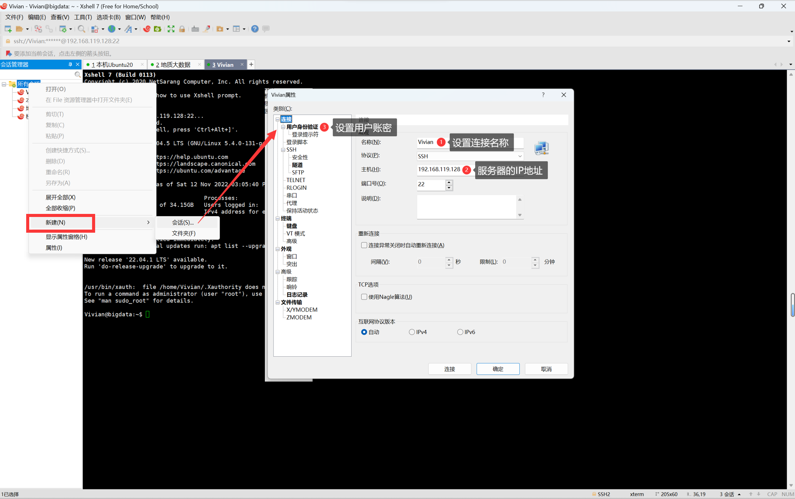
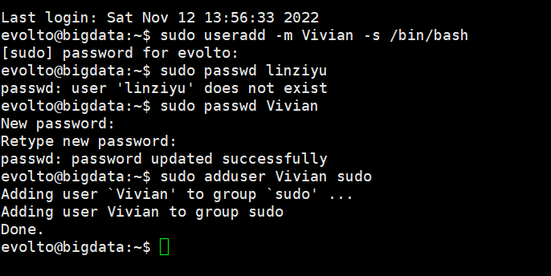
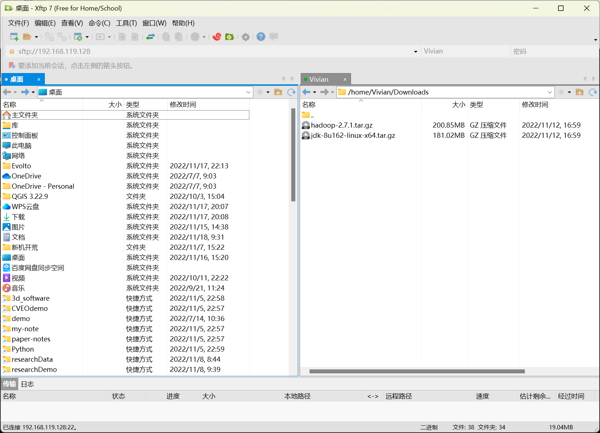
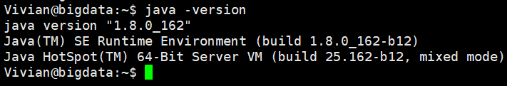
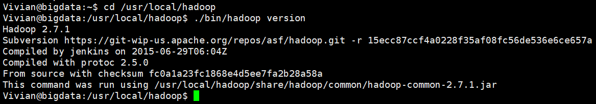
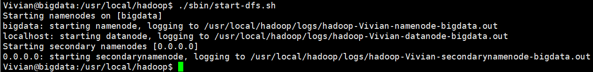

# 练习一：配置 Hadoop 环境（虚拟机服务器版）

- 完成时间：2022-11-24（第 12 周周一）至 2022-11-20（第 12 周周五）

- 参考资料：[厦门大学 林子雨老师 - 在阿里云中搭建大数据实验环境](https://dblab.xmu.edu.cn/blog/1952/)


## 一、实验环境

1. 虚拟机：`VMware Workstation 16.2.4`
2. 操作系统：`Ubuntu-20.04.5-live-server-amd64`
3. 连接软件：`Xshell7`，`Xftp7`
4. JAVA 环境：`jdk-8u162-linux-x64`
5. 大数据软件：`hadoop-3.1.3`


## 二、实验要求

1. 为 Ubuntu 系统添加新的普通用户
2. 使用服务器连接软件实现 SSH 登录到 Ubuntu 系统
3. 使用 FTP 软件向服务器中的 Ubuntu 系统上传和下载文件
4. 在服务器中的 Ubuntu 系统中安装 Java
5. 在服务器中的 Ubuntu 系统中安装 Hadoop


## 三、实验内容

### 1、在 Xshell 7 中新建连接

（1）新建会话<br>
（2）设置连接名称：如 地质大数据第 12 组<br>
（3）设置服务器的 IP 地址：（老师分配的阿里云服务器 IP）<br>
（4）设置用户账密：<br>
（5）点击连接即可成功登录服务器系统<br>



<center>图 1 设置连接属性</center>

### 2、创建新用户

（1）使用 `sudo` 权限新建名为 `Vivian` 的普通用户

```sh
sudo useradd -m Vivian -s /bin/bash
```

（2）设置普通用户 `Vivian` 的用户密码为 $123456$

```sh
sudo passwd Vivian
```

（3）赋予 `Vivian` 用户管理员权限

```sh
sudo adduser Vivian sudo
```

（4）切换到 `Vivian` 用户

```sh
sudo su Vivian
```

（5）全过程截图




<center>图 2 创建用户全过程</center>


### 3、安装 JAVA

（1）在当前用户目录下创建所需的文件夹

```sh
cd ~
mkdir Downloads
mkdir -p usr/lib
mkdir -p usr/local
```

（2）通过 `Xftp7` 软件，将安装包传输到 `Downloads` 目录下



<center>图 3 Xftp7 上传文件</center>

（3）创建 `~/usr/lib/jvm` 目录用来存放 `JDK` 文件

```sh
cd ~/usr/lib
mkdir jvm
```

（4）把 `JDK` 文件解压到 `~/usr/lib/jvm` 目录下

```sh
tar -zxvf ~/Downloads/jdk-8u162-linux-x64.tar.gz -C ~/usr/lib/jvm
```

（5）编辑用户环境变量配置

```sh
vim ~/.bashrc
```

（6）进入编辑，添加 JAVA 相关的环境变量配置，保存并退出

```sh
export JAVA_HOME=/home/Vivian/usr/lib/jvm/jdk1.8.0_162
export JRE_HOME=${JAVA_HOME}/jre
export CLASSPATH=.:${JAVA_HOME}/lib:${JRE_HOME}/lib
export PATH=$PATH:${JAVA_HOME}/bin
```

（7）使用户环境变量生效

```sh
source ~/.bashrc
```

（8）检查是否安装成功

```sh
java -version
```



<center>图 4 检查 JAVA 版本</center>


### 4、安装 Hadoop

（1）修改 `hostname` 配置文件

```sh
sudo vim /etc/hosts
```

（2）在其内添加：服务器的本地（私有）IP 地址  服务器主机名，如：

**！！注**：这一步非常重要，关系到后面 `Hadoop` 是否能正常运行

```
192.168.119.128		bigdata
```

（3）`Hadoop` 解压后即可使用，所以接下来我们直接解压安装

```sh
tar -zxf ~/Downloads/hadoop-3.1.3.tar.gz -C /usr/local
```

（4）修改 `Hadoop` 的文件夹名称

```
cd ~/usr/local/
mv ./hadoop-3.1.3/ ./hadoop
```

（5）检查是否安装成功

```sh
cd ~/usr/local/hadoop
./bin/hadoop version
```



<center>图 5 检查 Hadoop 版本</center>


### 5、Hadoop 伪分布式配置

&emsp;&emsp;Hadoop 的配置文件位于 `~/usr/local/hadoop/etc/hadoop/` 中，伪分布式需要修改 2 个配置文件：

-  `core-site.xml`
-  `hdfs-site.xml`

（1）修改配置文件 `core-site.xml`

```sh
vim ~/usr/local/hadoop/etc/hadoop/core-site.xml
```

（2）修改为如下内容（需要稍作修改）

```xml
<configuration>
    <property>
        <name>hadoop.tmp.dir</name>
        <value>file:/home/Vivian/usr/local/hadoop/tmp</value>
        <description>Abase for other temporary directories.</description>
    </property>
    <property>
        <name>fs.defaultFS</name>
        <value>hdfs://之前填写的服务器私网IP:9000</value>
    </property>
</configuration>
```

（3）修改配置文件 `hdfs-site.xml`

```sh
vim ~/usr/local/hadoop/etc/hadoop/hdfs-site.xml
```

（4）修改为如下内容（不用修改）

```xml
<configuration>
    <property>
        <name>dfs.replication</name>
        <value>1</value>
    </property>
    <property>
        <name>dfs.namenode.name.dir</name>
        <value>file:/home/Vivian/usr/local/hadoop/tmp/dfs/name</value>
    </property>
    <property>
        <name>dfs.datanode.data.dir</name>
        <value>file:/home/Vivian/usr/local/hadoop/tmp/dfs/data</value>
    </property>
</configuration>
```

（5）配置完成后，执行 `NameNode` 的格式化

```sh
cd ~/usr/local/hadoop
./bin/hdfs namenode -format
```

**！！注**：如若成功，会看到 `successfully formatted` 和 `Exitting with status 0` 的提示，若是出错，则为 `Exitting with status 1` 。

（6）开启 `NameNode` 和 `DataNode` 守护进程

```sh
cd ~/usr/local/hadoop
./sbin/start-dfs.sh
```



<center>图 6 成功启动进程</center>

（7）如需停止运行 `Hadoop`，则执行以下命令

```sh
cd ~/usr/local/hadoop
./sbin/stop-dfs.sh
```


### 6、实验总结

#### （1）所遇问题

&emsp;&emsp;① 问题描述：在进行多行复制时，因为缩进原因系统无法识别文件内容，导致执行 NameNode 的格式化失败，问题报错如下图所示：


<center>图 7 问题截图</center>

&emsp;&emsp;② 问题解决方案：再次编辑两个配置文档，重新调整文档内容的缩进即可，在以后的操作中，在多行内容复制时，一定要谨慎处理。

#### （2）实验结论

&emsp;&emsp;通过本次实验练习，我们学习了：

&emsp;&emsp;① 使用 `Xshell7`，`Xftp7` 来操作服务器中的 Ubuntu 系统

&emsp;&emsp;② 安装配置了 JAVA 环境和 Hadoop 环境，配置了大数据操作的基本环境

&emsp;&emsp;③ 同时也学习了 Linux 的一些基本操作指令

&emsp;&emsp;④ 以及 Vim 编辑器的使用

&emsp;&emsp;⑤ 直观地了解到了 Linux 与 Windows 之间的使用区别

