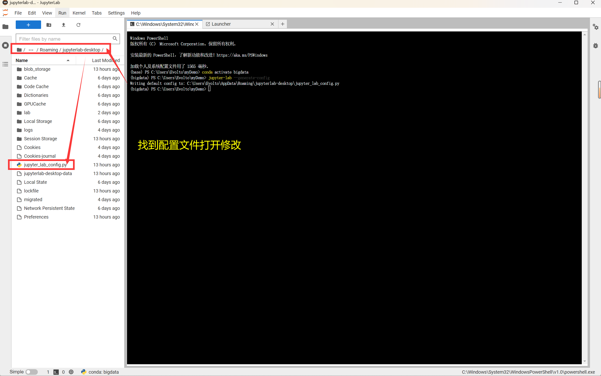

# 练习三：安装 Jupyter 并运行 pyspark


## 参考资料

1. [JupyterLab 出 Windows 桌面版了！](https://developer.aliyun.com/article/885232)
2. [Jupyter Notebooks：您一直在寻觅的基于Web的开发工具](https://baijiahao.baidu.com/s?id=1693370428533116798&wfr=spider&for=pc)
3. [Jupyter Lab 安装和基本设置 - 简书](https://www.jianshu.com/p/c0275f9113e3)
4. [win10安装jdk1.8（附国内下载镜像）- CSDN](https://blog.csdn.net/u014454538/article/details/88085316)
5. [Windows下pyspark的环境搭建 - 知乎](https://zhuanlan.zhihu.com/p/129061994)
6. [PySpark数据分析基础：Spark本地环境部署搭建 - CSDN](https://blog.csdn.net/master_hunter/article/details/125790656)
7. [Spark 学习笔记 13 之 Spark 的 wordCount 案例分析 - 知乎](https://zhuanlan.zhihu.com/p/468065669)
8. [Spark 学习实例(Python)：单词统计 Word Count - CSDN](https://blog.csdn.net/a544258023/article/details/94403849)
9. [修改 Jupyter Lab、Jupyter Notebook 的工作目录 - CSDN](https://blog.csdn.net/xing09268/article/details/123919230)
10. [无法加载文件C:\Users\xxx\Documents\WindowsPowerShell\profile.ps1，因为在此系统上禁止运行脚本 - CSDN](https://blog.csdn.net/qq_42951560/article/details/123859735)


## 一、实验目的

1. 学习并了解 JupyterLab 与 Jupyter Notebook
2. 安装 Jupyterlab 并成功运行 PySpark
3. 在 JupyterLab 软件中编写运行 Spark 的 WordCount 程序，并写出实验报告


## 二、实验平台

1. 编程环境：Miniconda3 (Python3.9)、JDK1.8
2. 相关 Python 环境包：Jupyter Notebook、JupyterLab、PySpark
3. 开发平台：JupyterLab Windows 桌面版


## 三、实验内容和要求

### 1 环境配置

#### 1.1 创建虚拟环境 

&emsp;&emsp;以下操作均建立在已经安装 Anaconda / Miniconda 的基础上，并在 ***命令行*** 中进行的。

> 创建虚拟环境 bigdata

```sh
conda create -n bigdata python=3.9
```

> 激活虚拟环境

```sh
conda activate bigdata
```

#### 1.2 安装并启动 Jupyter Notebook

> 清华镜像安装 notebook

```sh
pip install notebook -i https://pypi.tuna.tsinghua.edu.cn/simple
```

&emsp;&emsp;每次启动，都需要输入如下命令进行启动；如需关闭直接在启动的控制台 `ctrl+c` 即可退出。

> 启动 Jupyter

```sh
jupyter notebook
```


<center>图 1-1 Jupyter 界面</center>

#### 1.3 安装 JAVA

&emsp;&emsp;下载并安装 JAVA 的 JDK，官网的必须注册账户才能下载，推荐使用华为云下载

- Oracle 官网 JDK1.8 下载地址：https://www.oracle.com/java/technologies/javase/javase8-archive-downloads.html

- 【推荐】华为镜像 JDK1.8 下载地址：https://repo.huaweicloud.com/java/jdk/8u181-b13/
- 参考教程：[win10安装jdk1.8（附国内下载镜像）- CSDN](https://blog.csdn.net/u014454538/article/details/88085316)

1. 修改 JDK 安装目录（路径无中文、无空格、无符号）


<center>图 1-2 安装 JDK</center>

2. 修改 JRE 安装目录（规则同上）


<center>图 1-3 安装 JRE</center>

3. 配置 JDK 环境变量
   - 变量名：`JAVA_HOME`
   - 变量值：`E:\program\Java\jdk`


<center>图 1-4 配置 JDK 环境变量</center>

4. 添加 `JAVA_CLASSPATH` 变量
   - 变量名：`JAVA_CLASSPATH`
   - 变量值：`.;%JAVA_HOME%\lib\dt.jar;%JAVA_HOME%\lib\tools.jar`


<center>图 1-5 配置 JAVA_CLASSPATH 变量</center>

5. 更改 `Path` 变量
   - 变量名：`Path`
   - 添加变量值1：`%JAVA_HOME%\bin`
   - 添加变量值2：`E:\program\Java\jre\bin`

**！！注**：环境变量设置路径为以实际安装路径为准。

6. 检查安装情况

```sh
java -version
```


<center>图 1-6 查看当前 JAVA 版本</center>

#### 1.4 安装 PySpark

> 清华镜像安装 pyspark

```sh
pip install pyspark -i https://pypi.tuna.tsinghua.edu.cn/simple
```


<center>图 1-7 正在安装 pyspark</center>

- 验证安装情况，启动虚拟环境中的 Python 导入 PySpark 包，如果没有错误提示，即为安装成功。


<center>图 1-8 验证 pyspark 安装情况</center>

#### 1.5 安装 JupyterLab Windows 桌面版

&emsp;&emsp;官网下载地址：https://github.com/jupyterlab/jupyterlab-desktop

1. 在安装之前，还需要先在虚拟环境中安装 JupyterLab 包，否则在安装桌面版后，将无法正常启动

> 清华镜像安装 jupyterlab

```sh
pip install jupyterlab -i https://pypi.tuna.tsinghua.edu.cn/simple
```

2. 安装很简单，同意相关条款之后会直接默认安装在 `C:\JupyterLab` 目录

3. 首次运行程序时，需要选定调用 Python 环境，这里我们选择之前创建并配置好的虚拟环境


<center>图 1-9 配置 JupyterLab 启动环境</center>

4. JupyterLab 界面介绍


<center>图 1-10 JupyterLab 界面介绍</center>

### 2 配置工作目录

#### 2.1 修改 jupyter lab 工作目录

&emsp;&emsp;由于 JupyterLab 默认的工作目录是 Windows 的当前用户根目录，我们可以将工作目录修改为一个固定的代码存放目录。

&emsp;&emsp;参考资料：[修改 Jupyter Lab、Jupyter Notebook 的工作目录 - CSDN](https://blog.csdn.net/xing09268/article/details/123919230)

1. 在除 C 盘外的其他盘根目录下，创建一个名为 `myDemo` 的文件，用于存放后续代码文件和数据操作文件

2. 执行以下命令，在如图显示的文件夹下生成 `jupyter_lab_config.py` 文件

> 生成 jupyterlab 配置文件

```sh
jupyter-lab --generate-config
```


<center>图 2-1 生成 jupyterlab 配置文件</center>

3. 找到配置文件后，双击打开



<center>图 2-2 查找配置文件</center>

4. 按住 `ctrl+f`，搜索 `ServerApp.root` ，将其修改为：

```python
c.ServerApp.root_dir = 'E:\myDemo'
```


<center>图 2-3 修改 JupyterLab 工作目录</center>

#### 2.2 修改 jupyter notebooks 工作目录

1. 执行以下命令，在如图显示的文件夹下生成 `jupyter_notebook_config.py` 文件

> 生成 jupyter notebook 配置文件

```sh
jupyter notebook --generate-config
```


<center>图 2-4 生成 jupyter notebook 配置文件</center>

2. 找到生成的文件，按住 `ctrl+f`，搜索 `NotebookApp.notebook` ，将其修改为：

```python
c.NotebookApp.notebook_dir = 'E:\myDemo'
```


<center>图 2-5 修改 jupyter notebooks 工作目录</center>

#### 2.3 创建文件夹

&emsp;&emsp;重新启动 JupyterLab，此时左侧的工作目录已经修改了，在此目录下创建一个名为 `bigdataDemo` 的文件夹，用于存放代码文件和数据操作文件，完成后双击进入。


<center>图 2-6 创建文件夹</center>

&emsp;&emsp;在完成上述配置后，我们就可以开始真正的实验操作了。步骤虽然繁琐，但都是一劳永逸的，后续学习不需要再次配置上述内容。

### 3 编写并运行 Spark 的 WordCount 程序

&emsp;&emsp;自己输入一个有几句话的文本文件，用 WordCount 程序进行词频分析。

#### 3.1 数据准备

1. 在 `bigdataDemo` 目录下创建文本文件 `text01.txt`，其内输入如下测试内容：

```
I am a first-year graduate student studying big data.
Now I have learned to use linux, hadoop, hbase, java, and spark.
```


<center>图 3-1 准备文本文件</center>

2. 创建文件 `WordCount.ipynb` 即可开始后续编程操作。


<center>图 3-2 创建编程文件</center>

#### 3.2 JupyterLab 中实现

> 导入 PySpark 需求包

```python
from pyspark import SparkConf, SparkContext
```

> 临时指定 PySpark 环境变量

```python
import os
os.environ['PYSPARK_PYTHON'] = "E:\\Miniconda3\\envs\\bigdata\\python.exe"
```

**！！注**：此处环境变量设置路径为以实际安装路径为准。

> 主函数

```python
if __name__ == '__main__':
    conf = SparkConf().setMaster("local[*]").setAppName("PythonWordCount")
    # 通过 SparkConf 对象构建 SparkContext 对象
    sc = SparkContext(conf=conf)
    '''
    WordCount 单词计数, 读取对应的文本文件, 统计单词出现的数量
    '''
    # 读取文件
    file_rdd = sc.textFile("./text01.txt")
    # 将单词进行切割, 得到一个存储全部单词的集合对象
    words_rdd = file_rdd.flatMap(lambda line: line.split(" "))
    # 将单词转换为元组对象, key 是单词, value 是数字
    words_with_one_rdd = words_rdd.map(lambda x: (x, 1))
    # 将元组的 value 按照 key 来分组, 对所有的 value 执行聚合(相加)操作
    result_rdd = words_with_one_rdd.reduceByKey(lambda a, b: a+b)
    # 通过 collect 方法收集 RDD 的数据打印输出结果
    print(result_rdd.collect())
```


<center>图 3-3 运行代码成功输出结果</center>

#### 3.3 全部代码

```python
# coding:utf8
# 导入 PySpark 需求包
from pyspark import SparkConf, SparkContext
# 临时指定 PySpark 环境变量
import os
os.environ['PYSPARK_PYTHON'] = "E:\\Miniconda3\\envs\\bigdata\\python.exe"
# 主函数
if __name__ == '__main__':
    conf = SparkConf().setMaster("local[*]").setAppName("PythonWordCount")
    # 通过 SparkConf 对象构建 SparkContext 对象
    sc = SparkContext(conf=conf)
    '''
    WordCount 单词计数, 读取对应的文本文件, 统计单词出现的数量
    '''
    # 读取文件
    file_rdd = sc.textFile("text01.txt")
    # 将单词进行切割, 得到一个存储全部单词的集合对象
    words_rdd = file_rdd.flatMap(lambda line: line.split(" "))
    # 将单词转换为元组对象, key 是单词, value 是数字
    words_with_one_rdd = words_rdd.map(lambda x: (x, 1))
    # 将元组的 value 按照 key 来分组, 对所有的 value 执行聚合(相加)操作
    result_rdd = words_with_one_rdd.reduceByKey(lambda a, b: a+b)
    # 通过 collect 方法收集 RDD 的数据打印输出结果
    print(result_rdd.collect())
```


## 四、问题及其解决方法

### 1 问题一

#### 1.1 问题描述

&emsp;&emsp;JupyterLab Windows 桌面版在初次启动时，需要配置程序运行所需的 Python 环境，这个环境中必须包含如下 Python 包，否则将无法运行。

- `jupyter notebook`
- `jupyterlab`

#### 1.2 解决方案

&emsp;&emsp;在初次运行 jupyterlab 桌面端之前，严格按照上述环境配置部分内容执行即可。

### 2 问题二

#### 2.1 问题描述

&emsp;&emsp;由于 Spark 是基于 Hadoop 的，而 Hadoop 又是基于 JAVA 开发，并在 Linux 系统上使用的。在 Windows 系统中运行时，一定要先配置好 JAVA 环境。

#### 2.2 解决方案

&emsp;&emsp;按照环境配置中 JAVA 安装配置好环境即可。在 Windows 上运行 PySpark 不需要安装 Hadoop 和原生 Spark，只需要安装配置好 JDK1.8 即可。

### 3 问题三

#### 3.1 问题描述

&emsp;&emsp;在使用 conda / pip 安装相关包时，安装速度太慢容易超时。

#### 3.2 解决方案

&emsp;&emsp;修改为清华、豆瓣等国内镜像源即可，可以临时设置也可以永久设置，任选其一即可。

- 清华大学开源软件镜像站：https://mirrors.tuna.tsinghua.edu.cn/help/pypi/

> 临时使用清华镜像安装

```sh
pip install -i https://pypi.tuna.tsinghua.edu.cn/simple 需要安装的包的名称
```

> 设为默认镜像

```sh
pip config set global.index-url https://pypi.tuna.tsinghua.edu.cn/simple
```

### 4 问题四

#### 4.1 问题描述

&emsp;&emsp;在使用控制台命令行时，出现如下错误，且无法使用 conda 命令激活虚拟环境：

```sh
无法加载文件C:\Users\xxx\Documents\WindowsPowerShell\profile.ps1，因为在此系统上禁止运行脚本
```


<center>图 4-1 问题四截图</center>

#### 4.2 解决方案

&emsp;&emsp;参考：https://blog.csdn.net/qq_42951560/article/details/123859735

> 在终端中输入命令并选择 Y

```sh
set-ExecutionPolicy RemoteSigned
```

> 查看脚本执行策略

```sh
get-ExecutionPolicy
```

&emsp;&emsp;若输出结果 `RemoteSigned` 则修改成功，再次打开命令行即可恢复正常。

