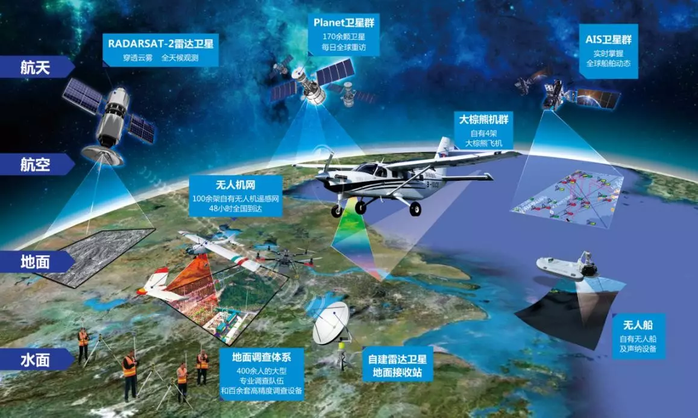
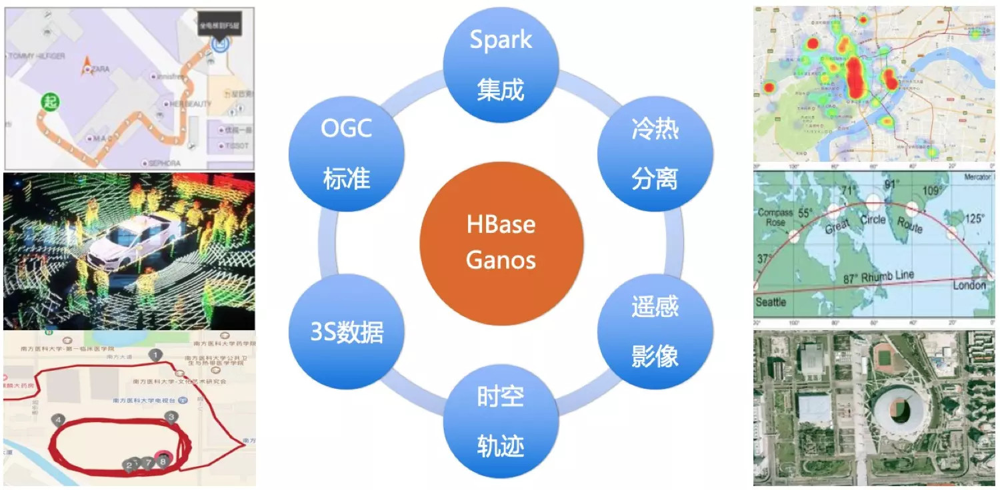
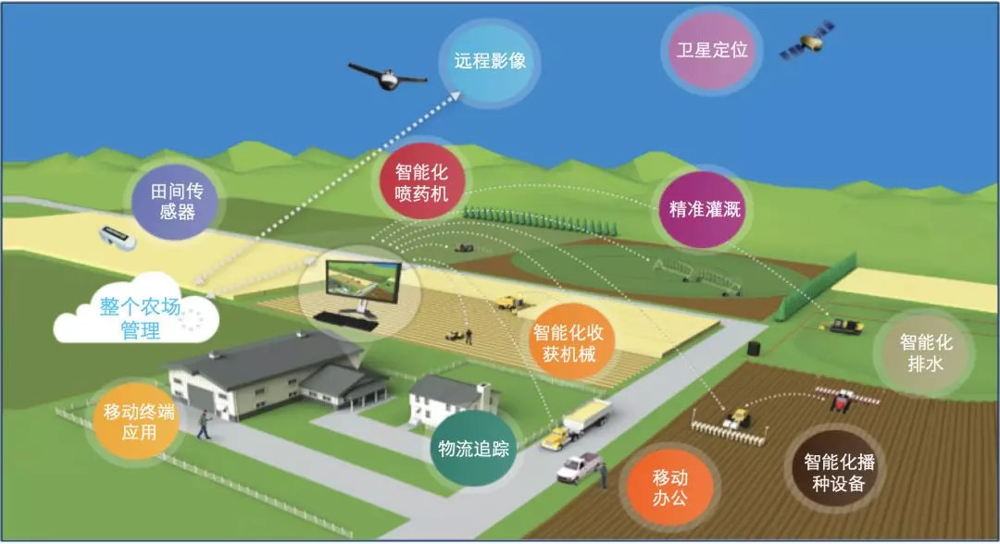
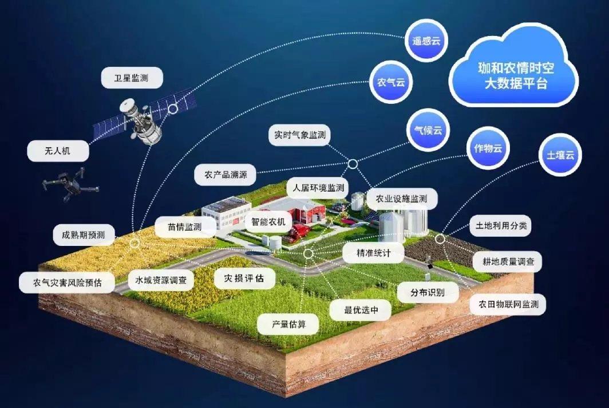
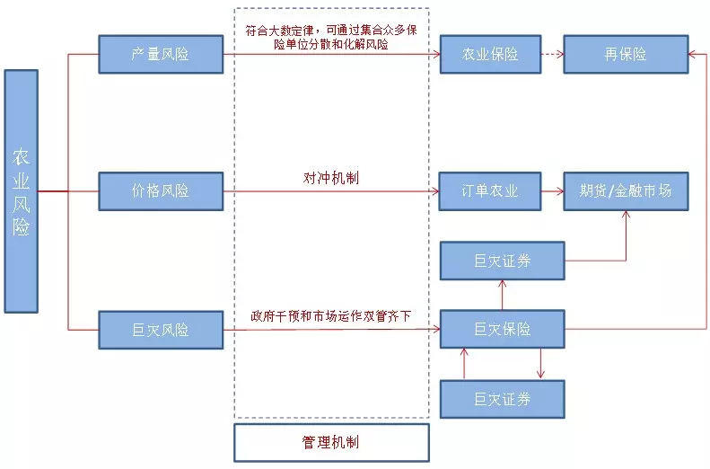
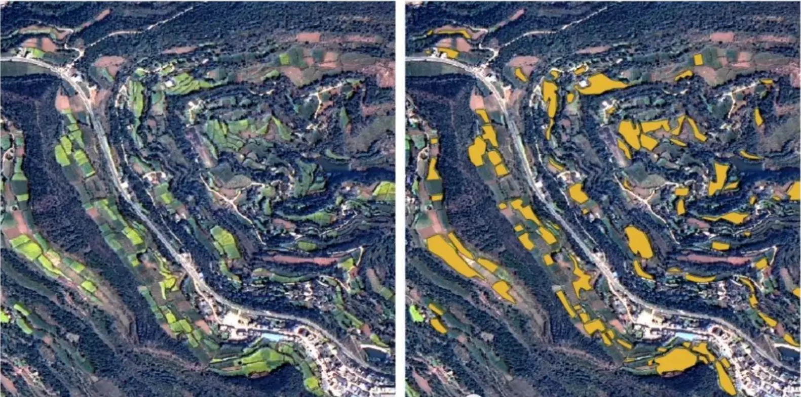
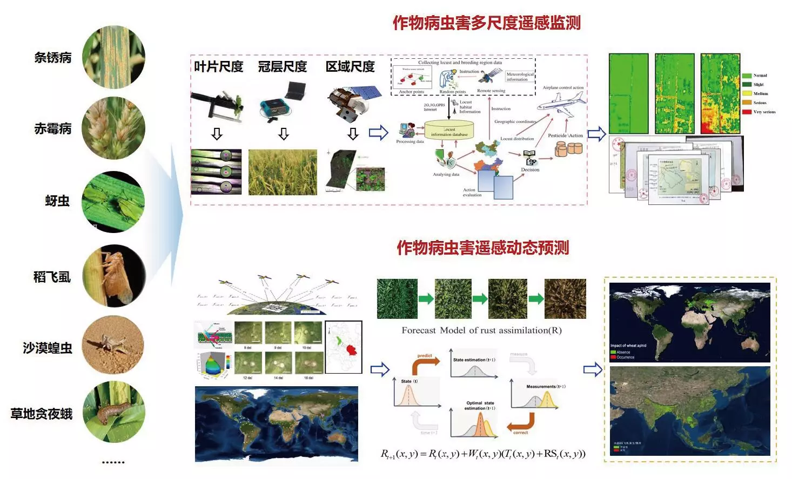
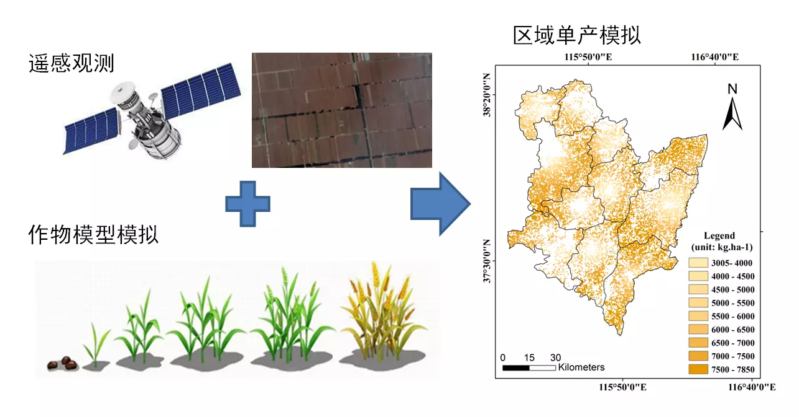

# 大数据技术架构与农业遥感应用

## 1 引言

农业是人类生存和发展的基础，也是国家经济和社会稳定的重要支柱。随着人口增长、资源环境压力、市场需求变化等多重因素的影响，农业面临着提高生产效率、保障粮食安全、实现可持续发展等重大挑战。为了应对这些挑战，农业生产方式需要进行深刻的变革，利用现代科技手段实现农业的数字化、智能化和绿色化。

遥感技术是一种利用航空器或卫星等载体搭载各种传感器，从远距离对地表目标进行探测和获取信息的技术。遥感技术具有覆盖范围广、获取信息快速、成本相对低廉、无损探测等优点，是农业生产中不可或缺的重要工具。遥感技术可以提供农业自然资源、农田作物、农业灾害等方面的数据和信息，为农业生产的规划、管理、监测、评估等提供科学依据和技术支撑。

大数据是指规模庞大、类型多样、价值密度低、时效性高的数据集合。大数据具有海量性、多样性、动态性、价值性等特点，是信息时代的重要资源和驱动力。大数据可以对遥感数据进行有效的整合、分析和挖掘，提高遥感数据的质量和价值，实现对农业生产过程和结果的深入理解和优化。

遥感与大数据的结合，可以实现农业生产的精细化管理和智能化决策支持。通过遥感与大数据技术，可以实现对农田作物种植面积、长势、品质、病虫害、产量等方面的精准监测和预测，为农田施肥、灌溉、防治等提供指导建议；可以实现对农业灾害发生概率和影响程度的预警和评估，为灾害防御和救助提供依据；可以实现对农业资源利用效率和环境影响的评价和优化，为农业可持续发展提供保障。

## 2 大数据的技术架构

大数据的技术架构是实现大数据处理和分析的基础，主要包括数据采集、数据存储、数据处理和数据分析四个环节。

### 2.1 数据采集

数据采集是指通过各种手段收集大量的数据。在农业遥感中，可以利用卫星遥感、航空遥感、地面传感器等手段获取农田的各种信息，如土壤水分、作物生长状况、病虫害情况等。数据采集可以通过传感器网络、遥感卫星等设备实现，收集大量的农业数据。

传感器网络：利用无线传感器节点部署在农田中，实时监测农田的温度、湿度、光照、CO2等参数，并将数据通过无线通信传输到中心节点或云端。

遥感卫星：利用在轨道上运行的人造卫星搭载的遥感仪器，对地球表面进行观测和探测，获取农田的光谱、红外、雷达等信息，并将数据通过卫星通信传输到地面接收站。

航空遥感：利用飞机、无人机等载具搭载的遥感仪器，对地面进行低空或高空的观测和探测，获取农田的高分辨率图像、视频等信息，并将数据通过无线通信传输到地面控制站。

图 2-1 多源数据采集

### 2.2 数据存储

数据存储是指将采集到的数据进行存储和管理。在农业遥感中，可以利用分布式文件系统（如Hadoop HDFS）、NoSQL数据库（如MongoDB、Cassandra）和列式数据库（如HBase）等技术。这些技术能够有效地存储和管理海量的农业遥感数据，确保数据的安全性和可靠性。

分布式文件系统：将一个大文件拆分成多个小文件块，并将文件块分散存储在多个节点上，提供高容错性和高可扩展性。例如，Hadoop HDFS是一个开源的分布式文件系统，可以支持PB级别的数据存储。

NoSQL数据库：不使用关系模型来组织数据，而使用键值对、文档、图等方式来存储非结构化或半结构化的数据，提供高性能和高可扩展性。例如，MongoDB是一个开源的文档型数据库，可以支持多种查询语言和索引。

列式数据库：以列为单位来存储和压缩数据，而不是以行为单位，提供高效的查询和分析能力。例如，HBase是一个开源的列式数据库，可以支持随机读写和实时查询。

图 2-2 阿里云 HBase Ganos

### 2.3 数据处理

数据处理包括对原始数据进行清洗、集成、转换和加载等过程，以使其适用于后续的分析和应用。在农业遥感中，可以利用数据处理工具如Hadoop、Spark等，处理大规模的农业遥感数据，提取有用的信息和知识。

Hadoop：一个开源的分布式计算框架，提供了MapReduce编程模型和HDFS分布式文件系统，可以支持大规模的数据处理。例如，可以使用Hadoop MapReduce对农业遥感数据进行并行的统计、分类、聚合等操作。

Spark：一个开源的分布式计算框架，提供了基于内存的RDD抽象和DAG调度引擎，可以支持快速的数据处理。例如，可以使用Spark SQL对农业遥感数据进行结构化的查询和分析。

### 2.4 数据分析

数据分析是大数据的核心环节，通过各种算法和模型对数据进行分析和挖掘，以提取有价值的信息和知识。在农业遥感领域，数据分析可以应用于土壤质量评估、作物生长模拟、病虫害预测等任务，为农业生产提供科学依据。常用的数据分析方法包括机器学习、深度学习、数据挖掘等。

机器学习：利用统计学和优化理论等方法，让计算机从数据中学习规律和模式，并进行预测和决策。例如，可以使用支持向量机（SVM）对农田遥感图像进行作物的分类。

深度学习：利用多层的神经网络模型，让计算机从数据中自动提取特征和抽象，并进行预测和决策。例如，可以使用卷积神经网络（CNN）对农田遥感图像进行病虫害的检测。

数据挖掘：利用统计学、机器学习、数据库等方法，从大量的数据中发现隐含的有用信息和知识。例如，可以使用关联规则挖掘（ARM）对农田遥感数据进行频繁模式的挖掘。

## 3 农业遥感领域与大数据理念的结合

农业遥感领域与大数据理念的结合可以实现农业生产的精细化管理和智能化决策支持。

### 3.1 精准农业

精准农业是指根据农田的空间变异性和作物的生长需求，对农田进行精确的管理和控制，以提高农业生产的效率和质量。 精准农业是数字农业和智慧农业的重要组成部分，也是当前农业发展的主要方向。 通过农业遥感技术获取的大量数据，结合大数据处理和分析技术，可以实现农田的精准管理。比如利用遥感数据和大数据分析方法，可以对农田进行土壤质量评估，精确测定养分含量、土壤湿度等参数，以制定科学的施肥和灌溉方案，提高农作物的生长效率和产量。

图 3-1 精准农业示例图

### 3.2 农田监测与管理

大数据技术可以对农田进行实时、全面的监测和管理。通过遥感数据的采集和分析，可以监测农田的植被覆盖、土壤湿度、病虫害情况等指标，及时发现问题并采取相应措施。同时，结合大数据技术的可视化和空间分析能力，可以建立农田监测与管理系统，实现对农田的远程监控和智能化管理。 

例如，中国遥感卫星在智慧农业上的应用案例之一是利用环境减灾卫星电荷耦合器 (CCD)影像数据，与国外卫星数据相结合，监测全国主要作物种植面积与长势、病虫害情况、灾情评估等。

图 3-2 农情遥感监测示例图

### 3.3 农业风险评估和保险

大数据分析可以为农业领域提供风险评估和保险服务。通过对历史气象数据、农田遥感数据和农业生产数据进行分析，可以预测气候变化、病虫害发生的概率，为农民提供风险评估和保险推荐。 这可以帮助农民降低农业风险，保障农业生产的可持续发展。

例如，利用遥感技术，结合各种自然灾害的实际应用模型，研究监测各种自然灾害，同时对监测到的灾情及时预报，并为保险公司提供核实依据。

图 3-3 农业风险保险示例图

## 4 大模型技术在农业遥感中的全新应用

当前，大模型技术如深度学习和自然语言处理等在农业遥感中得到了广泛的应用。大模型技术可以利用海量的数据和强大的计算能力，构建复杂的算法和模型，实现对农业遥感数据的高效处理和智能分析。

### 4.1 作物识别与分类

利用大模型技术，可以对农田遥感图像进行作物的自动识别与分类。通过深度学习模型的训练，可以识别不同作物的生长状态和种类，为农业生产提供更准确的监测和管理。例如，利用卷积神经网络 (CNN)模型，可以对遥感影像进行特征提取和分类，实现对不同类型、不同阶段的作物的识别。

图 4-1 油菜种植面积分布-卫星影像图

### 4.2 病虫害检测与预测

大模型技术可以用于农田病虫害的检测与预测。通过对遥感数据进行深度学习模型的训练，可以自动检测农田中的病虫害，提前预警并采取相应的防治措施，减少病虫害对农作物的损害。例如，利用卷积神经网络 (CNN)模型和长短期记忆网络 (LSTM)模型，可以对遥感影像进行特征提取和时序分析，实现对病虫害发生概率和发展趋势的预测。

图 4-2 作物病虫害遥感监测和预测机理与应用

### 4.3 农田产量预测

利用大模型技术和历史农业数据，可以建立农田产量预测模型。通过对气象数据、土壤数据和作物生长数据的分析，可以预测农田的产量水平，为农民和政府决策提供参考依据。常用的大模型技术包括机器学习、深度学习、数据挖掘等。例如，利用支持向量机 (SVM)模型、随机森林 (RF)模型、人工神经网络 (ANN)模型等，可以根据遥感数据和其他相关因素，建立作物产量估算模型。

图 4-3 中国农科院农田产量单产模拟

## 5 模拟应用案例——基于大数据的农业精准施肥系统

为了进一步说明大数据在农业遥感中的应用，我们将介绍一个模拟的应用案例：基于大数据的农业精准施肥系统。该系统利用农业遥感数据和大数据分析技术，为农田提供精准的施肥方案，以提高农业生产的效益和可持续性。

### 5.1 数据收集与处理

该系统采用多种数据收集方法来获取农田的遥感数据，其中包括卫星遥感、无人机遥感和地面传感器等设备。获取数据后对数据进行预处理和清洗，去除噪声和异常值，并进行校正和整合，以确保数据的准确性和一致性。最终，这些数据存储在大数据平台中，为后续的分析和应用提供支持。

#### 5.1.1 卫星遥感数据收集

卫星遥感数据收集是系统的一项重要任务。通过卫星遥感技术，该系统可以获取农田的高分辨率影像数据，从中捕捉土壤质量、植被覆盖、水分分布等与农业生产相关的关键信息。这些卫星遥感数据不仅覆盖广泛，而且可以提供大范围的农田监测，帮助农民更好地了解农田的整体状况。

#### 5.1.2 无人机遥感数据收集

除了卫星遥感，无人机遥感也是数据收集的重要手段之一。无人机可以在低空进行飞行，捕捉更为细致的农田图像。通过无人机遥感数据收集，系统可以实时监测作物的生长情况，捕捉作物的健康状态和生长趋势。这种细粒度的遥感数据对于精准施肥方案的生成和决策支持具有重要意义。

#### 5.1.3 地面传感器数据收集

此外，地面传感器数据收集也是数据收集与处理阶段的重要环节。通过部署地面传感器，系统可以实时监测土壤养分含量、温度、湿度和气象信息等关键数据。这些传感器提供的数据能够更加准确地反映农田的环境条件和土壤特性，为后续的数据分析和模型训练提供有力支持。

### 5.2 数据分析与模型训练

数据分析和模型训练是基于大数据的农业精准施肥系统中的核心环节，基于收集到的农田遥感数据，系统利用大数据分析方法进行深入挖掘和分析。首先，系统对数据进行特征提取和降维处理，以减少数据的复杂性和冗余性。然后，采用机器学习和深度学习等技术建立精准施肥模型。系统通过训练这些模型，将农田数据与施肥效果进行关联分析，以预测不同施肥方案对作物产量和质量的影响。模型可以考虑多个因素，如土壤养分含量、作物需求、环境因素和气象条件等。通过不断的模型训练和优化，系统可以提高施肥方案的准确性和可靠性。

#### 5.2.1 农田遥感数据挖掘

农田遥感数据挖掘是指对收集到的农田遥感数据进行处理和分析的过程。这些数据包括卫星遥感图像、无人机采集的图像以及地面传感器收集的数据。通过应用图像处理和计算机视觉技术，可以对遥感数据进行特征提取、目标识别和分类，从而获得农田的土壤质量、植被覆盖、作物生长状态等关键信息。

#### 5.2.2 数据预处理

在进行数据分析之前，需要对收集到的农田遥感数据进行预处理。这包括数据的清洗、去噪、校正和配准等步骤，以确保数据的准确性和一致性。预处理还可以包括对数据进行空间和时间的插值，填补数据缺失，使数据具备连续性和完整性。

#### 5.2.3 模型建立与训练

在数据预处理完成后，可以利用机器学习和深度学习等技术建立精准施肥模型。模型可以考虑多个因素，例如土壤养分含量、作物需求、气象因素等，以实现对农田的精确施肥方案推荐。模型训练是通过对已有的农田数据进行学习和优化，以使模型能够更好地适应不同农田环境和作物种类的变化。

#### 5.2.4 模型验证与优化

在模型建立和训练完成后，需要进行模型的验证和优化。这包括将模型应用于新的农田数据集进行测试，评估模型的预测准确性和稳定性。通过与实际的农田施肥效果进行对比和分析，可以对模型进行优化，提高施肥方案的准确性和可靠性。

通过数据分析和模型训练，基于大数据的农业精准施肥系统能够利用农田遥感数据提供准确的施肥建议和决策支持。这些数据的挖掘和处理以及模型的建立和优化为农民提供了科学化和个性化的施肥方案，有助于提高农业生产的效益和可持续性。

### 5.3 施肥方案优化与决策支持

施肥方案的优化和决策支持是基于大数据的农业精准施肥系统中的关键环节，基于数据分析和模型训练的结果，系统为每个农田生成个性化的施肥方案。系统考虑到不同土壤类型、作物种类和生长阶段的差异性，为农民提供了针对性的施肥建议。系统会根据土壤养分含量、作物需求和环境条件等因素，推荐适当的施肥量和施肥时间。此外，系统还提供决策支持功能，帮助农民做出科学的施肥决策。通过可视化界面和实时监测功能，农民可以随时查看农田的施肥情况和作物生长情况，以便根据需要进行相应的调整。

#### 5.3.1 个性化施肥方案生成

基于分析结果和模型预测，系统能够为每个农田生成个性化的施肥方案。这包括根据农田的土壤质量、作物类型和生长阶段等因素，推荐适合该农田的施肥方式和施肥量。系统可以根据农田的差异性和作物的需求，提供不同类型和阶段的施肥建议，从而确保作物获得适当的养分供应，最大限度地发挥作物生长的潜力。

#### 5.3.2 决策支持功能

除了生成个性化施肥方案，系统还提供决策支持功能，帮助农民做出科学的施肥决策。系统基于农田遥感数据和模型预测结果，为农民提供关于施肥时机、施肥方式和施肥量的建议。农民可以根据系统提供的信息和分析结果，结合自身的经验和实际情况，做出更加明智的决策。这有助于避免过度施肥或不足施肥的问题，从而提高施肥效果，减少资源浪费和环境污染。

通过施肥方案的优化和决策支持，基于大数据的农业精准施肥系统能够为农民提供科学化和个性化的施肥建议，并帮助他们做出更加明智的决策，以提高农业生产的效益和可持续性。

### 5.4 实时监测与反馈

实时监测和反馈是基于大数据的农业精准施肥系统中的重要环节。通过实时监测农田的施肥情况和作物生长情况，并利用遥感数据的更新，系统可以实时评估施肥效果，并进行相应的调整和反馈。农民可以通过系统的界面，随时查看监测结果和预警信息，采取相应的措施，以确保农田的健康和作物的产量。

#### 5.4.1 农田施肥效果的实时监测

农田施肥后，系统通过实时监测农田的作物生长状况和土壤质量的变化，来评估施肥效果。系统利用遥感技术和传感器数据，获取关于作物的生长情况、叶绿素含量、土壤养分含量等方面的信息。这些数据可以与施肥前的基准数据进行比较，以确定施肥效果的好坏，并及时发现任何潜在的问题或异常情况。

#### 5.4.2 施肥方案的实时调整与优化

基于实时监测结果，系统可以对施肥方案进行实时调整和优化。如果系统检测到作物的生长状况不理想或土壤养分含量不平衡，系统可以自动调整施肥量或施肥方式，以满足作物的需求，并改善农田的生态环境。这样，农民可以根据系统提供的反馈信息，及时调整施肥策略，最大程度地优化施肥效果。

#### 5.4.3 实时反馈和农民参与

基于大数据的农业精准施肥系统还通过界面提供实时反馈和农民参与。农民可以通过系统的用户界面，随时查看农田的施肥情况和作物生长情况，包括作物生长的指标、土壤质量的变化和施肥效果的评估。这样，农民可以更加全面地了解农田的情况，并根据系统提供的建议，做出相应的调整和决策，从而实现精准施肥的目标。

通过实时监测和反馈，基于大数据的农业精准施肥系统能够帮助农民实时了解农田的施肥效果和作物生长情况，并根据系统提供的反馈信息，进行相应的调整和优化。这种实时的监测和反馈机制可以提高施肥效果的及时性和准确性，从而进一步提高农业生产的效益和可持续性。

## 6 结论

本文综述了大数据技术架构、农业遥感与大数据的结合以及大模型技术在农业遥感中的应用。大数据技术架构包括数据采集、存储、处理和分析四个环节，为农业遥感提供了强大的技术支持。农业遥感与大数据的结合实现了农业生产的精细化管理和智能化决策支持。

当前，大模型技术在农业遥感中的应用呈现出巨大的潜力，如作物识别与分类、病虫害检测与预测、农田产量预测等。模拟应用案例进一步展示了基于大数据的农业精准施肥系统的潜力，为农民提供个性化、科学化的施肥方案，提高农业生产的效益和可持续性。深入研究大数据技术与农业遥感的结合将推动农业领域的现代化和智能化，为农业可持续发展做出更大的贡献。

遥感与大数据技术是实现农业数字化、智能化和绿色化的重要手段和工具，它们能够为农业生产提供更多的信息、知识和服务，提高农业生产效率和质量，保障粮食安全和可持续发展。同时，遥感与大数据技术也需要不断地创新和完善，以适应农业生产的多样性和复杂性，解决应用过程中遇到的各种问题和困难。
