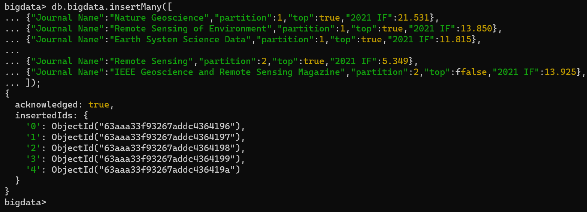
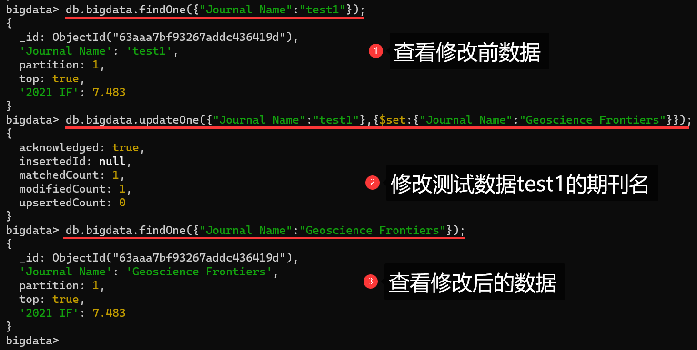

# 练习四：安装并使用 MongoDB


## 参考资料

1. [MongoDB简易安装和操作教程 - 厦门大学林子雨老师](https://dblab.xmu.edu.cn/blog/115/)
2. [Windows 平台安装 MongoDB - 菜鸟教程](https://www.runoob.com/mongodb/mongodb-window-install.html)
3. [实验4 NoSQL和关系数据库的操作比较 - CSDN](https://blog.csdn.net/Alicia_LX/article/details/121455687)
4. [MongoDB 6.0 Windows10 实验操作命令可复制 - CSDN](https://blog.csdn.net/m0_52331159/article/details/127581293)
5. [Windows下安装 MongoDB - CSDN](https://blog.csdn.net/code_nutter/article/details/125574109)
6. [MongoDB6安装和使用 - CSDN](https://blog.csdn.net/weixin_48167124/article/details/126580851)


## 一、实验目的

1. 安装 MongoDB
2. 使用 MongoDB 进行简单的建表操作


## 二、实验环境

1. 操作系统：Windows10
2. MongoDB 6.0.3 (Compass 1.6)
3. MongoDB Shell 1.6.1


## 三、实验内容和要求

### 1 下载 MongoDB 社区版

- [MongoDB Community Server 官网下载](https://www.mongodb.com/try/download/community)
- [MongoDB Shell 官网下载](https://www.mongodb.com/try/download/shell)

### 2 安装 MongoDB Server

&emsp;&emsp;在安装时，需要注意两点，其余保持默认配置安装即可。

#### 2.1 选择自定义安装


<center>图 3-1 选择自定义安装</center>

#### 2.2 修改安装路径


<center>图 3-2 修改安装路径</center>

#### 2.3 浏览器访问

- 在安装结束后，在浏览器中输入 http://127.0.0.1:27017/ ，显示如下界面即为安装成功。


<center>图 3-3 浏览器启动</center>

### 3 安装 MongoDB Shell

&emsp;&emsp;MongoDB Shell 是连接（和使用）MongoDB 的最快方式。使用这个现代的、可扩展的命令行界面轻松查询数据、配置设置和执行其他操作。

注1： MongoDB Shell 是一个开源 (Apache 2.0)，独立于 MongoDB 服务器开发的独立产品。

注2：与以往版本不同，MongoDB6 没有 mong.exe 和 mongdb.exe，要想通过命令行启动 `MongoDB`需要自己下载一个 `MongoShell`

- 修改安装路径（这里我们直接改到 MongoDB 所在路径），并取消只为当前用户安装


<center>图 3-4 安装 MongoDB Shell</center>

### 4 配置环境变量

&emsp;&emsp;与以往的旧版本不同，MongoDB6 将数据目录存储在 data 目录下，可以直接使用。但为了方便后续运行 MongDB，我们需要将安装路径写入到系统变量中。

> 在系统变量 Path 中添加

```
E:\program\MongoDB6\bin
```

```
E:\program\MongoDB6\mongosh
```

### 5 启动 MongoDB

#### 5.1  Shell 启动

> 命令行启动 MongoDB Shell

```sh
mongosh
```


<center>图 3-5 启动 MongoDB Shell</center>

#### 5.2 Compass 启动


<center>图 3-6 MongDB Compass 启动界面</center>

### 6 创建数据库

&emsp;&emsp;启动 MongDB 后默认是在 `test` 数据库中，可以通过 `use 数据库名称` 改变当前数据库。

> 创建并切换 bigdata 数据库

```sh
use bigdata
```

> 查询当前数据库

```sh
show dbs
```


<center>图 3-7 创建 bigdata 数据库</center>

### 7 增删改查 CURD

&emsp;&emsp;MongoDB 不用去设计表，避免了像关系型数据库设计表时的麻烦和复杂。接下来我们将以测绘遥感类 SCI 期刊信息为数据进行数据库的增删改查四大基本操作。

#### 7.1 插入并查看数据

&emsp;&emsp;在 MongoDB Shell 中，每行命令都以 `;` 分号结尾，如果没有分号，则可以进行换行输入。

注：在命令行中，右击鼠标即可粘贴复制好的数据

> 向 bigdata 插入单条数据

```sql
db.bigdata.insert({
    title: 'MongoDB 教程', 
    description: 'MongoDB 是一个 Nosql 数据库', 
    by: 'vivian', 
    group: '地质大数据第12组', 
    tags: ['mongodb', 'database', 'NoSQL']
});
```

> 查询数据

```python
db.bigdata.find()
```


<center>图 3-8 插入数据并查询</center>

#### 7.2 批量插入数据

> 向 bigdata 批量插入测绘遥感类 SCI 期刊信息

```sql
db.bigdata.insertMany([
    {"Journal Name":"Nature Geoscience","partition":1,"top":true,"2021 IF":21.531},
    {"Journal Name":"Remote Sensing of Environment","partition":1,"top":true,"2021 IF":13.850},
    {"Journal Name":"Earth System Science Data","partition":1,"top":true,"2021 IF":11.815},
    ...
    {"Journal Name":"Remote Sensing","partition":2,"top":true,"2021 IF":5.349},
    {"Journal Name":"IEEE Geoscience and Remote Sensing Magazine","partition":2,"top":false,"2021 IF":13.925},
]);
```



<center>图 3-9 批量插入数据</center>

> 查询数据库中期刊名为 Remote Sensing 的数据

```js
db.bigdata.findOne({"Journal Name":"Remote Sensing"})
```


<center>图 3-10 条件查询数据</center>

#### 7.3 修改数据

> 添加两条测试数据

```sql
db.bigdata.insertMany([
    {"Journal Name":"test1","partition":1,"top":true,"2021 IF":7.483},
    {"Journal Name":"test2","partition":0,"top":false,"2021 IF":0},
]);
```

> 修改 test1 数据的期刊名

```sql
db.bigdata.updateOne({"Journal Name":"test1"},{$set:{"Journal Name":"Geoscience Frontiers"}});
```



<center>图 3-11 修改数据</center>

#### 7.4 删除数据

> 删除名为 test2 的数据

```js
db.bigdata.deleteOne({"Journal Name":"test2"});
```


<center>图 3-12 删除一条数据</center>

> 删除数据库中全部数据

```js
db.bigdata.deleteMany({});
```


<center>图 3-13 删除全部数据</center>

> 退出数据库命令行

```sql
exit
```


<center>图 3-14 退出数据库命令行</center>


## 四、问题与解决方案

### 1 问题一

#### 1.1 问题描述

&emsp;&emsp;在 MongoDB 6 中，`insert()` 函数已经被废弃，但是仍然不影响使用。


<center>图 4-1 问题一实例</center>

#### 1.2 解决方案

&emsp;&emsp;在插入数据时，尽量使用插入单条数据 `insertOne()` ，插入多条数据 `insertMany()` ，`bulkWrite()` 

