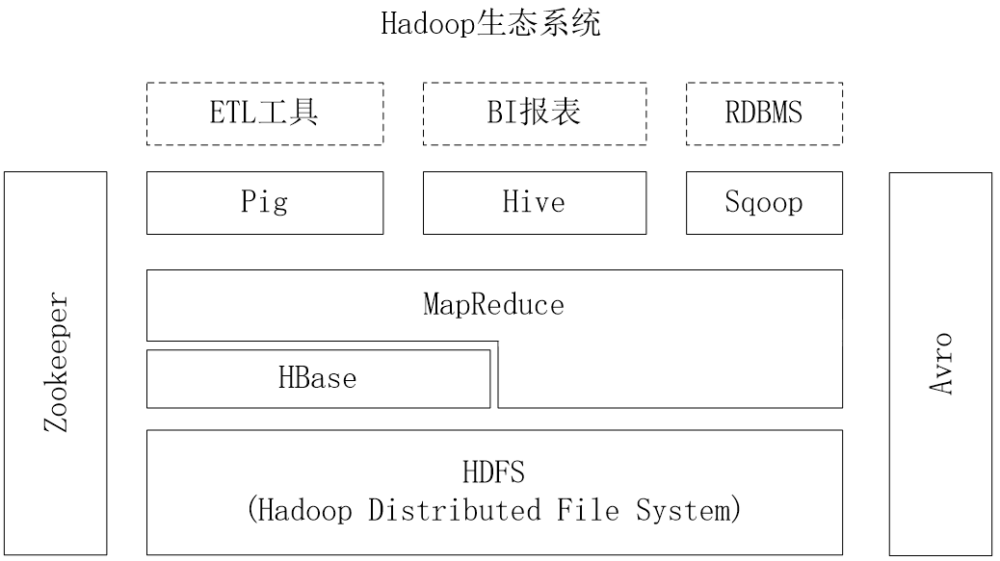

 # 地质资源大数据课堂笔记

## 课前重点回顾

1. （数据）块：大数据最基础的数据单元，默认大小为 64MB，大数据中主要处理的数据对象。
2. 名称节点 NameNode & 数据节点 DataNode
4. 元数据 Metadata：
5. HDFS 运作概念：

### 通信协议

1. 与名称节点通信使用 TCP/IP 协议
2. 与数据节点交互使用 RPC（Remote Procedure Call）

## 课堂重点

1. 端口：
2. HDFS 最大局限性：只设置唯一一个 NameNode 名称节点
3. 代码编写原则：

- 注意大小写
- 注意中英文
- 代码缩进对齐
- 备份代码

## 大数据三驾马车：

1. HDFS：主要管理文件
2. HBase：主要管理数据
3. Spark（MapReduce）：主要管理计算

- 奠定了大数据计算的基础

## 1 BigTable

- BigTable 是一个分布式存储系统，存储一个个数据，一个个数值，一个数据库就一张表。
- BigTable 起初用于解决典型的互联网搜索问题

### 1.1 建立互联网索引

1. 爬虫持续不断地抓取新页面，这些页面每页一行地存储到 BigTable 里
2. MapReduce 计算作业运行在整张表上，生成索引，为网络搜索应用做准备

### 1.2 搜索互联网

3. 用户发起网络搜索请求
4. 网络搜索应用查询建立好的索引，从 BigTable 得到网页
5. 搜索结果提交给用户

## 2  HBase 简介

### 2.1 

1. 继承了 BigTable 的所有特点
2. HBase 是一个高可靠、高性能、***面向列、可伸缩*** 的分布式数据库。

- 动态可变的行列表（誊抄图表）
- 按时间排序（时间戳）分层叠加存储

3. HBase 主要用来存储 非结构化 和 半结构化 的松散数据。

- 结构化：如现实中的座位位置，行列完整。
- 非结构化 / 半结构化：如现实中座位在坐的人数，数据零散。

4. HBase 的目标是处理非常庞大的表，可以通过水平扩展的方式，利用廉价计算机集群处理由超过 10 亿行数据和数百万列元素组成的数据表。

- 水平扩展：横向沿行方向动态扩展。

图 1 Hadoop 生态系统中 HBase 与其他部分的关系 

Zookeeper：

表 1 HBase和BigTable的底层技术对应关系

|              | **BigTable** |     **HBase**     |
| :----------: | :----------: | :---------------: |
| 文件存储系统 |     GFS      |       HDFS        |
| 海量数据处理 |  MapReduce   | Hadoop  MapReduce |
| 协同服务管理 |    Chubby    |     Zookeeper     |

### 2.2 HBase 与传统关系数据库的对比分析

（1）数据类型：

&emsp;&emsp;关系数据库采用关系模型，具有丰富的数据类型和存储方式，HBase 则采用了更加简单的数据模型，它把数据存储为未经解释的字符串。
（2）数据操作：

&emsp;&emsp;关系数据库中包含了丰富的操作，其中会涉及复杂的多表连接。HBase 操作则不存在复杂的表与表之间的关系，只有简单的 插入、查询、删除、清空 等，因为 HBase 在设计上就避免了复杂的表和表之间的关系。
（3）存储模式：

&emsp;&emsp;关系数据库是基于行模式存储的。HBase 是基于列存储的，每个列族都由几个文件保存，不同列族的文件是分离的。

- 一行：就是指一条数据记录，数据按行存储。
- 文件按列存储，
- 大数据分析的基本图像：直方图

（4）数据索引：

&emsp;&emsp;关系数据库通常可以针对不同列构建复杂的多个索引，以提高数据访问性能。HBase 只有一个索引——行键，通过巧妙的设计，HBase 中的所有访问方法，或者通过行键访问，或者通过行键扫描，从而使得整个系统不会慢下来。

- 索引：

（5）数据维护：
&emsp;&emsp;在关系数据库中，更新操作会用最新的当前值去替换记录中原来的旧值，旧值被覆盖后就不会存在。而在 HBase 中执行更新操作时，并不会删除数据旧的版本，而是生成一个新的版本，旧有的版本仍然保留。

- 通过时间戳区分新老版本的数据

（6）可伸缩性：
&emsp;&emsp;关系数据库很难实现横向扩展，纵向扩展的空间也比较有限。相反，HBase 和 BigTable 这些分布式数据库就是为了实现灵活的水平扩展而开发的，能够轻易地通过在集群中增加或者减少硬件数量来实现性能的伸缩。

- 增加设备后，列增加了就是文件存储能力增加了。

## 3 HBase 访问接口

## 4 HBase 数据模型

### 4.1 数据模型概述

&emsp;&emsp;HBase 是一个 稀疏、多维度、排序 的映射表，这张表的索引是行键、列族、列限定符和时间戳。

- 稀疏：非结构化的特征
- 多维度：长、宽、高、材质、颜色、密度......
- 排序：存储文件里的数据是被排序的

### 4.2 数据模型相关概念

- ！！重点：四维坐标

### 4.3 数据坐标

- 键值对：KEY-VAULE

### 4.4 概念视图

| **行键**      | **时间戳**                | **列族**contents | **列族**anchor              |
| ------------- | ------------------------- | ---------------- | --------------------------- |
| "com.cnn.www" | t5                        |                  | anchor:cnnsi.com=”CNN”      |
| t4            |                           |                  | anchor:my.look.ca="CNN.com" |
| t3            | contents:html="<html>..." |                  |                             |
| t2            | contents:html="<html>..." |                  |                             |
| t1            | contents:html="<html>..." |                  |                             |

### 4.5 物理视图

## 学习一下，什么是 RDD?

1. [跟着车仔入门spark：理解spark RDD和RDD属性](https://www.bilibili.com/video/BV135411X7zw/)

2. [BigData MR & Spark 02-04 Spark RDD的概念与要素](https://www.bilibili.com/video/BV1if4y1Y7Th/)

