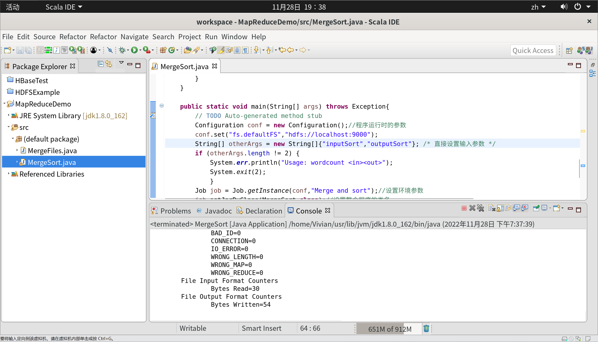

# MapReduce 编程初级实践


## 参考资料

1. [厦门大学林子雨老师 - HDFS编程实践（Hadoop3.1.3）](https://dblab.xmu.edu.cn/blog/2460/)
2. [CSDN - 实验5MapReduce初级编程实践](https://blog.csdn.net/Alicia_LX/article/details/121709312)
3. [CSDN - mkdir: Cannot create directory /input. Name node is in safe mode.](https://blog.csdn.net/weixin_43721228/article/details/109272204)


## 一、实验目的

1. 通过实验掌握基本的 MapReduce 编程方法。
2. 掌握用 MapReduce 解决一些常见数据处理问题的方法，包括数据去重、数据排序和数据 挖掘等。 


## 二、实验平台

&emsp;&emsp;已经配置完成的 Hadoop 伪分布式环境。

1. 操作系统：本地虚拟机 `Ubuntu-20.04.5`
2. 开发工具：`Eclipse-4.7.0`
3. 大数据软件：`hadoop-3.1.3`


## 三、实验内容和要求

### 3.1 编程实现文件合并和去重操作

&emsp;&emsp;对于两个输入文件，即文件 A 和文件 B，请编写 MapReduce 程序，对两个文件进行合并，并剔除其中重复的内容，得到一个新的输出文件 C。下面是输入文件和输出文件的一个样例，供参考。 

#### 3.1.1 准备输入文件

&emsp;&emsp;首先，我们需要先把输入文件准备好，

- 将其命名为 `textA.txt` 和 `textB.txt`，并向其内输入数据
- 在 HDFS 中创建输入文件夹
- 将两个文本文件上传到 `input` 文件夹中

> 启动 Hadoop

```sh
start-dfs.sh
```

> 在 HDFS 用户目录中创建 input 目录

- 注：此处用户名一定要与当前操作用户名保持一致。

```sh
hdfs dfs -mkdir -p /user/Vivian/input
```

> 在本地文件创建输入文件 A

```sh
vim ~/textA.txt
```

&emsp;&emsp;输入文件 A 内的数据样例如下。 

```
20150101 x
20150102 y
20150103 x
20150104 y
20150105 z
20150106 x
```

> 在本地文件创建输入文件 B

```sh
vim ~/textB.txt
```

&emsp;&emsp;输入文件 B 的数据样例如下。

```
20150101 y
20150102 y
20150103 x
20150104 z
20150105 y
```

> 将文件上传到 HDFS

```sh
hdfs dfs -put ~/textA.txt input
hdfs dfs -put ~/textB.txt input
```

> 查看 HDFS input 目录内容

```sh
hdfs dfs -ls input
```


<center>图 1-1 准备输入文件全过程</center>

> 查看输入文件中的数据

```sh
hdfs dfs -cat input/textA.txt
hdfs dfs -cat input/textB.txt
```


<center>图 1-2 查看输入文件数据</center>

&emsp;&emsp;最终，我们将通过编程，实现把输入文件 A 和 B 合并得到输出文件 C ，样例如下。

```
20150101 x
20150101 y
20150102 y
20150103 x
20150104 y
20150104 z
20150105 y
20150105 z
20150106 x
```

#### 3.1.2 创建 JAVA 项目 MapReduceDemo

&emsp;&emsp;接下来，我们打开 Eclipse，点击 File → New → JAVA Project，新建 JAVA 项目，并名为 MapReduceDemo


<center>图 1-3 创建 JAVA 项目 </center>

#### 3.1.3 为项目添加需要用到的 JAR 包

&emsp;&emsp;为了编写一个 MapReduce 程序，在新建 JAVA 项目时，向 Java 工程中添加以下 JAR 包：

1. `~/usr/local/hadoop/share/hadoop/common`目录下的 `hadoop-common-3.1.3.jar`和 `haoop-nfs-3.1.3.jar`；
2. `~/usr/local/hadoop/share/hadoop/common/lib` 目录下的所有 JAR 包；
3. `~/usr/local/hadoop/share/hadoop/mapreduce` 目录下的所有 JAR 包，但不包括其他文件夹
4. `~/usr/local/hadoop/share/hadoop/mapreduce/lib` 目录下的所有 JAR 包
5. `~/usr/local/hadoop/share/hadoop/hdfs` 目录下的所有 JAR 包，但不包括其他文件夹
6. `~/usr/local/hadoop/share/hadoop/hdfs/lib` 目录下的所有 JAR 包
7. `~/usr/local/hadoop/share/hadoop/yarn` 目录下的所有 JAR 包，但不包括其他文件夹
8. `~/usr/local/hadoop/share/hadoop/yarn/lib` 目录下的所有 JAR 包


<center>图 1-4 添加 JAR 包</center>

#### 3.1.4 新建 JAVA 类 MergeFiles

&emsp;&emsp;在刚刚创建好的 MapReduceDemo 工程下，右击 → New → Class，创建名为 MergeFiles 的类。


<center>图 1-5 新建 JAVA 类</center>

#### 3.1.5 代码实现

- 注：这里我们使用 input 为输入目录，输出目录为 output，在运行前一定要确保输出目录不存在。

```java
import java.io.IOException;
import org.apache.hadoop.conf.Configuration;
import org.apache.hadoop.fs.Path;
import org.apache.hadoop.io.Text;
import org.apache.hadoop.mapreduce.Job;
import org.apache.hadoop.mapreduce.Mapper;
import org.apache.hadoop.mapreduce.Reducer;
import org.apache.hadoop.mapreduce.lib.input.FileInputFormat;
import org.apache.hadoop.mapreduce.lib.output.FileOutputFormat;

public class MergeFiles {

    /**
	 * @param args
	 * 对A,B两个文件进行合并，并剔除其中重复的内容，得到一个新的输出文件C
	 */
    // 重载map函数，直接将输入中的value复制到输出数据的key上
    public static class Map extends Mapper<Object, Text, Text, Text>{
        private static Text text = new Text();
        public void map(Object key, Text value, Context context) throws IOException,InterruptedException{
            text = value;
            context.write(text, new Text(""));//括号内容作为中间结果扔出去交给shuffle处理
        }
    }

    // 重载reduce函数，直接将输入中的key复制到输出数据的key上
    public static class Reduce extends Reducer<Text, Text, Text, Text>{
        public void reduce(Text key, Iterable<Text> values, Context context ) throws IOException,InterruptedException{
            context.write(key, new Text(""));
        }
    }

    public static void main(String[] args) throws Exception{

        // TODO Auto-generated method stub
        Configuration conf = new Configuration();//程序运行时的参数
        conf.set("fs.defaultFS","hdfs://localhost:9000");
        String[] otherArgs = new String[]{"input","output"}; /* 直接设置输入参数 */
        if (otherArgs.length != 2) {
            System.err.println("Usage: wordcount <in><out>");
            System.exit(2);
        }
        Job job = Job.getInstance(conf,"Merge and duplicate removal");//设置环境参数
        job.setJarByClass(MergeFiles.class);//设置整个程序的类名
        job.setMapperClass(Map.class);//添加Mapper类
        job.setCombinerClass(Reduce.class);//设置Combiner类
        job.setReducerClass(Reduce.class);//添加Reducer类
        job.setOutputKeyClass(Text.class);//设置输出类型
        job.setOutputValueClass(Text.class);//设置输出类型
        FileInputFormat.addInputPath(job, new Path(otherArgs[0]));//设置输入原始文件文件路径
        FileOutputFormat.setOutputPath(job, new Path(otherArgs[1]));//设置输出文件路径
        //Job运行是通过job.waitForCompletion(true)，true表示将运行进度等信息及时输出给用户，false的话只是等待作业结束
        boolean result = job.waitForCompletion(true);
        System.exit(result ? 0 : 1);
    }
}
```


<center>图 1-6 运行成功</center>

#### 3.1.6 查看输出结果

> 查看输出目录

```sh
hdfs dfs -ls output
```

> 查看输出结果数据

```sh
hdfs dfs -cat output/*
```


<center>图 1-7 查看输出数据</center>

### 3.2 编程实现对输入文件的排序

&emsp;&emsp;现在有多个输入文件，每个文件中的每行内容均为一个整数。要求读取所有文件中的整数，进 行升序排序后，输出到一个新的文件中，输出的数据格式为每行两个整数，第一个整数为第二个整 数的排序位次，第二个整数为原待排列的整数。下面是输入文件和输出文件的一个样例，供参考。

#### 3.2.1 准备输入文件

> 在 HDFS 用户目录中创建 inputSort 目录

```sh
hdfs dfs -mkdir -p /user/Vivian/inputSort
```

> 在本地文件创建输入文件 1

```sh
vim ~/text1.txt
```

&emsp;&emsp;输入文件 1 的样例如下。

```
33
37
12
40
```

> 在本地文件创建输入文件 2

```sh
vim ~/text2.txt
```

&emsp;&emsp;输入文件 2 的样例如下。

```
4
16
39
5
```

> 在本地文件创建输入文件 3

```sh
vim ~/text3.txt
```

&emsp;&emsp;输入文件 3 的样例如下。

```
1
45
25
```

> 将文件上传到 HDFS

```sh
hdfs dfs -put ~/text1.txt inputSort
hdfs dfs -put ~/text2.txt inputSort
hdfs dfs -put ~/text3.txt inputSort
```

> 查看 HDFS inputSort 目录内容

```sh
hdfs dfs -ls inputSort
```


<center>图 2-1 准备排序输入文件全过程</center>


&emsp;&emsp;最终，我们将通过编程，实现把输入文件 1、2 和 3 得到的输出文件如下。

```
1	1
2	4
3	5
4	12
5	16
6	25
7	33
8	37
9	39
10	40
11	45
```

#### 3.2.2 新建类 MergeSort

&emsp;&emsp;接下来我们继续在创建好的 MapReduceDemo 工程下进行操作，右击 → New → Class，创建名为 MergeSort 的类，步骤同 3.1.4。

#### 3.2.3 代码实现

- 注：这里我们使用 inputSort 为输入目录，输出目录为 outputSort。

```java
import java.io.IOException;
import org.apache.hadoop.conf.Configuration;
import org.apache.hadoop.fs.Path;
import org.apache.hadoop.io.IntWritable;
import org.apache.hadoop.io.Text;
import org.apache.hadoop.mapreduce.Job;
import org.apache.hadoop.mapreduce.Mapper;
import org.apache.hadoop.mapreduce.Partitioner;
import org.apache.hadoop.mapreduce.Reducer;
import org.apache.hadoop.mapreduce.lib.input.FileInputFormat;
import org.apache.hadoop.mapreduce.lib.output.FileOutputFormat;

public class MergeSort {

    /**
	 * @param args
	 * 输入多个文件，每个文件中的每行内容均为一个整数
	 * 输出到一个新的文件中，输出的数据格式为每行两个整数，第一个数字为第二个整数的排序位次，第二个整数为原待排列的整数
	 */
    //map函数读取输入中的value，将其转化成IntWritable类型，最后作为输出key
    public static class Map extends Mapper<Object, Text, IntWritable, IntWritable>{

        private static IntWritable data = new IntWritable();
        public void map(Object key, Text value, Context context) throws IOException,InterruptedException{
            String text = value.toString();
            data.set(Integer.parseInt(text));//将括号内容复制给data对象
            context.write(data, new IntWritable(1));//括号内容作为中间结果扔出去交给shuffle处理
        }
    }

    //reduce函数将map输入的key复制到输出的value上，然后根据输入的value-list中元素的个数决定key的输出次数,定义一个全局变量line_num来代表key的位次
    public static class Reduce extends Reducer<IntWritable, IntWritable, IntWritable, IntWritable>{
        private static IntWritable line_num = new IntWritable(1);

        public void reduce(IntWritable key, Iterable<IntWritable> values, Context context) throws IOException,InterruptedException{
            for(IntWritable val : values){
                context.write(line_num, key);
                line_num = new IntWritable(line_num.get() + 1);
            }
        }
    }

    //自定义Partition函数，此函数根据输入数据的最大值和MapReduce框架中Partition的数量获取将输入数据按照大小分块的边界，然后根据输入数值和边界的关系返回对应的Partiton ID
    public static class Partition extends Partitioner<IntWritable, IntWritable>{
        public int getPartition(IntWritable key, IntWritable value, int num_Partition){
            int Maxnumber = 65223;//int型的最大数值
            int bound = Maxnumber/num_Partition+1;
            int keynumber = key.get();//从key的序列类型转换成int类型
            for (int i = 0; i<num_Partition; i++){
                if(keynumber<bound * (i+1) && keynumber>=bound * i){
                    return i;
                }
            }
            return -1;// 表示返回一个代数值，一般用在子函数结尾。按照程序开发的一般惯例，表示该函数失败；
        }
    }

    public static void main(String[] args) throws Exception{
        // TODO Auto-generated method stub
        Configuration conf = new Configuration();//程序运行时的参数
        conf.set("fs.defaultFS","hdfs://localhost:9000");
        String[] otherArgs = new String[]{"inputSort","outputSort"}; /* 直接设置输入参数 */
        if (otherArgs.length != 2) {
            System.err.println("Usage: wordcount <in><out>");
            System.exit(2);
        }
        Job job = Job.getInstance(conf,"Merge and sort");//设置环境参数
        job.setJarByClass(MergeSort.class);//设置整个程序的类名
        job.setMapperClass(Map.class);//添加Mapper类
        job.setReducerClass(Reduce.class);//添加Reducer类
        job.setPartitionerClass(Partition.class);//添加Partitioner类
        job.setOutputKeyClass(IntWritable.class);//设置输出类型
        job.setOutputValueClass(IntWritable.class);//设置输出类型
        FileInputFormat.addInputPath(job, new Path(otherArgs[0]));//设置输入原始文件文件路径
        FileOutputFormat.setOutputPath(job, new Path(otherArgs[1]));//设置输出文件路径
        //Job运行是通过job.waitForCompletion(true)，true表示将运行进度等信息及时输出给用户，false的话只是等待作业结束
        boolean result = job.waitForCompletion(true);
        System.exit(result ? 0 : 1);
    }

}
```



<center>图 2-2 排序程序成功运行</center>

#### 3.2.4 查看输出结果

> 查看输出目录

```sh
hdfs dfs -ls outputSort
```

> 查看输出结果数据

```sh
hdfs dfs -cat outputSort/*
```


<center>图 2-3 查看排序输出结果</center>

### 3.3 对给定的表格进行信息挖掘

&emsp;&emsp;下面给出一个 child-parent 的表格，要求挖掘其中的父子辈关系，给出祖孙辈关系的表格。

#### 3.3.1 准备输入文件

> 在 HDFS 用户目录中创建 inputData 目录

```sh
hdfs dfs -mkdir -p /user/Vivian/inputData
```

> 在本地文件创建输入文件

```sh
vim ~/inputText.txt
```

&emsp;&emsp;输入文件内容如下。

```
child	parent
Steven	Lucy
Steven	Jack
Jone	Lucy
Jone	Jack
Lucy	Mary
Lucy	Frank
Jack	Alice
Jack	Jesse
David	Alice
David	Jesse
Philip	David
Philip	Alma
Mark	David
Mark	Alma
```

> 将文件上传到 HDFS

```sh
hdfs dfs -put ~/inputText.txt inputData
```

> 查看 HDFS inputData 目录内容

```sh
hdfs dfs -ls inputData
```


<center>图 3-1 数据挖掘准备全过程</center>

&emsp;&emsp;最终，我们将通过编程，实现的输出文件内容如下。

```
grandchild	grandparent
Steven		Alice
Steven		Jesse
Jone		Alice
Jone		Jesse
Steven		Mary
Steven		Frank
Jone		Mary
Jone		Frank
Philip		Alice
Philip		Jesse
Mark		Alice
Mark		Jesse 
```

#### 3.3.2 新建类 dataMining

&emsp;&emsp;接下来我们继续在创建好的 MapReduceDemo 工程下进行操作，右击 → New → Class，创建名为 dataMining 的类，步骤同 3.1.4。

#### 3.3.3 代码实现

- 注：这里我们使用 inputData 为输入目录，输出目录改为 outputData。

```java
import java.io.IOException;
import java.util.*;
import org.apache.hadoop.conf.Configuration;
import org.apache.hadoop.fs.Path;
import org.apache.hadoop.io.Text;
import org.apache.hadoop.mapreduce.Job;
import org.apache.hadoop.mapreduce.Mapper;
import org.apache.hadoop.mapreduce.Reducer;
import org.apache.hadoop.mapreduce.lib.input.FileInputFormat;
import org.apache.hadoop.mapreduce.lib.output.FileOutputFormat;

public class dataMining {
    public static int time = 0;

    /**
	 * @param args
	 * 输入一个child-parent的表格
	 * 输出一个体现grandchild-grandparent关系的表格
	 */
    //Map将输入文件按照空格分割成child和parent，然后正序输出一次作为右表，反序输出一次作为左表，需要注意的是在输出的value中必须加上左右表区别标志
    public static class Map extends Mapper<Object, Text, Text, Text>{
        public void map(Object key, Text value, Context context) throws IOException,InterruptedException{
            String child_name = new String();
            String parent_name = new String();
            String relation_type = new String();
            String line = value.toString();
            int i = 0;
            while(line.charAt(i) != ' '){
                i++;
            }
            String[] values = {line.substring(0,i),line.substring(i+1)};
            if(values[0].compareTo("child") != 0){
                child_name = values[0];
                parent_name = values[1];
                relation_type = "1";//左右表区分标志
                context.write(new Text(values[1]), new Text(relation_type+"+"+child_name+"+"+parent_name));
                //左表
                relation_type = "2";
                context.write(new Text(values[0]), new Text(relation_type+"+"+child_name+"+"+parent_name));
                //右表
            }
        }
    }

    public static class Reduce extends Reducer<Text, Text, Text, Text>{
        public void reduce(Text key, Iterable<Text> values,Context context) throws IOException,InterruptedException{
            if(time == 0){   //输出表头
                context.write(new Text("grandchild"), new Text("grandparent"));
                time++;
            }
            int grand_child_num = 0;
            String grand_child[] = new String[10];
            int grand_parent_num = 0;
            String grand_parent[]= new String[10];
            Iterator ite = values.iterator();
            while(ite.hasNext()){
                String record = ite.next().toString();
                int len = record.length();
                int i = 2;
                if(len == 0) continue;
                char relation_type = record.charAt(0);
                String child_name = new String();
                String parent_name = new String();
                //获取value-list中value的child

                while(record.charAt(i) != '+'){
                    child_name = child_name + record.charAt(i);
                    i++;
                }
                i=i+1;
                //获取value-list中value的parent
                while(i<len){
                    parent_name = parent_name+record.charAt(i);
                    i++;
                }
                //左表，取出child放入grand_child
                if(relation_type == '1'){
                    grand_child[grand_child_num] = child_name;
                    grand_child_num++;
                }
                else{//右表，取出parent放入grand_parent
                    grand_parent[grand_parent_num] = parent_name;
                    grand_parent_num++;
                }
            }

            if(grand_parent_num != 0 && grand_child_num != 0 ){
                for(int m = 0;m<grand_child_num;m++){
                    for(int n=0;n<grand_parent_num;n++){
                        context.write(new Text(grand_child[m]), new Text(grand_parent[n]));
                        //输出结果
                    }
                }
            }
        }
    }
    public static void main(String[] args) throws Exception{
        // TODO Auto-generated method stub
        Configuration conf = new Configuration();
        conf.set("fs.defaultFS","hdfs://localhost:9000");
        String[] otherArgs = new String[]{"inputData","outputData"}; /* 直接设置输入参数 */
        if (otherArgs.length != 2) {
            System.err.println("Usage: wordcount <in><out>");
            System.exit(2);
        }
        Job job = Job.getInstance(conf,"Single table join");
        job.setJarByClass(dataMining.class);
        job.setMapperClass(Map.class);
        job.setReducerClass(Reduce.class);
        job.setOutputKeyClass(Text.class);
        job.setOutputValueClass(Text.class);
        FileInputFormat.addInputPath(job, new Path(otherArgs[0]));
        FileOutputFormat.setOutputPath(job, new Path(otherArgs[1]));
        System.exit(job.waitForCompletion(true) ? 0 : 1);

    }
}
```


<center>图 3-2 数据挖掘程序成功运行</center>

#### 3.3.4 查看输出结果

> 查看输出目录

```sh
hdfs dfs -ls outputData
```

> 查看输出结果数据

```sh
hdfs dfs -cat outputData/*
```


<center>图 3-3 查看数据挖掘输出结果</center>
