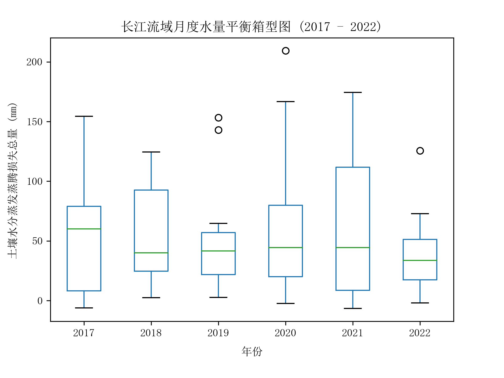

# 地学数据多元统计实验一：使用专业数据绘制箱型图


## 一、实验环境

1. 操作系统：`Windows 11`
2. Python 环境：`python 3.9.12`，`geemap`，`pandas`，`matplotlib`
3. 编辑器：`JupyterLab Desktop 3.4.6-1`


## 二、实验要求

1. 使用专业数据做箱型图
2. 手写实验报告，图表部分使用铅笔绘图


## 三、实验步骤

### 1 使用 GEE 计算水量平衡数据

1. 研究区域：长江流域

2. 研究时间：2017 年 1 月 ~ 2022 年 12 月，近六年的 72 个月

3. 数据源：

- CHIRPS 全球准降雨量数据，每 5 日一次数据
- MOD16 数据集的 ET 波段

4. 计算方法：

- P：对每月的 CHIRPS 降雨量数据求出当月均值
- ET：对每月的 MOD16_ET 蒸发散量求出当月均值
- 计算水量平衡公式：$Q=P-ET$
- 并将数据以 “时间：土壤水分蒸发蒸腾损失总量” 的关系导出到 excel 表格中，具体部分数据如下：

<center>表 1 长江流域水量平衡表（以2017年上半年为例）</center>

| date                 | balance_mean |
| -------------------- | ------------ |
| 2017-01-01  00:00:00 | 4.728499802  |
| 2017-02-01  00:00:00 | 8.195560112  |
| 2017-03-01  00:00:00 | 61.62333007  |
| 2017-04-01  00:00:00 | 48.27867981  |
| 2017-05-01  00:00:00 | 58.44247066  |
| 2017-06-01  00:00:00 | 154.4862597  |


### 2 加载必要的包

```python
import pandas as pd
import matplotlib.pyplot as plt
```

### 3 加载数据

```python
input_file = "./input/yangtze_balance_chart_monthly.xlsx"
out_file = "./output/yangtze_balance_boxplot.png"
data = pd.read_excel(input_file)
data['year'] = pd.DatetimeIndex(data['date']).year
```

### 4 绘制箱型图

```python
# 创建一个空白的图形和子图
fig, ax = plt.subplots()
# 绘制箱型图，并传入子图
data.boxplot(column='balance_mean', by='year', ax=ax, grid=False)
# 设置中文字体，宋体
plt.rcParams['font.sans-serif'] = ['SimSun']
# 设置x轴和y轴的标签
plt.xlabel('年份', labelpad=8)
plt.ylabel('土壤水分蒸发蒸腾损失总量 (mm)', labelpad=8)
# 设置图形的标题
plt.title('长江流域月度水量平衡箱型图 (2017 - 2022)')
# 清空默认的标题
fig = ax.get_figure()
fig.suptitle('')
# 保存图形为一个png文件，分辨率为300dpi，要放在图像绘制之前
plt.savefig(out_file, dpi=300)
# 显示图形
plt.show()
```



<center>图 1 长江流域月度水量平衡箱型图 (2017 - 2022)</center>

### 5 箱型图说明

一个箱型图是一种显示数据分布的图形，它基于五个数的概括（“最小值”，第一四分位数 [Q1]，中位数，第三四分位数 [Q3] 和“最大值”）。箱型图的各项特征如下：

- 箱子：从第一四分位数到第三四分位数的矩形，表示数据的中间50%的范围。
- 中位线：在箱子中间的竖线，表示数据的中位数。
- 胡须：从箱子两端延伸出来的线段，表示数据的最小值和最大值。如果有异常值，胡须会停在距离箱子1.5倍四分位距（IQR）的位置。
- 异常值：如果有些数据点超出了胡须的范围，它们会被标记为异常值，通常用圆点表示。

你可以通过箱型图来观察数据的对称性、集中度、偏态和离群情况。


std是标准差的缩写，它表示数据的离散程度，也就是数据点与均值的平均偏差。标准差越大，表示数据越分散；标准差越小，表示数据越集中。
