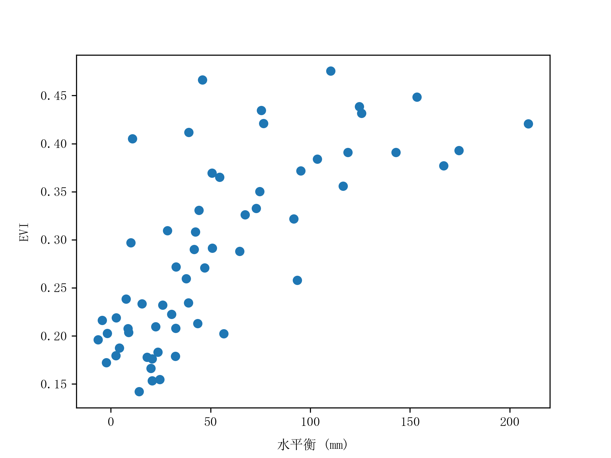

# 地学数据多元统计实验二：回归分析


## 一、实验环境

1. 操作系统：`Windows 11`
2. Python 环境：`python 3.9.16`，`geemap`，`pandas`，`matplotlib`，`statsmodels`
3. 编译工具：`JupyterLab Desktop 3.4.6-1`


## 二、实验要求

1. 使用专业数据进行回归分析
2. 手写实验报告，图表部分使用铅笔绘图


## 三、实验步骤

### 1 计算长江流域相关数据

使用 Geemap 包调用 GEE 平台的资源和算力计算长江流域的相关数据。

1. 研究区域：长江流域

2. 研究时间：2018 年 1 月 ~ 2022 年 12 月，近五年，60 个月

3. 数据源：

- CHIRPS 全球准降雨量数据集，每 5 日一次数据
- MOD09 数据集的 NIR 和 SWIR 波段
- MOD13 数据集的 EVI 波段
- MOD16 数据集的 ET 波段

4. 计算数据：

- P：每月的 CHIRPS 降雨量数据求月度均值
- ET：每月的 MOD16_ET 蒸发散量求月度均值
- Q：月度水量平衡
- MSI：月度干旱指数
- EVI：月度增强植被指数

5. 相关公式

- 月度水量平衡

$$
Q=P-ET \tag*{(1)}
$$

- 干旱指数

$$
MSI = SWIR / NIR \tag*{(2)}
$$

### 2 导出数据

1. 使用 Geemap 包将计算好的数据以 “时间：相关变量” 的关系导出到 excel 表格中，得到五张数据表。

2. 使用 pandas 包将月度的水平衡、EVI、MSI 指数以时间为匹配合并成一张新表，具体部分数据如下：

<center>表 1 长江流域相关数据表（以2018年上半年为例）</center>

| date       | balance_mean | msi_mean    | evi_mean    |
| ---------- | ------------ | ----------- | ----------- |
| 2018-01-01 | 20.13776659  | 0.913432189 | 0.166229169 |
| 2018-02-01 | 2.476625534  | 0.966022926 | 0.179405804 |
| 2018-03-01 | 30.36589088  | 0.889692071 | 0.222627674 |
| 2018-04-01 | 42.32355161  | 0.790530022 | 0.308332396 |
| 2018-05-01 | 95.2822297   | 0.753975527 | 0.37172006  |
| 2018-06-01 | 103.5617162  | 0.710246966 | 0.383874888 |

### 3 数据分析

1. 使用 `describe()` 函数获取数据的描述性统计分析

<center>表 2 数据描述性统计分析表</center>

|       | balance_mean | msi_mean    | evi_mean    |
| ----- | ------------ | ----------- | ----------- |
| count | 60           | 60          | 60          |
| mean  | 54.23086116  | 0.797117997 | 0.289466469 |
| std   | 49.7602456   | 0.101809624 | 0.096046982 |
| min   | -6.48218478  | 0.635090271 | 0.142029182 |
| 25%   | 19.64246664  | 0.72031554  | 0.206569206 |
| 50%   | 40.45366585  | 0.791738236 | 0.280049746 |
| 75%   | 75.74651309  | 0.882405791 | 0.373057061 |
| max   | 209.3363853  | 0.995065787 | 0.475566963 |

2. 使用 `corr(numeric_only=True)` 函数进行数据的相关性分析，获得相关矩阵。

<center>表 3 数据相关性分析表</center>

|              | balance_mean | msi_mean     | evi_mean     |
| ------------ | ------------ | ------------ | ------------ |
| balance_mean | 1            | -0.741298715 | 0.72988548   |
| msi_mean     | -0.741298715 | 1            | -0.923045341 |
| evi_mean     | 0.72988548   | -0.923045341 | 1            |

### 4 数据散点图

1. 使用 matplotlib 包绘制散点图，首先观察水平衡与 EVI 指数的散点关系



<center>图 1 长江流域月度水平衡与 EVI 散点图 (2018 - 2022)</center>

2. 接下来，再观察 MSI 与 EVI 指数的散点关系


<center>图 2 长江流域月度 EVI 与 MSI 散点图 (2018 - 2022)</center>

### 5 OLS Regression 普通最小二乘回归

本次实验目标，是研究长江流域的生态环境和植被覆盖情况，选择增强植被指数作为因变量，设置两个自变量，分别是水量平衡和干旱指数。使用多元线性回归模型来分析因变量和自变量之间的线性关系，分析植被生长和退化的原因和效应。

多元线性回归模型的一般形式为：
$$
y=\beta_0+\beta_1x_1+\beta_2x_2+...+\beta_kx_k+\epsilon \tag*{(3)}
$$
其中，$y$ 是因变量，$x_1,x_2,...,x_k$ 是自变量，$β_0,β_1,β_2,...,β_k$ 是回归系数，$ϵ$ 是误差项。

1. 首先，使用水量平衡和干旱指数两个自变量建立回归模型


根据上述表格得到的是一个二元线性回归模型，有两个自变量和一个因变量。因变量是增强植被指数 EVI，自变量是水量平衡和 MSI 干旱指数，得到的回归方程为：
$$
evi = 0.9165 + 0.0002 \times balance\_water - 0.8000 \times msi + \epsilon
$$
并得到回归报告：

```
Notes:
[1] Standard Errors assume that the covariance matrix of the errors is correctly specified.
[2] The condition number is large, 1.44e+03. This might indicate that there are
strong multicollinearity or other numerical problems.
```

【1】标准误差是假设误差项的协方差矩阵是正确指定的。

【2】条件数很大，为1.44e+03。这可能表明存在强的多重共线性或其他数值问题。

2. 通过上面的回归方程发现水平衡的权重很低，所以接下来剔除掉水平衡 balance_mean 再次建立模型，回归分析结果如下：


根据上述表格得到的是一个一元线性回归模型，只有一个自变量和一个因变量。因变量是增强植被指数 EVI，自变量是 MSI 干旱指数，得到的回归方程为：
$$
evi = 0.9836 - 0.8708 \times msi + \epsilon
$$
并得到回归报告：

```
Notes:
[1] Standard Errors assume that the covariance matrix of the errors is correctly specified.
```

这说明 MSI 干旱指数与 EVI 增强植被指数确实存在强关联关系。。。

### 6 总结

对回归模型进行检验和评价

回归方程的显著性检验：F检验，p值小于0.05，拒绝原假设，认为回归方程是显著的

回归系数的区间估计和显著性检验：t检验，p值小于0.05，拒绝原假设，认为回归系数不等于0

残差分析：残差图，正态概率图，残差与自变量的关系图等，检查残差是否符合正态分布、独立性、方差齐性等假设

拟合优度：R平方和调整R平方，表示模型对数据的解释程度，越接近1越好

使用回归方程进行预测和控制

预测：给定自变量的值，计算因变量的预测值，并给出预测区间

控制：给定因变量的期望值，计算自变量的取值范围，并给出置信区间
