# 练习二  - 准备工作


## 参考资料
1. [厦门大学林子雨老师 - Hadoop3.1.3安装教程_单机/伪分布式配置](https://dblab.xmu.edu.cn/blog/2441/)
1. [厦门大学林子雨老师 - 大数据原理与应用 第四章 分布式数据库HBase 学习指南](https://dblab.xmu.edu.cn/blog/588/)
1. [厦门大学林子雨老师 - 在ECS实例的Ubuntu系统中安装HBase](https://dblab.xmu.edu.cn/blog/2139/)
1. [厦门大学林子雨老师 - HBase2.2.2安装和编程实践指南](https://dblab.xmu.edu.cn/blog/2442/)


## 1 配置 Hadoop 的 PATH 环境变量

&emsp;&emsp;由于之前我们每次启动 Hadoop 命令时，都要写出详细文件位置，为了方便后续运行，我们将 Hadoop 写入用户环境变量。（后面对 Hbase 也是相同的操作）

> 修改配置文件

```sh
vim ~/.bashrc
```

> 配置 PATH 变量

```sh
export HADOOP_HOME=/home/Vivian/usr/local/hadoop
export HADOOP_COMMON_LIB_NATIVE_DIR=${HADOOP_HOME}/lib/native
export PATH=$PATH:${JAVA_HOME}/bin:${HADOOP_HOME}/bin:${HADOOP_HOME}/sbin
```

> 配置生效

```sh
source ~/.bashrc
```

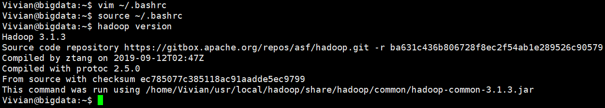

<center>图 1-1 配置 Hadoop 环境变量全过程截图</center>

## 2 安装并配置 Hbase2.2.2

### 2.1 上传所需安装包

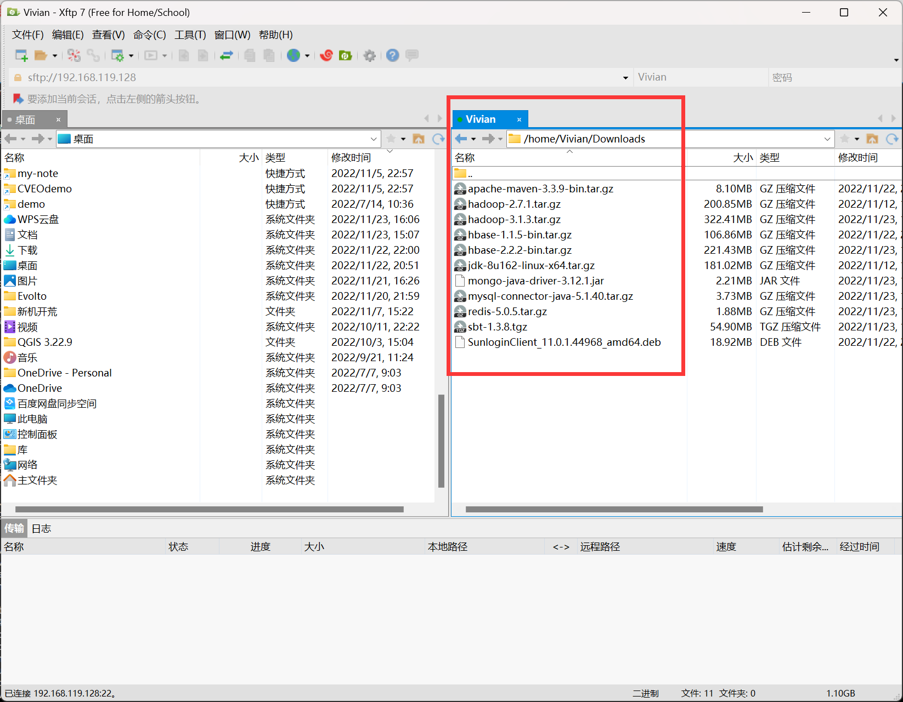

<center>图 2-1 上传所需安装包</center>

### 2.2 安装 Hbase2.2.2

> 解压安装 Hbase2.2.2

```sh
tar -zxf ~/Downloads/hbase-2.2.2-bin.tar.gz -C ~/usr/local
```

> 重命名文件夹

```sh
cd ~/usr/local
mv ./hbase-2.2.2 ./hbase
```

### 2.3 配置环境变量

> 修改配置文件

```sh
vim ~/.bashrc
```

> 配置 PATH 变量

```sh
export PATH=$PATH:${JAVA_HOME}/bin:${HADOOP_HOME}/bin:${HADOOP_HOME}/sbin:/home/Vivian/usr/local/hbase/bin
```

> 配置生效

```sh
source ~/.bashrc
```

### 2.4 检查安装情况

```sh
hbase version
```

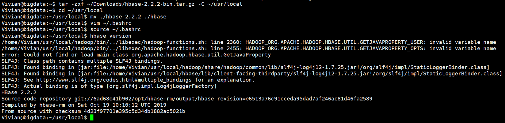

<center>图 2-2 Hbase2.2.2 安装全过程</center>

## 3 HBase 伪分布式模式配置

- HBase 有三种运行模式：① 单机模式；② 伪分布式模式；③ 分布式模式
- 伪分布式模式和分布式模式都需要基于 Hadoop 才能运行
- 三种运行方式不能同时存在，只能选择其一，这里我们常用的是 ***伪分布式***

### 3.1 配置 `hbase-env.sh`

> 打开并编辑 `hbase-env.sh`

```sh
vim ~/usr/local/hbase/conf/hbase-env.sh
```

> 添加内容

在文件的顶部添加下面的内容，这里尤其注意第二行，有教程中所写的路径不同，hadoop3.1.3 的配置文件在 `etc/hadoop/`目录下，而不是教程中的 `conf/` 目录。

```sh
export JAVA_HOME=/home/Vivian/usr/lib/jvm/jdk1.8.0_162
export HBASE_CLASSPATH=/home/Vivian/usr/local/hadoop/etc/hadoop/
export HBASE_MANAGES_ZK=true 
```


<center>图 3-1 hbase-env.sh 添加内容</center>

### 3.2 配置 `hbase-site.xml`

> 打开并编辑 `hbase-site.xml`

```sh
vim ~/usr/local/hbase/conf/hbase-site.xml
```

> `hbase-site.xml` 配置内容

```xml
<configuration>
        <property>
                <name>hbase.rootdir</name>
                <value>hdfs://localhost:9010/hbase</value>
        </property>
        <property>
                <name>hbase.cluster.distributed</name>
                <value>true</value>
        </property>
        <property>
        <name>hbase.unsafe.stream.capability.enforce</name>
        <value>false</value>
    </property>
</configuration>
```

### 3.3 启动 HBase

**！！！注：**集群、单节点模式都需要用到 SSH 登陆，且由于 HBase 的伪分布式是基于 Hadoop 的，所以每次都要注意。

- 启动关闭 Hadoop 和 HBase 的顺序一定是：
  登录 SSH → 启动 Hadoop → 启动 HBase → 关闭 HBase → 关闭 Hadoop → 退出 SSH 

> SSH 登录

```sh
ssh localhost
```

> 启动 Hadoop

```sh
start-dfs.sh
```

> 启动 HBase

```sh
start-hbase.sh
```

> 查看当前 Java 进程

```sh
jps
```

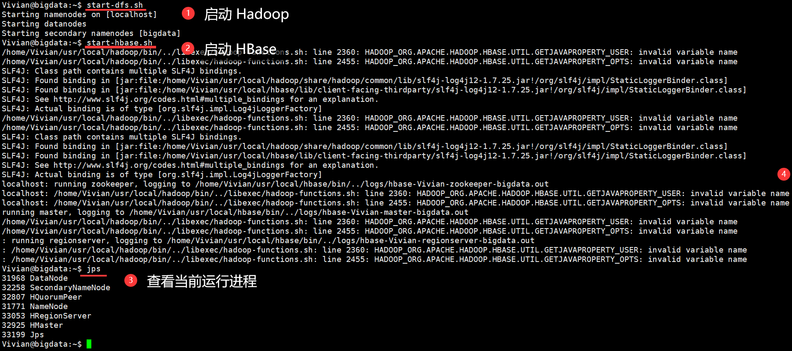

<center>图 3-2 启动伪分布式 HBase</center>

### 3.4 进入 shell 界面

在已经成功启动 HBase 后，可以进入 shell 命令行开始进行操作。

> 打开 shell 命令行模式

```sh
hbase shell
```

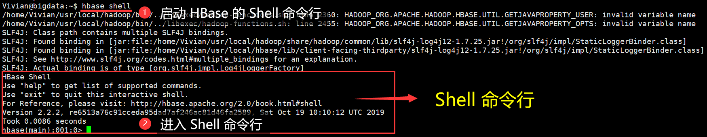

<center>图 3-3 进入 Shell 命令行</center>

> 如需退出

```sh
exit
```

### 3.5 利用 Web 界面管理 HDFS 和 HBase

> HDFS 的 Web 界面

```sh
http://服务器IP:9870
```

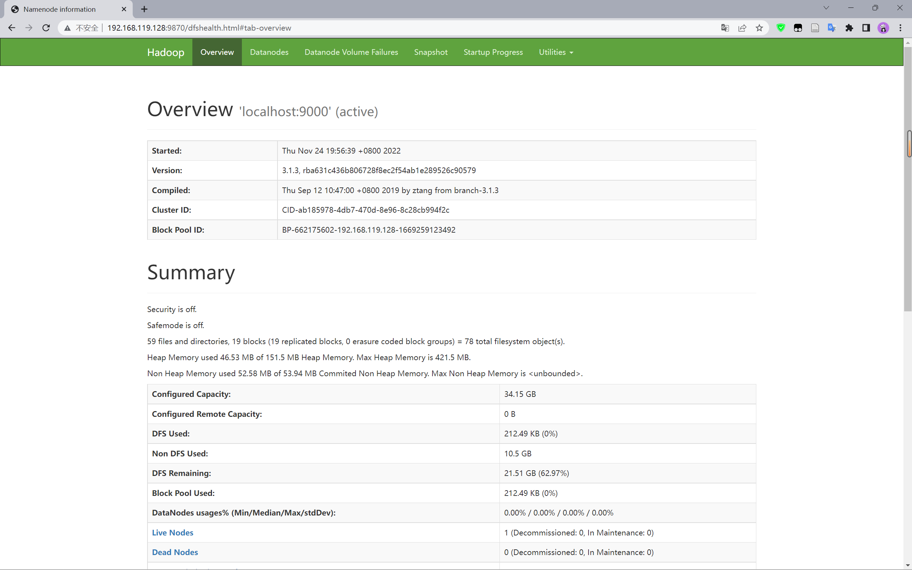

<center>图 3-4 HDFS 的 Web 界面</center>

>HBase 的 Web 界面

```
http://服务器IP:16010/
```


<center>图 3-5 HBase 的 Web 界面</center>

### 3.6 关闭 HBase

**！！！注：**再次强调，启动关闭 Hadoop 和 HBase 的顺序一定是：

- 登录 SSH → 启动 Hadoop → 启动 HBase → 关闭 HBase → 关闭 Hadoop → 退出 SSH 

> 停止 HBase

```sh
stop-hbase.sh
```

> 停止 Hadoop

```sh
stop-dfs.sh
```


## 4 利用 Java API 进行交互

### 4.1 在 Ubuntu 中安装 Eclipse

> 将 Eclipse 安装给系统用户

```sh
sudo tar -zxvf ~/Downloads/eclipse-4.7.0-linux.gtk.x86_64.tar.gz -C /usr/local 
```

> 启动 Eclipse

```sh
cd /usr/local/eclipse
./eclipse 
```

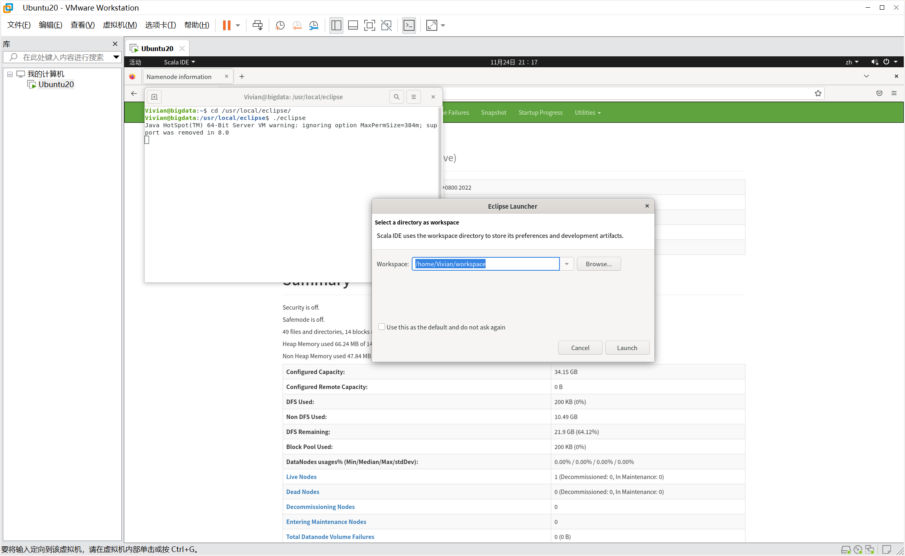

<center>图 4-1 Eclipse 界面</center>

### 4.2 手动创建 Eclipse 图标

&emsp;&emsp;Eclipse 安装后可能会没有图标，所以需要我们自己手动创建，具体命令如下：

> 进入图标存放目录

```sh
cd /usr/share/applications/
```

> 用文本编辑器打开 eclipse 的图标文件,没有会自动创建

```sh
sudo gedit eclipse.desktop
```

> 复制下面的文本粘贴进去

```
[Desktop Entry]
Name=eclipse
Type=Application
Exec=/usr/local/eclipse/eclipse
Icon=/usr/local/eclipse/icon.xpm
```

- `Exec=`：后面改为 eclipes 的安装路径
- `Icon=`：后面改成 eclipes 图标的路径

&emsp;&emsp;最后保存就好了，再去启动器看会发现图标出来了。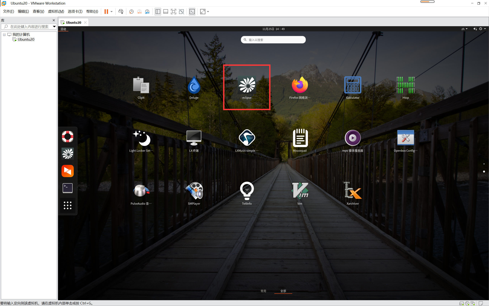

<center>图 4-2 桌面上查看 Eclipse 图标</center>


## 5 问题及其解决方法

### 5.1 问题一

#### 5.1.1 问题描述

在每次运行 Hadoop 时，都会出现如下报错信息，但是却不影响使用。

```
WARN util.NativeCodeLoader: Unable to load native-hadoop library for your platform... using builtin-java classes where applicable
```

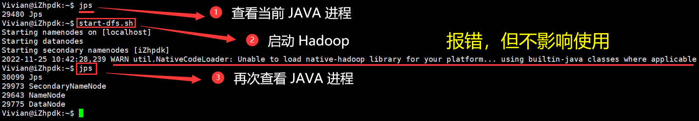

<center>图 5-1 问题二截图</center>

#### 5.1.2 参考文章

- [CSDN - 解决 WARN util.NativeCodeLoader: Unable to load native-hadoop library for your platform...警告](https://blog.csdn.net/weixin_45678985/article/details/120497297)

#### 5.1.3 解决步骤

> 编辑当前用户环境变量

```sh
vim ~/.bashrc
```

> 插入如下内容

```sh
export JAVA_LIBRARY_PATH=/home/Vivian/usr/local/hadoop/lib/native
```

注：这里的路径就是之前 Hadoop 安装的路径。

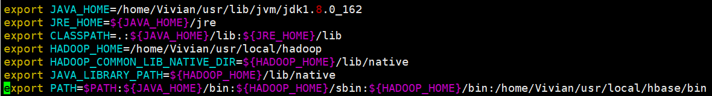

<center>图 5-2 用户环境变量</center>

> 生效用户变量

```sh
source ~/.bashrc
```

> 关闭 Hadoop 

```sh
stop-dfs.sh
```

这里我们关闭 Hadoop 来测试是否仍有警告，截图如下，此时可以看到，已经没有警告信息了。


<center>图 5-3 问题一成功解决</center>

### 5.2 问题二

#### 5.2.1 问题描述

在每次运行 HBase 时，都会出现如下报错信息，但是却不影响使用。

```sh
line 2360: HADOOP_ORG.APACHE.HADOOP.HBASE.UTIL.GETJAVAPROPERTY_USER：invalid variable name
```


<center>图 5-4 问题一截图</center>

#### 5.2.2 参考文章 

- [CSDN - Hbase 出现：usrlocalhadooplibexechadoop-functions.sh 行 2360 HADOOP_ORG.APACHE.HADOOP.HBASE](https://blog.csdn.net/m0_67393413/article/details/123936015)

#### 5.2.3 解决方案

> 编辑 HBase 环境文件

```sh
vim ~/usr/local/hbase/conf/hbase-env.sh
```

> 将最后一行取消注释

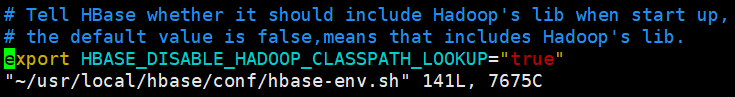

<center>图 5-5 取消注释</center>

> 关闭 HBase

```sh
stop-hbase.sh
```

> 重新启动 HBase

```sh
start-hbase.sh
```

这里我们重启 HBase 来测试是否仍有警告，截图如下，此时可以看到，已经没有警告信息了。

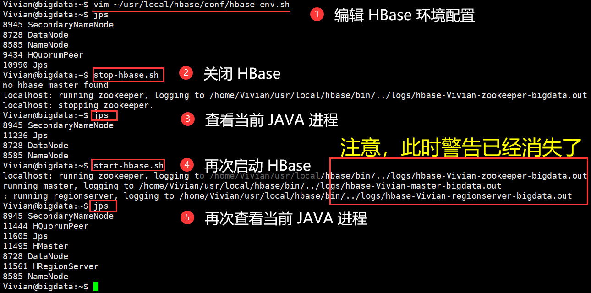

<center>图 5-6 问题二成功解决</center>
