# 地理信息系统三维建模课程报告


## 实验环境

1. 操作环境：虚拟机 Windows 10

2. 操作软件：Visual Studio 2012


## 课时一 OpenGL 开发环境配置【2023.2.22 课】

### 课程说明

&emsp;&emsp;使用 OpenGL 创建一个显示图像的 Windows 程序，通过这个程序学习用 OpenGL 编程的基本要求。

1、GDI（Graphics Device Interface）是通过设备句柄 (Device Context, DC) 来绘图，而 OpenGL 则需要绘制环境 (Rendering Context, RC)

2、每一个 GDI 命令需要传给它一个 DC，与 GDI 不同，OpenGL 使用当前绘制环境 (RC)。一旦在一个线程中指定了一个当前 RC，所有在此线程中的 OpenGL 命令都使用相同的当前 RC。虽然在单一窗口中可以使用多个 RC，但在单一线程中只有一个当前 RC。

3、本例将首先产生一个 OpenGL RC 并使之成为当前 RC，分为三个步骤：

 - 设置窗口像素格式
 - 产生 RC
 - 设置为当前 RC

### 一、创建工程

#### 1.1 新建工程

1. 首先，创建在电脑上创建一个名为 `GIS-3DM` 的文件夹，用于存放后续所有操作项目
2. 打开 VS2012，顶部工具栏 → 文件 → 新建项目 → MFC 应用程序
3. 将框架从默认的 4.5 改为 `.NET Framework 4`
4. 选择工程存放位置，并将工程命名为 `GLSample1`，如下图所示

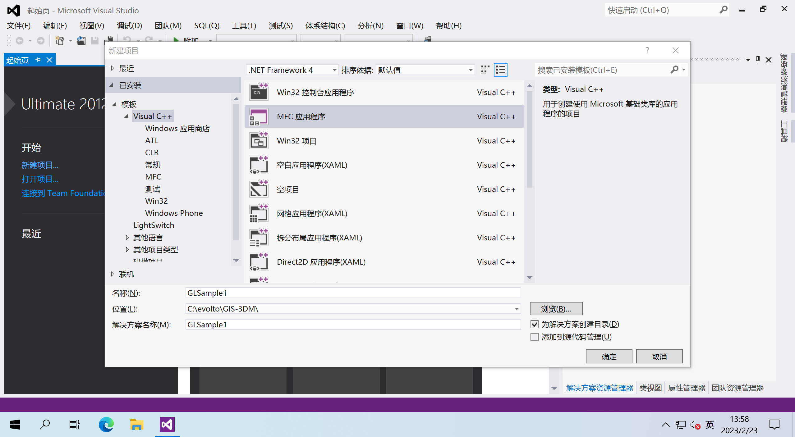

#### 1.2 MFC 应用配置

- 设置应用程序类型

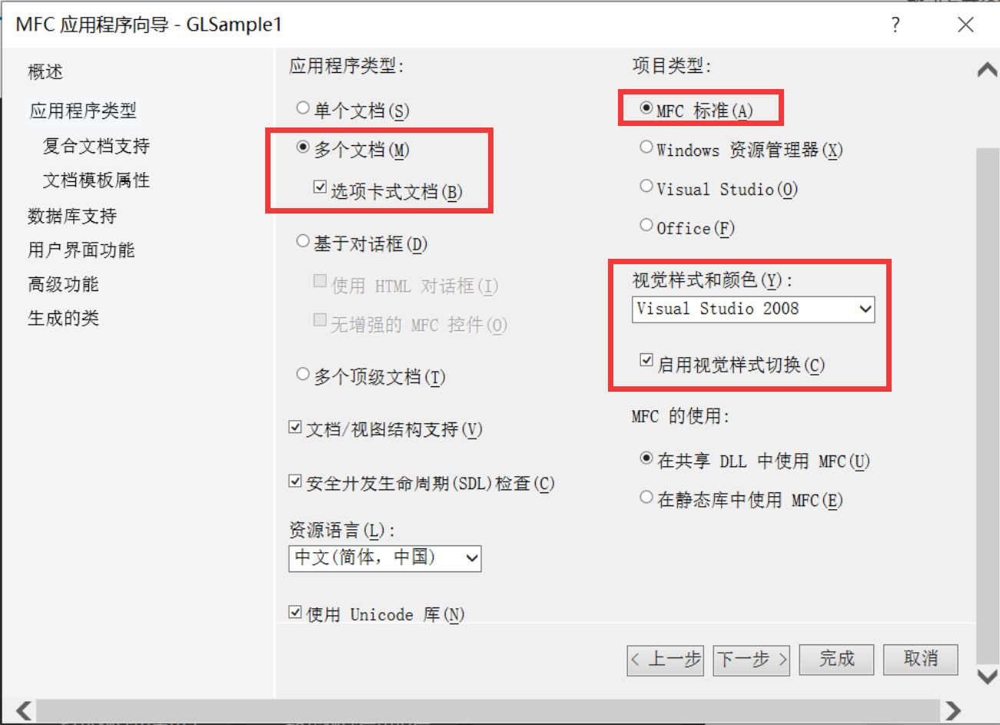

- 设置复合文档支持【维持默认即可】

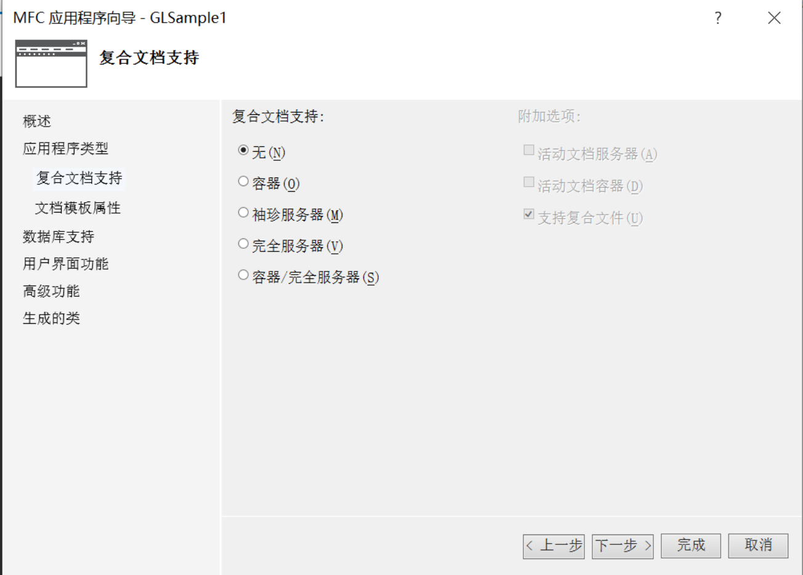

- 设置文档模板属性【维持默认即可】

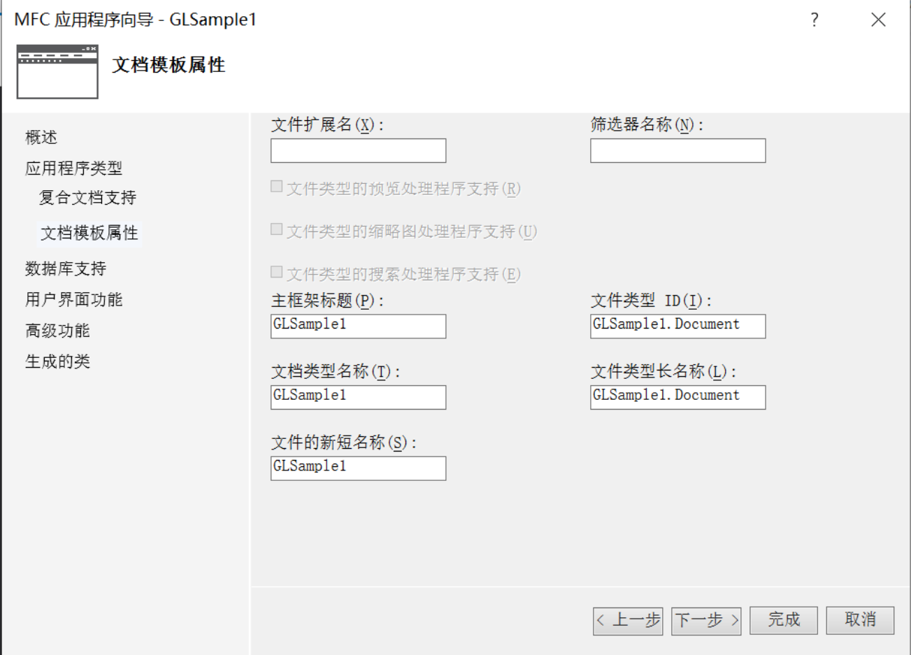

- 设置数据库支持【维持默认即可】

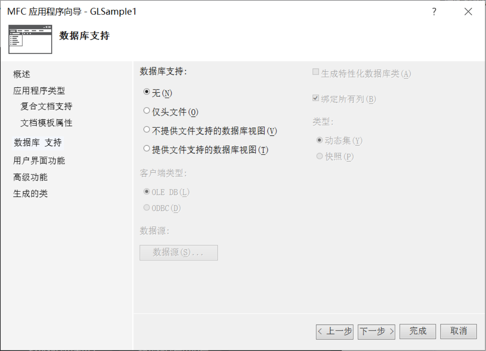

- 设置用户界面功能【维持默认即可】

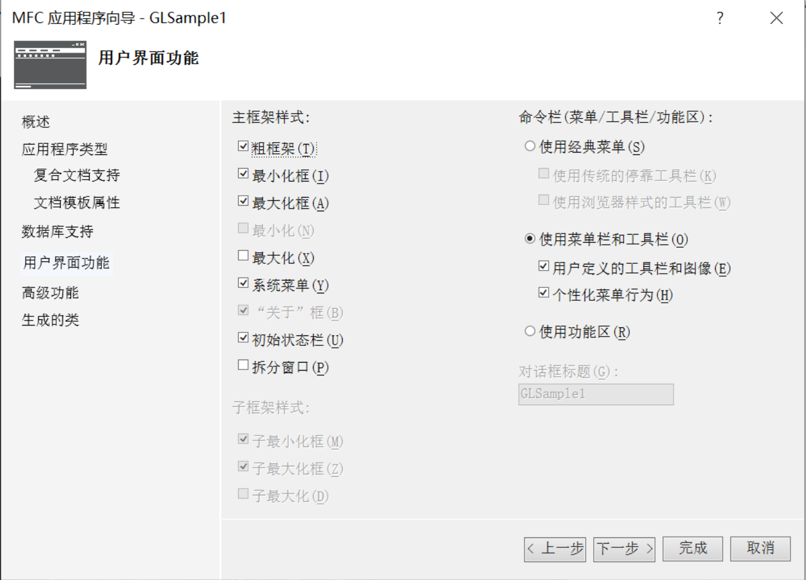

- 设置高级功能【维持默认即可】

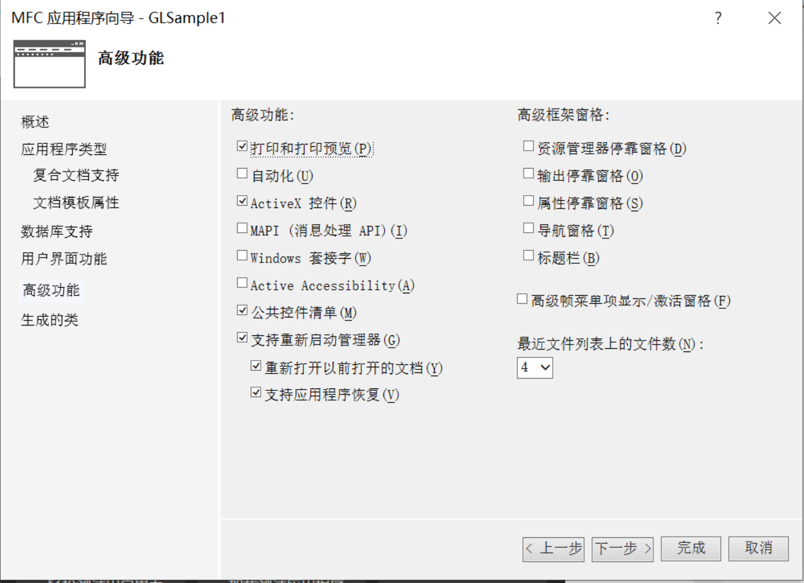

- 设置生成的类【维持默认即可】

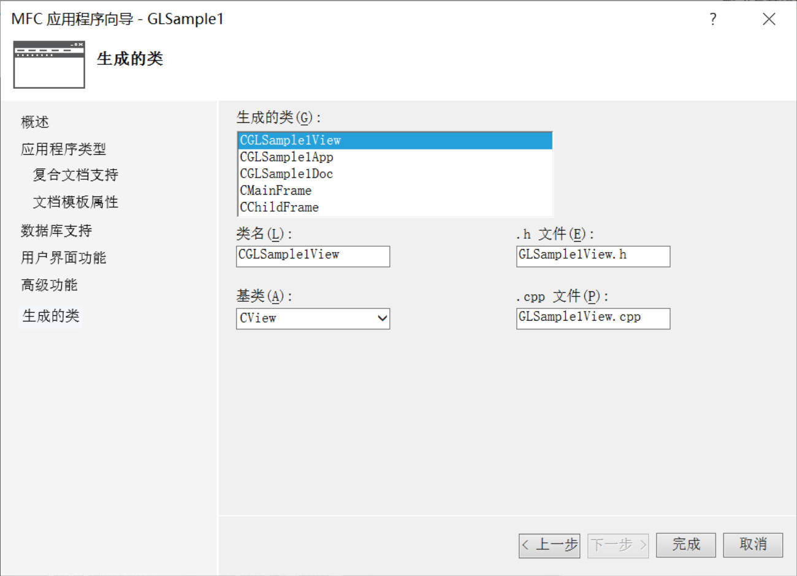

#### 1.3 进入项目界面

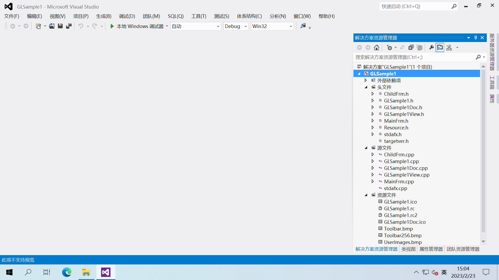

### 二、添加 OpenGL 库

&emsp;&emsp;接下来我们要将此工程所需的 OpenGL 文件和相关库加入到工程中。

#### 2.1 拷贝 OpenGL  相关文件

&emsp;&emsp;1、将相关的头文件拷贝到 `VS安装路径/VC/include/GL` 目录下

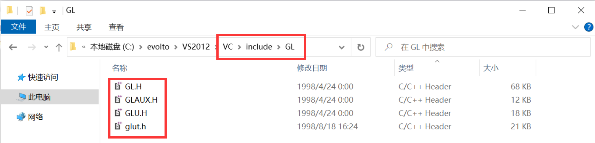

&emsp;&emsp;2、将相关的 `*.lib` 文件拷贝到 `VS安装路径/VC/lib` 目录下

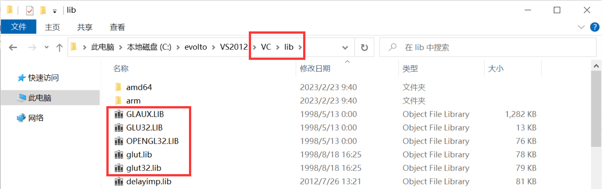

&emsp;&emsp;3、将相关的 `*.DLL` 文件，拷贝到项目工程文件所在的目录下

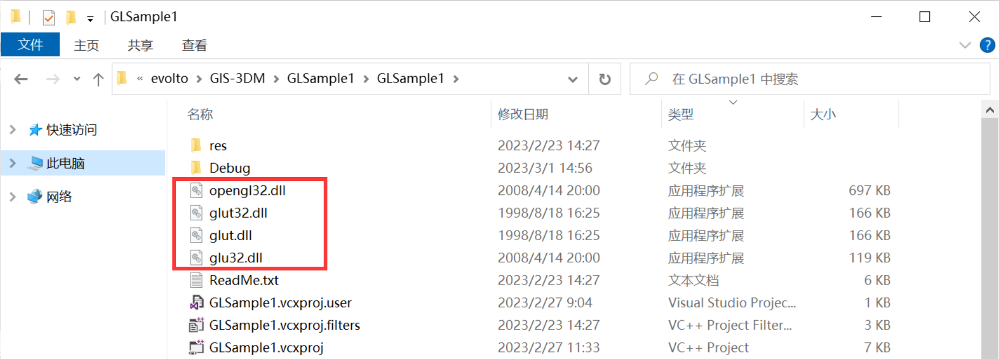

#### 2.2 项目属性配置

&emsp;&emsp;1、在顶部工具栏 → 项目 → 属性，进入项目设置界面，将字符集改为：“使用多字节字符集”

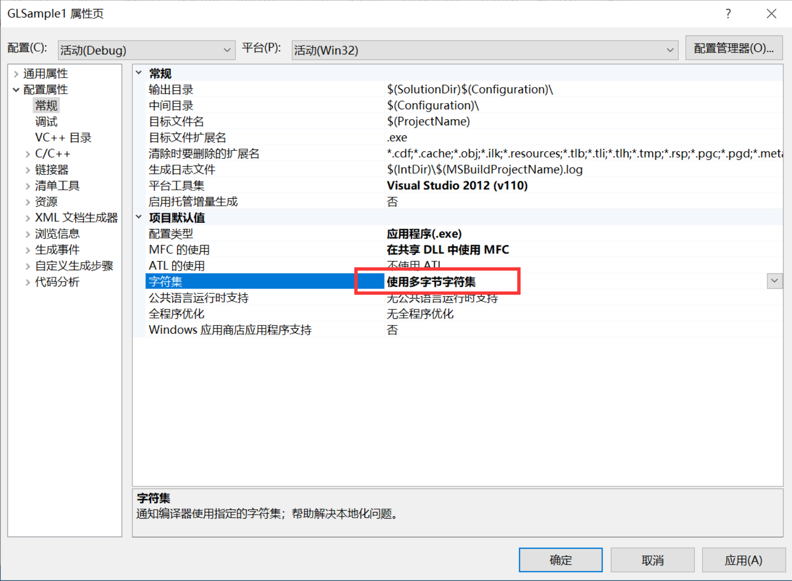

&emsp;&emsp;2、左侧链接器栏 → 输入 → 附加依赖项，添加如下内容：

```
OpenGL32.lib; glu32.lib; glaux.lib
```

【注】：各个库用空格分开，否则会出现链接错误。

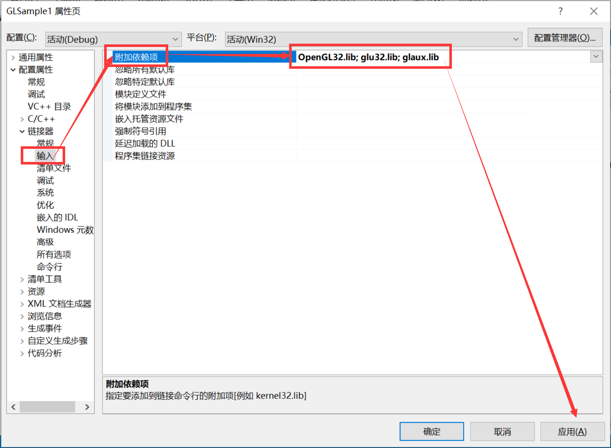

### 三、设置窗口样式

#### 3.1 窗口风格介绍

&emsp;&emsp;OpenGL 需要对窗口添加两种风格：

1. `WS_CLIPCHILDREN`：创建父窗口使用的 Windows 风格，用于重绘时裁剪子窗口所覆盖的区域
2. `WS_CLIPSIBLINGS`：创建子窗口使用的 Windows 风格，用于重绘时剪裁其他子窗口所覆盖的区域
3. 这两个样式可以提高窗口的绘制效率和避免子控件之间的绘制冲突。

#### 3.2 修改 `PreCreateWindow` 函数

&emsp;&emsp;右侧源文件 → 打开 `GLSample1View.cpp` 文件 → 找到 `PreCreateWindow` 函数并修改，如下图所示

```c++
BOOL CGLSample1View::PreCreateWindow(CREATESTRUCT& cs)
{
	// TODO: 在此处通过修改
	//  CREATESTRUCT cs 来修改窗口类或样式
    cs.style |= (WS_CLIPCHILDREN | WS_CLIPSIBLINGS);
	return CView::PreCreateWindow(cs);
}
```

#### 3.3 代码解释

&emsp;&emsp;这是一个 MFC 的视图类 `CGLSample1View` 中的 `PreCreateWindow` 函数。

1. 该函数在窗口创建之前被调用，可以在这里修改窗口的样式和类。
2. 在该函数中，将 CREATESTRUCT 结构体中的样式 `cs.style` 进行修改，增加了 `WS_CLIPCHILDREN` 和 `WS_CLIPSIBLINGS` 样式
3. 最后，函数调用 `CView::PreCreateWindow(cs)`来执行视图类的默认行为，并返回结果。

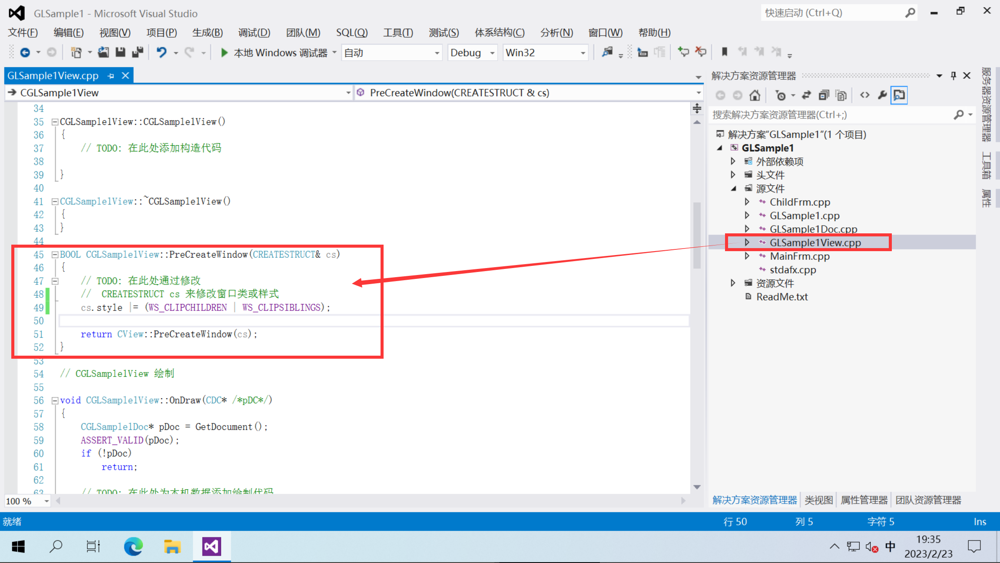

### 四、设置窗口像素格式

#### 4.1 RC 概念介绍

&emsp;&emsp;OpenGL 中，RC 指的是渲染上下文（Render Context），它是一个抽象概念，用于表示 OpenGL 的渲染状态和资源。

&emsp;&emsp;在 Windows 平台上，渲染上下文通常使用设备上下文（Device Context，简称 DC）和像素格式描述符（Pixel Format Descriptor）创建。

&emsp;&emsp;渲染上下文包括了 OpenGL 的所有状态，如当前绘制颜色、深度测试状态、光照状态、材质状态等。

&emsp;&emsp;当我们需要在 Windows 平台上使用 OpenGL 进行绘制时，需要创建一个渲染上下文（RC），并将其绑定到当前的设备上下文（DC）中。这样才能正确地进行 OpenGL 绘制操作。 

#### 4.2 定义窗口像素格式

&emsp;&emsp;产生一个 RC 的第一步是定义窗口的像素格式。像素格式决定窗口着所显示的图形在内存中是如何表示的。

&emsp;&emsp;由像素格式控制的参数包括：颜色深度、缓冲模式和所支持的绘画接口。在下面将有对这些参数的设置。

&emsp;&emsp;1、顶部工具栏 → 视图 → 类视图，此时右侧会出现对应的界面

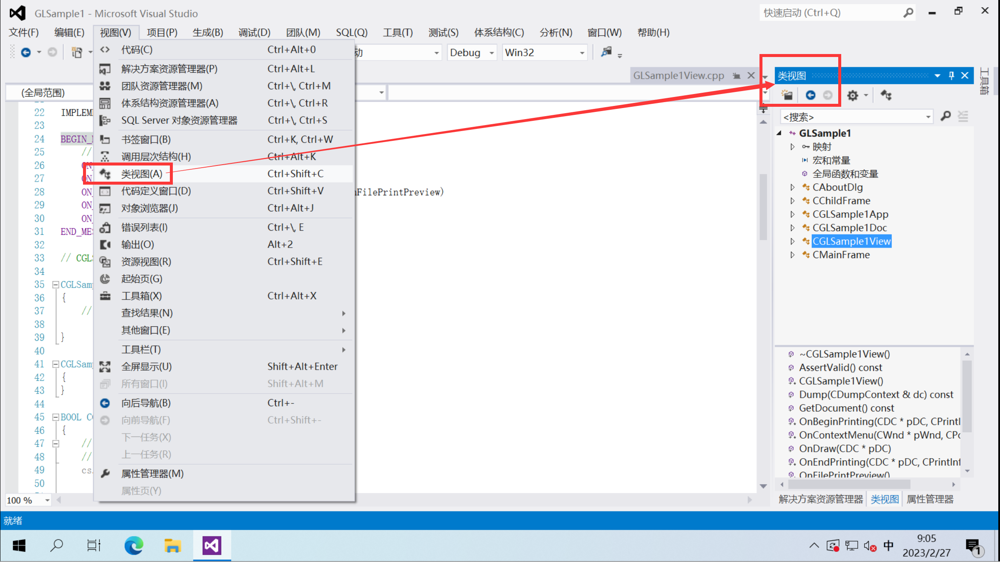

&emsp;&emsp;2、我们先在 `CGLSample1View` 的类中添加一个成员函数 `BOOL SetWindowPixelFormat(HDC hDC)`

- 鼠标右击 `CGLSample1View` → 添加 → 添加函数 → 修改各项参数 → 点击添加

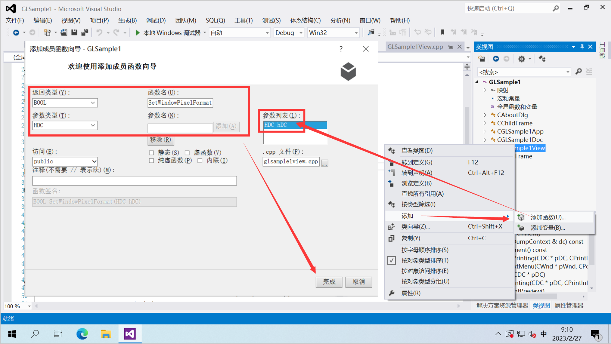

&emsp;&emsp;3、设置函数内容

```c++
BOOL CGLSample1View::SetWindowPixelFormat(HDC hDC)
{
	static PIXELFORMATDESCRIPTOR pfd= //pfd 告诉窗口我们所希望的东东
	{
		sizeof(PIXELFORMATDESCRIPTOR),//file://上诉格式描述符的大小
		1,// 版本号
		PFD_DRAW_TO_WINDOW |// 格式必须支持窗口
		PFD_SUPPORT_OPENGL |// 格式必须支持OpenGL
		PFD_DOUBLEBUFFER,// 必须支持双缓冲
		PFD_TYPE_RGBA,// 申请 RGBA 格式
		32,// 选定色彩深度
		0, 0, 0, 0, 0, 0,// 忽略的色彩位
		0,// 无Alpha缓存
		0,// 忽略Shift Bit
		0,// 无聚集缓存
		0, 0, 0, 0,// 忽略聚集位
		16,// 16位 Z-缓存 (深度缓存)
		0,// 无模板缓存
		0,// 无辅助缓存
		PFD_MAIN_PLANE,// 主绘图层
		0,// 保留
		0, 0, 0// 忽略层遮罩
	}; 

	/*if (!(hDC=GetDC(hWnd))) //取得设备描述表了么?
	{
	// 重置显示区
	MessageBox(NULL,"Can't Create A GL Device Context.","ERROR",MB_OK|MB_ICONEXCLAMATION);
	return FALSE; // 返回 FALSE
	} */
	// 设法为OpenGL窗口取得设备描述表后，我们尝试找到对应与此前我们选定的象素格式的象素格式。如果Windows不能找到的话，弹出错误消息，并退出程序(返回FALSE)。 
	if (!(m_GLPixelIndex=ChoosePixelFormat(hDC,&pfd))) // Windows 找到相应的象素格式了吗?
	{ // 重置显示区
		AfxMessageBox("Can't Find A Suitable PixelFormat.");
		return FALSE; // 返回 FALSE
	}  
	// Windows 找到相应的象素格式后，尝试设置象素格式。如果无法设置，弹出错误消息，并退出程序(返回FALSE)。 
	if(!SetPixelFormat(hDC,m_GLPixelIndex,&pfd)) // 能够设置象素格式么?
	{
		// 重置显示区
		AfxMessageBox("Can't Set The PixelFormat." );
		return FALSE;   
	}    
	m_hGLContext = wglCreateContext(hDC); 
	return TRUE;
}
```

&emsp;&emsp;4、右侧类视图 → 双击 `CGLSample1View` 类 → 找到对应位置添加如下代码：

```c++
int m_GLPixelIndex;
HGLRC m_hGLContext;
float movex,movey,movez;
float m_rotatex,m_rotatey,m_rotatez;
```

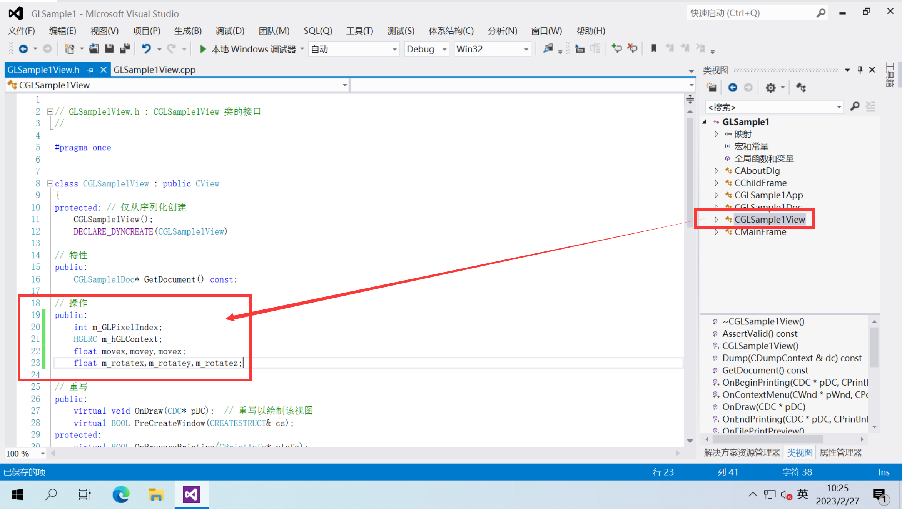

&emsp;&emsp;5、构造初始化类

- 双击右侧 `CGLSample1View()` 方法，添加如下代码

```c++
CGLSample1View::CGLSample1View()
{
	// TODO: 在此处添加构造代码
	m_hGLContext = NULL;
	m_GLPixelIndex = 0; 
	movex = movey = movez = 0;
	m_rotatex = 0;
	m_rotatey = 0;
	m_rotatez = 0;
}
```

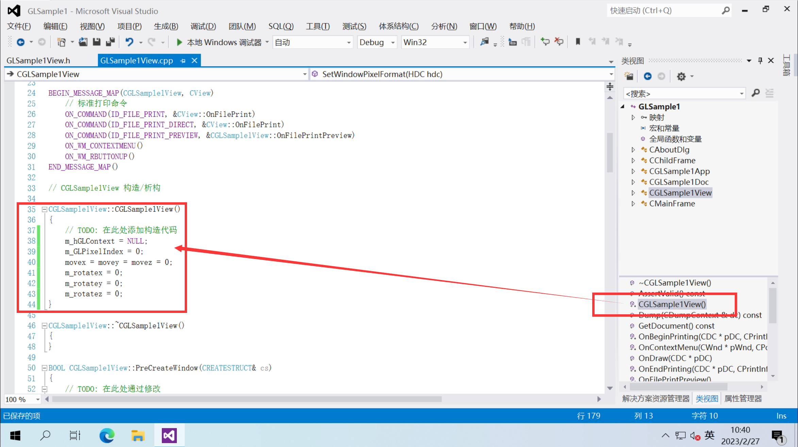

&emsp;&emsp;现在像素格式已经设定，我们下一步工作是产生绘制环境 (RC) 并使之成为当前绘制环境。


### 五、产生 RC

#### 5.1 设置当前产生绘制环境

&emsp;&emsp;1、在 `CGLSample1View` 中加入一个成员函数 `BOOL CreateViewGLContext(HDC hDC)`，使之如下所示：

- 双击 `CGLSample1View` ，在对应位置添加如下代码：

```c++
BOOL CGLSample1View::CreateViewGLContext(HDC hDC)
{ 
	m_hGLContext = wglCreateContext(hDC);// 用当前产生绘制环境(RC)
	if (m_hGLContext == NULL)
	{
		return FALSE;
	}
	if (wglMakeCurrent(hDC, m_hGLContext)==FALSE)
	{
		return FALSE;
	}
	return TRUE; 
}
```

保护型的成员变量 HGLRC `m_hGLContext`；HGLRC 是一个指向 rendering context 的句柄。

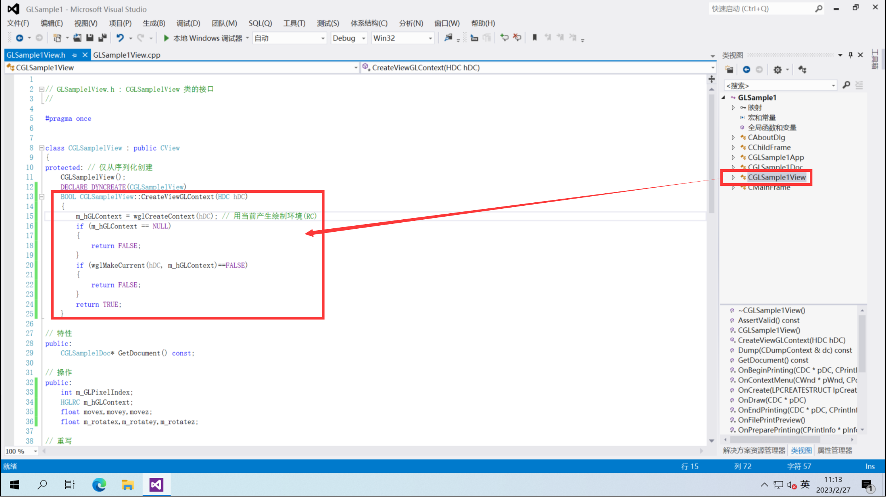

接下来，我们要添加一系列函数以完善项目程序。

#### 5.2 `OnCreate()` 函数

&emsp;&emsp;1、用 `ClassWizard` 添加 `WM_CREATE` 的消息处理函数

- 右击 `CGLSample1View` → 类向导 → 消息 → 双击 `WM_CREATE` → 点击确认
- 此时在文件中会出现对应的函数，我们后续会对其进行处理

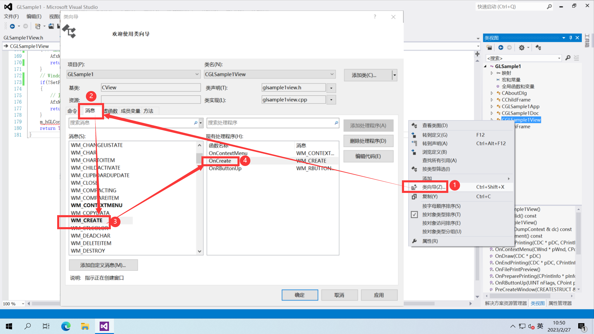

&emsp;&emsp;2、将内容修改为如下内容

```c++
int CGLSample1View::OnCreate(LPCREATESTRUCT lpCreateStruct)
{ 
	if (CView::OnCreate(lpCreateStruct) == -1)
		return -1;
	HWND hWnd = GetSafeHwnd();
	HDC hDC = ::GetDC(hWnd);
	if (SetWindowPixelFormat (hDC)==FALSE)
		return 0;
	if (CreateViewGLContext (hDC)==FALSE)
		return 0;
	return 0; 
}
```

#### 5.3 `OnDestroy()` 函数

- 添加 `WM_DESTROY` 的消息处理函数 `OnDestroy( )`，**添加过程同 5.2**，并将其修改为如下内容：

```c++
void CGLSample1View::OnDestroy()
{
	CView::OnDestroy();

	// TODO: 在此处添加消息处理程序代码
	if(wglGetCurrentContext()!=NULL)
	{ // make the rendering context not current
		wglMakeCurrent(NULL, NULL) ;
	}
	if (m_hGLContext!=NULL)
	{ 
		wglDeleteContext(m_hGLContext);
	    m_hGLContext = NULL;
	}
}
```

#### 5.4 `OnSize()` 函数

- 添加 `WM_SIZE` 的消息处理函数 `OnSize( )`，**添加过程同 5.2**，并将其修改为如下内容：

```c+
void CGLSample1View::OnSize(UINT nType, int cx, int cy) 
{
	CView::OnSize(nType, cx, cy); 
	
	// TODO: 在此处添加消息处理程序代码
	CClientDC dc(this); 
	GLsizei width, height;
	GLdouble aspect;
	width = cx;
	height = cy;
	if (cy==0)
		aspect=(GLdouble)width;
	else
        aspect=(GLdouble)width/(GLdouble)height; 
 	wglMakeCurrent(dc.m_hDC ,m_hGLContext);
	glViewport(0, 0, width, height);
    glViewport (0,0,cx,cy);
	 //gluLookAt(300,300,3000,0,0,0,1,0,0);

	glMatrixMode(GL_PROJECTION);
   	glLoadIdentity();	
	glOrtho(-500, 500.0*aspect, -500, 500.0,-500,500);
    glMatrixMode(GL_MODELVIEW);
	glLoadIdentity(); 
 	glClearColor(0.99F,0.00006369f,0.0006301F,0);
    wglMakeCurrent(NULL,NULL); 
}
```

#### 5.5 `OnDraw()` 函数

- 在 `CGLSample1View.cpp` 文件中找到函数 `OnDraw( )`，将其修改为如下内容

```c++
void CGLSample1View::OnDraw(CDC* pDC)
{
	CGLSample1Doc* pDoc = GetDocument();
	ASSERT_VALID(pDoc);
	
	HWND hwnd=GetSafeHwnd();
	HDC hdc=::GetDC(hwnd);
	wglMakeCurrent(hdc,m_hGLContext); 
	//glFrontFace(GL_CCW);缺省
	//glFrontFace(GL_CW); 
    glPolygonMode(GL_FRONT_AND_BACK,GL_FILL);
	// glPolygonMode(GL_FRONT,GL_LINE);
	glShadeModel(GL_SMOOTH); 
    glEnable(GL_AUTO_NORMAL);
	glEnable(GL_NORMALIZE); 
    glClear(GL_COLOR_BUFFER_BIT|GL_DEPTH_BUFFER_BIT);
	glClearColor(0,0,0,1);
	glClear(GL_COLOR_BUFFER_BIT); 
	//Light(); 
    glTranslatef(movex,-movey,movez); 
	
    glRotatef(m_rotatex,1,0,0);
	glRotatef(m_rotatey,0,1,0);
    glRotatef(m_rotatez,0,0,1);
	::glPushMatrix(); 
	glutSolidTeapot(80); 
	glBegin(GL_POLYGON);
	glColor4f(1.0f, 0.0f, 0.0f, 1.0f);
	glVertex3f(10.0f, 5.0f,10);
	
	glColor4f(0.0f, 1.0f, 0.0f, 1.0f);
	glVertex3f(500.0f, 360.0f,-20);
	
	glColor4f(0.0f, 0.0f, 1.0f, 1.0f);
	glVertex3f(450.0f, 500.0f,100);
	
	glEnd();
	
	//ShowPoints();
	SwapBuffers(hdc);
	glFlush();
	wglMakeCurrent(NULL,NULL); 
	
	glClear(GL_COLOR_BUFFER_BIT | GL_DEPTH_BUFFER_BIT );
}
```

#### 5.6 添加头文件

- 在 `CGLSample1View.cpp` 的 CPP 头文件包含位置中，加入如下三行代码：

```c++
#include "gl/glut.h"
#include "gl/gl.h" 
#include "gl/glu.h"
```

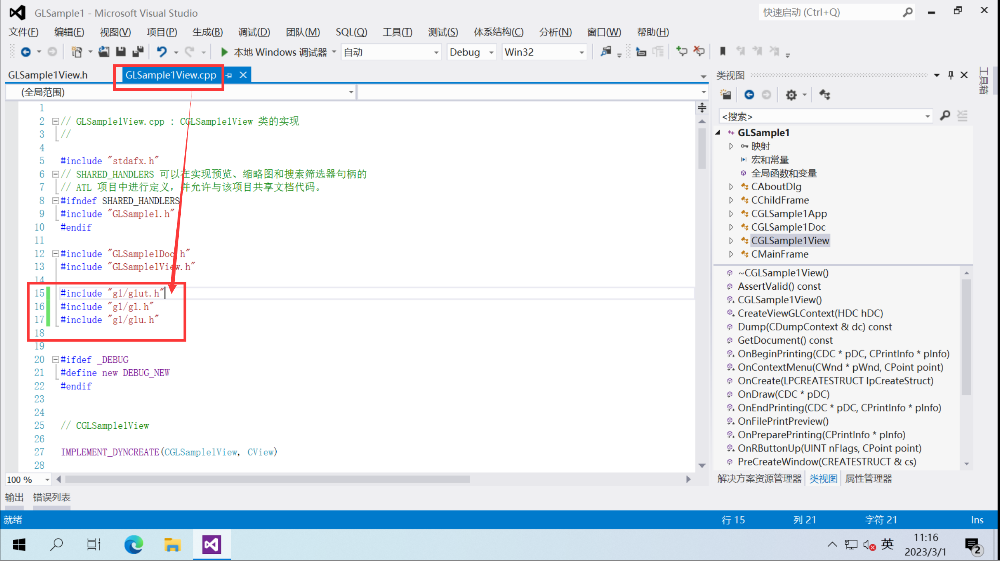

### 课程小结

&emsp;&emsp;至此，我们已经构造好了框架，使程序可以利用 OpenGL 进行画图了。我们在程序开头产生了一个 RC，自始自终都使用它。这与大多数的 GDI 程序不同。在 GDI 程序中，DC 在需要时才产生，并且是画完立刻释放掉。实际上，RC 也可以这样做；但要记住，产生一个 RC 需要很多处理器时间。因此，要想获得高性能流畅的图像和图形，最好只产生 RC 一次，并始终用它，直到程序结束。

&emsp;&emsp;`CreateViewGLContext` 产生 RC 并使之成为当前 RC。`WglCreateContext` 返回一个 RC 的句柄。在调用 `CreateViewGLContext` 之前，我们必须用 `SetWindowPixelFormat(hDC)` 将与设备相关的像素格式设置好。

&emsp;&emsp;`wglMakeCurrent` 将 RC 设置成当前 RC。传入此函数的 DC 不一定就是我们产生 RC 的那个 DC，但二者的设备句柄 (Device Context) 和像素格式必须一致。假如我们在调用 `wglMakeforCurrent` 之前已经有另外一个 RC 存在，`wglMakeforCurrent` 就会把旧的 RC 冲掉，并将新 RC 设置为当前 RC。另外我们可以用 `wglMakeCurrent(NULL, NULL)` 来消除当前 RC。

&emsp;&emsp;最后，我们要在 `OnDestroy` 中把绘制环境删除掉。但在删除 RC 之前，必须确定它不是当前句柄。我们是通过 `wglGetCurrentContext` 来了解是否存在一个当前绘制环境的。假如存在，那么用 `wglMakeCurrent(NULL, NULL)`来把它去掉。然后就可以通过 `wglDelete-Context` 来删除 RC 了。这时允许视类删除 DC 才是安全的。注：一般来说，使用的都是单线程的程序，产生的 RC 就是线程当前的 RC，不需要关注上述这一点。但如果使用的是多线程的程序，那我们就特别需要注意这一点了，否则会出现意想不到的后果。

- 运行结果如下：

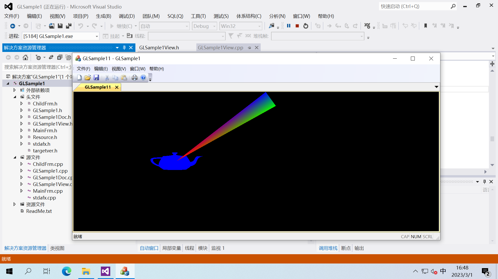


## 课时二 OpenGL 建模【2023.3.1 课】


VS2012 多行注释：Ctrl + K + C

### 教材参考

- OpenGL 教程 / OpenGL 基础图形编程 / 第六章、第七章


### 一、三维物体绘制

#### 1 添加头文件

首先，我们要在 `GLSample1View.cpp` 文件顶部添加 `glaux.h` 头文件，否则后面绘制时会报错。

```
#include "gl/glaux.h"
```

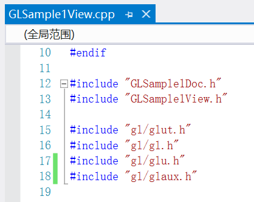

#### 2 绘制三维物体

接下来，我们在 `OnDraw()` 函数上方，添加 `DrawObject()` 函数用于绘制物体，其内容如下：

```c++
void CGLSample1View::DrawObject()
{ // 网状体（wire）和实心体（solid）
	// 网状球
	glPushMatrix();
	glTranslatef(-250, 150, 0);
	auxWireSphere(90);
	glPopMatrix();
	// 实心球
	glPushMatrix();
	glTranslatef(-250, -150, 0);
	auxSolidSphere(90);
	glPopMatrix();
	// 实心茶壶
	glPushMatrix();
	glTranslatef(0, 150, 0);
	glutSolidTeapot(100);
	glPopMatrix();
	// 网状茶壶
	glPushMatrix();
	glTranslatef(0, -150, 0);
	auxWireTeapot(100);
	glPopMatrix();
	// 实心十二面体
	glPushMatrix();
	glTranslatef(250, 0, 0);
	auxSolidDodecahedron(120);
	glPopMatrix();
	// 网状十二面体
	glPushMatrix();
	glTranslatef(500, 0, 0);
	auxWireDodecahedron(120);
	glPopMatrix();
}
```

然后，必须在 `CGLSample1View` 类的头文件中公开声明 `DrawObject()` 函数才能正常使用

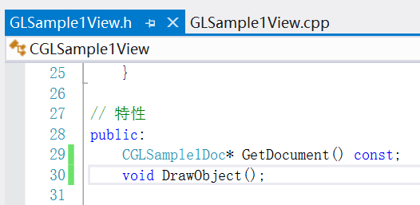

接着在 `CGLSample1View` 类的 `OnDraw()` 函数中调用 `DrawObject()` 函数

```c++
DrawObject();
```

最后，运行项目即可在把多个图形同时绘制好显示在屏幕上

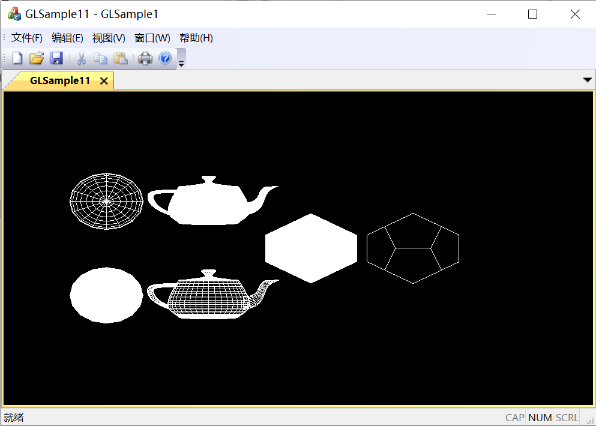


### 二、几何图元绘制

#### 1 几何图元绘制函数

下面我们进行几何图元的绘制，先创建 `DrawGeometry()` 函数用于绘制几何图元，后续操作步骤同上，这里不再赘述

- 创建函数；声明函数；调用函数
- 函数内容如下，包括点、线、多边形、闭合三角形，四种图元的绘制
- 这里我们绘制时，以 *==**左上角**==* 为起始点，以 *==**逆时针**==* 方向进行绘制

```c++
void CGLSample1View::DrawGeometry()
{
    // 设置颜色
    glColor3f(1.0f, 1.0f, 1.0f);
    // 绘制 GL_POINTS
    // 控制点的大小
    glPointSize(5);
    glBegin(GL_POINTS);
        glVertex3f(-100, 100, 0);
        glVertex3f(-100, -100, 0);
        glVertex3f(100, -100, 0);
        glVertex3f(100, 100, 0);
    glEnd();
    // 绘制 GL_LINES
    // 控制线的粗细
	glLineWidth(8);
    glBegin(GL_LINES);
        glVertex3f(-100, 0, 0);
        glVertex3f(100, 0, 0);
        glVertex3f(0, -100, 0);
        glVertex3f(0, 100, 0);
    glEnd();
    // 绘制 GL_POLYGON
    glBegin(GL_POLYGON);
        glVertex3f(120, 50, 0);
        glVertex3f(120, -50, 0);
        glVertex3f(200, -50, 0);
        glVertex3f(200, 50, 0);
    glEnd();
    // 绘制 GL_TRIANGLES
    glBegin(GL_TRIANGLES);
        glVertex3f(250, 0, 0);
        glVertex3f(300, -50, 0);
        glVertex3f(300, 50, 0);
        glVertex3f(350, 0, 0);
        glVertex3f(400, -50, 0);
        glVertex3f(400, 50, 0);
    glEnd();
}
```

#### 2 控制细节

在 `DrawGeometry()` 函数中，我们可以控制绘制图元的颜色和大小，相关代码如下：

```c++
// 设置颜色
glColor3f(1.0f, 1.0f, 1.0f);
// 控制点的大小
glPointSize(5);
// 控制线的粗细
glLineWidth(8);
```

#### 3 运行结果

要注意的是，我们在运行绘制前，先把上一步的绘制函数 `DrawObject()` 注释掉：

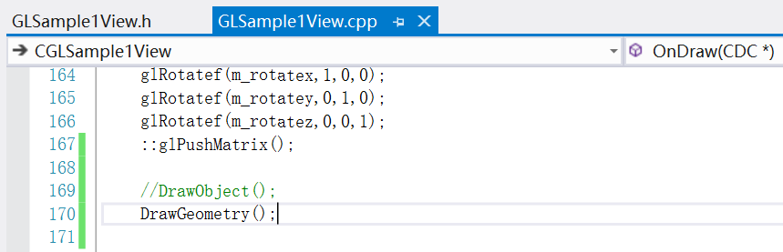

此时再运行，绘制结果如下图所示：

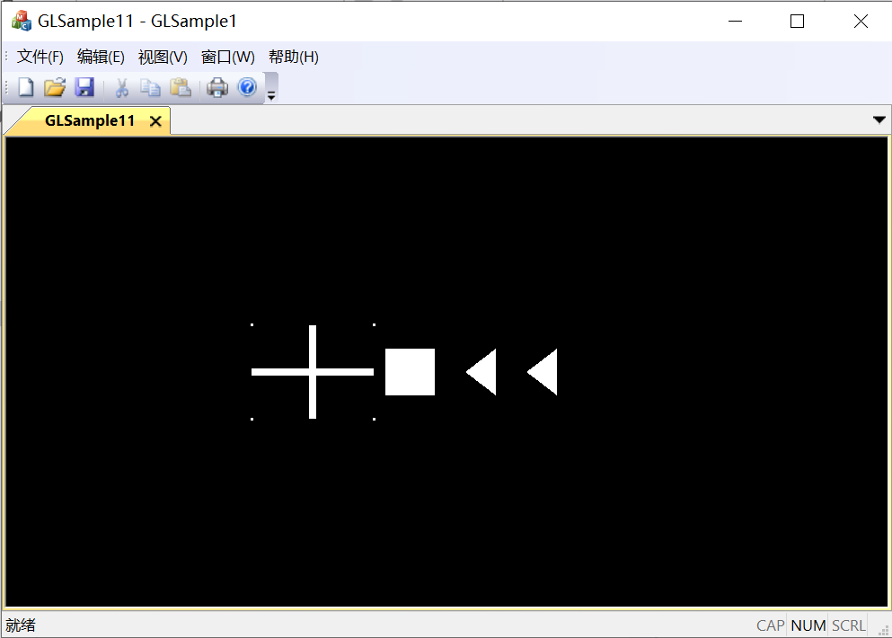

### 三、绘制方向

OpenGL 中默认使用逆时针绘制多边形表示正面，而使用顺时针绘制则表示背面。

在上节中，我们使用 逆时针 方向进行绘制得到了可见的图像，接下来，我们以正方形的绘制为例，进行顺时针图像的绘制，以此来进行对比。

这里由于 OpenGL 关闭了面剔除功能，所以我们需要在函数中设置开启。

```c++
void CGLSample1View::DrawSquare()
{
	GLfloat vertices[] = {
        // 四个点按顺时针方向排列
		-50.0f,  50.0f, 0.0f, // 左上角
		 50.0f,  50.0f, 0.0f, // 右上角
		 50.0f, -50.0f, 0.0f, // 右下角
		-50.0f, -50.0f, 0.0f // 左下角
	};
    // 开启面剔除功能
    glEnable(GL_CULL_FACE);
    // 设置剔除背面
    glCullFace(GL_BACK);
    // 绘制正方形，使用 GL_POLYGON 模式
    glBegin(GL_POLYGON);
    	// 循环传递四个顶点给 OpenGL
        for (int i = 0; i < 4; i++) {
            glVertex3fv(&vertices[i * 3]); // 将顶点传递给OpenGL
        }
    glEnd();
    // 关闭面剔除功能
    glDisable(GL_CULL_FACE);
}
```

此时的运行结果显示的是正方形的背面，但是由于 OpenGL 进行了背面剔除，所以显示界面空无一物。

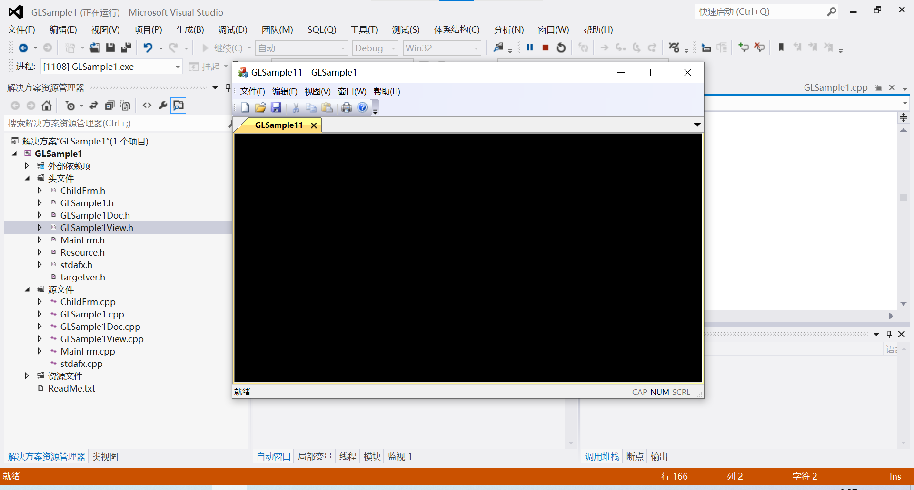


### 课程小结


## 课时三 物体的平移与旋转【2023.3.8 课】


### 教材参考

- OpenGL 教程 / OpenGL 基础图形编程 / 第八章

工具栏


弹出颜色对话框


## 课时四 坐标轴与物体颜色【2023.3.15 课】


### 教材参考

- OpenGL 教程 / OpenGL 基础图形编程 / 第八章、第九章


### 1 绘制 x，y，z 三轴坐标系


```c++
void CGLSample1View::DrawString(const char* str)
{
    static int isFirstCall = 1;
    static GLuint lists;

    if( isFirstCall ) 
	{	// 如果是第一次调用，执行初始化
        // 为每一个ASCII字符产生一个显示列表
        isFirstCall = 0; 
        // 申请MAX_CHAR个连续的显示列表编号
        lists = glGenLists(MAX_CHAR); 
        // 把每个字符的绘制命令都装到对应的显示列表中
        wglUseFontBitmaps(wglGetCurrentDC(), 0, MAX_CHAR, lists);
    }
    // 调用每个字符对应的显示列表，绘制每个字符
    for(; *str!='\0'; ++str)
        glCallList(lists + *str);
}
```


### 2 物体正反面，颜色修改


## 课时五 物体的光照与材质【2023.3.22 课】


### 教材参考

- OpenGL 教程 / OpenGL 基础图形编程 / 第十章


### 1 光照

```c++
void CGLSample1View::OnLight()
{
    // 设置0号光照位置
	GLfloat light_position[] = { 1.0, 1.0, 1.0, 0.0 };
	// 使用0号光源
	glLightfv(GL_LIGHT0, GL_POSITION, light_position);
    // 设置光照颜色
	GLfloat light_ambient [] = { 0.0, 0.0, 0.0, 1.0 };
	GLfloat light_diffuse [] = { 1.0, 1.0, 1.0, 1.0 };
	GLfloat light_specular[] = { 1.0, 1.0, 1.0, 1.0 };
	glLightfv(GL_LIGHT0, GL_DIFFUSE , light_diffuse );
	glLightfv(GL_LIGHT0, GL_SPECULAR, light_specular);
	// 启动光照
	glEnable(GL_LIGHTING);
	glEnable(GL_LIGHT0); // 启动0号光源
    // 设置1号光照位置
	GLfloat light_position1[] = { 10.0, 0.0, 0.0, 0.0 };
	// 使用1号光源
	glLightfv(GL_LIGHT1, GL_POSITION, light_position1);
	GLfloat light_ambient1 [] = { 0.0, 1.0, 0.0, 1.0 };
	glLightfv(GL_LIGHT1, GL_AMBIENT , light_ambient1);
	glEnable(GL_LIGHT1); // 启动0号光源
}
```


### 2 材质


### 3 工具栏按钮

视图 → 资源视图 → Toolbar → 绘制图像 → 设置ID


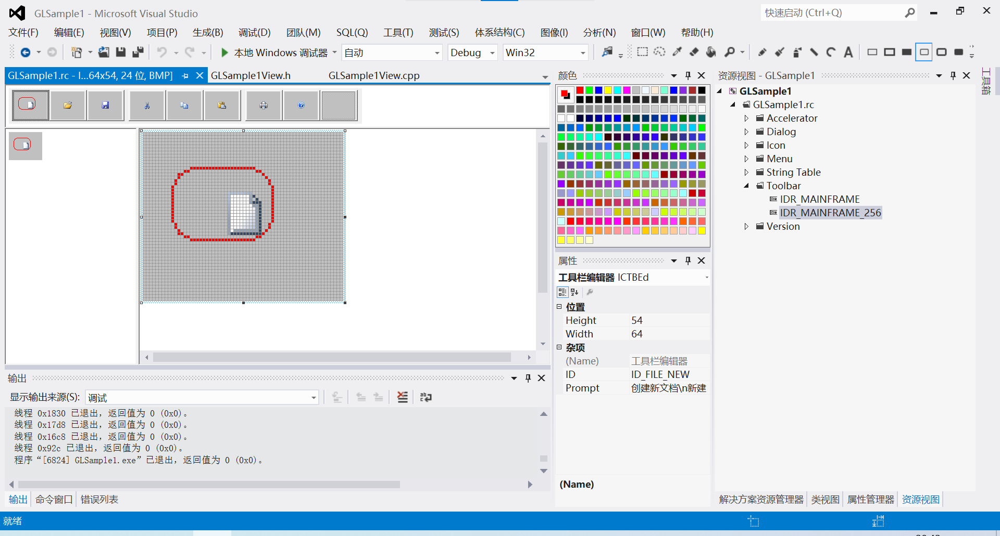


类视图 → 类向导 → 新ID → 添加点击事件Onbuttonm0


```c++
// 加上前面所讲到的wglUseFontBitmaps函数，即可显示中文字符了。
void CGLSample1View::drawCNString(const char* str)
{
    int len, i;
    wchar_t* wstring;
    HDC hDC = wglGetCurrentDC();
    GLuint list = glGenLists(1); 
    // 计算字符的个数
    // 如果是双字节字符的（比如中文字符），两个字节才算一个字符
    // 否则一个字节算一个字符
    len = 0;
    for(i=0; str[i]!='\0'; ++i)
    {
        if( IsDBCSLeadByte(str[i]) )
            ++i;
        ++len;
    } 
    // 将混合字符转化为宽字符
    wstring = (wchar_t*)malloc((len+1) * sizeof(wchar_t));
    MultiByteToWideChar(CP_ACP, MB_PRECOMPOSED, str, -1, wstring, len);
    wstring[len] = L'\0'; 
    // 逐个输出字符
    for(i=0; i<len; ++i)
    {
        wglUseFontBitmapsW(hDC, wstring[i], 1, list);
        glCallList(list);
    } 
    // 回收所有临时资源
    free(wstring);
    glDeleteLists(list, 1);
}

```


## 课时六 绘制纹理与地形【2023.3.29 课】


### 教材参考

- OpenGL 教程 / OpenGL 基础图形编程 / 第十二章纹理


创建纹理函数

```cpp
bool CGLSample1View::CreateTexture(UINT &ntexture,LPSTR strFileName )
{
	AUX_RGBImageRec *pImage = NULL;
	FILE *pFile = NULL; 
	if(!strFileName) 
		return false; 
	// 以只读模式打开文件 
	if((pFile = fopen(strFileName, "rb")) == NULL) 
	{
		// 如果文件无法打开，则显示错误信息
		AfxMessageBox("Unable to load BMP File!" );
		return NULL;
	} 
	// 装入位图
	pImage = auxDIBImageLoad(strFileName); 
	// 确保位图数据已经装入
	if(pImage == NULL)								
		return false; 
	// 生成纹理
	  
	// ::wglMakeCurrent(m_hDC, m_hRC); 
	 glGenTextures(1, &ntexture);
	// 设置像素格式
	glPixelStorei (GL_UNPACK_ALIGNMENT, 1); 
	// 捆绑纹理
	glBindTexture(GL_TEXTURE_2D, ntexture); 
	gluBuild2DMipmaps(GL_TEXTURE_2D, 3, pImage->sizeX, 
	pImage->sizeY, GL_RGB, GL_UNSIGNED_BYTE, pImage->data);	glTexParameterf(GL_TEXTURE_2D, GL_TEXTURE_WRAP_S, GL_REPEAT);	
	glTexParameterf(GL_TEXTURE_2D, GL_TEXTURE_WRAP_T, GL_REPEAT);  
	glTexParameterf(GL_TEXTURE_2D, GL_TEXTURE_MAG_FILTER,GL_LINEAR);// GL_NEAREST);  
	glTexParameterf(GL_TEXTURE_2D, GL_TEXTURE_MIN_FILTER,GL_LINEAR);//  GL_NEAREST);
	//glTexParameteri(GL_TEXTURE_2D, GL_TEXTURE_MIN_FILTER, GL_LINEAR_MIPMAP_NEAREST);
	glTexEnvf(GL_TEXTURE_ENV, GL_TEXTURE_ENV_MODE, GL_MODULATE); 
	//  释放位图数据占据的内存资源
	if (pImage)	
	{
		if (pImage->data)	
		{
			free(pImage->data);
		}
		free(pImage);	
	} 
		// 返回true
    return true;
}

```


在头文件中添加

```c++
//纹理
unsigned int texture[2];
```

在视图类文件中

```cpp
CreateTexture(texture[0], "D://dem1.bmp" ); 
	glEnable(GL_TEXTURE_2D);   
	glBindTexture(GL_TEXTURE_2D, texture[0]);  
	glBegin(GL_QUADS); 
		//glTexCoord2f(0.0, 0.0);
		glVertex3f(-200.0, -200.0, 0.0);
		//glTexCoord2f(0.0, 1.0); 
		glVertex3f(-200.0, 200.0, 0.0);
		//glTexCoord2f(1.0, 1.0);
		glVertex3f(200.0, 200.0, 0.0);
		//glTexCoord2f(1.0, 0.0); 
		glVertex3f(200.0, -200.0, 0.0);  
	glEnd();
```


参考：[error C4996: 'fopen': This function or variable may be unsafe. Consider using fopen_s instead._菜鸟知识搬运工的博客-CSDN博客](https://blog.csdn.net/qq_30815237/article/details/87005968)

```cpp
#define _CRT_SECURE_NO_WARNINGS
```


### 纹理坐标的映射

画两个三角形，将纹理附到三角形上


100


0	50	100	150	200


```cpp
// 绘制三角形
glBegin(GL_TRIANGLE_STRIP);
    glVertex3f(0.0,0.0,0.0);
    glVertex3f(100.0,0.0,0.0);
    glVertex3f(50.0,100.0,0); 
glEnd();
```


## 地表模型建立

将ondraw()函数内容清空


加入数学函数库

```cpp
#include <math.h>
```


复制代码


定义高程的最大值最小值

```cpp
float minz,maxz;
```


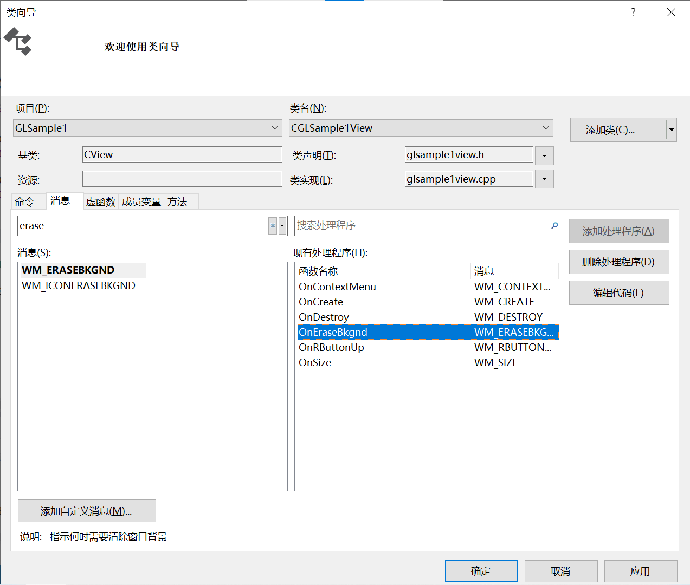


```cpp
BOOL CGLSample1View::OnEraseBkgnd(CDC* pDC)
{
	// TODO: 在此添加消息处理程序代码和/或调用默认值
	return false;
	return CView::OnEraseBkgnd(pDC);
}
```


