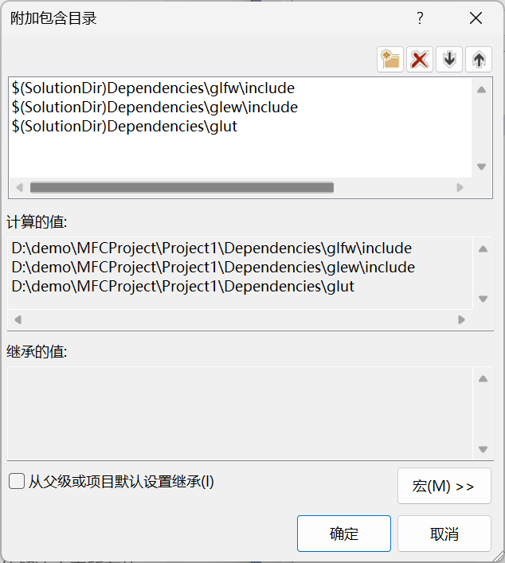
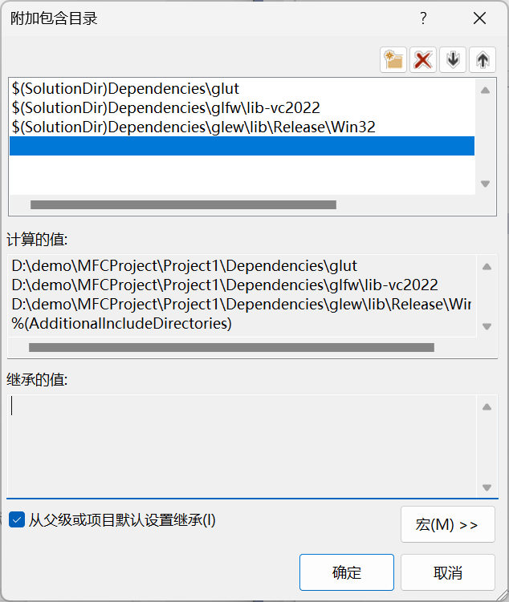
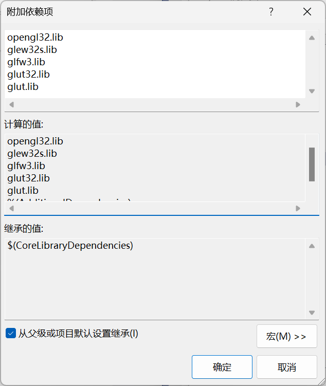

# VS2022 配置 MFC+ openGL


## 一、安装 VS2022 社区版

- 微软官方下载地址：https://visualstudio.microsoft.com/zh-hans/vs/

## 二、配置 openGL

[openGL 在Visual Studio2022 环境下的配置](https://blog.csdn.net/Accelerator12138/article/details/126858648)


```
$(SolutionDir)Dependencies\glfw\include
$(SolutionDir)Dependencies\glew\include
$(SolutionDir)Dependencies\glut
```




```
$(SolutionDir)Dependencies\glut
$(SolutionDir)Dependencies\glfw\lib-vc2022
$(SolutionDir)Dependencies\glew\lib\Release\Win32
```




```
opengl32.lib
glew32s.lib
glfw3.lib
glut32.lib
glut.lib
```

