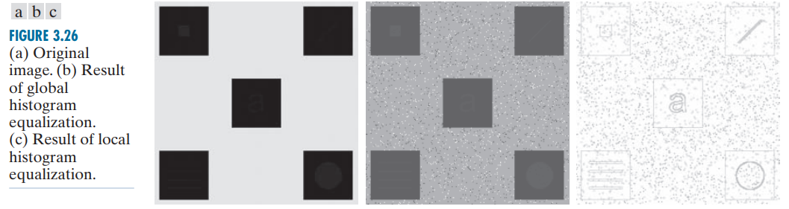

# 遥感数字图像处理与分析 练习二

- 本文在线地址：[https://gis-xh.github.io/yanxue-notes/RS-DIP/practice/02/](https://gis-xh.github.io/yanxue-notes/RS-DIP/practice/02/)

## 本次任务

### 任务内容

&emsp;&emsp;制作小报告，比较以下三种直方图均衡化方法：

1. 全局直方图均衡化：Global histogram equalization (GHE)
2. 局部直方图均衡化：Local histogram equalization (LHE)
3. 对比度受限自适应直方图均衡化：CLAHE (Contrast Limited Adaptive Histogram Equalization)

### 任务要求

1. 排版美观
2. 内容包含原理、应用、参考文献

## 1 相关基本概念

### 1.1 归一化

#### 1.1.1 归一化的目的

&emsp;&emsp;其目的就是使得预处理的数据被限定在一定的范围内（比如 $[0,1]$ 或者 $[-1,1]$），从而消除奇异样本数据导致的不良影响。

- 奇异样本数据：指相对于其他输入样本，特别大 / 特别小的样本矢量（即特征向量）
- 奇异样本数据导致的不良影响：会引起训练时间增大，同时也可能导致无法收敛

#### 1.1.2 什么时候用归一化？

（1）对输出结果范围有要求 

（2）数据较为稳定，不存在极端的最大最小值 

（3）数据存在异常值和较多噪音，用标准化，可以间接通过中心化避免异常值和极端值的影响。 

### 1.2 归一化直方图

&emsp;&emsp;多数情况下我们处理的都是归一化直方图，并将这种直方图直接简称为直方图 / 图像直方图。

#### 1.3 直方图容器

&emsp;&emsp;细分的灰度级被称为直方图容器。

### 1.4 概率论相关

（1）PDF：概率密度函数，它的值总是正的，且函数的积分是函数下方的面积 
（2）CDF：累积分布函数 / 分布函数 
（3）通俗点来说，PDF 是 CDF 的求导，CDF 是 PDF 的求积分 

### 1.5 一个重要函数

&emsp;&emsp;在图像处理中，有一个特别重要的变换函数：式(1)

$$
s = T(r)=(L-1) \int_{0}^{r} {p_r}(w)dw
$$

- $w$ 是一个假积分变量
- 右侧积分是随机变量 $r$ 的累积分布函数（CDF）

## 2 直方图均衡化 / 直方图线性变换（HE）

### 2.1 原理

&emsp;&emsp;直方图均衡化 (Histogram Equalization) 是一种增强图像对比度 (Image Contrast) 的方法，其主要思想是将一副图像的直方图分布变成近似 **均匀分布**，从而增强图像的对比度。

&emsp;&emsp;使用 式(2) 将 输入图像 中灰度级为 $r_k$ 的每个像素 **映射** 为 输出图像 中灰度级为 $s_k$ 的对应像素，能得到处理后的（输出）图像，这种操作就是 直方图均衡化 或 直方图线性变换。

$$
s_k = T(r_k)=(L-1)\sum_{j=0}^{k}{p_r(r_j)},\quad k=0,1,2,...,L-1
$$

### 2.2 应用

&emsp;&emsp;直方图均衡化的过程包括上式的整个实现，此操作往往会扩展输入图像的直方图，使得均衡化后的图像的灰度级覆盖更宽的灰度范围，进而增强图像的对比度。直方图均衡化作为自适应、自动对比度增强工具，其具有强大的能力。

&emsp;&emsp;这里说的直方图均衡化是全局性的，即全局直方图均衡化（GHE）。

### 2.3 全局直方图均衡化（GHE）

#### 2.3.1 原理

&emsp;&emsp;全局直方图均衡化 ( global histogram equalization，GHE ) 基本思想是根据 ***整幅图像*** 的灰度概率分布确定对应的输出灰度值，通过扩展图像的动态范围提升图像对比度。[1]

#### 2.3.2 不足

&emsp;&emsp;在全局直方图均衡化的过程中，像素是由基于整个图像的灰度分布的变换函数修改的，这种全局性方法适合于整体增强，但当图像处理的目的是增强图像中几个小区域的细节时，通常就会失败，因为在这些小区域中，像素的数量对计算全局变换的影响可以忽略。

## 3 局部直方图均衡化（LHE）

### 3.1 原理

&emsp;&emsp;当我们仅需处理图像中几个小区域细节时，可以设计基于像素邻域的灰度分布的变换函数。这项直方图处理技术适用于局部增强。它的过程是：

（1）定义一个邻域，并将其中心在水平方向或垂直方向上从一个像素移动到另一个像素。 

（2）在每个位置，计算邻域中的各点的直方图，得到直方图均衡化或直方图规定化变换函数，这个函数用于映射邻域中心像素的灰度。 

（3）然后将邻域的中心移到一个相邻像素位置，并重复这个过程。 

### 3.2 应用

&emsp;&emsp;图 a 是一幅大小为 $512×512$ 像素的 8 比特图像，它由 5 个黑色方格组成，背景为浅灰色。这幅图像中存在察觉不到的轻微噪声。黑色方格中嵌入了几个物体，这些物体对于所有实用目的都是不可见的。

&emsp;&emsp;图 b 是 ***全局直方图均衡化*** 的结果。类似于平滑噪声区域的直方图均衡化，这幅图像表明噪声已明显增强。然而，除了噪声，图 b 并未揭示原图像中任何有意义的新细节。

&emsp;&emsp;图 c 是用图 a 中的 ***局部直方图均衡化*** 得到的，邻域的大小为 $3×3$。在这幅图像中，我们能看到所有黑色方格内的重要细节。由于这些物体的灰度值太接近黑色方格的灰度，加之尺寸太小，因此使得全局直方图均衡化无法显示这种灰度的细节。

## 4 对比度受限自适应直方图均衡化（CLAHE）

### 4.1 自适应直方图均衡 AHE

&emsp;&emsp;直方图均衡化作为一种全局性的图像增强方法，在改善图像整体对比度方面成效显著，但是往往对细节增强效果不佳。而这一点对红外图像增强效果的影响尤为严重，因此在红外图像增强实际应用中直方图均衡化算法往往并不能达到理想的效果。[2]

&emsp;&emsp;为了克服上述直方图均衡算法的局限，Pizer 提出自适应直方图均衡化算法 [3]（adaptive histogram equalization, AHE)，在图像的局部分析中引入直方图均衡化思想。

（1）优点：AHE 算法通过对局部区域进行直方图均衡化来改变局部的灰度分布，使局部细节得到明显的增强。因此，该算法更适合于改进图像局部的对比度来获得更多的图像细节。 

（2）缺点：但是自适应直方图均衡化算法有过度放大区域的噪声问题。

### 4.2 CLAHE 原理

&emsp;&emsp;CLAHE 算法是由直方图均衡算法演化发展而来，最初应用于医学图像处理领域。

&emsp;&emsp;为了解决 AHE 算法带来的噪声问题，有学者提出了对比度受限自适应直方图均衡化 [4, 5]（contrast limited adaptive histogram equalization, CLAHE）算法，该算法对自适应直方图均衡化算法进行了改进，采用固定阈值的限幅方法有效抑制局部区域对比度的过度增强及区域噪声的放大问题。

## 5 小结

表 1 三种直方图均衡化算法对比

|                                       | 优点                                                 | 缺点                                                         |
| :-----------------------------------: | :--------------------------------------------------- | :----------------------------------------------------------- |
|        全局直方图均衡化（GHE)         | 算法简单、速度块、可自动增强图像                     | 对噪声敏感、细节信息容易丢失，在某些结果区域产生过增强的问题 |
|        局部直方图均衡化（LHE）        | 局部自适应，可最大限度的增强图像细节                 | 增强图像质量操控困难，会随之引入噪声                         |
| 对比度受限自适应直方图均衡化（CLAHE） | 有效抑制局部区域对比度的过度增强及区域噪声的放大问题 |                                                              |

## 参考文献

[1] 朱维斌,李继哲,叶树亮.基于SIFT的小模数齿轮图像亚像素级配准研究[J].仪器仪表学报,2017,38(09):2326-2334.DOI:10.19650/j.cnki.cjsi.2017.09.029.

[2] 郑林涛,俞卫华,董永生.基于暗通道先验和CLAHE的红外图像增强算法[J].计算机工程与设计,2015,36(12):3297-3301.DOI:10.16208/j.issn1000-7024.2015.12.026.

[3] Volker Schatz. Low-latency histogram equalization for infrared image sequences: a hardware implementation[J]. Journal of Real-Time Image Processing, 2013, 8(2) : 193-206.

[4] Indra Kanta Maitra and Sanjay Nag and Samir Kumar Bandyopadhyay. Technique for preprocessing of digital mammogram[J]. Computer Methods and Programs in Biomedicine, 2012, 107(2) : 175-188.

[5] Ali M. Reza. Realization of the Contrast Limited Adaptive Histogram Equalization (CLAHE) for Real-Time Image Enhancement[J]. The Journal of VLSI Signal Processing, 2004, 38(1) : 35-44.

## 其他参考文章

1. [如何理解归一化（normalization）? - 知乎](https://zhuanlan.zhihu.com/p/424518359)
2. [clahe（限制对比度自适应直方图均衡化）- CSDN](https://blog.csdn.net/qq_43743037/article/details/107195117)
3. [Python图像增强之直方图均衡化(全局直方图均衡、局部直方图均衡) - CSDN](https://blog.csdn.net/L888666Q/article/details/127208352)
