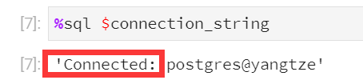
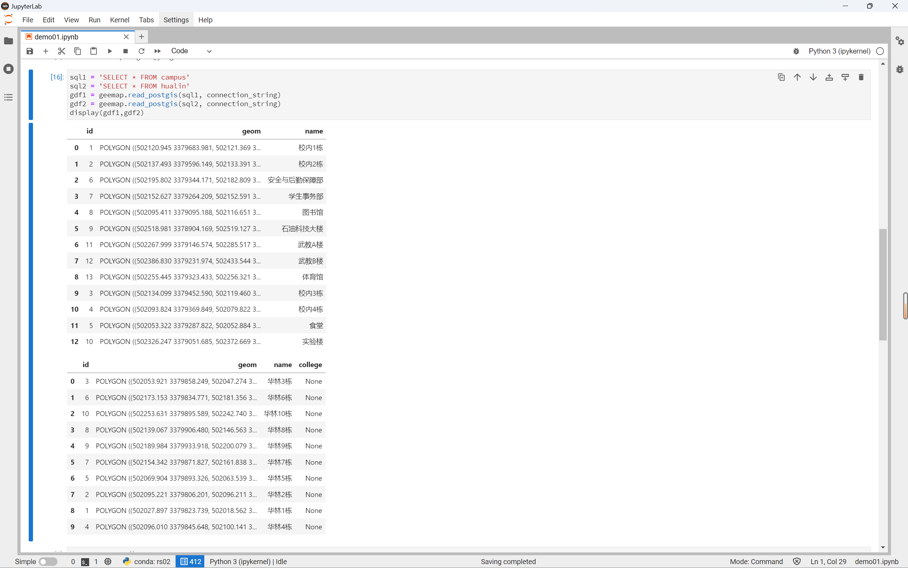
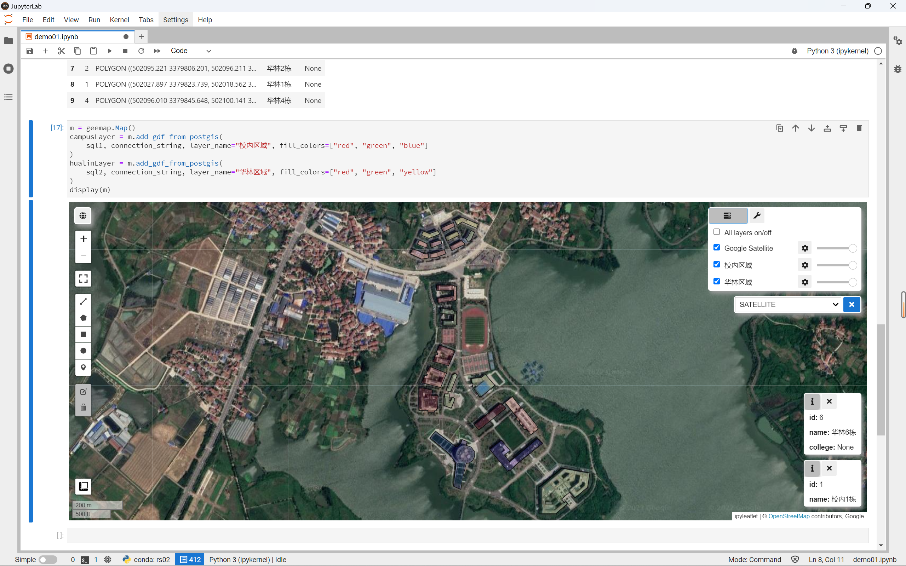

# 基于 GEEMAP 的湖北省遥感图像实现


## 参考

1. [吴秋生教授主页](https://wetlands.io/)
2. [GEE MAP 官方教程](https://book.geemap.org/index.html)


## 1 配置开发环境

### 1.1 创建并激活虚拟环境

&emsp;&emsp;在命令行中逐行键入内容，将会创建一个名为 rs02 的新 conda 环境，并在其内安装需要的包。

> 创建虚拟环境

```sh
conda create -n rs02 python=3.9
```

> 激活虚拟环境

```sh
conda activate rs02
```

### 1.2 使用 mamba 配置环境

&emsp;&emsp;mamba 是一个快速、健壮、跨平台的包管理器。它运行在 Windows、macOS 和 Linux 上，完全兼容 conda 包，支持 conda 的大部分命令。可以通过 mamba 来配置安装 geemap 所依赖的复杂环境。

> conda 安装 mamba

```sh
conda install -c conda-forge mamba
```

> mamba 安装 pygis

```sh
mamba install -c conda-forge pygis geemap 
```


<center>图 1-1 mamba 批量安装包</center>


## 2 

### 2.1 起手配置

> 导入需求包

```python
import os
import ee
import geemap
from IPython.display import display
```

> 在 VPN 中使用 geemap

```python
geemap.set_proxy(port="7890")
```

> 初始化地图并启动

```python
Map = geemap.Map(center=[30, 113], zoom=7)
Map
```

### 2.2 从 PostGIS 中导入数据

再次打开命令行，并激活 `rs02` 环境，使用 `mamba` 安装数据库相关包。

```sh
mamba install ipython-sql sqlalchemy psycopg2 pandas -c conda-forge
```

回到 jupyterlab 中，

> 加载 sql

```python
%load_ext sql
```

> 配置 PostGIS 数据库连接

```python
host = "localhost"
database = "yangtze"
user = "postgres"
password = "123qwe"
connection_string = f"postgresql://{user}:{password}@{host}/{database}"
```

> 检查连接情况

```python
%sql $connection_string
```



<center>图 2-1 查看数据库连接情况</center>

> 查询表内数据

```python
sql1 = 'SELECT * FROM campus'
sql2 = 'SELECT * FROM hualin'
gdf1 = geemap.read_postgis(sql1, connection_string)
gdf2 = geemap.read_postgis(sql1, connection_string)
display(gdf1,gdf1)
```



<center>图 2-2 查询并打印表内数据</center>

> 将数据添加至图层

```python
m = geemap.Map()
campusLayer = m.add_gdf_from_postgis(
    sql1, connection_string, layer_name="校内区域", fill_colors=["red", "green", "blue"]
)
hualinLayer = m.add_gdf_from_postgis(
    sql2, connection_string, layer_name="华林区域", fill_colors=["red", "green", "yellow"]
)
display(m)
```



<center>图 2-3 在 GEEMAP 中查看数据</center>


## 3 

参考：[如何在Python中运行JS代码（PyExecJS、Node.js、js2py速度对比）](https://blog.csdn.net/csg999/article/details/124326676)

> 安装 js2py 库

```python
conda install -c conda-forge js2py
```


> 

```sh
pip install oeel --upgrade
```

