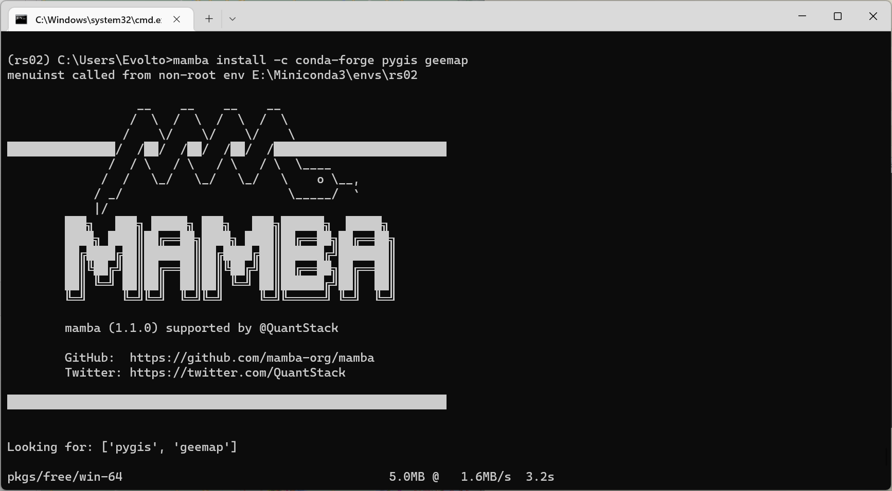

# 基于 LT-GEE 的武汉市森林扰动地图制作

- 本文在线地址：[https://gis-xh.github.io/yanxue-notes/RS-DIP/practice/coursework/](https://gis-xh.github.io/yanxue-notes/RS-DIP/practice/coursework/)


## 参考

1. [吴秋生教授主页](https://wetlands.io/)
2. [GEEMAP 官网](https://geemap.org/)
3. [LT-GEE 官网](https://emapr.github.io/LT-GEE/)


## 1 绘制植被损失图


## 2 相关技术

### 2.1 GEE 介绍

#### 2.1.1 GEE 官网

&emsp;&emsp;Google Earth Engine （以下均用 GEE 代替），谷歌地球引擎，是用于地球科学数据和分析的行星级平台，由 Google 的云基础架构提供支持。

&emsp;&emsp;GEE 将卫星图像和地理空间数据集的多 PB 目录与行星尺度分析功能相结合。科学家、研究人员和开发人员可以使用 GEE 来检测变化、绘制趋势图并量化地球表面的差异。


<center>图 2-1 GEE 官网</center>

#### 2.1.2 GEE API

&emsp;&emsp;GEE 提供 API 和其他工具来支持分析大型数据集。其中，GEE API 分为 Python 和 JavaScript 两类，可以利用 Google 云的强大功能进行自己的地理空间分析。下图 2-2 为 GEE 的 JavaScript API 在线编辑器。


<center>图 2-2 GEE 在线编辑器</center>

### 2.2 Geemap

#### 2.2.1 Geemap 简介

&emsp;&emsp;Geemap 是用于与 GEE、ipyleaflet 和 ipywidgets 进行交互式映射的 Python 包。

&emsp;&emsp;由于 GEE Python API 具有相对较少的文档和有限的交互式可视化结果功能。Geemap Python 包就是为了填补这个空白而创建的。它建立在 ipyleaflet 和 ipywidgets 之上，使用户能够在基于 Jupyter 的环境中以交互方式分析和可视化 Earth Engine 数据集。


<center>图 2-3 Geemap 官网</center>

#### 2.2.2 为什么要使用 GEE Python API 与 Geemap

&emsp;&emsp;通过 Geemap 我们将能够实现，在借助 GEE 平台的海量数据以及云端算力的同时，还不会受制于有限的云端存储空间。

&emsp;&emsp;经过对比使用发现，同样的操作在两个 API 中，GEE Python API 计算速度明显要快于 GEE JavaScript API。

&emsp;&emsp;与此同时，Geemap 还可以直接调用本地数据，也可以直接调用空间数据库中存储的空间数据，灵活性比之 GEE JavaScript API 要高很多。

&emsp;&emsp;本次作业将使用 Geemap 实现具体的算法操作。

### 2.3 LT-GEE

&emsp;&emsp;LT-GEE 是一个基于 GEE 平台的 LandTrendr 光谱-时间分割算法。

&emsp;&emsp;LandTrendr（以下均用 LT 代替）是一组光谱时间分割算法，可用于中等分辨率卫星图像（主要是 Landsat）时间序列中的变化检测，以及生成基本不含年际信号噪声的基于轨迹的光谱时间序列数据。


<center>图 2-4 LT-GEE 官网</center>

### 2.4 小结

&emsp;&emsp;本章（第二章）大致介绍了本次作业所使用到的相关技术，GEE、Geemap 以及 LT-GEE。


## 3 配置开发环境

### 3.1 创建并激活虚拟环境

&emsp;&emsp;在命令行中逐行键入内容，创建一个名为 `rs02` 的新 conda 环境，接下来的一系列操作都将在此环境中进行。

> 创建虚拟环境

```sh
conda create -n rs02 python=3.9 -y
```

> 激活虚拟环境

```sh
conda activate rs02
```

### 3.2 使用 mamba 配置环境

&emsp;&emsp;mamba 是一个快速、健壮、跨平台的包管理器。它运行在 Windows、macOS 和 Linux 上，完全兼容 conda 包，支持 conda 的大部分命令。可以通过 mamba 来配置安装 geemap 所依赖的复杂环境。

> conda 安装 mamba

```sh
conda install -c conda-forge mamba -y
```

> mamba 安装 pygis

```sh
mamba install -c conda-forge pygis geemap
```



<center>图 3-1 mamba 批量安装包</center>

### 3.3 安装 OEEL 库

&emsp;&emsp;[Open Earth Engine Library（OEEL）](https://www.open-geocomputing.org/OpenEarthEngineLibrary/)，开放地球引擎库是一个基于 GEE 的代码辅助的集合库。

&emsp;&emsp;由于 GEE Python API 的相关文档较少，多数文档和 API 均基于 JavaScript API 进行设计与开发的，所以我们有时会需要借助 OEEL 库在 Python 中实现对 JS 脚本的调用。

> 安装 OEEL 库最新版

```sh
pip install oeel --upgrade
```

### 3.4 JupyterLab 桌面版

&emsp;&emsp;在进行上述环境配置时，jupyterlab 会一并安装在虚拟环境中，所以我们可以直接安装 JupyterLab 桌面版并选择当前虚拟环境的 `python.exe` ，即可正常运行JupyterLab 桌面版。后续的编程操作都将在这里进行，操作界面如下图 3-2 所示。

 

<center>图 3-2 工作环境</center>

### 3.5 小结

&emsp;&emsp;本章（第三章）介绍了本次作业的开发环境配置。


## 4 Geemap 的简单使用

### 4.1 起手配置

&emsp;&emsp;在每次使用 Geemap 时，都需要进行以下操作，导入需求包并初始化。

> 导入需求包

```python
import ee
import geemap
```

> 在 VPN 中使用 geemap

```python
geemap.set_proxy(port="7890")
```

> geemap 初始化

```python
geemap.ee_initialize()
```

### 4.2 显示武汉市地图

&emsp;&emsp;对于矢量数据，GEE 与 Geemap 都有多种调用方法，这里仅列举了三种，同时也借助武汉市矢量数据的显示，来检查 Geemap 是否正常使用：

1. `ee.FeatureCollection()`：调用 GEE 云端用户已上传的矢量数据
2. `geemap.shp_to_ee()`：Geemap 直接调用本地的 `*.shp` 数据
3. `geemap.geojson_to_ee()`：Geemap 直接调用本地的 `*.json` 格式数据

```python
# wh = ee.FeatureCollection("users/vivianwei/Wuhan")
# wh = geemap.shp_to_ee("E:/geeDownloads/shp/wuhan.shp")
wh = geemap.geojson_to_ee("E:/Downloads/wuhan.json")
Map = geemap.Map()
Map.addLayer(wh, {}, 'wuhan')
Map.centerObject(wh, 9)
Map
```

### 4.3 小结

&emsp;&emsp;本章（第四章）对 Geemap 进行了一些简单使用，完成了对武汉市的矢量地图的加载与显示。


## 5 代码实现

### 5.1 定义影像集参数

```python
startYear = 1984
endYear = 2019
startDay = '06-20'
endDay = '09-01'
aoi = wh
index = 'NBR'
maskThese = ['cloud', 'shadow', 'snow', 'water']
```

### 5.2 运行 LandTrendr

> 加载 LT-GEE API

```python
url = 'https://github.com/eMapR/LT-GEE/blob/master/LandTrendr.js'
ltgee = geemap.requireJS(url)
```

> 定义 landtrendr 参数

```py
runParams = {
    'maxSegments':            6,
    'spikeThreshold':         0.9,
    'vertexCountOvershoot':   3,
    'preventOneYearRecovery': True,
    'recoveryThreshold':      0.25,
    'pvalThreshold':          0.05,
    'bestModelProportion':    0.75,
    'minObservationsNeeded':  6
}
```

> 定义变化参数

```python
changeParams = {
    'delta':  'loss',
    'sort':   'greatest',
    'year':   {'checked':True, 'start':1986, 'end':2019},
    'mag':    {'checked':True, 'value':200, 'operator':'>'},
    'dur':    {'checked':True, 'value':4, 'operator':'<'},
    'preval': {'checked':True, 'value':300, 'operator':'>'},
    'mmu':    {'checked':True, 'value':11},
}
```

> 为变化参数字典添加指数 NBR

```python
changeParams['index'] = index
```

> 运行 landtrendr

```python
lt = ltgee.runLT(startYear, endYear, startDay, endDay, aoi, index, [], runParams, maskThese)
```

> 得到变化地图图层

```python
changeImg = ltgee.getChangeMap(lt, changeParams)
```

### 5.3 地图可视化配置

```python
palette = ['#9400D3', '#4B0082', '#0000FF', '#00FF00', '#FFFF00', '#FF7F00', '#FF0000']
yodVizParms = {
    'min': startYear,
    'max': endYear,
    'palette': palette
}
magVizParms = {
    'min': 200,
    'max': 800,
    'palette': palette
}
```

### 5.4 将扰动图可视化

> 以武汉市为地图缩放中心

```python
Map = geemap.Map()
Map.centerObject(aoi, 9)
```


> 武汉市矢量边界显示配置

```python
# 设置显示样式: color代表边界颜色, fillcolor代表填充颜色, width边界宽度
styling = {
    'color': 'blue',
    # 填充颜色用不了
    # 'fillColor': '#ffffff',
    'width': 2
}
# 添加武汉市矢量边界图层
Map.addLayer(aoi, vis_params=styling, name="武汉市", opacity=0.2)
Map
```


> 以武汉市为边界切割变化图像

```python
exportImg = changeImg.clip(wh)
```


> 添加并显示切割后的扰动图层

```python
Map.addLayer(exportImg.select(['mag']), magVizParms, '变化幅度')
Map.addLayer(exportImg.select(['yod']), yodVizParms, '年份观测')
Map
```

### 5.5 下载生成扰动地图

```python
geemap.download_ee_image(
    exportImg,
    "E:/geeDownloads/img/lt-gee_disturbance_map.tif",
    scale=30
)
```

### 5.6 小结

&emsp;&emsp;本章（第五章）实现了 landtrendr 算法，同时生成绘制了最大的植被损失部分并显示了变化检测的年份和变化的幅度，最终导出了计算结果数据。


## 6 在 QGIS 中查看成果

&emsp;&emsp;在 QGIS 中打开下载的数据，如下图 6-1 所示。


<center>图 6-1 查看扰动地图</center>
