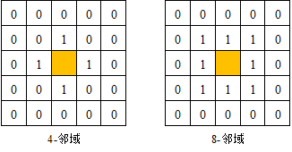
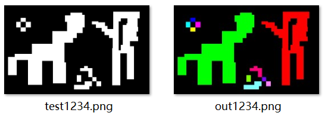
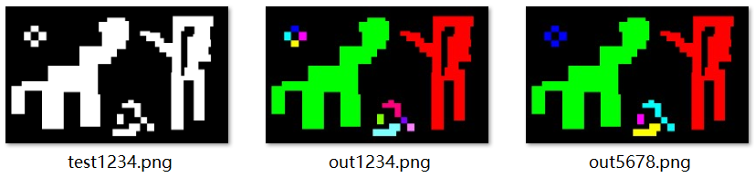

# 遥感数字图像处理与分析 练习三

- 本文发布地址：[https://gis-xh.github.io/yanxue-notes/RS-DIP/practice/practice03/](https://gis-xh.github.io/yanxue-notes/RS-DIP/practice/practice03/)


## 本次任务

&emsp;&emsp;实现连通域标记算法（8-邻域）


## 1 相关知识点

1. 图像的连通域：是指图像中具有相同像素值并且位置相邻的像素组成的区域。
2. 连通域分析：是指在图像中寻找出彼此互相独立的连通域并将其标记出来。
3. 一般情况下，一个连通域内只包含一个像素值，因此为了防止像素值波动对提取不同连通域的影响，连通域分析通常处理的是二值化后的图像。
4. 图像邻域 4-邻域：两个像素相邻必须在水平和垂直方向上相邻，相邻的两个像素坐标必须只有一位不同而且只能相差1个像素。（如下图左图所示）



<center>图 1 （左）4-邻域和（右）8-邻域示意图</center>

5. 图像邻域 8-邻域：两个像素相邻允许在对角线方向相邻，相邻的两个像素坐标在X方向和Y方向上的最大差值为1。（如上图右图所示）


## 2  OpenCV 介绍

&emsp;&emsp;OpenCV 是一个基于 BSD 许可（开源）发行的跨平台计算机视觉库，可以运行在 Linux、Windows、Android 和 Mac OS 操作系统上。它轻量级而且高效——由一系列 C 函数和少量 C++ 类构成，同时提供了 Python、Ruby、MATLAB 等语言的接口，实现了图像处理和计算机视觉方面的很多通用算法。 

&emsp;&emsp;OpenCV 用 C++ 语言编写，它的主要接口也是 C++ 语言，但是依然保留了大量的C语言接口。（CV：Computer Vision，计算机视觉）


## 3 开发环境配置

&emsp;&emsp;接下来，我们将延续 [练习一](https://gis-xh.github.io/yanxue-notes/RS-DIP/practice/practice01/) 创建的虚拟环境，并在其中安装 OpenCV Python 库。

> 激活创建好的虚拟环境

```sh
conda activate rs01
```

> 安装 OpenCV Python 库

```sh
pip install opencv-python
```

## 4 实现 4-邻域连通域标记

### 4.1 标记规则

<center>表 1 查找表</center>

| **源数据 (Source)** | **目标数据 (Distination)** |
| :-----------------: | :------------------------: |
|          1          |             1              |
|          2          |             2              |
|          3          |             1              |

- 一开始被打上 1 标签的像素（即 `Source=1` 的像素）最终被分配到的标签 1（`Distination=1`）

- 一开始被打上 3 标签的像素（即 `Source=3` 的像素）最终被分配的的标签也为 1（`Distination=1`）

### 4.2 算法实现

&emsp;&emsp;做 4−邻域连通域标记时，我们只用考察上方像素和左边像素

1. 从图像的左上角开始进行光栅扫描

2. 如果当前遍历到的像素 $i(x,y)$ 是黑像素，则不做处理。如果是白像素，考察该像素的上方像素 $i(x,y-1)$ 和 左边像素 $i(x-1,y)$，如果两个的取值都为 0，则将该像素分配一个新的标签。

- 在这里我们用数字做标签，即 $1,2,3,4,...$ 

3. 如果两个像素中有一个不为 0（也就是说已经分配了标签），则将上方和左边的像素分配的标签中数值较小的那一个（0 除外）分配给当前遍历到的像素 $i(x,y)$。在这里，将上方像素和左边像素的标签写入查找表的源数据，将当前遍历的像素 $i(x,y)$ 分配的标签写入目标数据。

4. 最后，对照查找表，对像素分配的标签由源数据变为目标数据。

### 4.3 代码实现

```python
import cv2
import numpy as np
def four_cc_label(img):
    height, width, channel = img.shape
    label = np.zeros((height, width), dtype=np.int32)
    LUT = np.zeros(height * width, dtype=np.uint8)

    COLORS = np.array([[0, 0, 255], [0, 255, 0], [255, 0, 0],
                       [255, 255, 0], [255, 0, 255], [0, 255, 255],
                       [125, 0, 255], [0, 255, 125], [255, 0, 125],
                       [255, 255, 125], [255, 125, 255], [0, 125, 255]], dtype=np.uint8)
    out = np.zeros((height, width, channel), dtype=np.uint8)
    label[img[:, :, 0] > 0] = 1
    n = 1
    for y in range(height):
        for x in range(width):
            if label[y, x] == 0:
                continue
            c3 = label[max(y - 1, 0), x]
            c5 = label[y, max(x - 1, 0)]
            if c3 < 2 and c5 < 2:
                n += 1
                label[y, x] = n
            else:
                _vs = [c3, c5]
                vs = [a for a in _vs if a > 1]
                v = min(vs)
                label[y, x] = v

                minv = v
                for _v in vs:
                    if LUT[_v] != 0:
                        minv = min(minv, LUT[_v])
                for _v in vs:
                    LUT[_v] = minv
    count = 1
    for l in range(2, n + 1):
        flag = True
        for i in range(n + 1):
            if LUT[i] == l:
                if flag:
                    count += 1
                    flag = False
                LUT[i] = count
    for index, lut in enumerate(LUT[2:]):
        out[label == (index + 2)] = COLORS[lut - 2]
    return out
if __name__ == '__main__':
    img = cv2.imread("img/test1234.png")
    out = four_cc_label(img)
    cv2.imwrite("img/out1234.png", out)
    cv2.imshow("result", out)
    cv2.waitKey(0)
    cv2.destroyAllWindows()
```

### 4.4 结果对比

&emsp;&emsp;左图是输入图像，右图为 ***4-邻域连通域标记*** 输出图像。



<center>图 2 （左）输入图像（右）输出图像</center>


## 5 实现 8-邻域连通域标记

&emsp;&emsp;要进行 8−邻域连通域标记，我们需要考察 4 个像素：左上 $i(x-1,y-1)$，正上 $i(x, y-1)$，正左 $i(x-1,y)$，左下 $i(x+1,y-1)$ 或者右上。

### 5.1 代码实现

```python
import cv2
import numpy as np
def four_cc_label(img):
    height, width, channel = img.shape
    label = np.zeros((height, width), dtype=np.int32)
    LUT = np.zeros(height * width,dtype=np.uint8)

    COLORS = np.array([[0, 0, 255], [0, 255, 0], [255, 0, 0],
                       [255, 255, 0], [255, 0, 255], [0, 255, 255]],dtype=np.uint8)
    out = np.zeros((height, width, channel), dtype=np.uint8)
    label[img[:,:, 0] > 0] = 1
    n = 1
    for y in range(height):
        for x in range(width):
            if label[y, x] == 0:
                continue
            c2 = label[max(y - 1, 0), min(x + 1, width - 1)]
            c3 = label[max(y - 1, 0), x]
            c4 = label[max(y - 1, 0), max(x - 1, 0)]
            c5 = label[y, max(x - 1, 0)]
            if c3 < 2 and c5 < 2 and c2 < 2 and c4 < 2:
                n += 1
                label[y, x] = n
            else:
                _vs = [c3, c5, c2, c4]
                vs = [a for a in _vs if a > 1]
                v = min(vs)
                label[y, x] = v

                minv = v
                for _v in vs:
                    if LUT[_v] != 0:
                        minv = min(minv, LUT[_v])
                for _v in vs:
                    LUT[_v] = minv
    count = 1
    for l in range(2, n + 1):
        flag = True
        for i in range(n + 1):
            if LUT[i] == l:
                if flag:
                    count += 1
                    flag = False
                LUT[i] = count
    for i, lut in enumerate(LUT[2:]):
        out[label == (i + 2)] = COLORS[lut - 2]
    return out
if __name__ == '__main__':
    img = cv2.imread("img/test1234.png")
    out = four_cc_label(img)
    cv2.imwrite("img/out5678.png", out)
    cv2.imshow("result", out)
    cv2.waitKey(0)
    cv2.destroyAllWindows()
```

### 5.2 结果对比

&emsp;&emsp;左图是输入图像，中图为 4-邻域连通域标记输出图像，最右图为 ***8-邻域连通域标记*** 输出图像。



<center>图 3 （最右）8-邻域连通域标记输出结果</center>


## 参考文章

1. [Py之cv2：cv2库(OpenCV，opencv-python)的简介、安装、使用方法(常见函数、方法等)最强详细攻略 - CSDN](https://blog.csdn.net/fuhanghang/article/details/121260534)
2. [OpenCV—python 连通域标记 - CSDN](https://blog.csdn.net/wsp_1138886114/article/details/111355021)
3. [【OpenCV 4开发详解】图像连通域分析 - 腾讯云](https://cloud.tencent.com/developer/article/1581956)
