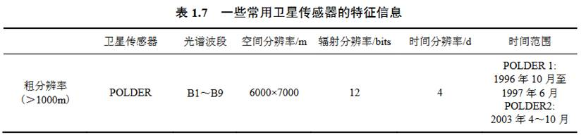
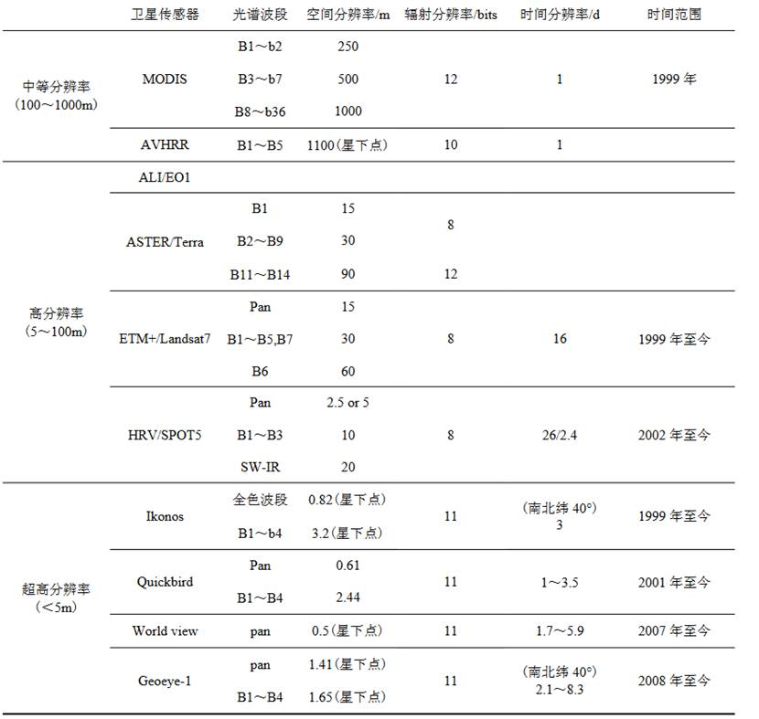
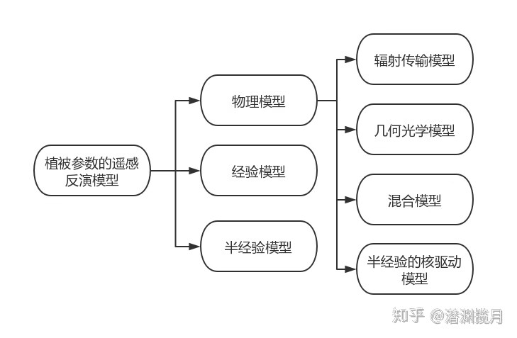
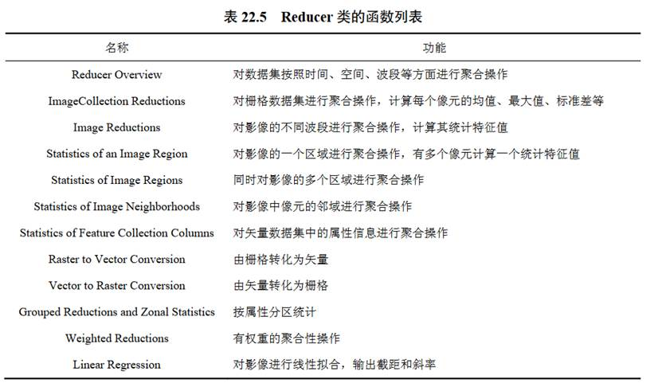
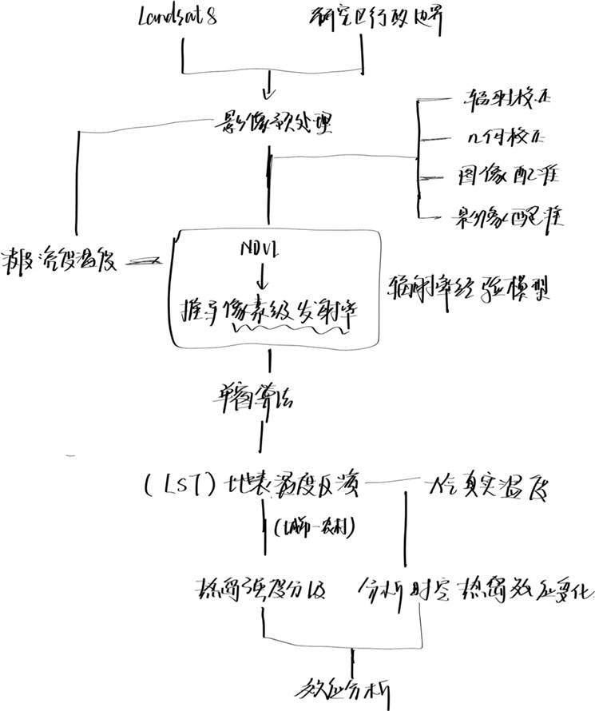

# 定量遥感 期末复习

## 一、选择题知识点

### 1 常用卫星

**Sentinel**

- Sentinel-1 是极地轨道雷达卫星

- Sentinel-2 (2016) 具有较高的空间分辨率，其可见光和近红外波段的分辨率为10米，其他波段为20米或60米
- Level-1C 是大气顶层反射率数据；经过大气校正得到 Level-2A 表面反射率数据
- Sentinel-5P 是一颗针对大气监测和污染物浓度研究的卫星，主要用于研究大气中污染物浓度的数据集

**MODIS**

- MODIS 具有较高的时间分辨率，时间分辨率最高为1天

**Landsat**	

- Landsat-8：可以通过热红外波段来推算地表温度信息，从而实现地表温度的测量。
- 热红外波段在Landsat-8中是波段10和波段11，它们测量的是地物的热量辐射，即地表温度（Land Surface Temperature，LST）。
- 地表温度是指地物表面与大气交换能量的有效温度，它反映了地物的热状态和热平衡。地表温度与目标的辐射亮度（Brightness of objects）有关。
- 辐射亮度是指目标在一定波长范围内发出的辐射能量，它与目标的温度、发射率、反射率等因素有关。
- 因此，热红外波段在Landsat-8中测量的是辐射亮度，通过一定的算法可以反演出地表温度。

### 2 数字量化值（DN）

是指以像素为单位测量的卫星图像中的电磁能量强度值。

### 3 常用波段

| 波段名 |   波长范围    |                           波段描述                           |
| :----: | :-----------: | :----------------------------------------------------------: |
|  Blue  |  0.45-0.52μm  | 可见光波段，对水体的穿透力最大，可用于判别水深，研究浅海水下地形、水体浑浊度等 |
| Green  |  0.52-0.60μm  | 可见光波段，位于绿色植物的反射峰附近，对健康茂盛植物反射敏感，可以识别植物类别和评价植物生产力 |
|  Red   |  0.63-0.69μm  | 可见光波段，位于叶绿素的主要吸收带，可用于区分植物类型、覆盖度、判断植物生长状况等，此外该波段对裸露地表、植被、岩性、地层、构造、地貌、水文等特征均可提供丰富的信息 |
|  NIR   |  0.76-0.90μm  | 红外光波段，位于植物的高反射区，反映了大量的植物信息，多用于植物的识别、分类，同时它也位于水体的强吸收区，用于勾绘水体边界，识别与水有关的地质构造、地貌等 |
|  SWIR  |  1.55-1.75μm  | 红外光波段，位于两个水体吸收带之间，对植物和土壤水分含量敏感，从而提高了区分作物的能力，信息量大，应用率较高 |
| 热红外 | 10.40-12.50μm | 红外光波段，对地物热量辐射敏感，可以根据辐射响应的差别区分农林覆盖长势，差别表层湿度，水体岩石，以及监测与人类活动有关的热特征,进行热制图 |
| 远红外 |  2.08-2.35μm  | 红外光波段，处于水的强吸收带，水体呈黑色，可用于区分主要岩石类型,岩石的热蚀度，探测与交代岩石有关的粘土矿物 |

### 4 植被指数

- 归一化差值植被指数：$NDVI=\dfrac{NIR-Red}{NIR+Red}$

- 增强型植被指数：$EVI=2.5×\dfrac{(NIR-Red)}{NIR+6×Red-7.5×Blue+1}$

- 归一化差值水体指数：$NDWI=\dfrac{NIR-SWIR}{NIR-SWIR}$

### 5 特殊遥感

- 微波遥感：微波遥感能够穿透云层和雨雪，相对于光学遥感，具有全天候观测的能力，不受光照、云、雨、雾的影响；同时也具有强大的穿透能力，能够穿透植被、冰雪和干沙土，以获得近地面以下的信息。
- 高光谱遥感：它可以捕捉100多个波段的数据，相比多光谱数据具有更高的光谱分辨率。高光谱数据可以捕捉到较多的窄波段，比多光谱数据有更高的光谱分辨率，能提供更详细的光谱信息。

## 二、名词解释

### 1 定量遥感

&emsp;&emsp;定量遥感是指从遥感观测电磁波信号中定量提取地球表面信息的原理和方法。用遥感方法获得地表信息的遥感系统，主要包括遥感平台与传感器系统、数据传输与地面接收系统、辐射与几何特征参量处理系统、成像制图与高级数据产品生成分析系统、产品生产和分发系统、产品验证和遥感应用等。

### 2 遥感分辨率

&emsp;&emsp;遥感平台和传感器系统的技术参数决定了遥感数据的特征，即：空间分辨率、光谱分辨率、时间分辨率和辐射分辨率。

#### 2.1 空间分辨率

&emsp;&emsp;是指传感器所能分辨的最小目标的测量值，或是传感器瞬时视场 (Instantaneous Field of View, IFOV)成像的地面面积，或是每个像素所表示地面的直线尺寸。

#### 2.2 光谱分辨率

&emsp;&emsp;描述传感器系统的光谱波段数量和带宽。许多传感器系统在可见光谱段有一个全色波段，在可见光至近红外或热红外光谱段有多个光谱波段(表 1.7)。

#### 2.3 时间分辨率

&emsp;&emsp;指传感器重访地球表面相同区域的重复观测周期或频率。这一频率取决于对卫星传感器和卫星运行轨道的设计，表 1.7 列出了常用传感器获取数据的时间分辨率。

#### 2.4 辐射分辨率

&emsp;&emsp;指每一波段传感器接收辐射数据的动态范围，或可输出数值的数量，记录数据的比特位数决定了对辐射数据的量化分级。例如，以 8 比特位数记录的数据，每个像元的数字值(Digital Numbers，DN)的取值范围可从 0～255(28=256)。

&emsp;&emsp;它以“bits”为单位记录数据，采用的比特位数越高，传感器获取数据的辐射精度就越高，就会占用更多的存储空间。传感器可以区分的光谱辐射强度的细微差异。更高的辐射分辨率将允许传感器区分不同的灰度值，从而提供更丰富的信息。

### 3 辐射标定处理

&emsp;&emsp;<u>辐射标定处理</u> 是将传感器接收记录的电压信号或数字值(DN)转换为绝对量纲的辐射亮度或反射率。

&emsp;&emsp;<u>辐射定标</u> 将图像的数字量化值（DN）转换为辐射亮度值或者反射率或者表面温度等物理量，利用传感器提供的元数据文件或者其他参数进行计算。

&emsp;&emsp;遥感器定标是指建立遥感器每个探测元件听输出信号的数值量化值与该探测器对应像元内的实际地物辐射亮度值之间的定量关系。

&emsp;&emsp;由于卫星运行时所获取的遥感信息受到诸多因素影响，如遥感器系统的畸变、大气传播的干扰、地形影响等都会造成遥感器采集到的辐射能量与日标地物实际的辐射能量之间存在较大偏差

&emsp;&emsp;遥感器定标是遥感数据定量化处理中的最基本环节遥感器的定标精度直接影响到遥感数据的可靠性和精度

-遥感器实验室定标 -遥感器星上内定标 -遥感器场地外定标

遥感器实验室定标

&emsp;&emsp;是指对比分析与研究空中遥感器接收到的电磁波能量信号与地物光谱仪接收到的电磁波能量信号的定量关系，以及电磁波能量信号与地物的物理特性的关系，以便对获取的空中遥感器信号进行纠正。

&emsp;&emsp;遥感器实验室定标主要包括光谱定标与辐射定标两大部分。

- 光谱定标是测量遥感器随入射辐射波长变化的响应。
- 辐射定标用以确定遥感器入瞳处的准确辐射数值。

遥感器星上内定标

&emsp;&emsp;卫星发射后，探测探测器元件老化或者工作温度变化都会影响到遥感器的响应，因此需要遥感器星上内定标。

&emsp;&emsp;星上内定标主要是绝对辐射定标，在可见光和反射红外区采用电光源(灯定标)和大阳光(太阳定标)作为高温的标准辐射源，在热红外区采用卫星上的标准黑体(黑体定标)作为高温的标准辐射源，以宇宙空间作为低温标准辐射源。

遥感器场地外定标

&emsp;&emsp;是在遥感器飞越辐射定标场上空时，在定标扬选择若干像元区，测量遥感器对应的各波段地物的光谱反射率和大气光谱参量，并利用大气辐射传输模型给出遥感器入瞳处各光谱带的辐射亮度，最后确定它与遥感器对应输出的数字量化的数量关系，求解定标系数，并进行误差分析。

&emsp;&emsp;通过地面辐射场地外定标对于提高辐射定标精度具有重要意义，这因为场地外定标方法可以实现全孔径、全视场、全动态范围的定标，并考虑到大气传输和环境的影响。该定标方法可以实现在遥感器运行状态下与获取地面图像完全相同条件下的绝对订正

### 4 误差矩阵

&emsp;&emsp;<u>误差矩阵</u> 用于表达观测数据、模型和背景信息(通常包含在目标函数中)的不确定性。误差矩阵用于评估遥感分类或检测算法的准确性。它比较了分类结果与参考数据之间的差异，并提供了不同类型的错误分类（如漏报和误报）的统计信息。

### 5 反射率

&emsp;&emsp;<u>反射率</u> 是指地物表面对入射辐射的反射能力。它是光谱辐射度量的重要指标之一，通常以介于0到1之间的值表示。反射率较高的地物表面通常对入射光有较高的反射能力。

### 6 地表反照率

&emsp;&emsp;<u>地表反照率</u> 是一个广泛应用于地表能量平衡、中长期天气预测和全球变化研究的重要参数(Dickinson, 1995)，其定义为短波波段地表所有反射辐射能量与入射辐射能量之比。地表反照率反映了地球表面对太阳辐射的反射能力，是地表辐射能量平衡以 及地气相互作用中的驱动因子之一。

## 三、简答

### 1 遥感反演的模型（三类）

#### 1.1 经验模型

经验模型基于实测数据，通过统计分析或机器学习方法，建立遥感信号与地表或大气参数之间的经验关系。经验模型具有简单和高效的特点，但通常需要较多的训练数据和较强的区域依赖性。例如，利用归一化植被指数反演植被覆盖度、利用土壤调节植被指数反演土壤含水量等。

#### 1.2 物理模型

物理模型基于物理定律和原理，描述遥感信号与地表或大气参数之间的定量关系。物理模型具有普适性和可解释性，但通常需要较多的输入参数和较高的计算复杂度。例如，利用辐射传输模型反演植被生物物理参数、利用布儒斯特方程反演水体水深等

#### 1.3 半经验模型

半经验模型结合物理模型和经验模型的优点，通过引入一些可调节的参数或系数，建立遥感信号与地表或大气参数之间的半经验关系。半经验模型具有一定的普适性和可解释性，同时也具有一定的灵活性和适应性。例如，利用改进的土壤调节植被指数反演植被生物量、利用改进的光谱匹配方法反演水体叶绿素等。

-----

地表温度反演是指利用卫星遥感数据，通过一定的数学模型，计算出地表的温度值。

地表温度反演的方法有很多种，比如单通道法、分裂窗法、多通道温度-比辐射率分离法等。其中，单通道法是一种比较简单和常用的方法，它只需要一个热红外波段的数据，就可以估算出地表温度。

单通道法的基本原理是：卫星传感器观测到的辐射亮度值是由地表辐射、大气向上辐射和大气向下辐射三部分组成的，如果我们知道了大气的透过率和辐射亮度，就可以消除大气的影响，得到地表的辐射亮度，然后通过普朗克函数转换为地表温度。

具体的计算步骤如下：

1. 辐射定标：将遥感影像的灰度值转化为辐射亮度值，这一步可以通过ENVI软件中的Radiometric Calibration工具实现。
2. 计算地表比辐射率：这是一个重要的参数，它反映了地表对热红外辐射的发射能力。有很多方法可以计算地表比辐射率，比如NDVI阈值法、植被指数法、分类法等³。其中，NDVI阈值法是一种常用的方法，它利用归一化植被指数（NDVI）来估算植被覆盖度（PV），然后根据一个经验公式计算地表比辐射率。这一步可以通过ENVI软件中的Band Math工具实现。
3. 计算黑体辐射亮度和地表温度：这是最后一步，也是最关键的一步。黑体辐射亮度是指没有大气影响的地表辐射亮度，它可以通过单通道法的公式计算得到。然后，利用普朗克函数将黑体辐射亮度转换为地表温度。这一步也可以通过ENVI软件中的Band Math工具实现。

-------

植被指数反演：

1：几何光学模型

几何光学模型是以几何光学原理为基础的经典模型，它假设地物由一系列不同几何形状的要素构成，根据这些要素的大小和空间分布，计算遥感的像元值由这些不同比例组合而成。

2：辐射传输模型

辐射传输方程以研究辐射在冠层中薄层或单元中的传输过程为基础，对辐射传输方程求解，推算辐射与冠层的相互作用，由此解释辐射在冠层中的 传输机理，进而得到冠层及其下垫面对 入射辐射的 吸收、透过和反射的方向和光谱特性 。

3：几何光学与辐射传输混合模型

充分利用几何光学模型在解释阴影投影面积和地物表面空间相关性上的基本优势，结合辐射传输模型在解释均匀媒质中多次散射上的优势，分两个层次建立承照面和阴影区反射强度的辐射传输模型，从而得到几何光学与辐射传输混合模型 。

4：计算机模型

计算机模拟模型能同时真实地考虑 植被各组分的大小、形状和任意的空间分布方式对冠层 大小、形状和任意的空间分布方式对冠层BRDF的影响，可以逼真地模拟地表辐射场景，但计算机模拟模型的结构设置繁杂，而地表场景的构成需要大量的实测资料，模型过于庞大、复杂，难以反演。

-------

植被参数的遥感反演模型目前利用遥感数据反演植被生物物理、生物化学参数，主要采用物理模型、经验模型核半经验模型三种方法。

- 物理模型：物理模型遵循遥感系统的物理规律。优点是可以建立因果关系，如果初始的模型不好，通过加入最新的知识信息就可以知道该在哪部分改进模型，缺点是建立模型的过程漫长而曲折。
- 经验模型（统计模型）：经验模型基于陆地表面变量和遥感数据的相互关系构建变量之间的模型。优点在于容易建立并且可以有效地概括从局部区域获取的数据；缺点是拓展后的模型一般都是有地域局限性的，不能解释因果关系。
- 半经验模型（混合模型）：半经验模型是统计模型与物理模型结合的混合。

模型类别由于物理模型具有因果关系和数学物理基础，是目前研究的主要方向。物理模型也有主要的四个分类：辐射传输模型、几何光学模型、混合模型以及半经验的核驱动模型。下面是对于这几种方法的简单介绍

- 辐射传输模型：考虑叶片对于光的散射、反射等因素，根据实际的物理条件建立模型。考虑到树木冠层和叶片结构的复杂性和多样性，常用的方法是将冠层分层后，建立一些参数来表征叶面积等参数与冠层厚度的关系（使用这些参数来简化复杂的物理过程），并使用这些参数建立辐射传输模型。
- 几何光学模型GO：从遥感像元的观测尺度出发，将像元视场的总亮度，看做是阴影面和承照面亮度的加权和。
- 混合模型：上述两种方法各有优缺。辐射传输模型的优点是能考虑多次散射作用；缺点是只能得到数值解，难以得到植被结构和BRDF之间明细的表达式。几何光学模型的优点是适用于不连续植被以及粗糙表面；缺点是没有考虑多次散射。因此，人们提出了几何光学-辐射传输混合模型GORT。由于几何光学模型和辐射传输模型分别在不同的尺度上具有各自的优势，充分利用几何光学模型在解释阴影投射面积和地物表面空间相关性上的基本优势，在GO模型的基础上，用辐射传输方法求解多次散射对各面积分量亮度的贡献，分两个层次来建立光照面与阴影区反射强度的辐射传输模型，并以模型联系二者，发展了几何光学-辐射传输混合模型GORT。

### 2 温度-植被干旱指数法

&emsp;&emsp;在《定量遥感：理念与算法》**18.4.3** 节中介绍了温度-植被干旱指数法，它是由 Sandholt 等(2002)基于地表温度和 NDVI 之间的经验参数关系，发展了一个简化的地表干旱指数(Temperature-Vegetation Dryness Index，TVDI)。这个指数在概念上和计算 上都非常直观。

$$
TVDI=\frac{T_s-T_{min}}{a+bNDVI-T_{min}} \tag{18.21}
$$

- $T_{min}$ 是三角形内用来定义湿边的最小地表温度
- $T_s$ 是某一像元的地表温度
- NDVI 是归一化植被指数
- a 和 b 是模拟干边的线性回归方程的系数 $T_{smax}= a + bNDVI$，其中 $T_{smax}$ 是一定 NDVI 下观测到的最大地表温度。要得到基于像元的回归系数 a 和 b，要求研究区必须足够大，并能够反映研究区从湿到干、从裸土到密闭植被表面的土壤水分含量的整个变化范围。

&emsp;&emsp;高 NDVI 值常常对应不确定性大的 TVDI。在 NDVI 的高值区域，TVDI 等值线密集。 用简化的三角形而非梯形来代表 Ts/NDVI 空间的方法加剧了 TVDI 在 NDVI 高值区的不 确定性(如 Moran et al.，1994)。同样地，在 TVDI 中，湿边被模拟做水平线，而非梯形 法中的斜线，可能导致在低 NDVI 时过高地估计 TVDI。

&emsp;&emsp;Sandholt 等(2002)利用 TVDI 对塞内加尔的一个研究区进行了土壤水分的估算，并将估算的结果和分布式水文模型在同一区域内模拟的结果进行了比较，发现两者的回归系数达到了 0.7。

&emsp;&emsp;虽然利用遥感估算土壤水分已经取得了很大的进步，但是光学和红外传感器的测量值对土壤类型的敏感度相似，也很难将两种信号分离。而且，利用光学和红外传感器数据反演土壤水分时需要土壤微气候和大气信息，但这些信息不在常规测量之内，不容易获得。控制实验虽然显示利用光学和红外传感器反演土壤水分的方法具有很大的潜力， 但这种反演方法仍未投入实际应用。

### 3 降雨观测卫星和遥感降水数据集

&emsp;&emsp;在《定量遥感：理念与算法》**16.3** 节中介绍了 TRMM、GSMaP、GPCP、GPM 和 CMORPH 这五种数据集，它们现已被广泛应用于全球尺度的降水监测之中。

#### 3.1 TRMM

&emsp;&emsp;TRMM 是由美国 NASA 和日本空间发展总局(NASDA)合作开展的热带降雨测量计划，旨在观测和研究热带、亚热带地区的降雨及能量交换情况(Kummerow and Barnes， 1998)。由于地球上三分之二的降水集中于热带，因此热带降雨对于调节全球水文循环的意义非比寻常。TRMM 数据集的建立有助于人们了解热带降水对全球循环机制的影响， 更好地理解、诊断及预报厄尔尼诺和南方涛动(ENSO)。TRMM 卫星轨道于 2015 年 4 月 停止运行。TRMM 卫星运行于近地轨道，轨道为圆形，覆盖范围为 35°N～35°S，轨道倾角约 为 35°，高度仅 350km，可提供热带降雨的大量细节信息(Kummerow and Barnes，1998) (图 16.4)。星上搭载了 5 台科学测量仪器，包括：可见光和红外扫描仪(VIRS)、降水雷达 (PR)、微波成像仪(TMI)、闪电成像感应器(LIS)以及云和地球辐射能量系统(CERES)。 其中，前三种仪器与降水测量密切相关，表 16.4 列举了它们的主要参数。 

- PR 是第一台专为空间测雨设计的雷达，它的主要科学目标是：①提供降水的三维结 构信息，尤其是垂直分布；②获取陆地和海洋上的定量降水分布；③结合主动和被动传 感器数据，提高 TRMM 反演降水的精度。
- TMI 是一种具有多频段、双极化通道的微波 辐射计，可提供与海洋降雨速率有关的数据。TMI 和 PR 数据集是用于降水反演的主要数据集。PR 和 TMI 相结合，第一次给出了云雨的垂直结构。
- VIRS 是一种沿与轨道垂直 方向扫描的辐射计，它有 5 个谱带，一个在可见光区域，一个在短波红外区域，另外三个在热红外区域。VIRS 提供了云顶温度和结构，补充其他传感器的不足，其中一个重要角色就是：在高质量但是低观测频率的 TMI 及 PR，和更长期的静止卫星的可见光、红外平台之间搭建桥梁。将微波数据与可见光红外数据相结合使用的方法，极好地消减了只使用可见光红外数据所造成的误差，从而改善了反演精度。

#### 3.2 GSMaP

&emsp;&emsp;全球卫星降水制图(the Global Satellite Mapping of Precipitation，GSMaP)项目始于 2002 年 11 月，为期五年，至 2008 年 3 月结束，由日本科学技术总局(Japan Science an Technology Agency，JST)赞助实施。研究目的在于：

① 使用当前在轨的被动微波辐射计 数据生产具有高精度、高分辨率的全球降水图；

② 不断改善降水物理模型和降雨速率反演算法；

③ 评估产品精度，从而为即将开展的全球降水测量(GPM)项目做好充足准备。

自 2007 年起，该项目转而由日本宇宙航空研究开发机构(JAXA)的降水测量科学团队运作。

&emsp;&emsp;GSMaP 使用多传感器数据集作为输入来反演降雨速率。数据源包括来自 LEO 卫星的 MWR 数据集和 GEO 卫星的 VIR/IR 数据集。用于被动微波遥感的传感器可分为成像 仪和探测器这两大类。前者包括 TRMM 的 TMI、AMSR、AMSR-E 和  SSM/I，后者目前只有 AMSU-B 这一种用于 GSMaP。另外，AMSU-B 也是最新加入 GSMaP 研究的数据集。 GEO 卫星的 IR 数据集由气候预测中心(CPC)提供，已被融入数据处理系统的现行版本中(Janowiak et al. 2001)。数据的空间分辨率为 0.03635°(在赤道上相当于 4km 长)，时间分辨率约为 30min，覆盖区域为 60°N～60°S。图 16.6 显示了 GSMaP 的处理流程。

#### 3.3 GPCP

&emsp;&emsp;全球降水气候计划(GPCP)是由世界气候研究计划于 1986 年正式发起的，其目标在于获取经过时间和空间加权的降水分析产品。它综合了地表雨量计的降水观测结果和卫 星遥感的降水反演结果，因此能较好地反映出降水的时空分布和变化，为降水研究提供了一种“准标准”资料。这对于理解全球能量和水循环季节性变化、年际变化及长期变 化而言，意义重大。 GPCP 的主要数据源之一是极轨卫星的红外辐射数据，这些卫星包括 GOES、GMS、 Meteosat 和 NOAA。微波数据来源于 DMSP 卫星搭载的 SSM/I。站点观测数据主要由德 国气象观测组织(German Weather Service)旗下的全球降水气候中心(GPCC)提供。卫星 降水估算方法有 SSM/I 发射算法、SSM/I 散射算法、基于 TOVS 的算法以及降水指数法。

#### 3.4 GPM

&emsp;&emsp;GPM 是由美国 NASA、日本空间发展总局(NASDA)和欧盟等其他一些国际组织合作开展的全球降水观测卫星计划，目的在与提高测量降水精度和采样频率，实现更准确的、更早期的降水预报(Smith et al.，2007)。GPM 拓展了 TRMM 的观测范围，可对更高纬度地区降雨量进行观测；可提供更高分辨率高精度的全球降水信息。GPM 能够更加精 确地捕捉微量降水(0.5mm/h)和固态降水，这两种类型降水的观测对中高纬度地区和高原地区具有重要意义。

&emsp;&emsp;GPM 核心观测平台(GPM Core Observatory，GPMCO)是 GPM 计划的核心卫星。卫星运行于近地轨道，轨道为圆形，覆盖范围为 65°N～65°S，轨道倾角约为 65°，高度仅 407km，可提供更高精度更大范围降雨信息(Smith et al.，2007)。GPMCO 搭载了全球首个星载双频卫星雷达(DPR)和个多波段锥扫微波成像仪(GMI)。

#### 3.5 CMORPH

&emsp;&emsp;CMORPH 数据集由 NOAA 的 CPC 生产，从2002 年 12 月至今，覆盖区域为 60°N～ 60°S。CMORPH 包括 0.07°×0.07°、半小时和 0.25°×0.25°、3 小时的 2 种降水产品。数据产品都可通过其网站下载得到(https://climatedataguide.ucar.edu/climate-data/cmorphcpc-morphing-technique-high-resolution-precipitation-60s-60n)。CMORPH 是最早利用红外影像提取的云移动向量，将 PMW 反演数据进行外推的多传感器联合算法。

### 4 GEE 平台的 Reducer

&emsp;&emsp;在《定量遥感：理念与算法》**22.3** 节中介绍了谷歌地球引擎（GEE），Reducer 主要是按照时间、空间、波段等其他方面对数据进行聚合操作，它可以定义一种简单的统计运算(如最小值、最大值、中值、均值等)进行聚合运算，也可以定义稍微复杂一点的运算(如线性回归)进行聚合操作(表 22.5)。

## 四、论述

### 1 简述区域水量平衡原理以及水量平衡估算流程

#### 1.1 水量平衡方法原理

&emsp;&emsp;在《定量遥感：理念与算法》**20.1** 节中介绍了水量平衡法。通常，对于某一特定的区域而言，陆表蓄水量大小取决于水文变量输入和输出项。水量输入项主要包括区域的降水、入湖径流和渗流，水量输出项包括蒸发、地下水出流和出湖径流(Cretaux and Birkett, 2006)。因此，根据质量守恒定律，对于一个湖泊或水库而言，其水量平衡方程可以表示为：

$$
\frac{\mathrm{d} S}{\mathrm{d} t}=P-ET-Q_s-Q_g+\varepsilon \tag{20.1}
$$

- $S$ 代表蓄水量 (m$^3$)；$t$ 代表时间 (h)
- P 代表整个区域的降水总量 (m$^3$/h)；ET 代表 区域实际蒸发总量 (m$^3$/h)
- $Q_s$ 和 $Q_g$ 分别代表区域的地表径流 (m$^3$/h) 和地下径流  (m$^3$/h)
- $\varepsilon$ 表示所有项的累积误差，以及其他人类活动(如人类用水)的影响量。

&emsp;&emsp;因此，通过水量平衡法所计算的蓄水量则为式(20.1)右边所有变量之和。其中，区域降水量和蒸散量这两项可利用遥感数据通过定量反演而获得，$Q_s$ 数据可从水文观测站点获得。在年尺度上，可以假定 $Q_g$ 近似为零。

&emsp;&emsp;这种方法的数学表达形式似乎十分简单而便于直接应用。如果纯粹地应用遥感手段， 区域降水量和蒸散量的反演目前仍然存在着很大的不确定性(Roads et al., 2003; Kutoba et al., 2009)。陆地降水量易于被低估，反演精度从 10%到 100%不等，因算法和研究地区而异。由于遥感影像时空分辨率的限制及现有反演方法的局限性，陆地蒸散量的平均反演精度约为 30%。因此，尽管水量平衡法在理论上非常简单，但是由于降水量和蒸散量反演精度的限制，严重地制约着这一方法的实际应用价值。若能提高上述四分量的遥感获取精度，水量平衡法可直接用于估测地表实际水量变化。

#### 1.2 估算流程

&emsp;&emsp;使用与降水和蒸散发相关的遥感衍生产品进行简单的水平衡计算，基于遥感数据的水量平衡估算流程大致如下：

（1）选择合适的遥感数据源，如卫星影像、雷达数据、气象数据等，根据研究区域和时段进行预处理和校正。

（2）利用遥感数据提取区域内的各种水文要素，如降水、蒸发、径流、地下水、湖泊、沼泽、冰川等，并进行空间插值和时间平均。

（3）根据区域内的地形、地质、植被等特征，确定合适的水量平衡方程式，将遥感数据作为输入参数，计算区域内的蓄水变量和水量平衡误差。

（4）对计算结果进行分析和评价，比较不同遥感数据源和方法的优劣，检验水量平衡方程式的适用性和准确性，探讨区域内的水文过程和规律。

**具体步骤：**

（1）我们首先导入我们感兴趣的区域，湄公河下游盆地。

（2）我们设置分析的开始和结束日期。我们创建了一个年份和月份的列表，稍后将使用它进行迭代。

（3）导入 CHIRPS 图像集合并选择相关日期的图像。请注意，我们使用了五天一组时间序列;此集合中的每个图像都包含五天的累积降雨量。每日产品也可在地球引擎中使用。使用五天一组数据集而不是每日数据产品来减少聚合数据所需的计算次数。

（4）使用年份和月份列表来计算每月降雨量。我们使用服务器端嵌套循环，我们首先映射了多年来（2010年，2011年，...2020），然后绘制几个月的地图（1，2，...12）这将返回包含每月总降雨量的图像。我们为每个图像设置年、月和时间戳（“system：time_start”），并将图像拼合以将对象转换为单个图像集合。

（5）将具有月平均降水量的图层添加到地图中，并计算具有月平均降水量的图表

（6）导入MOD16数据集并选择代表总蒸散量的ET波段。

（7）计算月值，乘以0.1作为比例因子。比例因子可以在Earth Engine的数据集描述中找到。通过更改数据类型，应用缩放因子来减少所需的存储容量。

（8）用之前计算的月蒸散量和P来计算水平衡，地图上的负数表示总体蒸散发过剩的区域，而负的月度水量平衡则表示整个区域蒸散发过剩。

### 2 简述城市热岛效应及遥感监测技术路线

#### 2.1 城市热岛效应原理

&emsp;&emsp;城市热岛（UHI）效应是城市比周围环境或未城市化的同等表面温暖的现象。传统上，UHI 被定义为一个城市和城市以外的一些农村参考之间由气象站测量的气温差异。使用热波段的卫星观测可以让我们获得另一种温度测量：辐射测肤温度，通常称为地表温度（LST）。可以使用 LST 来计算 UHI（SUHI）强度，包括它在像素尺度上在城市内的变化。

#### 2.2 技术路线

（1）在 Google Earth Engine 平台上，导入 LANDSAT 8 OLI/TIRS 数据集，选择一个感兴趣的城市或区域，如武汉市。

（2）对数据集进行预处理，包括裁剪、重投影、去云、去噪等，以提高数据质量。

（3）利用数据集中的热红外波段（B10），计算城市地表温度（LST），并进行空间插值和时间平均。

（4）利用数据集中的近红外波段（B5）和红色波段（B4），计算归一化植被指数（NDVI），并进行空间插值和时间平均。基于植被覆盖的发射率经验模型得到地表发射率

（5）根据城市热岛效应的定义和特征，确定合适的指标和方法，如表面热岛强度（SUHI），即城市地表温度与郊区地表温度的差值。

取农村参考的最简单且可能也是最常用的方法是在城市边界周围生成缓冲区。缓冲区的确切宽度因研究而异，以前的研究使用了宽度为 2-30 公里的缓冲区

（6）制作地表温度、归一化植被指数和表面热岛强度的分布图和统计图表，展示研究结果，并进行解释和评价。

 

 

