# 练习一：数字化校园


##  实验内容

&emsp;&emsp;本校园数字化用 GIS 打开，包括（1）点、（2）线、（3）面等三要素。


## 1 准备工作

- 本次作业采用 `QGIS(3.22.9)` + `PostgreSQL(9.6.24)` + `PostGIS(3.2)` 进行操作
- 数字化数据均存储在 `PostgreSQL` 数据库中
- 请务必在完成 [PostgreSQL9.6 & PostGIS3.2 安装教程](../Install-PostgreSQL+PostGIS.md) 中全部操作流程后再进行此次练习。


## 2 PostgreSQL 软件操作

### 2.1 中文显示配置

&emsp;&emsp;首先，为了方便后续操作，这里我们将数据库操作界面显示语言改为简体中文。这里我们统一使用 `PostgreSQL` 数据库自带的官方操作软件 `pgAdmin4` 进行后续操作。

#### 2.1.1 默认英文界面

- 每次打开 `pgAdmin4` 都要输入数据库密码

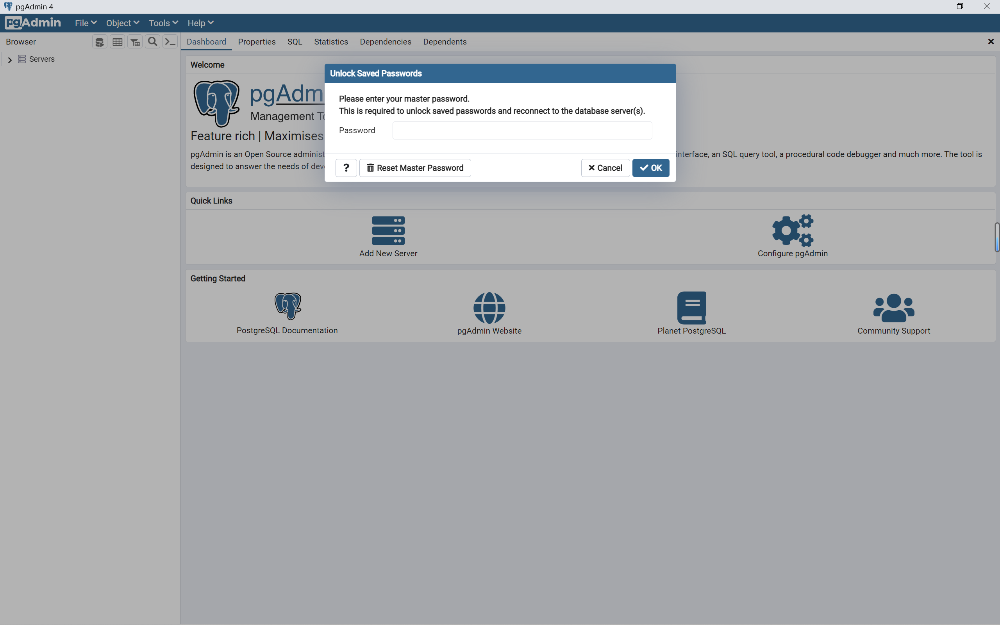

#### 2.1.2 修改显示语言

- 打开顶部工具栏 File → Preference → User language → Chinese (Simplified) → Save 即可，然后我们关闭软件。

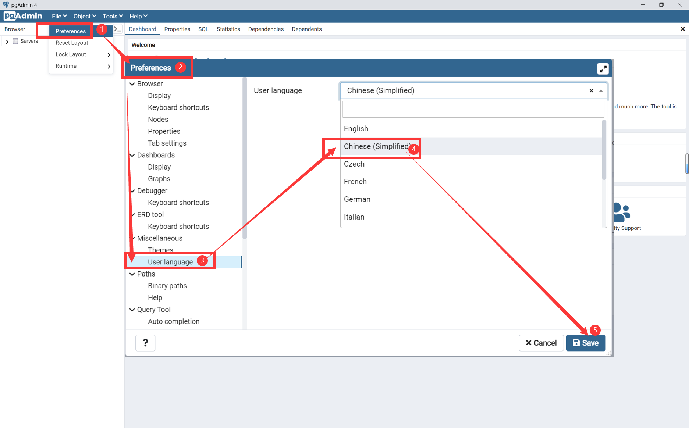

#### 2.1.3 中文界面

- 重新打开 `pgAdmin4` ，需要再次输入数据库密码，此时我们已经可以看到，界面变成中文显示了。

<font style="color:red">***【注】***：</font>我们一定要注意的是，虽然界面显示为中文了，但为了后续操作的稳定性、安全性以及后续可维护性，命名一定要全程使用英文。

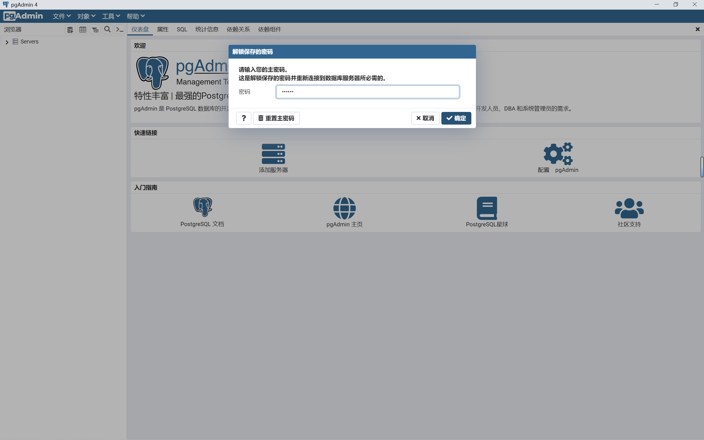

### 2.2 创建数据库

- 基于 `PostGIS32` 模板创建一个名为 `yantze` 的数据库来存放后续的操作数据

#### 2.2.1 直接创建

- 右击新建数据库

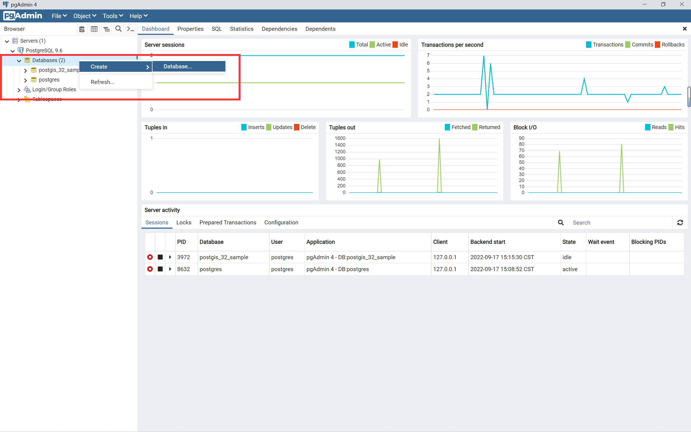

- 设置数据库名称


- 数据库定义：这里我们选择 postgis_32_sample 作为模板进行创建。


#### 2.2.2 报错信息及对应处理

- 报错：接下来必定会报错，因为在一开始，模板数据库也就是 postgis_32_sample 数据库处于运行状态


- 此时我们将模板数据库关闭即可

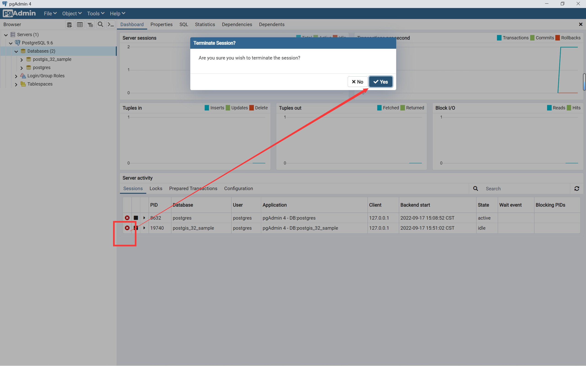

- 成功创建 `yangtze` 数据库。


## 3 QGIS 软件操作

### 3.1 中文显示配置

#### 3.1.1 默认英文界面

- 同样地，为了方便后续操作，这里我们将 QGIS 操作界面显示语言改为简体中文。

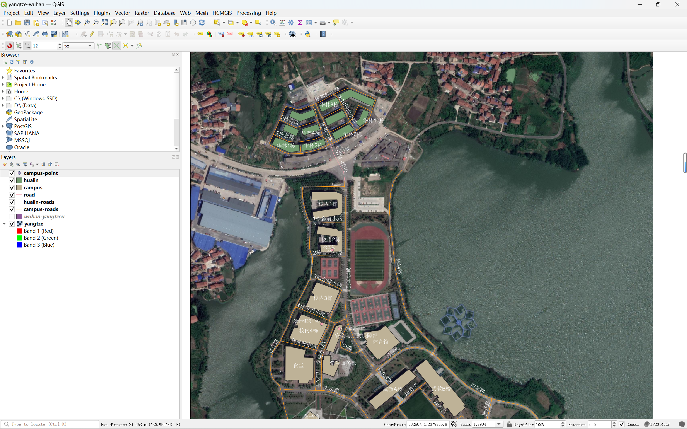

#### 3.1.2 修改显示语言

- 打开顶部工具栏 Settings → Options... → 简体中文→ OK 即可，然后我们关闭软件。

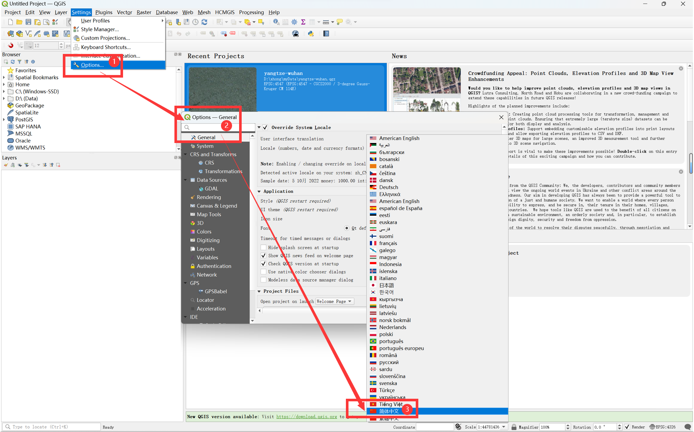

#### 3.1.3 中文界面

- 重新打开，此时我们已经可以看到，界面变成中文显示了。

<font style="color:red">***【注】***：</font>我们一定要注意的是，虽然界面显示为中文了，但为了后续操作的稳定性、安全性以及后续可维护性，命名一定要全程使用英文。

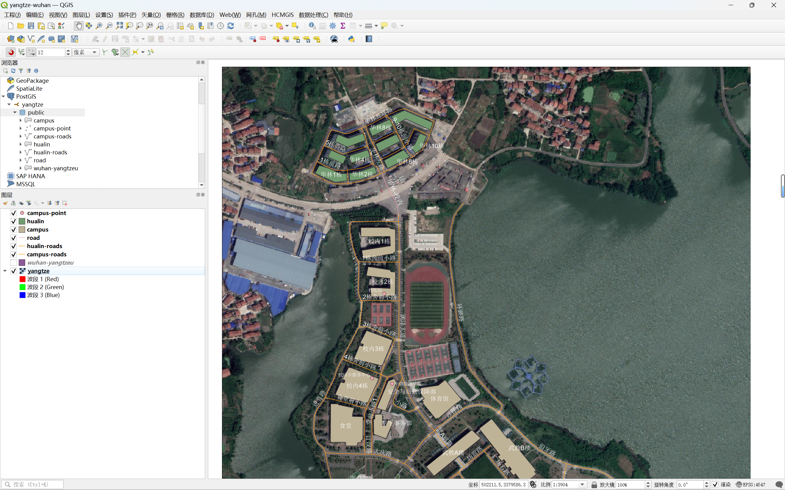


### 3.2 QGIS 连接 PostGIS

#### 3.2.1 连接 PostGIS

- 这里连接数据库使用的账密即为安装 PostgreSQL 时      配置的账密。

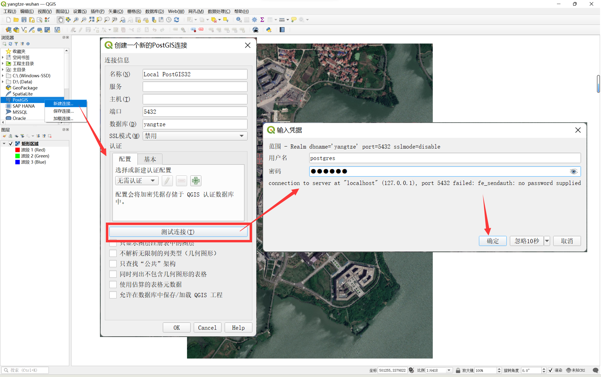

#### 3.2.2 成功连接

- 连接成功


- 在 QGIS 中查看数据库连接


#### 3.2.3 再次打开

- 由于本工程数据直接存储在 `PostgreSQL` 数据库中，所以每次打开工程时都需要连接数据库。

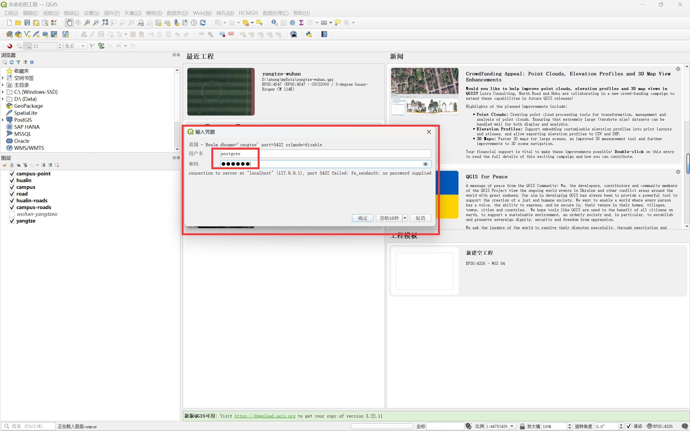

### 3.3 坐标参考系（CRS）

#### 3.3.1 查看影像坐标系

- 右击遥感数据，选择属性，即可在图层信息中查看到当前所使用的坐标参考系

- 这里我们使用的遥感影像数据的坐标参考系如下：

```
EPSG:4547 - CGCS2000 / 3-degree Gauss-Kruger CM 114E
```


#### 3.3.2 修改当前工程的坐标系

- 点击当前界面右下角的坐标系栏，进入后搜索 4547 ID 的坐标参考系并选中，点击确定即可。

<font style="color:red">***【注】***：</font>在创建任何数据时，请务必保证坐标系一致。

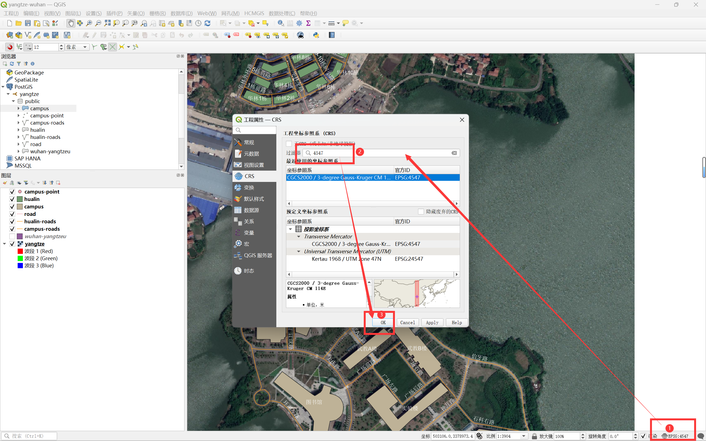

#### 3.3.3 各个数据的坐标系

- 我们选着 PostGIS 连接中数据，查看图层属性即可看到图层所属的坐标参考系

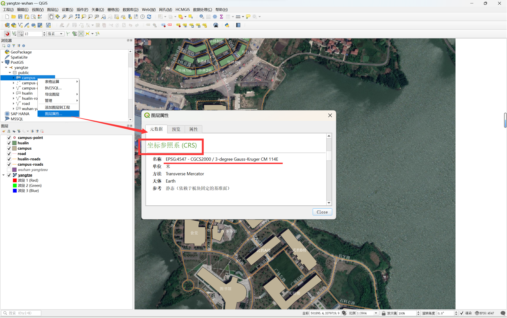

### 3.4 查用工具栏介绍

#### 3.4.1 插件的安装和管理

- 顶部工具栏 → 插件 → 管理并安装插件... → 进入插件界面，可以搜索想要使用的插件直接安装
- 由于开源 GIS 的加持，里面有很多实用的插件，具体可以上网检索，自行安装使用。

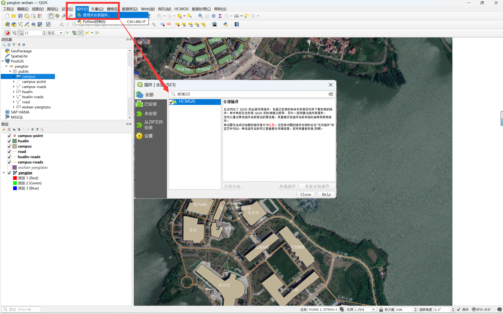

#### 3.4.2 捕捉工具栏

- 右击顶部工具栏空白部分，选中 “捕捉工具栏” 使其在顶部工具栏显示出来
- “捕捉工具栏” ：在矢量化地图时，选取节点非常实用。

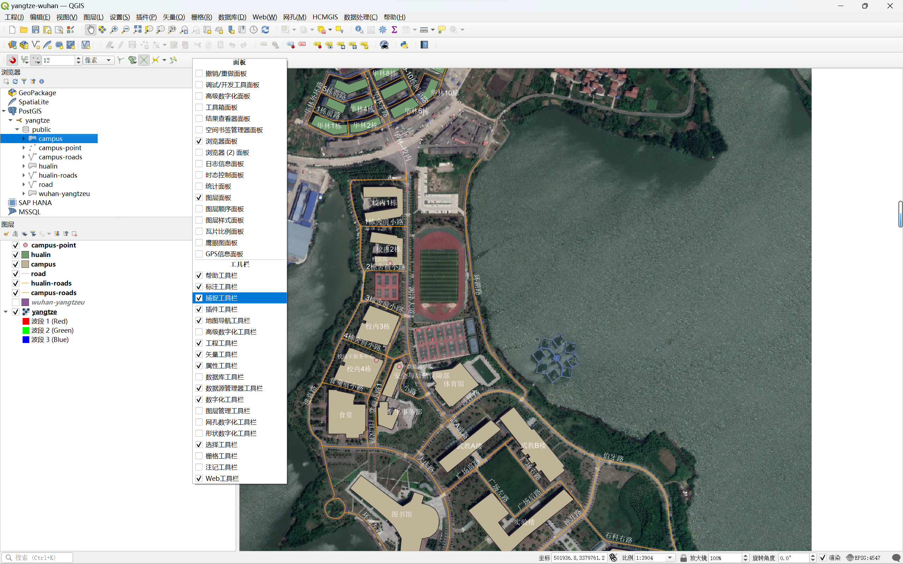


## 4 校园数字化过程

&emsp;&emsp;在做完上述准备工作后，我们可以正式开始对校园进行数字化处理了。由于步骤重复性较高，所以这里我们仅以其中一个数据为例进行详细说明。

### 4.1 新建数据

- 这里我们以校园的运动场地（sport-field）数字化为例，后续一系列操作均基于此。

#### 4.1.1 新建表格

- 选中 `PostGIS` 连接下的 `yangtze` 数据库，右击，新建表格，即可创建一个空间数据表。

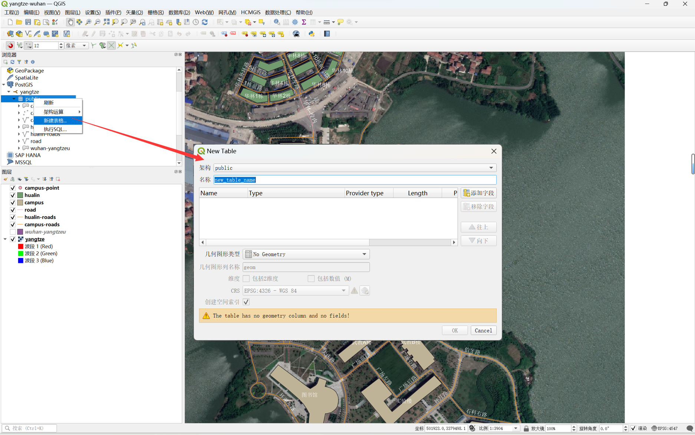

#### 4.1.2 设置表格属性内容

- 修改表格名称


- 添加名为 `name` 的长度为 `50` 的 `varchar` 文本字段，用于存放场地名称


- 由于场地是区域型的数据，所以我们几何类型选择 ***多边形***


- <font style="color:red">**！！！千万注意！！！**</font>坐标系一定要与当前工程保持一致。


#### 4.1.3 新建数据成功

- 若操作无误的话，此时界面应该如下图所示。


- 成功创建后会有提示，但要注意这时数据表中是没有任何数据信息的，接下来的操作都会存储在这张数据表中。


### 4.2 编辑数据

#### 4.2.1 导入数据

- 双击新建的数据表，即可导入当前工程，成为一个新的图层，此时仍然是空的。

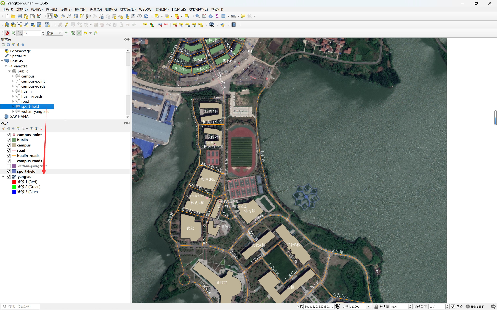

#### 4.2.2 打开编辑

- 选中导入的图层后，点击顶部工具栏的铅笔图标，再点击 “添加多边形要素” 即可开始编辑，此时鼠标光标会变成指针形式。


#### 4.2.3 开始编辑

&emsp;&emsp;这里我们说几个常用的数字化操作：

- 双击鼠标：生成节点
- Backspace：就是键盘删除键，可以撤回到上一个节点
- 右击鼠标：创建结束，将数据保存为一个要素

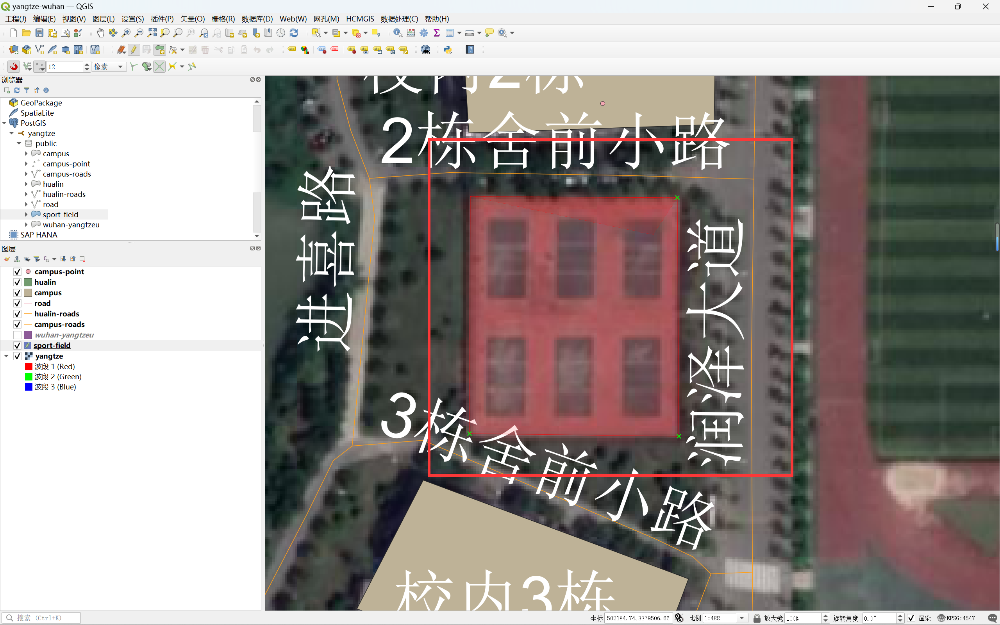

#### 4.2.4 保存并结束编辑

- 右击鼠标后，会弹出设置要素属性的对话框，根据情况自行填写即可。

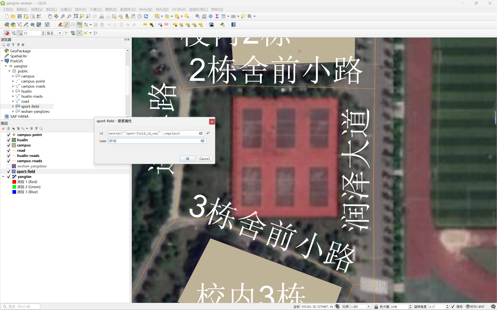

- 保存前后对比，此时已经生成了一个面状的要素。


- 但是，这还没完，我们必须保存并退出编辑，才能使数据真正的存储到数据库中。

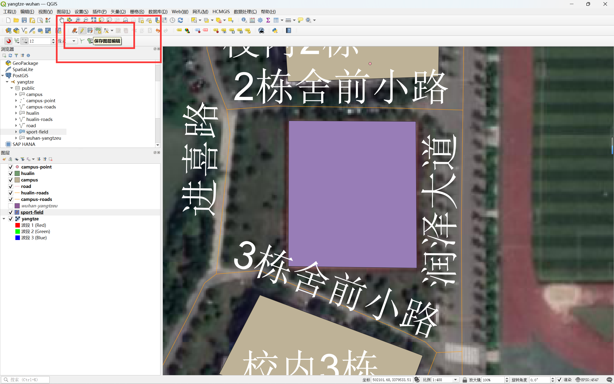

### 4.3 查看数据

- 此时我们右击 `sport-field` 数据表，查看预览，即可看到刚刚存储的面要素数据。

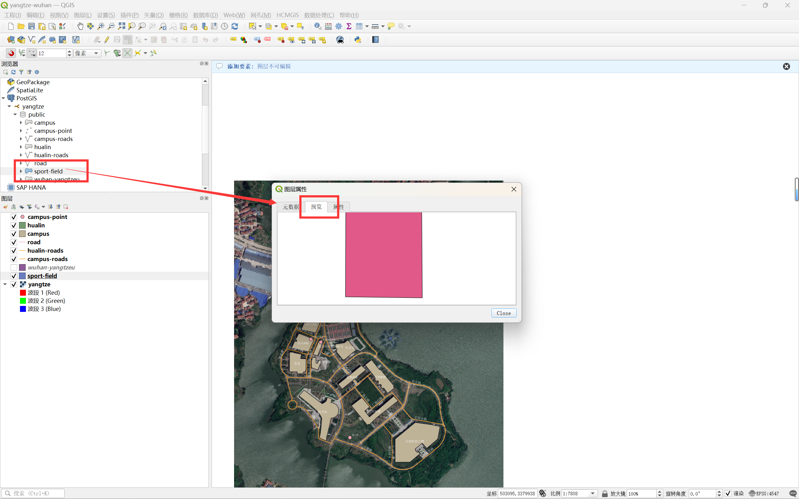


### 4.4 查询数据

- 由于我们直接使用数据库对数据进行存储，所以可以通过 PostGIS 支持的函数查询数据包含的空间信息。

> 检索华林公寓数据表中，各个面要素的边界坐标信息

```sql
SELECT ST_AsText(geom) FROM hualin
```

> 检索校园道路数据表中，各个线要素的坐标信息

```sql
SELECT ST_AsText(geom) FROM "campus-roads"
```


## 5 数字化成果

- 如图所示

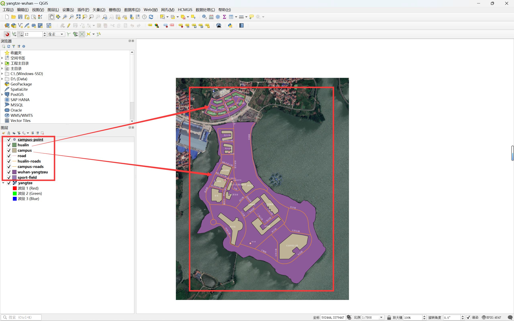


上一章：无

下一章：[练习二：数字化校园的数据表与 E-R 图](./02.md)
