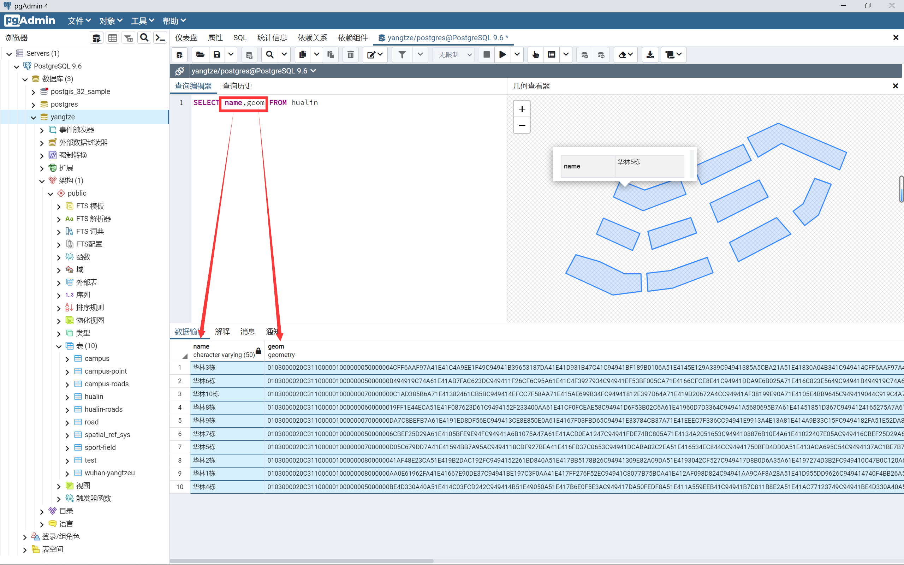
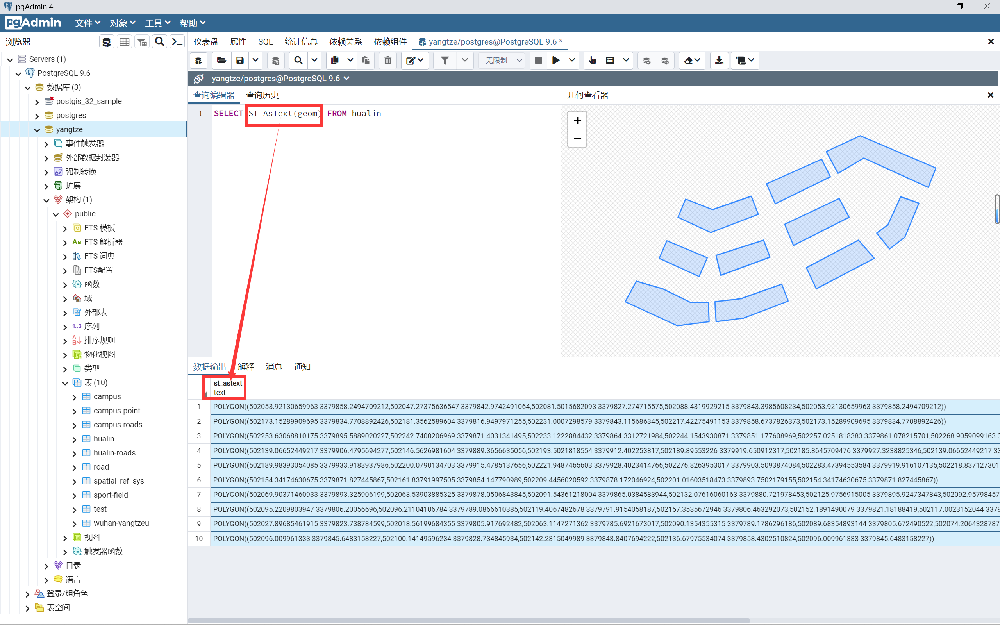
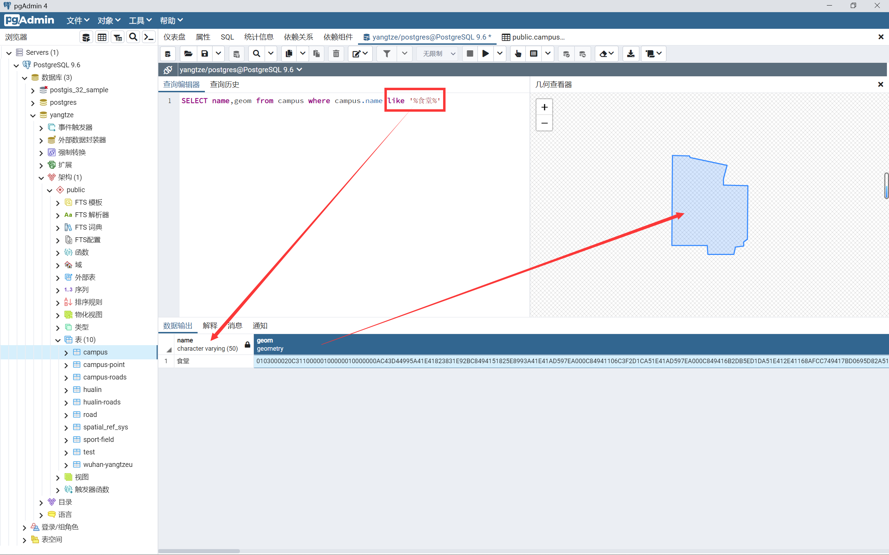
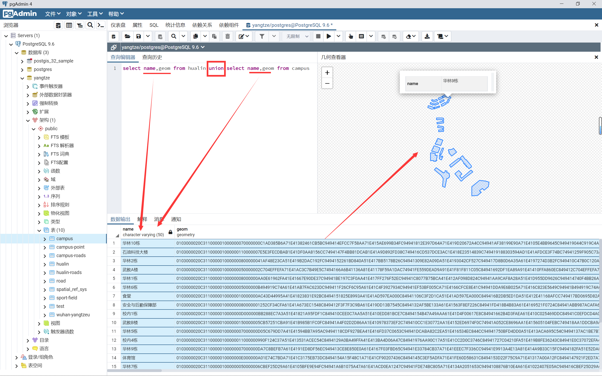
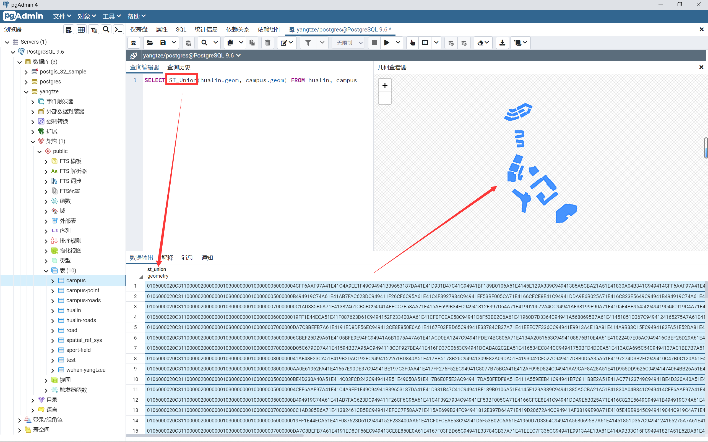
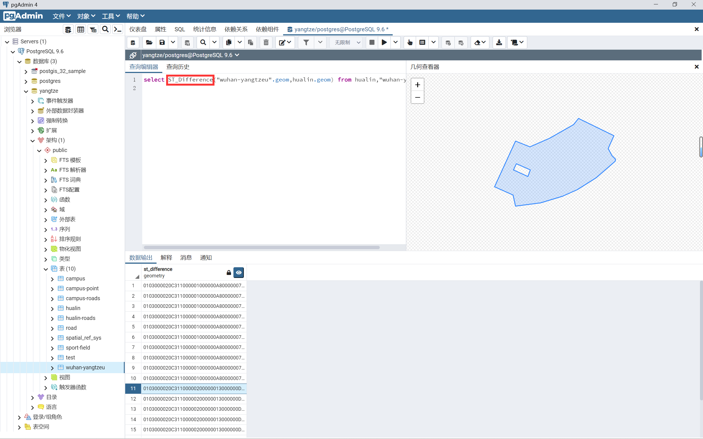
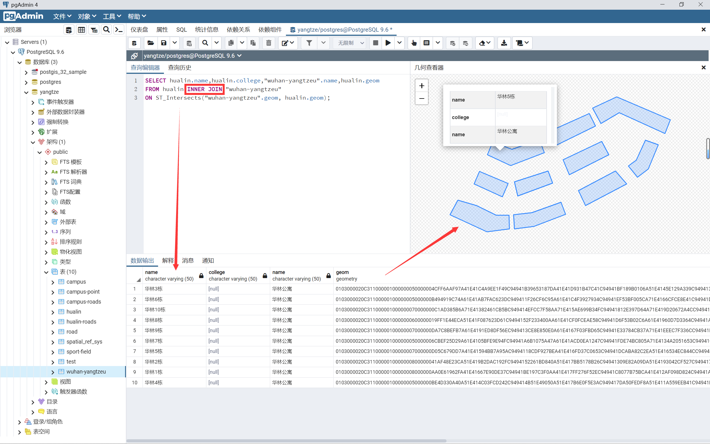
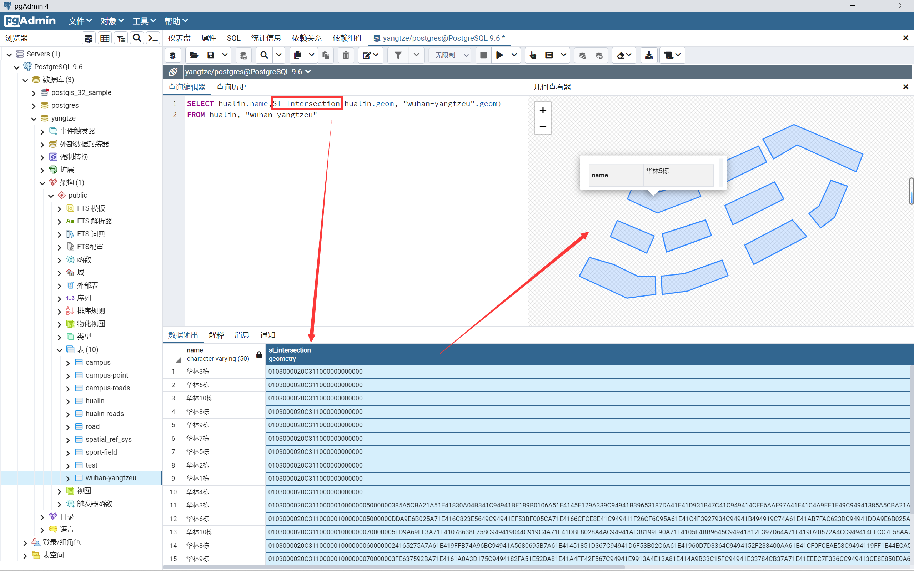
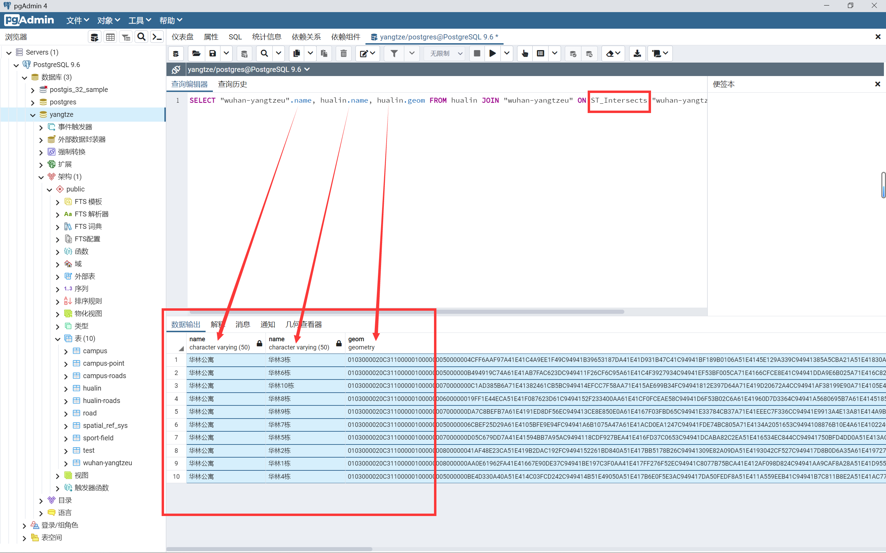

# 练习三：SQL 的 6 个基本操作


## 1 前言

### 1.1 书接上回：[练习二：数字化校园的数据表与 E-R 图](./02.md)

### 1.2 本文参考

1. [CSDN - 数据库的关系代数六大基本操作符](https://blog.csdn.net/gpwner/article/details/51474651)
2. [PostGIS 官网 - 第 5 章空间查询](https://postgis.net/docs/using_postgis_query.html#examples_spatial_sql)
3. [CSDN - SQL语句求交集、并集、差集](https://blog.csdn.net/jsxztshaohaibo/article/details/124006508)
4. 

### 1.3 作业内容

- 在练习一和二的基础上，对存储的数据进行
- SQL 语句的 6 个基本操作中至少使用 3 种方法（如：选择、投影、并集...）
- 这里我们已经选用并实现了 ***投影、选择、交、并、差、笛卡儿积、连接*** 等操作


## 2 SQL 的基本操作一

### 2.1 SQL 基本操作 - 投影

&emsp;&emsp;**投影**，就是对数据表的某一列 / 某几列数据，***按列检索*** 进行操作，将表中的的一列数据检索出来后，再打印显示出来。

> 默认以 WKB 格式显示数据

```sql
SELECT name,geom FROM hualin
```



<center>图 2-1 WKB 格式显示地理数据</center>

> 使用函数以 WKT 格式显示数据

```sql
SELECT ST_AsText(geom) FROM "hualin"
```



<center>图 2-2 WKT 格式显示地理数据</center>

- 这两条都是在华林公寓数据表中，检索各个面要素的边界坐标信息
- 因为数据中默认查询的是几何对象 WKB 描述，也就是二进制的显示形式
- `ST_AsText(geom)` 函数：输出函数，用于获取几何对象的 WKT 描述，此时数据会显示为可直接识别的坐标点

### 2.2 SQL 基本操作 - 选择

&emsp;&emsp;**选择**，就是指将数据 ***按行检索*** 后进行筛选，常用查询谓词 WHERE，对数据表中的数据进行查询。

> 查询校园表中食堂的 geom 属性

```sql
SELECT name,geom from campus where campus.name like '%食堂%'
```

- 这里需要特别注意的是，由于中文编码的特殊性，我们使用 `like '%中文字符%'` 的形式进行查询。



<center>图 2-3 在校园表中查询食堂</center>

## 3 SQL 的基本操作二

### 3.1 集合并

> 普通并集操作

```sql
select name,geom from hualin union select name,geom from campus
```

- `union`：并集操作符



<center> 图 3-1 普通并集操作</center>

> 使用 `ST_Union()` 函数联合并集

```sql
SELECT name,ST_Union(hualin.geom, campus.geom) FROM hualin, campus
```

- `ST_Union(geom1, geom2)` 函数：几何处理函数，用于返回两个几何对象合并后的结果




<center>图 3-2 ST_Union() 函数并操作</center>

### 3.2 集合差

> 普通的差集计算

```sql
```

- 没找到合适的，有空找一下。

> 使用 `ST_Difference()` 函数对几何对象做差

```sql
SELECT ST_Difference("wuhan-yangtzeu".geom,hualin.geom) FROM hualin,"wuhan-yangtzeu"
```

- `ST_Difference(geom A, geom B)` 函数：几何处理函数，用于获取 A 去除 B 相交部分的几何形状



<center>图 3-3 ST_Difference() 函数差操作</center>

### 3.3 集合交

> 普通的交集操作

```sql
SELECT hualin.name,hualin.college,"wuhan-yangtzeu".name,hualin.geom
FROM hualin INNER JOIN "wuhan-yangtzeu" 
ON ST_Intersects("wuhan-yangtzeu".geom, hualin.geom);
```

- `INNER JOIN` ：交集操作符
- `ST_Intersects(geom1, geom2)` 函数：空间关系函数，判断两个几何对象是否相交



<center>图 3-4 普通交集操作</center>

> 使用 `ST_Intersection()` 函数求几何对象的交集

```sql
SELECT hualin.name,ST_Intersection(hualin.geom, "wuhan-yangtzeu".geom)
FROM hualin, "wuhan-yangtzeu"
```

- `ST_Intersection(geom1, geom2)` 函数：几何处理函数，获取两个几何对象相交部分的几何形状




<center>图 3-5 ST_Intersection() 交集操作</center>

## 4 SQL 的基本操作三

&emsp;&emsp;连接操作分为两大类，自然连接和条件连接，在进行连接之前，都需要进行笛卡儿积的计算。

### 4.1 条件连接查询

> 联合查询

```sql
SELECT "wuhan-yangtzeu".name, hualin.name, hualin.geom FROM hualin JOIN "wuhan-yangtzeu" ON ST_Intersects("wuhan-yangtzeu".geom, hualin.geom);
```

- `ST_Intersects(geom1, geom2)` 函数：空间关系函数，用于判断两个几何对象是否相交
- 联合 `wuhan-yangtzeu` 表和 `hualin`  表，使用 `ST_Intersects()` 函数查询出 `wuhan-yangtzeu` 的 `geom` 和 `hualin`  的 `geom` 的相交部分，最后将符合条件的 `wuhan-yangtzeu` 表的 `name` 字段和 `hualin`  表的 `name` 和 `geom` 字段三个字段内容显示出来。



<center>图 4-1 联合查询</center>

