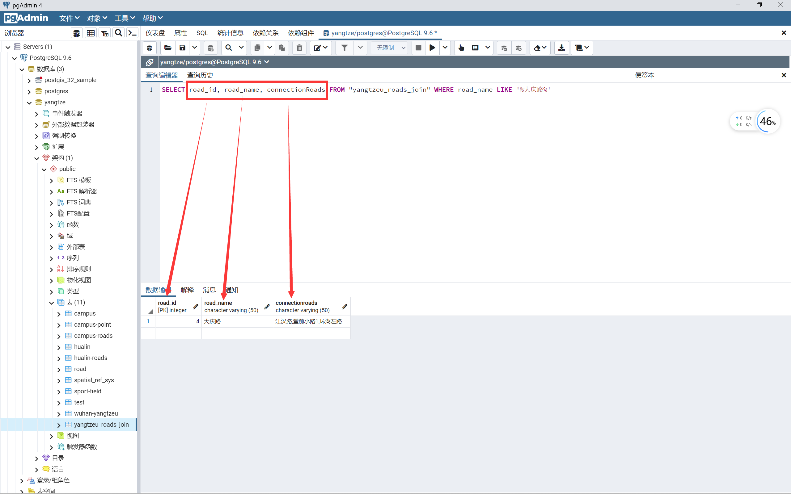

# 练习五 邻接矩阵

- 实验日期：10月28日，第 9 周周五上午

## 参考文章

1. [CSDN - 在 Arcgis 中基于 Python 对地图分级别进行四色填充](https://blog.csdn.net/wan_yanyan528/article/details/49175673)
1. [菜鸟教程 - PostgreSQL DELETE 语句](https://www.runoob.com/postgresql/postgresql-delete.html)
1. [CSDN - 各数据库 SQL 查询结果多行数据合并成一行](https://blog.csdn.net/qq_41512902/article/details/125671618)


## 一、实验准备

1. 软件：`PostgreSQL 9.6.24` + `PostGIS 3.2`
2. 数据：练习二所得的数据表


## 二、实验任务

1. 以之前设计的数字化校园数据库数据为例，说明邻接矩阵的概念
1. 并用 SQL 实现邻接矩阵的计算


## 三、实验内容

### 3.1 创建新表

```sql
CREATE TABLE "yangtzeu_roads_join"
(
	"road_id" int4 NOT NULL PRIMARY KEY,
	"road_geom" geometry,
	"road_name" varchar(50),
	connectionRoads varchar(50)
)
```

（1）创建名为 `yangtzeu_roads_join` 的数据表，用于存储长江大学武汉校区所有的道路数据

（2）数据表包含：

- `road_id`：道路 ID 号，整数类型、非空、主键

- `road_geom`：道路的地理信息，`geometry` 下的 `polyline` 子类型

- `road_name`：道路名称，字符类型、长度最大为 $50$

- `connectionRoads`：存放道路邻接关系，字符类型、长度最大为 $50$

<center>表 1 yangtzeu_roads_join 长江大学武汉校区道路总表</center>

|     列  名      |  数据类型   |          描  述          |
| :-------------: | :---------: | :----------------------: |
|     road_id     |    int4     |  道路 ID 号、非空、主键  |
|    road_geom    |  geometry   |      道路的地理信息      |
|    road_name    | varchar(50) |         道路名称         |
| connectionRoads | varchar(50) | 与此条道路邻接的道路名称 |

### 3.2 插入数据

#### 3.2.1 给道路 ID 增加自增属性

&emsp;&emsp;由于在之前建表中，我们的道路都是自生成的 ID 列，所以存储的道路 ID 会有重复，为了避免校内与华林区域内的道路 ID 冲突，我们需要给道路总表的道路 ID 设置自增长属性。

&emsp;&emsp;在 PostgreSQL 中，设置字段自增与 MySQL 等数据库略有不同。

> 字段自增属性修改 `PostgreSQL` 模板

```sql
ALTER TABLE 表名 ALTER COLUMN 字段名 SET DEFAULT nextval('"表名_id_seq"'::regclass);
```

> 给道路 ID 增加自增属性

```sql
ALTER TABLE "yangtzeu_roads_join" ALTER COLUMN "road_id" SET DEFAULT nextval('"wuhan-yangtzeu_id_seq"'::regclass);
```

&emsp;&emsp;接下来，就可以放心添加数据了。

#### 3.2.2 插入所有道路数据

> 插入校内道路数据

```sql
INSERT INTO "yangtzeu_roads_join" (road_geom, road_name)
	SELECT "campus-roads".geom, "campus-roads".name FROM "campus-roads"
```

> 插入华林道路数据

```sql
INSERT INTO "yangtzeu_roads_join" (road_geom, road_name)
	SELECT "hualin-roads".geom, "hualin-roads".name FROM "hualin-roads"
```

### 3.3 查询并插入道路邻接关系

#### 3.3.1 `UPDATE` 命令

&emsp;&emsp;由于 `INSERT` 命令只能按行来插入数据，当我们需要向某一行某一列插入数据时，则需要时 `UPDATE` 命令。

> 某一行某一列更新数据 `PostgreSQL` 模板

```sql
UPDATE 表名
SET 列名1 = value1, 列名2 = value2...., 列名N = valueN
WHERE 定位某一行;
```

#### 3.3.2 插入道路邻接关系

> 插入道路邻接关系, 以 大庆路 为例

```sql
UPDATE "yangtzeu_roads_join" SET connectionRoads = (
    SELECT string_agg(road_name,',') FROM "yangtzeu_roads_join"
    WHERE ST_Touches(
        (
            SELECT road_geom
            FROM "yangtzeu_roads_join"
            WHERE "yangtzeu_roads_join".road_name LIKE '%大庆路%'
        ), road_geom
    ) = TRUE
)
WHERE road_name LIKE '%大庆路%';
```

（1）在校园道路总表中为当前选中道路插入 connectionRoads （邻接道路名）

（2）`string_agg(字段名, '分隔符')`：合并函数，能将查询结果合并成一个字符串

（3）`ST_Touches(geom1, geom2)`：空间关系函数，如果两几何对象间至少有一个公共点，但它们内部又不相交，则返回为 TRUE

#### 3.3.3 查询数据

> 查询大庆路现在的数据

```sql
SELECT road_id, road_name, connectionRoads FROM "yangtzeu_roads_join" WHERE road_name LIKE '%大庆路%'
```

<center>表 2 查询大庆路邻接表</center>

| road_id [int] | road_name [varchar(50)] | connectionRoads [varchar(50)] |
| ------------- | ----------------------- | ----------------------------- |
| 4             | 大庆路                  | 江汉路，堂前小路1，环湖左路   |



<center>图 1 查询界面</center>

## 四、实验结论

&emsp;&emsp;本次实验，创建了武汉校区道路总表，对校内道路表与校外华林道路表进行数据合并，并添加了 `connectionRoads` 字段用于存储邻接道路，借助 `ST_Touches()` 函数查询道路间的邻接关系，实现了两张空间数据表的空间连接并求得了具体道路的邻接矩阵。
