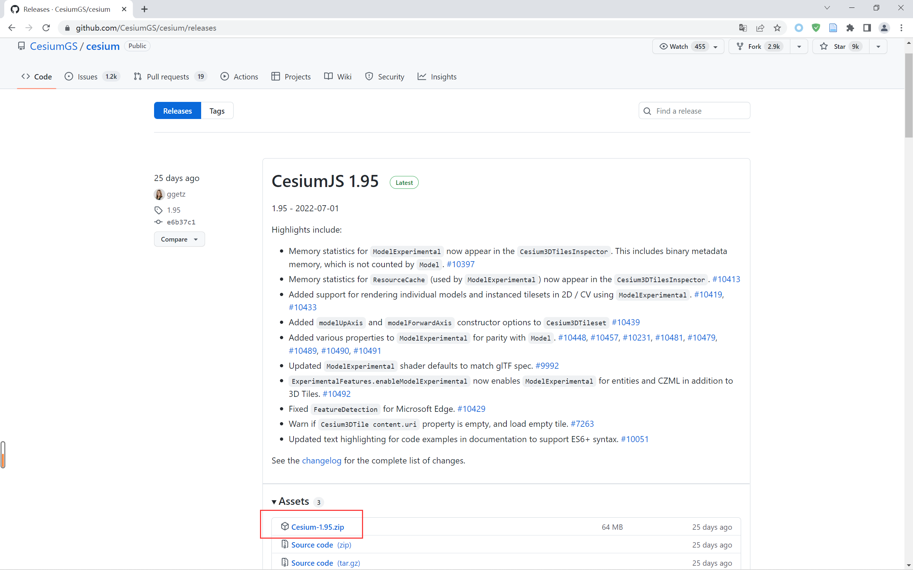

# Cesium 学习笔记（一）


## 1 下载安装 Cesium

### 1.1 GitHub 源码下载

- 下载地址：[cesium 官方下载](https://github.com/CesiumGS/cesium/releases)

&emsp;&emsp;这里我们选择当前最新（截止至2022.7.27）的 [CesiumJS 1.95](https://github.com/CesiumGS/cesium/releases/tag/1.95) 进行下载安装。



### 1.2 在 Vue 项目中直接引入

> 使用 yarn 安装最新版 cesium

```shell
yarn add cesium
```

> 使用 yarn 安装最新版 vue-cesium

​		由于我们项目使用的是 vue3.2，所以这里安装最新版 vue-cesium3.x 与之对应。

```shell
yarn add vue-cesium@next
```

>进行配置

​		参考：[vue-cesium 官方文档](https://zouyaoji.top/vue-cesium/#/zh-CN/component/installation)