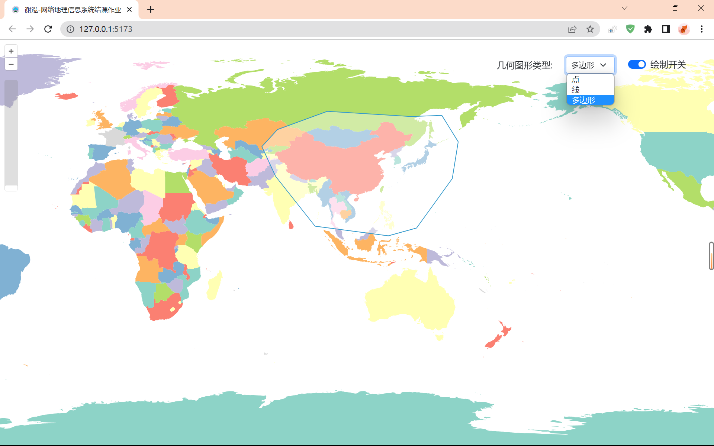
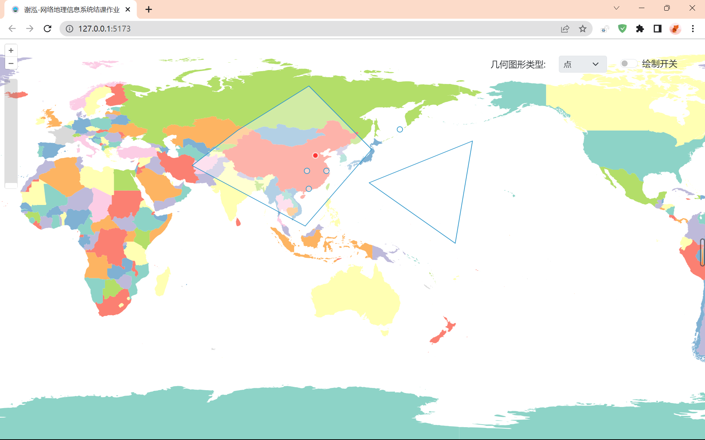
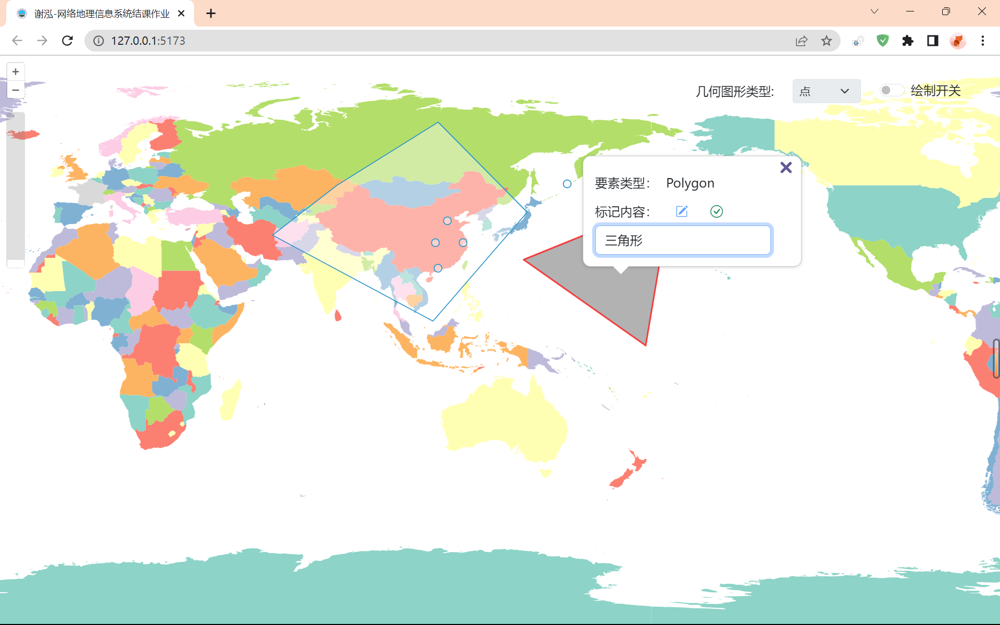

# 网络地理信息系统结课作业


- 本文在线地址：(https://gis-xh.github.io/yanxue-notes/WebGIS/coursework/)
- 本文源码地址：(https://github.com/gis-xh/yanxue-notes/tree/main/code/my-webgis)


## 要求

1、先配置好node.js环境。

2、加一个geoserver类型的服务

3、进行交互式绘制点与面

4、将刚才绘制好的形状变成要素，然后在点的位置添加该点文字标注，如“海滨公园”；在多边形内部添加气泡式的提示信息。


## 1 配置开发环境

### 1.1 创建 OpenLayers 项目

#### 1、安装配置 Node.js 环境

&emsp;&emsp;先到 Node.js 官网下载进行安装，然后将 Node.js 添加到系统环境变量，并修改镜像源。

- 官方下载地址：(https://nodejs.org/zh-cn/download)

#### 2、创建项目

&emsp;&emsp;找到合适的目录，启动 cmd 命令行，输入命令创建名为 my-webgis 的 openlayer 项目

> 创建 openlayer 项目

```sh
npm create ol-app my-webgis
```


<center>图 1-1 npm 创建 openlayers 项目</center>

#### 3、启动项目

&emsp;&emsp;使用编辑器打开 my-webgis 目录，在创建项目时会自动生成 openlayers 所需要的一系列基础文件，如 `package.json` 文件。在编辑器中调出命令行，输入命令，启动项目。

```sh
npm start
```

- 左侧：项目目录结构
- 右侧：项目代码编辑区域
- 下方：在项目目录下启动的命令行控制台


<center>图 1-2 编辑器打开项目</center>

#### 4、查看运行结果

&emsp;&emsp;访问项目启动后生成的链接，就可以看到项目的初始效果，如下图所示。


<center>图 1-3 项目初始界面</center>

### 1.2 安装配置 Geoserver

&emsp;&emsp;Geoserver 是用 Java 编写的开源软件服务器，在运行前需要安装配置 Java 环境。需要注意的是，Geoserver 最后一个支持 JRE8 的版本是 `2.22.x`。从 `2.23.x` 版本开始，Geoserver 需要 Java 11 或 Java 17 环境（JRE）才能运行。

#### 1、检查本机 JRE 版本

```sh
java -version
```

&emsp;&emsp;查询结果如下：


<center>图 1-4 检查 Java 环境</center>

&emsp;&emsp;由于当前本机的 JRE 版本是 JRE8，所以选择安装 Geoserver `2.22.3` 版本。

- 官方下载地址：(https://sourceforge.net/projects/geoserver/files/GeoServer/2.22.3/)
- 官方安装教程：(https://docs.geoserver.org/2.22.x/en/user/installation/win_installer.html)


<center>图 1-5 安装 Geoserver（一）下载安装程序</center>

#### 2、安装 Geoserver | 读取 Java 目录

&emsp;&emsp;在安装时，会自动检测当前设备的 JRE 版本及其所在的位置，符合依赖条件才能进行下一步安装。


<center>图 1-6 安装 Geoserver（二）读取 Java 目录</center>

#### 3、安装 Geoserver | 设置软件目录

&emsp;&emsp;接下来根据本机文件结构，将 GeoServer 及其数据安装到手动设置的对应目录中。

```
E:\program\GeoServer

E:\researchData\GeoServer
```

#### 4、安装 Geoserver | 正式安装

&emsp;&emsp;接下来设置好管理员用户名和密码以及地图服务发布的端口号，就可以正式开始安装了。


<center>图 1-7 安装 Geoserver（三）完成安装设置</center>

#### 5、安装完成

&emsp;&emsp;启动 Geoserver 服务后，在浏览器中输入以下地址即可访问，登录后的界面如下图所示。

```
http://localhost:8080/geoserver
```


<center>图 1-8 Geoserver 服务管理界面</center>


## 2 加载 Geoserver 服务

### 2.1 查看 Geoserver 示例数据

#### 1、启动 Geoserver

&emsp;&emsp;启动 Geoserver 服务，打开 `http://localhost:8080/geoserver` 链接

#### 2、查看待加载图层

&emsp;&emsp;登录账户后，左侧 Data → Layers → Countries 图层，这是 Geoserver 在安装时自带的数据


<center>图 2-1 查看 Geoserver 自带数据图层</center>

#### 3、查看待加载数据信息

&emsp;&emsp;进入 Countries 图层设置中，可以看到其坐标系为 `EPSG:4326`，地图范围以及属性名称。


<center>图 2-2 查看 Countries 数据信息</center>

#### 4、图层预览

&emsp;&emsp;并且也可以在 Geoserver 中对图层数据进行预览，左侧 Data → Layer Preview → Countries → OpenLayers，即可进行数据预览。


<center>图 2-3 预览 Countries 数据（一）</center>

&emsp;&emsp;进入预览页面，点击中国区域后，预览结果如下图所示：


<center>图 2-4 预览 Countries 数据（二）</center>

### 2.2 加载数据

#### 1、导入相关的包

&emsp;&emsp;打开项目目录下的 `main.js` 文件开始编辑。

```js
import ImageLayer from 'ol/layer/Image';
import { OSM, ImageWMS } from 'ol/source';
import ZoomSlider from 'ol/control/ZoomSlider';
import { getCenter } from 'ol/extent';
```

#### 2、添加相关设置

&emsp;&emsp;定义并设置地图范围、地图中心点、坐标系以及基于 Geoserver 的 WMS 访问基地址。

```js
const extent = [60, -80, 160, 80];
const center = getCenter(extent);
const projection = 'EPSG:4326';
const GeoWMS = 'http://localhost:8080/geoserver/ne/wms';
```

#### 3、添加 WMS 图层

&emsp;&emsp;接着在 `map` 中修改 `layers` 图层设置，将其改为服务类型为 geoserver 类型，并且指定 WMS 地址且图层名为 `ne:countries` 的图层。

```js
layers: [
    new ImageLayer({
      source: new ImageWMS({
        url: GeoWMS,
        params: {
          'LAYERS': 'ne:countries',
          'TILED': true
        },
        serverType: 'geoserver'
      })
    })
  ],
```

#### 4、修改 view 视图

&emsp;&emsp;在进行一系列配置后，也要将视图对应的配置进行修改。

```js
view: new View({
    center: center,
    zoom: 2,
    projection: projection
}),
```

#### 5、运行项目

&emsp;&emsp;此时可以看到已经成功将 Geoserver 服务数据加载到了地图中。


<center>图 2-5 OpenLayers 加载 Geoserver 数据</center>


## 3 交互式绘制点与面

&emsp;&emsp;本章将会通过一个绘制开关控制绘制状态，开始绘制时，通过鼠标交互式绘制点与面要素。

### 3.1 选择绘制类型

#### 1、绘制类型选择框

&emsp;&emsp;在 `index.html` 中，添加下拉选择框，包含了点、线、面三要素，并且默认选择多边形作为绘制待选。

```html
<select class="form-select form-select-sm" aria-label=".form-select-sm example" id="drawType" disabled>
    <option value="Point">点</option>
    <option value="LineString">线</option>
    <option value="Polygon" selected>多边形</option>
</select>
```

#### 2、导入矢量绘制包

&emsp;&emsp;接下来，在 `main.js` 内容顶部添加先导入矢量绘制所需的包，再进行后续操作。

```js
import Draw from 'ol/interaction/Draw';
import VectorLayer from 'ol/layer/Vector';
import VectorSource from 'ol/source/Vector';
```

#### 3、创建矢量图层

&emsp;&emsp;创建矢量数据源对象和矢量图层对象，用于存放和显示后续绘制的矢量数据。

```js
const vecSource = new VectorSource();
const vecLayer = new VectorLayer({
  source: vecSource,
});
map.addLayer(vecLayer);
```

#### 4、绘制几何图形

&emsp;&emsp;根据 `id` 值获取 `html` 选择框标签元素，监听选择框的选中情况，从而实现点线面要素的绘制切换，将不同要素类型的交互式绘制操作添加到地图容器上。

```js
const typeSelect = document.getElementById("drawType");
let draw;
const addDrawInteraction = () => {
  const value = typeSelect.value;
  draw = new Draw({
    source: vecSource,
    type: value,
  });
  map.addInteraction(draw);
};
typeSelect.onchange = () => {
  map.removeInteraction(draw);
  addDrawInteraction();
};
```

### 3.2 绘制控制

#### 1、绘制开关

&emsp;&emsp;在 `index.html` 中，添加一个基于 bootstrap 样式的 switch 开关，来控制绘制状态。

```html
<div class="form-check form-switch">
    <input class="form-check-input" type="checkbox" role="switch" id="drawState">
    <label class="form-check-label" for="isDraw">绘制开关</label>
</div>
```

#### 2、绘制开关函数

&emsp;&emsp;接下来，在 `main.js` 中，添加一个绘制开关函数。先利用 id 值获取开关的当前状态，再通过开关的状态来控制地图容器。

- 如果开关打开，则代表已开始绘制，绘制类型下拉选择框变为可用状态，并且移除其他交互，隐藏弹出窗口，只保留绘制交互。

- 如果开关关闭，则代表已结束绘制，保留已绘制图形，恢复其他交互，并且绘制类型下拉选择框变为不可用状态。

```js
const changeState = document.getElementById("drawState");
const handleDraw = () => {
  if (changeState.checked) 
    typeSelect.disabled = false;
    map.removeInteraction(highlightPointerMove);
    map.removeInteraction(selectClick);
    addDrawInteraction();
    overlay.setPosition(undefined);
  } else {
    typeSelect.disabled = true;
    map.removeInteraction(draw);
    highlightFeature();
    selectFeature();
  }
};
```

#### 3、监听绘制开关变化

&emsp;&emsp;最后，给绘制开关函数加一个全局动态监听，就可以完成对绘制开关的实时响应。

```js
changeState.onchange = () => {
  handleDraw();
};
```

### 3.3 绘制演示

&emsp;&emsp;打开绘制开关，选中多边形绘制一个多边形面要素，如下图所示。



<center>图 3-1 交互式绘制面要素</center>


## 4 添加标注

&emsp;&emsp;本章将会实现对已经绘制好的要素添加标注，并气泡式的显示提示信息，同时还实现了对标注的编辑和保存操作。

### 4.1 悬停高亮

#### 1、导入相关包

&emsp;&emsp;首先，在 `main.js` 内容顶部添加绘制风格，选择和编辑交互，单击和悬停的地图事件，气泡覆盖等一系列相关包，再进行后续操作。

```js
import { Circle, Fill, Stroke, Style } from 'ol/style';
import { Select, Modify } from 'ol/interaction';
import { click, pointerMove } from 'ol/events/condition';
import Overlay from 'ol/Overlay';
```

#### 2、设置要素高亮样式

&emsp;&emsp;通过 `Fill`、`Stroke`、`Circle` 来设置要素的高亮样式，设置线面要素高亮样式为填充全透明，红色边界，并且添加一个image属性，为点要素的图形设置相同高亮样式。

```js
const highlight = new Style({
  fill: new Fill({ color: 'rgba(0, 0, 0, 0)' }),
  stroke: new Stroke({
    color: 'rgba(255, 0, 0, 0.7)', // 设置为红色
    width: 2,
  }),
  image: new Circle({
    radius: 5,
    fill: new Fill({ color: 'rgba(255, 0, 0, 0.7)' }),
    stroke: new Stroke({
      color: 'rgba(255, 255, 255, 0.7)', // 设置为白色
      width: 2,
    }),
  }),
});
```

#### 3、悬停高亮要素函数

&emsp;&emsp;最后，通过悬停要素高亮函数实现鼠标悬停在要素上方时，要素变为高亮样式。

```js
const highlightPointerMove = new Select({
  condition: pointerMove,
  style: highlight,
});
const highlightFeature = () => {
  map.addInteraction(highlightPointerMove);
};
```

#### 4、悬停要素演示

&emsp;&emsp;这里已悬停在点要素上方为例作为效果演示，具体如图 4-1 所示。



<center>图 4-1 悬停点要素演示</center>

### 4.2 选中要素

#### 1、设置要素选中样式

&emsp;&emsp;和高亮样式设置类似，设置的要素选中后的样式也同样需要对点线面分别设置。为了与高亮样式区分开，将选中样式的填充色设为伪透明色。

```js
const selected = new Style({
  fill: new Fill({ color: 'rgba(0, 0, 0, 0.3)' }),
  stroke: new Stroke({
    color: 'rgba(255, 0, 0, 0.7)', // 设置为红色
    width: 2,
  }),
  image: new Circle({
    radius: 5,
    fill: new Fill({ color: 'rgba(255, 0, 0, 0.7)' }),
    stroke: new Stroke({
      color: 'rgba(255, 255, 255, 0.7)', // 设置为白色
      width: 2,
    }),
  }),
});
```

#### 2、要素单击选中事件

&emsp;&emsp;利用 `Select` 交互设置单击事件，实现单击要素，要素切换显示样式的操作。

```js
const selectClick = new Select({
  condition: click,
  style: selected,
});
```

### 4.3 添加并编辑标注

#### 1、添加弹出窗口

&emsp;&emsp;在 `index.html` 中添加一个 div 标签用于显示标注的弹出气泡窗口。并结合 bootstrap 样式，对气泡窗口进行美化。窗口包含要素的类型，标记内容框，编辑按钮，保存按钮等内容。

```html
<div id="popup" class="ol-popup">
    <a href="#" id="popup-closer" class="ol-popup-closer"></a>
    <div id="popup-content"></div>
  </div>
  <!-- 用于存放弹出窗口的内容 -->
  <template id="popup-template">
    <div class="row centerItems">
      <div class="col-4">
        <label>要素类型：</label>
      </div>
      <div class="col-6">
        <input type="text" readonly class="form-control-plaintext" value="{featureType}">
      </div>
    </div>
    <div class="row centerItems">
      <div class="col-4">
        <label>标记内容：</label>
      </div>
      <!-- 添加编辑和保存图标按钮，用于触发编辑和保存功能 -->
      <div class="col-8">
        <button type="button" id="edit-btn" class="btn text-primary border-0">
          <i class="bi bi-pencil-square"></i>
        </button>
        <button type="button" id="save-btn" class="btn text-success border-0" disabled>
          <i class="bi bi-check-circle"></i>
        </button>
      </div>
      <div class="row">
        <div class="col">
          <input type="text" id="feature-marker" readonly class="form-control-plaintext" value="{featureMarker}">
        </div>
      </div>
    </div>
  </template>
```

#### 2、编辑要素标记函数

&emsp;&emsp;在 `main.js` 中，先全局声明要素标记内容，再添加编辑要素标记函数 `editMarker()`：点击编辑按钮，获取弹出窗口中的 input 元素内容，通过修改标签的 class 将 input 标签中的文本内容由 readonly 只读变为输入框，并将编辑按钮设为不可用状态，保存按钮设置为可用状态。

```js
let featureMarker;
let markerInput;
const editMarker = (editBtn, saveBtn) => {
  markerInput = document.getElementById('feature-marker');
  markerInput.removeAttribute('readonly');
  markerInput.setAttribute('class', 'form-control');
  editBtn.disabled = true;
  saveBtn.disabled = false;
};
```

#### 3、保存要素标记函数

&emsp;&emsp;再添加一个保存要素标记函数 `saveMarker()`：点击保存按钮，通过添加 input 元素的 readonly 属性，并修改 input 元素的 class 属性，使其样式变化不可编辑，从而实现保存效果。

```js
const saveMarker = (editBtn, saveBtn) => {
  markerInput = document.getElementById('feature-marker');
  markerInput.setAttribute('readonly', 'readonly');
  markerInput.setAttribute('class', 'form-control-plaintext');
  editBtn.disabled = false;
  saveBtn.disabled = true;
};
```

#### 4、单击选中要素函数

&emsp;&emsp;最后添加一个单击选中要素函数，在地图上注册一个 singleclick 单击事件的监听器，获取点击位置上的要素，实现单击选中的效果，并且与绘制开关联动。

- 当绘制开关处于打开状态时，则不需要显示标注，隐藏弹出窗口
- 当绘制开关处于关闭状态，且有要素被点击时，获取要素的要素类型和标注信息，通过  `innerHTML` 实现对标签内容的替换。

```js
const selectFeature = () => {
  map.addInteraction(selectClick);
  map.on('singleclick', function (evt) {
    const feature = map.getFeaturesAtPixel(evt.pixel)[0];
    if (changeState.checked) {
      overlay.setPosition(undefined);
    } else {
      if (feature) {
        overlay.setPosition(evt.coordinate);
        const featureType = feature.getGeometry().getType();
        featureMarker = feature.get('name');
        const template = document.getElementById('popup-template').innerHTML;
        const contentHtml = template
          .replace('{featureType}', featureType)
          .replace('{featureMarker}', featureMarker);
        content.innerHTML = contentHtml;
        const editBtn = document.getElementById('edit-btn');
        const saveBtn = document.getElementById('save-btn');
        editBtn.onclick = () => {
          editMarker(editBtn, saveBtn);
        };
        saveBtn.onclick = () => {
          saveMarker(editBtn, saveBtn);
        };
      } else {
        overlay.setPosition(undefined);
      }
    }
  });
  closer.onclick = () => {
    overlay.setPosition(undefined);
    closer.blur();
    return false;
  };
};
```

#### 5、效果演示

&emsp;&emsp;这里已点击面要素并编辑标记内容为例作为效果演示，具体如下图 4-2 所示。



<center>图 4-2 编辑面要素标注内容</center>


## 5 总结

&emsp;&emsp;本次实验的目的是学习 OpenLayers，GeoServer，Bootstrap，ES6 相关知识并走通了对应的技术路线。在实验过程中，从配置开发环境开始，熟悉了 OpenLayers 项目的创建和运行方式，以及 GeoServer 的安装和使用方法。然后，加载了 GeoServer 服务，在 OpenLayers 中添加了 WMS 图层，并且了解了 GeoServer 中图层和数据的相关信息。接着，实现了交互式绘制点与面的功能，学习了如何使用 OpenLayers 的绘制交互来创建不同类型的几何图形，并且实现了一个绘制开关来控制绘制功能的开启和关闭。最后，添加了标注的功能，学习了如何使用 OpenLayers 的样式、选择和悬停交互来实现要素的高亮和选中效果，并且利用 Bootstrap 的弹出窗口和图标来为要素添加和编辑标注。通过本次实验，我提高了自己的网络地理信息系统开发能力，也增加了自己对地理信息的兴趣。同时，也发现了自己在编程方面还有很多不足之处，需要在今后的学习中不断改进和完善。


## 参考

[1] [Geoserver配置以及发布geojson服务教程_geoserver 发布geojson_迷茫的小猿的博客-CSDN博客](https://blog.csdn.net/weixin_43747076/article/details/106081501)

[2] [openlayers加载geoserver的wms服务_布偶不说话的博客-CSDN博客](https://blog.csdn.net/long_Amber/article/details/110553202)

[3] [Draw Features (openlayers.org)](https://openlayers.org/en/latest/examples/draw-features.html)

[4] [Draw and Modify Features (openlayers.org)](https://openlayers.org/en/latest/examples/draw-and-modify-features.html)

[5] [Select Features (openlayers.org)](https://openlayers.org/en/latest/examples/select-features.html)

[6] [Vector Labels (openlayers.org)](https://openlayers.org/en/latest/examples/vector-labels.html)

[7] [Overlay (openlayers.org)](https://openlayers.org/en/latest/examples/overlay.html)

[8] [Popup (openlayers.org)](https://openlayers.org/en/latest/examples/popup.html)
