# 网络地理信息系统结课作业


## 要求

1、先配置好node.js环境。

2、加一个geoserver类型的服务

3、进行交互式绘制点与面

4、将刚才绘制好的形状变成要素，然后在点的位置添加该点文字标注，如“海滨公园”；在多边形内部添加气泡式的提示信息。


## 参考

- [Geoserver配置以及发布geojson服务教程_geoserver 发布geojson_迷茫的小猿的博客-CSDN博客](https://blog.csdn.net/weixin_43747076/article/details/106081501)
- [openlayers加载geoserver的wms服务_布偶不说话的博客-CSDN博客](https://blog.csdn.net/long_Amber/article/details/110553202)
- [Draw Features (openlayers.org)](https://openlayers.org/en/latest/examples/draw-features.html)
- [Draw and Modify Features (openlayers.org)](https://openlayers.org/en/latest/examples/draw-and-modify-features.html)
- [Select Features (openlayers.org)](https://openlayers.org/en/latest/examples/select-features.html)
- [Vector Labels (openlayers.org)](https://openlayers.org/en/latest/examples/vector-labels.html)
- [Overlay (openlayers.org)](https://openlayers.org/en/latest/examples/overlay.html)
- [Popup (openlayers.org)](https://openlayers.org/en/latest/examples/popup.html)


## 1 配置开发环境

### 1.1 创建 OpenLayers 项目

#### 1、安装配置 Node.js 环境

先到 Node.js 官网下载进行安装，然后将 Node.js 添加到系统环境变量，并修改镜像源。

- 官方下载地址：(https://nodejs.org/zh-cn/download)

#### 2、创建项目

找到合适的目录，启动 cmd 命令行，输入命令创建名为 my-webgis 的 openlayer 项目

> 创建 openlayer 项目

```sh
npm create ol-app my-webgis
```

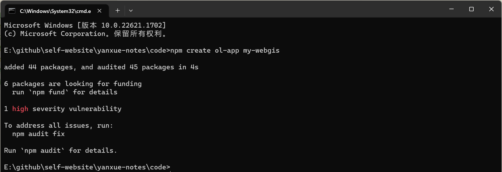

<center>图 1-1 npm 创建 openlayers 项目</center>

#### 3、启动项目

使用编辑器打开 my-webgis 目录，在创建项目时会自动生成 openlayers 所需要的一系列基础文件，如 `package.json` 文件。在编辑器中调出命令行，输入命令，启动项目。

```sh
npm start
```

- 左侧：项目目录结构
- 右侧：项目代码编辑区域
- 下方：在项目目录下启动的命令行控制台

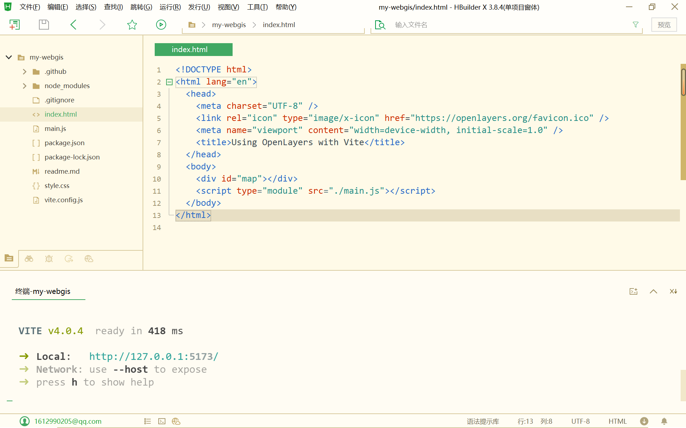

<center>图 1-2 编辑器打开项目</center>

#### 4、查看运行结果

访问项目启动后生成的链接，就可以看到项目的初始效果，如下图所示。

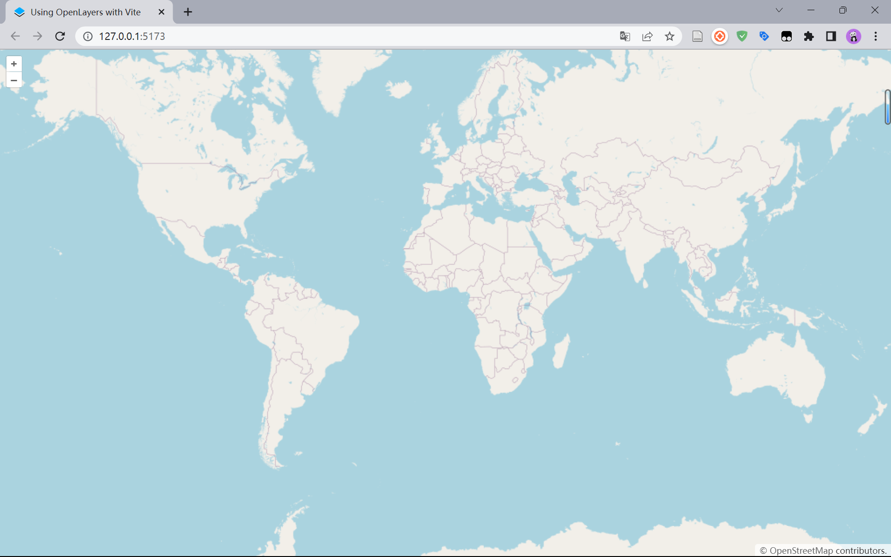

<center>图 1-3 项目初始界面</center>

### 1.2 安装配置 Geoserver

Geoserver 是用 Java 编写的开源软件服务器，在运行前需要安装配置 Java 环境。需要注意的是，Geoserver 最后一个支持 JRE8 的版本是 `2.22.x`。从 `2.23.x` 版本开始，Geoserver 需要 Java 11 或 Java 17 环境（JRE）才能运行。

#### 1、检查本机 JRE 版本

```sh
java -version
```

查询结果如下：

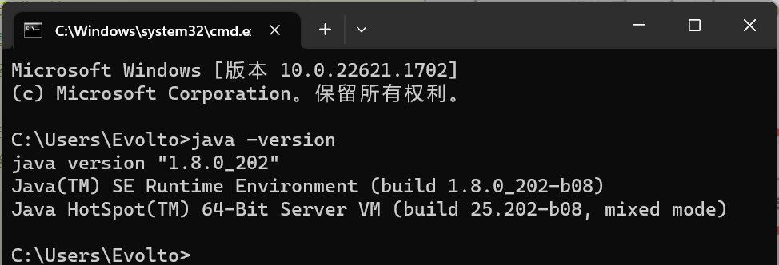

<center>图 1-4 检查 Java 环境</center>

由于当前本机的 JRE 版本是 JRE8，所以选择安装 Geoserver `2.22.3` 版本。

- 官方下载地址：(https://sourceforge.net/projects/geoserver/files/GeoServer/2.22.3/)
- 官方安装教程：(https://docs.geoserver.org/2.22.x/en/user/installation/win_installer.html)

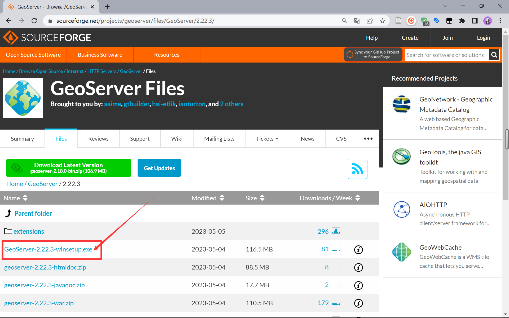

<center>图 1-5 安装 Geoserver（一）下载安装程序</center>

#### 2、安装 Geoserver | 读取 Java 目录

在安装时，会自动检测当前设备的 JRE 版本及其所在的位置，符合依赖条件才能进行下一步安装。

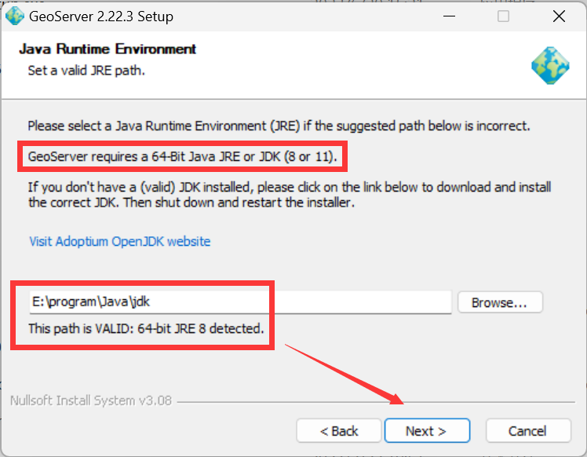

<center>图 1-6 安装 Geoserver（二）读取 Java 目录</center>

#### 3、安装 Geoserver | 设置软件目录

接下来根据本机文件结构，将 GeoServer 及其数据安装到手动设置的对应目录中。

```
E:\program\GeoServer

E:\researchData\GeoServer
```

#### 4、安装 Geoserver | 正式安装

接下来设置好管理员用户名和密码以及地图服务发布的端口号，就可以正式开始安装了。

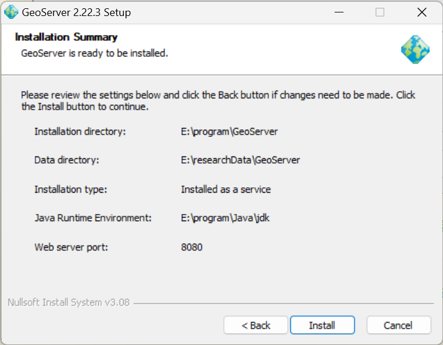

<center>图 1-7 安装 Geoserver（三）完成安装设置</center>

#### 5、安装完成

启动 Geoserver 服务后，在浏览器中输入以下地址即可访问，登录后的界面如下图所示。

```
http://localhost:8080/geoserver
```

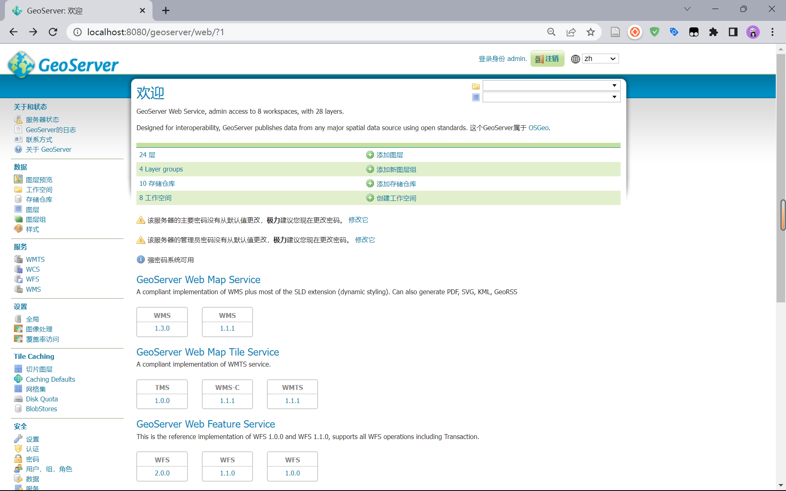

<center>图 1-8 Geoserver 服务管理界面</center>


## 2 加载 Geoserver 服务

### 2.1 查看 Geoserver 示例数据

#### 1、启动 Geoserver

启动 Geoserver 服务，打开 `http://localhost:8080/geoserver` 链接

#### 2、查看待加载图层

登录账户后，左侧 Data → Layers → Countries 图层，这是 Geoserver 在安装时自带的数据

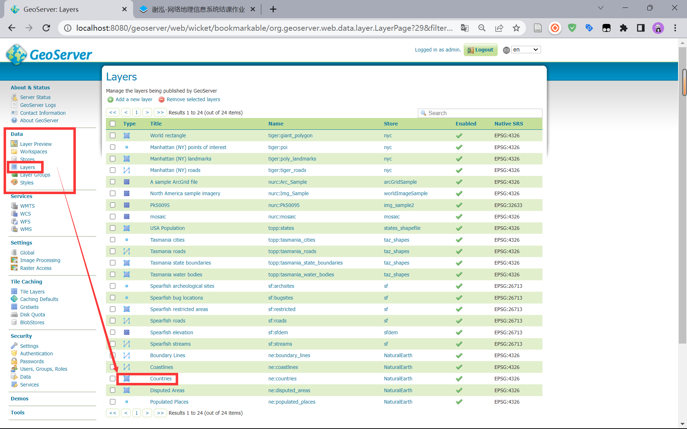

<center>图 2-1 查看 Geoserver 自带数据图层</center>

#### 3、查看待加载数据信息

进入 Countries 图层设置中，可以看到其坐标系为 `EPSG:4326`，地图范围以及属性名称。

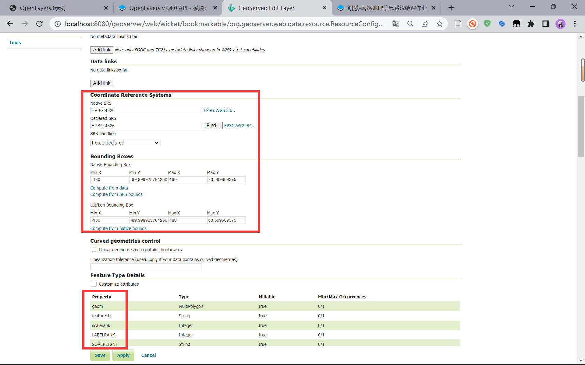

<center>图 2-2 查看 Countries 数据信息</center>

#### 4、图层预览

并且也可以在 Geoserver 中对图层数据进行预览，左侧 Data → Layer Preview → Countries → OpenLayers，即可进行数据预览。

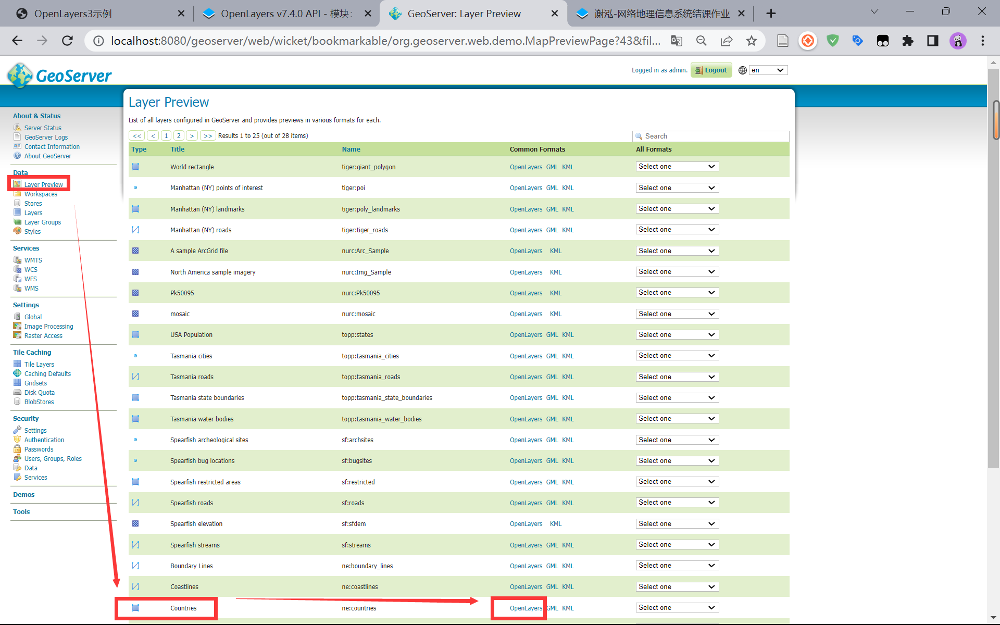

<center>图 2-3 预览 Countries 数据（一）</center>

进入预览页面，点击中国区域后，预览结果如下图所示：

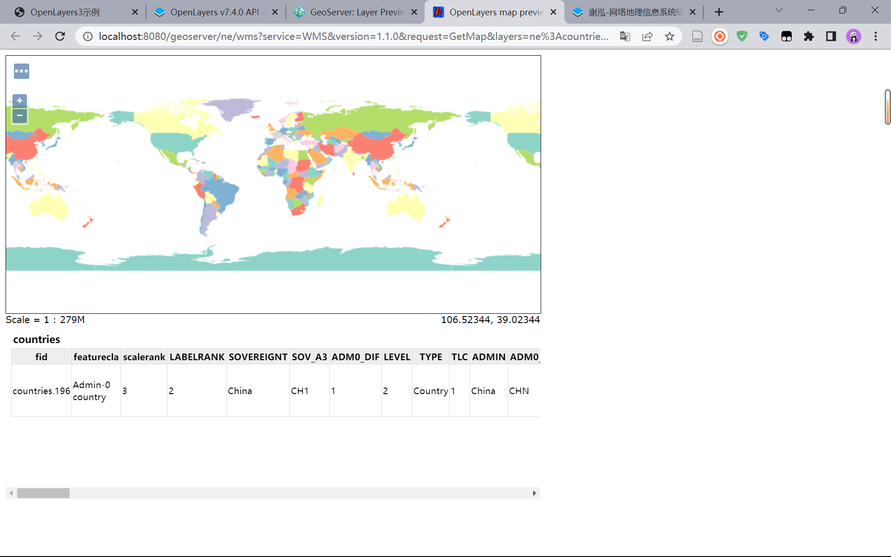

<center>图 2-4 预览 Countries 数据（二）</center>

### 2.2 加载数据

#### 1、导入相关的包

打开项目目录下的 `main.js` 文件开始编辑。

```js
import ImageLayer from 'ol/layer/Image';
import { OSM, ImageWMS } from 'ol/source';
import ZoomSlider from 'ol/control/ZoomSlider';
import { getCenter } from 'ol/extent';
```

#### 2、添加相关设置

定义并设置地图范围、地图中心点、坐标系以及基于 Geoserver 的 WMS 访问基地址。

```js
const extent = [60, -80, 160, 80];
const center = getCenter(extent);
const projection = 'EPSG:4326';
const GeoWMS = 'http://localhost:8080/geoserver/ne/wms';
```

#### 3、添加 WMS 图层

接着在 `map` 中修改 `layers` 图层设置，将其改为服务类型为 geoserver 类型，并且指定 WMS 地址且图层名为 `ne:countries` 的图层。

```js
layers: [
    new ImageLayer({
      source: new ImageWMS({
        url: GeoWMS,
        params: {
          'LAYERS': 'ne:countries',
          'TILED': true
        },
        serverType: 'geoserver'
      })
    })
  ],
```

#### 4、修改 view 视图

在进行一系列配置后，也要将视图对应的配置进行修改。

```js
view: new View({
    center: center,
    zoom: 2,
    projection: projection
}),
```

#### 5、运行项目

此时可以看到已经成功将 Geoserver 服务数据加载到了地图中。

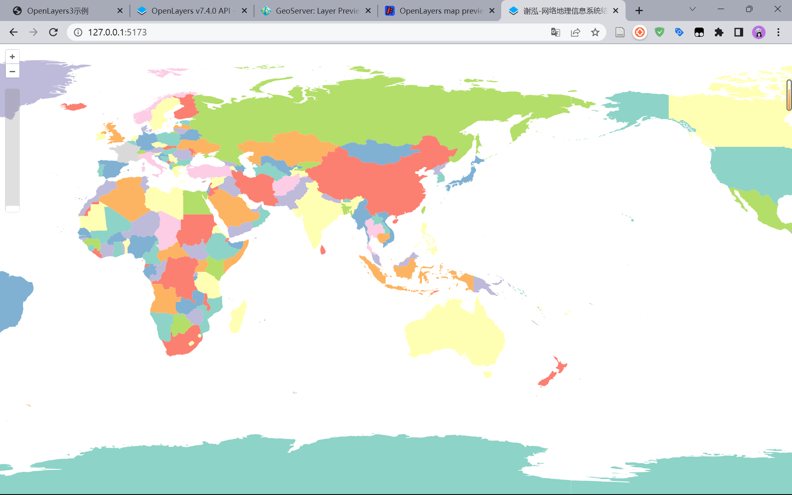

<center>图 2-5 OpenLayers 加载 Geoserver 数据</center>


## 3 交互式绘制点与面

进行交互式绘制点与面，并将绘制好的形状变成要素

### 3.1 选择绘制类型


### 3.2 控制绘制按钮


## 4 添加标注

然后在点的位置添加该点文字标准，如“海滨公园”；在多边形内部添加气泡式的提示信息。


1.点击编辑按钮，将input标签中的文本内容由readonly只读变为输入框，并且编辑按钮替换成保存按钮
2.点击保存按钮，将输入框的文本内容转化为input标签的readonly只读的文本内容，并将保存按钮替换成编辑按钮

3.以上操作，均在单击选中要素弹出气泡框后，才能使用


editMarker函数：获取当前选中的要素和弹出窗口中的input元素，将input元素的readonly属性设置为false，使其可以编辑，并且将编辑按钮隐藏，保存按钮显示。

saveMarker函数：获取当前选中的要素和弹出窗口中的input元素，将input元素的value属性赋值给要素的name属性，更新要素名称，并且将input元素的readonly属性设置为true，使其不可编辑，并且将保存按钮隐藏，编辑按钮显示。


