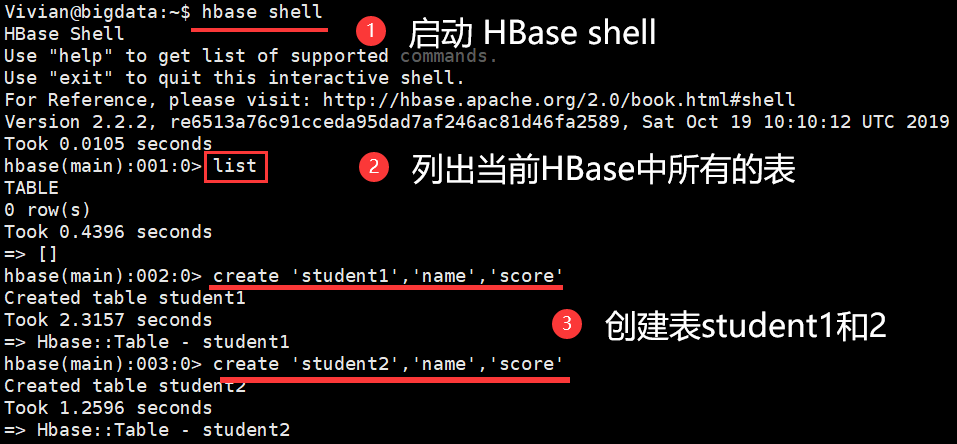
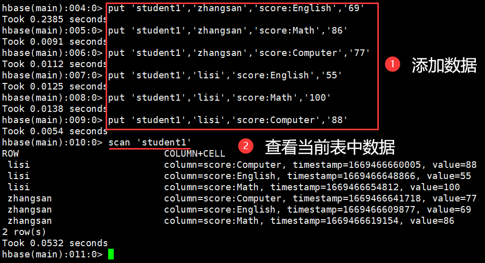
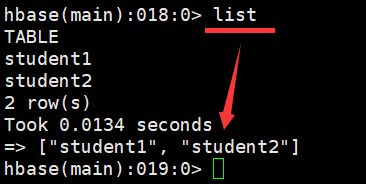
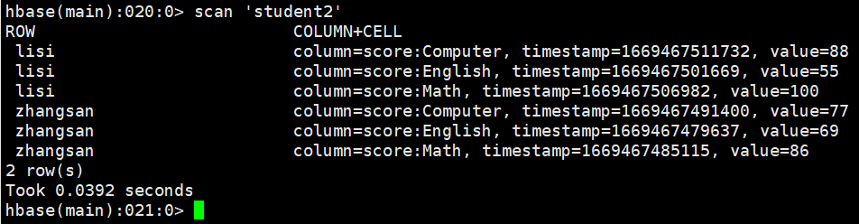
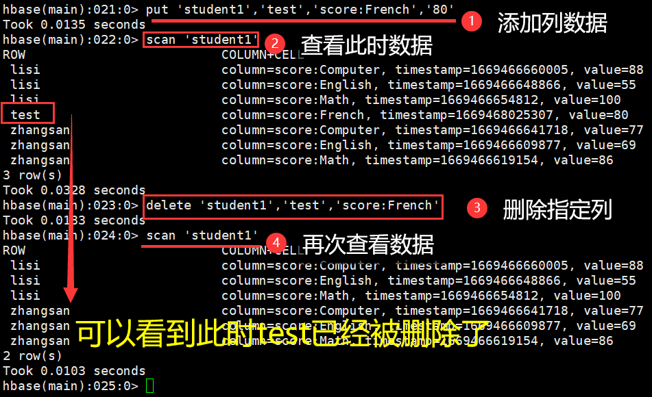
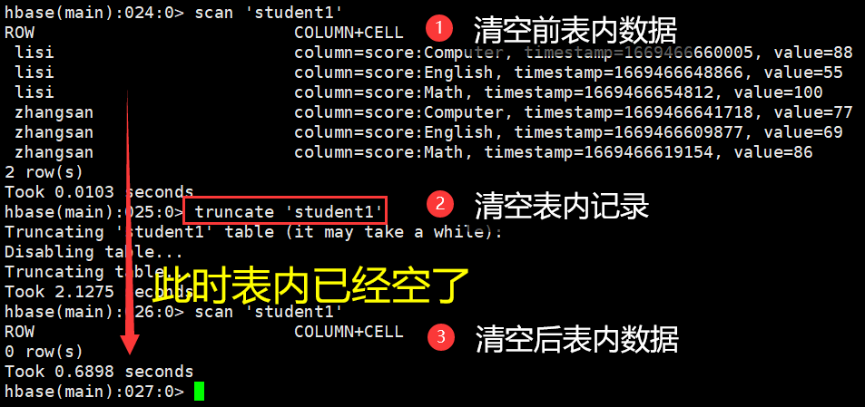
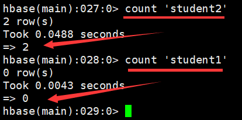

# 练习二：熟悉常用的 HBase 操作

- 完成时间：2022-11-21（第 13 周周一）至 2022-11-27（第 13 周周五）
- [练习二 - 准备工作](./practice02-1.md)

## 参考
1. [厦门大学林子雨老师 - 大数据原理与应用 第四章 分布式数据库HBase 学习指南](https://dblab.xmu.edu.cn/blog/588/)
1. [CSDN - 实验3 熟悉常用的HBase操作](https://blog.csdn.net/Alicia_LX/article/details/120963072)
1. [CSDN - Hbase使用CopyTable进行数据复制和迁移](https://blog.csdn.net/lp840312696/article/details/123137367)


## 一、实验目的

1. 理解 HBase 在 Hadoop 体系结构中的角色
2. 熟练使用 HBase 操作常用的 Shell 命令
3. 熟悉 HBase 操作常用的 Java API


## 二、实验平台

1. 服务器：本地虚拟机 `VMware Workstation 16.2.4`
2. 操作系统：`Ubuntu-20.04.5-desktop-amd64`
3. 连接软件：`Xshell7`，`Xftp7`
4. JAVA 环境：`jdk-8u162-linux-x64`，`Eclipse-4.7.0`
5. 大数据软件：`hadoop-3.1.3`，`hbase-2.2.2`


## 三、实验内容

### 3.1 编程实现以下指定功能，并用 Hadoop 提供的 HBase Shell 命令完成相同任务

#### 3.1.0 操作准备

&emsp;&emsp;接下来我们将用 JAVA API 和 HBase Shell 两种方式来操作以下表格，所以在开始操作之前，我们需要建立两张表 student1 和 student2：

- 表 student1 用于操作
- 表 student2 用于数据查询

<center>表 3-1 student1 表</center>

|          |         | score |          |
| :------: | :-----: | :---: | :------: |
|   name   | English | Math  | Computer |
| zhangsan |   69    |  86   |    77    |
|   lisi   |   55    |  100  |    88    |

<center>表 3-2 student2 表</center>

|          |         | score |          |
| :------: | :-----: | :---: | :------: |
|   name   | English | Math  | Computer |
| zhangsan |   69    |  86   |    77    |
|   lisi   |   55    |  100  |    88    |

> 创建表 student1, 其中有名为 name 和 score 的列

```sh
create 'student1','name','score'
```

> 创建表 student2, 同 student1

```sh
create 'student2','name','score'
```



<center>图 3-1 创建数据表</center>

>向表 student1 中添加数据

```sh
put 'student1','zhangsan','score:English','69'
put 'student1','zhangsan','score:Math','86'
put 'student1','zhangsan','score:Computer','77'
put 'student1','lisi','score:English','55'
put 'student1','lisi','score:Math','100'
put 'student1','lisi','score:Computer','88'
```

> 查看添加后表 student1 中的数据

```sh
scan 'student1'
```



<center>图 3-2 添加并查看表 student1 中数据</center>

> 向表 student2 中添加数据

```sh
put 'student2','zhangsan','score:English','69'
put 'student2','zhangsan','score:Math','86'
put 'student2','zhangsan','score:Computer','77'
put 'student2','lisi','score:English','55'
put 'student2','lisi','score:Math','100'
put 'student2','lisi','score:Computer','88'
```

> 查看添加后表 student2 中的数据

```sh
scan 'student2'
```

#### 3.1.1 列出 HBase 所有的表的相关信息，例如表名

> JAVA 实现

```java
//列出HBase所有的表的相关信息，例如表名、创建时间等
public static void listTables() throws IOException {
    init();//建立连接
    List<TableDescriptor> tableDescriptors = admin.listTableDescriptors();
    for (TableDescriptor tableDescriptor : tableDescriptors) {
        TableName tableName = tableDescriptor.getTableName();
        System.out.println("Table:"+tableName);
    }
    close();//关闭连接
}	
```

> HBase Shell 实现

```sh
list
```



<center>图 3-3 查看当前 HBase 中所有表的信息</center>

#### 3.1.2 在终端打印出指定的表的所有记录数据

> JAVA 实现

```java
//在终端打印出指定的表的所有记录数据
public static void getData(String tableName) throws IOException {
    init();
    Table table = connection.getTable(TableName.valueOf(tableName));
    Scan scan = new Scan();
    ResultScanner scanner = table.getScanner(scan);//获取行的遍历器
    for (Result result:scanner) {
        printRecoder(result);
    }
    close();
}

//打印一条记录的详情
private static void printRecoder(Result result) {
    // TODO Auto-generated method stub
    for(Cell cell:result.rawCells()) {
        String str1 = Bytes.toString(cell.getRowArray(),cell.getRowOffset(),cell.getRowLength());
        System.out.println("行键："+ str1);
        String str2 = Bytes.toString(cell.getFamilyArray(),cell.getFamilyOffset(),cell.getFamilyLength());
        System.out.println("列簇：" + str2);
        String str3 = Bytes.toString(cell.getQualifierArray(),cell.getQualifierOffset(),cell.getQualifierLength());
        System.out.println("列：" + str3);
        String str4 = Bytes.toString(cell.getValueArray(),cell.getValueOffset(),cell.getValueLength());
        System.out.println("值：" + str4);
        System.out.println("时间戳：" + cell.getTimestamp());
    }
}
```

> HBase Shell 实现

```sh
scan 'student1'
```


<center>图 3-4 查看 student1 表中所有记录数据</center>

```sh
scan 'student2'
```



<center>图 3-5 查看 student2 表中所有记录数据</center>

#### 3.1.3 向已经创建好的表添加和删除指定的列族或列

> JAVA 实现

```java
//向已经创建好的表添加和删除指定的列簇或列

//向表添加数据
public static void insterRow(String tableName,String rowKey,String colFamily,String col,String val) throws IOException {
    init();
    Table table = connection.getTable(TableName.valueOf(tableName));
    Put put = new Put(rowKey.getBytes());
    put.addColumn(colFamily.getBytes(), col.getBytes(), val.getBytes());
    table.put(put);
    table.close();
    close();
}

//删除数据
public static void deleRow(String tableName,String rowKey,String colFamily,String col) throws IOException {
    init();
    Table table = connection.getTable(TableName.valueOf(tableName));
    Delete delete = new Delete(rowKey.getBytes());
    //删除指定列簇
    delete.addFamily(Bytes.toBytes(colFamily));
    //删除指定列
    delete.addColumn(Bytes.toBytes(colFamily),Bytes.toBytes(col));
    table.delete(delete);
    table.close();
    close();
}
```

> HBase Shell 实现

- 向表 student1 中添加测试列 French

```sh
put 'student1','test','score:French','80'
scan 'student1'
```

- 删除表 student1 中指定的列 French

```sh
delete 'student1','test','score:French'
scan 'student1'
```



<center>图 3-6 添加和删除指定的列</center>

#### 3.1.4 清空指定的表的所有记录数据
> JAVA 实现

```java
//清空指定的表的所有记录数据
public static void clearRows(String tableName) throws IOException {
    init();
    TableName tablename = TableName.valueOf(tableName);
    admin.disableTable(tablename);
    System.out.println("disable...delete...");
    admin.deleteTable(tablename);
    System.out.println("delete...over...create");
    TableDescriptorBuilder tableDescriptor = TableDescriptorBuilder.newBuilder(tablename);
    ColumnFamilyDescriptor colFamilyDes=ColumnFamilyDescriptorBuilder.newBuilder(" ".getBytes()).build();
    tableDescriptor.setColumnFamily(colFamilyDes).build();
    admin.createTable(tableDescriptor.build());

    close();
}
```

> HBase Shell 实现

- 清空 student1 表内记录

```sh
truncate 'student1'
```

- 查看清空后的结果

```sh
scan 'student1'
```



<center>图 3-7 清空表内记录</center>

#### 3.1.5 统计表的行数

> JAVA 实现

```java
//统计表的行数
public static void countRows(String tableName) throws IOException {
    init();
    Table table = connection.getTable(TableName.valueOf(tableName));
    Scan scan = new Scan();
    ResultScanner scanner = table.getScanner(scan);
    int num = 0;
    for (Result result = scanner.next();result!=null;result=scanner.next()) {
        num++;
    }
    System.out.println("行数：" + num);
    scanner.close();
    close();
}
```

> HBase Shell 实现

- 查询表 student2 的行数

```sh
count 'student2'
```



<center>图 3-8 统计表的行数</center>

#### 3.1.6 全部代码

```java
import java.io.IOException;
import java.util.List;

import org.apache.hadoop.conf.Configuration;
import org.apache.hadoop.hbase.client.*;
import org.apache.hadoop.hbase.util.Bytes;
import org.apache.hadoop.hbase.*;

public class Test {

    public static Configuration configuration;
    public static Connection connection;
    public static Admin admin;

    // 建立连接
    public static void init() {
        configuration = HBaseConfiguration.create();
        configuration.set("hbase.rootdir", "hdfs://localhost:9000/hbase");
        try {
            connection = ConnectionFactory.createConnection(configuration);
            admin = connection.getAdmin();
        } catch (IOException e) {
            // TODO: handle exception
            e.printStackTrace();
        }
    }

    // 关闭连接
    public static void  close() {
        try {
            if (admin != null) {
                admin.close();
            }
            if (null != connection) {
                connection.close();
            }
        } catch (IOException e) {
            // TODO: handle exception
            e.printStackTrace();
        }
    }

    // 列出HBase所有的表的相关信息，例如表名、创建时间等
    public static void listTables() throws IOException {
        init();//建立连接
        List<TableDescriptor> tableDescriptors = admin.listTableDescriptors();
        for (TableDescriptor tableDescriptor : tableDescriptors) {
            TableName tableName = tableDescriptor.getTableName();
            System.out.println("Table:"+tableName);
        }
        close();//关闭连接
    }

    // 在终端打印出指定的表的所有记录数据
    public static void getData(String tableName) throws IOException {
        init();
        Table table = connection.getTable(TableName.valueOf(tableName));
        Scan scan = new Scan();
        ResultScanner scanner = table.getScanner(scan);//获取行的遍历器
        for (Result result:scanner) {
            printRecoder(result);
        }
        close();
    }

    // 打印一条记录的详情
    private static void printRecoder(Result result) {
        // TODO Auto-generated method stub
        for(Cell cell:result.rawCells()) {
            String str1 = Bytes.toString(cell.getRowArray(),cell.getRowOffset(),cell.getRowLength());
            System.out.println("行键："+ str1);
            String str2 = Bytes.toString(cell.getFamilyArray(),cell.getFamilyOffset(),cell.getFamilyLength());
            System.out.println("列簇：" + str2);
            String str3 = Bytes.toString(cell.getQualifierArray(),cell.getQualifierOffset(),cell.getQualifierLength());
            System.out.println("列：" + str3);
            String str4 = Bytes.toString(cell.getValueArray(),cell.getValueOffset(),cell.getValueLength());
            System.out.println("值：" + str4);
            System.out.println("时间戳：" + cell.getTimestamp());
        }
    }

    // 向已经创建好的表添加和删除指定的列簇或列

    // 向表添加数据
    public static void insterRow(String tableName,String rowKey,String colFamily,String col,String val) throws IOException {
        init();
        Table table = connection.getTable(TableName.valueOf(tableName));
        Put put = new Put(rowKey.getBytes());
        put.addColumn(colFamily.getBytes(), col.getBytes(), val.getBytes());
        table.put(put);
        table.close();
        close();
    }

    // 删除数据
    public static void deleRow(String tableName,String rowKey,String colFamily,String col) throws IOException {
        init();
        Table table = connection.getTable(TableName.valueOf(tableName));
        Delete delete = new Delete(rowKey.getBytes());
        //删除指定列簇
        delete.addFamily(Bytes.toBytes(colFamily));
        //删除指定列
        delete.addColumn(Bytes.toBytes(colFamily),Bytes.toBytes(col));
        table.delete(delete);
        table.close();
        close();
    }

    // 清空指定的表的所有记录数据
    public static void clearRows(String tableName) throws IOException {
        init();
        TableName tablename = TableName.valueOf(tableName);
        admin.disableTable(tablename);
        System.out.println("disable...delete...");
        admin.deleteTable(tablename);
        System.out.println("delete...over...create");
        TableDescriptorBuilder tableDescriptor = TableDescriptorBuilder.newBuilder(tablename);
        ColumnFamilyDescriptor colFamilyDes=ColumnFamilyDescriptorBuilder.newBuilder(" ".getBytes()).build();
        tableDescriptor.setColumnFamily(colFamilyDes).build();
        admin.createTable(tableDescriptor.build());

        close();
    }

    // 统计表的行数
    public static void countRows(String tableName) throws IOException {
        init();
        Table table = connection.getTable(TableName.valueOf(tableName));
        Scan scan = new Scan();
        ResultScanner scanner = table.getScanner(scan);
        int num = 0;
        for (Result result = scanner.next();result!=null;result=scanner.next()) {
            num++;
        }
        System.out.println("行数：" + num);
        scanner.close();
        close();
    }

    public static void main(String[] args) throws IOException {
        // TODO Auto-generated method stub
        // listTables();
        // getData("teacher");
        // getData("student");
        // deleRow("s1", "lisi", "score", "English");
        // clearRows("s1");
        // countRows("s2");
        // insterRow("s2", "xiaohong", "score", "Computer", "60");
    }
}
```

### 3.2 HBase 数据库操作（内容可以自定）

#### 3.2.0 操作要求

1. 现有以下关系型数据库中的表和数据，要求将其转换为适合于HBase存储的表并插入数据：

<center>表 3-1 学生表（Student）</center>

| 学号（S_No） | 姓名（S_Name） | 性别（S_Sex） | 年龄（S_Age） |
| :----------: | :------------: | :-----------: | :-----------: |
|   2015001    |    Zhangsan    |     male      |      23       |
|   2015003    |      Mary      |    female     |      22       |
|   2015003    |      Lisi      |     male      |      24       |

 

<center>表 3-2 课程表（Course）</center>

| 课程号（C_No） | 课程名（C_Name） | 学分（C_Credit） |
| :------------: | :--------------: | :--------------: |
|     123001     |       Math       |       2.0        |
|     123002     | Computer Science |       5.0        |
|     123003     |     English      |       3.0        |

 

<center>表 3-3 选课表（SC）</center>

| 学号（SC_Sno） | 课程号（SC_Cno） | 成绩（SC_Score） |
| :------------: | :--------------: | :--------------: |
|    2015001     |      123001      |        86        |
|    2015001     |      123003      |        69        |
|    2015002     |      123002      |        77        |
|    2015002     |      123003      |        99        |
|    2015003     |      123001      |        98        |
|    2015003     |      123002      |        95        |

2. 同时，编程实现以下功能：

（1）`createTable(String tableName, String[] fields)`

- 创建表，参数tableName为表的名称，字符串数组fields为存储记录各个字段名称的数组。要求当HBase已经存在名为tableName的表的时候，先删除原有的表，然后再创建新的表。

（2）`addRecord(String tableName, String row, String[] fields, String[] values)`

- 向表tableName、行row（用S_Name表示）和字符串数组fields指定的单元格中添加对应的数据values。其中，fields中每个元素如果对应的列族下还有相应的列限定符的话，用“columnFamily:column”表示。例如，同时向“Math”、“Computer Science”、“English”三列添加成绩时，字符串数组fields为{“Score:Math”, ”Score:Computer Science”, ”Score:English”}，数组values存储这三门课的成绩。

（3）`scanColumn(String tableName, String column)`

- 浏览表tableName某一列的数据，如果某一行记录中该列数据不存在，则返回null。要求当参数column为某一列族名称时，如果底下有若干个列限定符，则要列出每个列限定符代表的列的数据；当参数column为某一列具体名称（例如 `Score:Math` ）时，只需要列出该列的数据。

（4）`modifyData(String tableName, String row, String column)`

- 修改表tableName，行row（可以用学生姓名S_Name表示），列column指定的单元格的数据。

（5）`deleteRow(String tableName, String row)`

- 删除表tableName中row指定的行的记录。

#### 3.2.1 创建表函数

```java
/*createTable(String tableName, String[] fields)
	创建表，参数tableName为表的名称，字符串数组fields为存储记录各个域名称的数组。
	要求当HBase已经存在名为tableName的表的时候，先删除原有的表，然后再创建新的表。
    */
    public static void createTable(String tableName,String[] fields) throws IOException {

        init();
        TableName tablename = TableName.valueOf(tableName);

        if(admin.tableExists(tablename)){
            System.out.println("table is exists!");
            admin.disableTable(tablename);
            admin.deleteTable(tablename);//删除原来的表
            System.out.println("删除成功！");
        }

        System.out.println("开始创建表...");
        List<ColumnFamilyDescriptor> colFamilyList=new ArrayList<>();
        TableDescriptorBuilder tableDescriptor = TableDescriptorBuilder.newBuilder(tablename);
        for(String str:fields) {
            ColumnFamilyDescriptor colFamilyDes=ColumnFamilyDescriptorBuilder.newBuilder(Bytes.toBytes(str)).build();
            colFamilyList.add(colFamilyDes);
        }
        TableDescriptor tableDes=tableDescriptor.setColumnFamilies(colFamilyList).build();
        admin.createTable(tableDes);
        System.out.println(tableName+"创建成功！");
        close();
    }
```


#### 3.2.2 添加指定单元格数据函数

```java
/*addRecord(String tableName, String row, String[] fields, String[] values)
	向表tableName、行row（用S_Name表示）和字符串数组files指定的单元格中添加对应的数据values。
	其中fields中每个元素如果对应的列族下还有相应的列限定符的话，用“columnFamily:column”表示。
	例如，同时向“Math”、“Computer Science”、“English”三列添加成绩时，字符串数组
	fields为{“Score:Math”,”Score:Computer Science”,”Score:English”}，数组values存储这三门课的成绩。
    */
    public static void addRecord(String tableName,String row,String[] fields,String[] values) throws IOException {
        init();
        Table table = connection.getTable(TableName.valueOf(tableName));
        System.out.println("准备添加数据...");
        for(int i = 0;i != fields.length;i++){
            Put put = new Put(row.getBytes());
            String[] cols = fields[i].split(":");
            put.addColumn(cols[0].getBytes(),cols[1].getBytes(), values[i].getBytes());
            System.out.println(i+"put..."+i);
            table.put(put);
            System.out.println(i+"...ok");
        }
        table.close();

        close();
    }
```


#### 3.2.3 查看指定某列数据函数

```java
/* scanColumn(String tableName, String column)
	浏览表tableName某一列的数据，如果某一行记录中该列数据不存在，则返回null。
	要求当参数column为某一列族名称时，如果底下有若干个列限定符，则要列出每个列限定符代表的列的数据；
	当参数column为某一列具体名称（例如“Score:Math”）时，只需要列出该列的数据。
    */
    public static void scanColumn(String tableName,String column)throws  IOException{
        init();
        Table table = connection.getTable(TableName.valueOf(tableName));
        Scan scan = new Scan();
        scan.addFamily(Bytes.toBytes(column));
        ResultScanner scanner = table.getScanner(scan);
        for (Result result = scanner.next(); result != null; result = scanner.next()){
            showCell(result);
        }
        table.close();
        close();
    }
    //格式化输出
    public static void showCell(Result result){
        Cell[] cells = result.rawCells();
        for(Cell cell:cells){
            System.out.println("RowName:"+new String(Bytes.toString(cell.getRowArray(),cell.getRowOffset(), cell.getRowLength()))+" ");
            System.out.println("Timetamp:"+cell.getTimestamp()+" ");
            System.out.println("column Family:"+new String(Bytes.toString(cell.getFamilyArray(),cell.getFamilyOffset(), cell.getFamilyLength()))+" ");
            System.out.println("row Name:"+new String(Bytes.toString(cell.getQualifierArray(),cell.getQualifierOffset(), cell.getQualifierLength()))+" ");
            System.out.println("value:"+new String(Bytes.toString(cell.getValueArray(),cell.getValueOffset(), cell.getValueLength()))+" ");           
        }
    }
```

#### 3.2.4 修改表函数

```java
/* modifyData(String tableName, String row, String column)
	修改表tableName，行row（可以用学生姓名S_Name表示），列column指定的单元格的数据。*/
    public static void modifyData(String tableName,String row,String column,String val)throws IOException{
        init();
        Table table = connection.getTable(TableName.valueOf(tableName));
        Put put = new Put(row.getBytes());
        String[] col = column.split(":");
        put.addColumn(col[0].getBytes(),col[1].getBytes(),val.getBytes());
        table.put(put);
        table.close();
        close();
    }
```

#### 3.2.5 删除指定行数据函数

```java
/* deleteRow(String tableName, String row)
	删除表tableName中row指定的行的记录。*/
    public static void deleteRow(String tableName,String row)throws IOException{
        init();
        Table table = connection.getTable(TableName.valueOf(tableName));
        Delete delete = new Delete(row.getBytes());        
        table.delete(delete);
        table.close();
        close();
    }
```

#### 3.2.6 全部代码

```java
import org.apache.hadoop.conf.Configuration;
import org.apache.hadoop.hbase.*;
import org.apache.hadoop.hbase.client.*;
import org.apache.hadoop.hbase.util.Bytes;


import java.io.IOException;
import java.util.ArrayList;
import java.util.List;

public class Test2 {
    public static Configuration configuration;
    public static Connection connection;
    public static Admin admin;

    //建立连接
    public static void init(){
        configuration  = HBaseConfiguration.create();
        configuration.set("hbase.rootdir","hdfs://localhost:9000/hbase");
        try{
            connection = ConnectionFactory.createConnection(configuration);
            admin = connection.getAdmin();
        }catch (IOException e){
            e.printStackTrace();
        }
    }

    //关闭连接
    public static void close(){
        try{
            if(admin != null){
                admin.close();
            }
            if(null != connection){
                connection.close();
            }
        }catch (IOException e){
            e.printStackTrace();
        }
    }
    /* createTable(String tableName, String[] fields)
	创建表，参数tableName为表的名称，字符串数组fields为存储记录各个域名称的数组。
	要求当HBase已经存在名为tableName的表的时候，先删除原有的表，然后再创建新的表。
    */
    public static void createTable(String tableName,String[] fields) throws IOException {

        init();
        TableName tablename = TableName.valueOf(tableName);

        if(admin.tableExists(tablename)){
            System.out.println("table is exists!");
            admin.disableTable(tablename);
            admin.deleteTable(tablename);//删除原来的表
            System.out.println("删除成功！");
        }

        System.out.println("开始创建表...");
        List<ColumnFamilyDescriptor> colFamilyList=new ArrayList<>();
        TableDescriptorBuilder tableDescriptor = TableDescriptorBuilder.newBuilder(tablename);
        for(String str:fields) {
            ColumnFamilyDescriptor colFamilyDes=ColumnFamilyDescriptorBuilder.newBuilder(Bytes.toBytes(str)).build();
            colFamilyList.add(colFamilyDes);
        }
        TableDescriptor tableDes=tableDescriptor.setColumnFamilies(colFamilyList).build();
        admin.createTable(tableDes);
        System.out.println(tableName+"创建成功！");
        close();
    }


    /* addRecord(String tableName, String row, String[] fields, String[] values)
	向表tableName、行row（用S_Name表示）和字符串数组files指定的单元格中添加对应的数据values。
	其中fields中每个元素如果对应的列族下还有相应的列限定符的话，用“columnFamily:column”表示。
	例如，同时向“Math”、“Computer Science”、“English”三列添加成绩时，字符串数组
	fields为{“Score:Math”,”Score:Computer Science”,”Score:English”}，数组values存储这三门课的成绩。
    */
    public static void addRecord(String tableName,String row,String[] fields,String[] values) throws IOException {
        init();
        Table table = connection.getTable(TableName.valueOf(tableName));
        System.out.println("准备添加数据...");
        for(int i = 0;i != fields.length;i++){
            Put put = new Put(row.getBytes());
            String[] cols = fields[i].split(":");
            put.addColumn(cols[0].getBytes(),cols[1].getBytes(), values[i].getBytes());
            System.out.println(i+"put..."+i);
            table.put(put);
            System.out.println(i+"...ok");
        }
        table.close();

        close();
    }
    /* scanColumn(String tableName, String column)
	浏览表tableName某一列的数据，如果某一行记录中该列数据不存在，则返回null。
	要求当参数column为某一列族名称时，如果底下有若干个列限定符，则要列出每个列限定符代表的列的数据；
	当参数column为某一列具体名称（例如“Score:Math”）时，只需要列出该列的数据。
    */
    public static void scanColumn(String tableName,String column)throws  IOException{
        init();
        Table table = connection.getTable(TableName.valueOf(tableName));
        Scan scan = new Scan();
        scan.addFamily(Bytes.toBytes(column));
        ResultScanner scanner = table.getScanner(scan);
        for (Result result = scanner.next(); result != null; result = scanner.next()){
            showCell(result);
        }
        table.close();
        close();
    }
    //格式化输出
    public static void showCell(Result result){
        Cell[] cells = result.rawCells();
        for(Cell cell:cells){
            System.out.println("RowName:"+new String(Bytes.toString(cell.getRowArray(),cell.getRowOffset(), cell.getRowLength()))+" ");
            System.out.println("Timetamp:"+cell.getTimestamp()+" ");
            System.out.println("column Family:"+new String(Bytes.toString(cell.getFamilyArray(),cell.getFamilyOffset(), cell.getFamilyLength()))+" ");
            System.out.println("row Name:"+new String(Bytes.toString(cell.getQualifierArray(),cell.getQualifierOffset(), cell.getQualifierLength()))+" ");
            System.out.println("value:"+new String(Bytes.toString(cell.getValueArray(),cell.getValueOffset(), cell.getValueLength()))+" ");           
        }
    }
    /* modifyData(String tableName, String row, String column)
	修改表tableName，行row（可以用学生姓名S_Name表示），列column指定的单元格的数据。*/
    public static void modifyData(String tableName,String row,String column,String val)throws IOException{
        init();
        Table table = connection.getTable(TableName.valueOf(tableName));
        Put put = new Put(row.getBytes());
        String[] col = column.split(":");
        put.addColumn(col[0].getBytes(),col[1].getBytes(),val.getBytes());
        table.put(put);
        table.close();
        close();
    }
    /* deleteRow(String tableName, String row)
	删除表tableName中row指定的行的记录。*/
    public static void deleteRow(String tableName,String row)throws IOException{
        init();
        Table table = connection.getTable(TableName.valueOf(tableName));
        Delete delete = new Delete(row.getBytes());        
        table.delete(delete);
        table.close();
        close();
    }

    public static void main(String[] args)throws IOException{
        //      scanColumn("s1","score");
        //    	String[] fields = {"score"};
        //    	createTable("s1",fields);
        String tableName = "s1";
        String row = "001";
        //    	String[] fields = {"score:Math", "score:Computer Science", "score:English"};
        //    	String[] values = {"100","80","60"};
        //    	addRecord(tableName,row,fields,values);
        //    	scanColumn(tableName,"score");
        //    	String column = "score:English";
        //    	String val = "70";
        //    	modifyData(tableName,row, column, val);
        deleteRow(tableName,row);
    }
}
```

