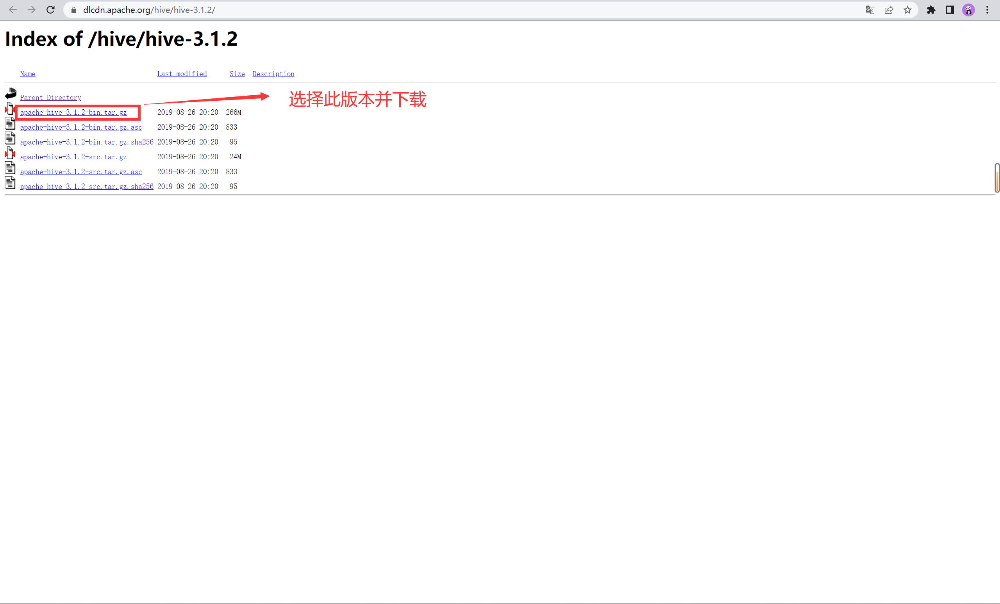
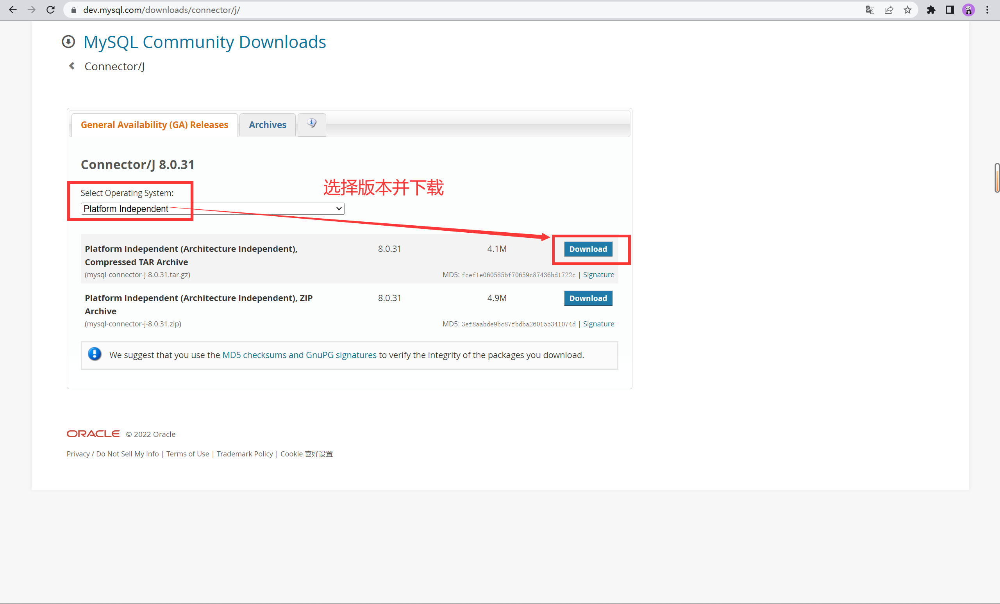
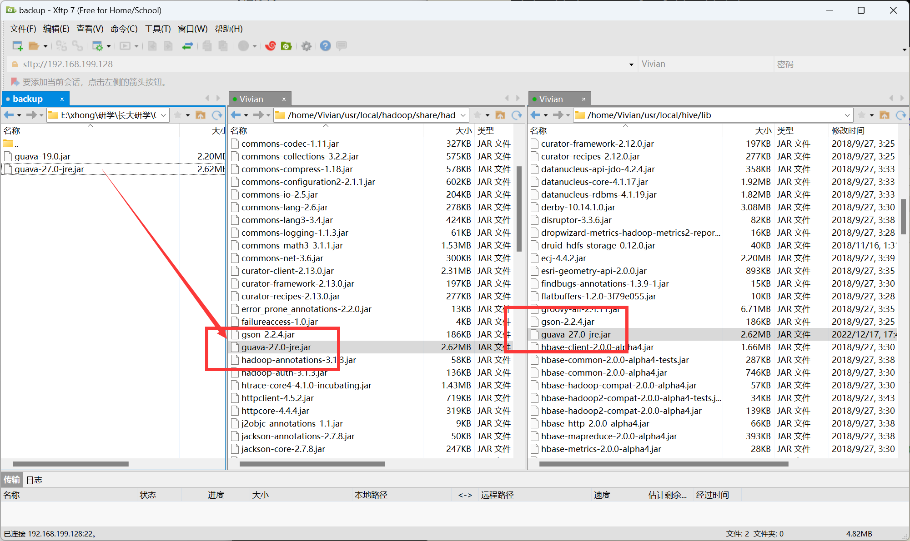

# 练习五：安装并使用 HIVE


## 参考资料

1. [windows下大数据开发环境搭建（5）——Hive环境搭建](http://wjhsh.net/JasonCeng-p-14224346.html)
1. [Hive3.1.2安装指南 - 厦门大学林子雨老师](https://dblab.xmu.edu.cn/blog/2440/)
1. [实验1 Hive 安装部署 - CSDN](https://blog.csdn.net/Alicia_LX/article/details/128100879)
1. [Ubuntu彻底卸载MySQL - CSDN](https://blog.csdn.net/weixin_46272577/article/details/124564640)
1. [数据库初始化设置密码时报错"SET PASSWORD has no significance for user 'root'@'localhost' as the authentication met... - CSDN](https://blog.csdn.net/weixin_43279138/article/details/126872698)
1. [Ubuntu20.04上安装MySQL8.0（绝对保证能够正常使用）](https://www.cnblogs.com/RioTian/p/16066917.html)


## 一、实验目的

1. 安装 HIVE
2. 使用 HIVE 进行简单操作


## 二、实验环境

1. 操作系统：`Ubuntu20.04.5`
2. 开发环境：`JDK1.8` ，`Hadoop3.1.3` ，`MySQL8.0.31`，`HIVE3.1.2`


## 三、实验内容和要求

### 1 下载并上传安装包

#### 1.1 下载 HIVE 安装包

- 下载地址：https://dlcdn.apache.org/hive/hive-3.1.2/



<center>图 1-1 下载 HIVE 3.1.2</center>

#### 1.2 下载 MySQL JDBC 包

- 官网下载地址：https://dev.mysql.com/downloads/connector/j/



<center>图 1-2 下载 MySQL JDBC 包</center>

#### 1.3 上传安装包


<center>图 1-3 上传安装包</center>

### 2 安装并配置 HIVE

#### 2.1 安装 HIVE

> 解压到当前用户的 `usr/local` 中

```sh
tar -zxvf ~/Downloads/apache-hive-3.1.2-bin.tar.gz -C ~/usr/local
```

> 切换目录

```sh
cd ~/usr/local
```

> 修改文件名

```sh
mv apache-hive-3.1.2-bin hive
```

#### 2.2 配置环境变量

> 修改环境变量文件

```sh
vim ~/.bashrc
```

> 添加 HIVE 安装路径

```sh
export HIVE_HOME=/home/Vivian/usr/local/hive
```

> 在 Path 中添加

```sh
export PATH=$PATH:$HIVE_HOME/bin
```

&emsp;&emsp;在完成上述操作后的环境变量文件至少应包含以下信息：JAVA、Hadoop、HIVE（缺一不可）。


<center>图 2-1 环境变量文件内容</center>

> 配置生效

```sh
source ~/.bashrc
```

#### 2.3 修改 HIVE 配置

> 切换到 HIVE 配置目录

！！注：接下来的操作都是在此目录下进行的。

```sh
cd ~/usr/local/hive/conf
```

> 重命名文件

```sh
mv hive-default.xml.template hive-default.xml
```

> 新建 `hive-site.xml`

```sh
vim hive-site.xml
```

- 输入以下内容后，保存并退出。

```xml
<?xml version="1.0" encoding="UTF-8" standalone="no"?>
<?xml-stylesheet type="text/xsl" href="configuration.xsl"?>
<configuration>
    <property>
        <name>hive.metastore.schema.verification</name>
        <value>false</value>
    </property>
  <!-- 存储在 HDFS 上的数据路径 -->
    <property>
        <name>hive.metastore.warehouse.dir</name>
        <value>/home/Vivian/usr/local/hive/warehouse</value>
    </property>
    <property>
        <name>hive.exec.scratchdir</name>
        <value>/home/Vivian/usr/local/hive/tmp/</value>
    </property>
  <!-- 本地mysql 配置 -->
    <property>
        <name>javax.jdo.option.ConnectionURL</name>
        <value>jdbc:mysql://localhost:3306/hive?createDatabaseIfNotExist=true</value>
        <description>JDBC connect string for a JDBC metastore</description>
    </property>
    <property>
        <name>javax.jdo.option.ConnectionUserName</name>
        <value>root</value>
        <description>username to use against metastore database</description>
    </property>
    <property>
        <name>javax.jdo.option.ConnectionPassword</name>
        <value>123qwe</value>
        <description>password to use against metastore database</description>
    </property>
</configuration>
```

> 配置 `hive-env.sh` 文件

```sh
cp hive-env.sh.template hive-env.sh
```

1. 编辑文件

```sh
vim hive-env.sh
```

2. 输入以下内容后，保存并退出

```sh
# 配置 Hadoop 安装路径
export HADOOP_HOME=/home/Vivian/usr/local/hadoop
# 配置 Hive 配置文件存放路径为 conf
export HIVE_CONF_DIR=/home/Vivian/usr/local/hive/conf
# 配置 Hive 运行资源库路径为 lib
export HIVE_AUX_JARS_PATH=/home/Vivian/usr/local/hive/lib
```

3. 修改内容，如图所示


<center>图 2-2 配置 HIVE 环境文件</center>

### 3 安装并配置 MySQL

#### 3.1 安装 MySQL8.0

> 更新软件源

```sh
sudo apt-get update
```

> 修复损坏的软件包

```sh
sudo apt-get -f install
```

> 安装 MySQL 最新版

```sh
sudo apt-get install mysql-server
```

> 以 root 账户运行 mysql

```sh
mysql -u root -p
```

&emsp;&emsp;运行命令后，输入设置的密码即可启动 MySQL Shell。


<center>图 3-1 启动 MySQL Shell</center>

#### 3.2 配置 MySQL JDBC 包

&emsp;&emsp;接下来，我们要将 `mysql-connector-j-8.0.31.jar` 拷贝到 `~/usr/local/hive/lib` 目录下。

> 解压包
```sh
tar -zxvf ~/Downloads/mysql-connector-j-8.0.31.tar.gz -C ~/Downloads/
```

> 切换目录

```sh
cd ~/Downloads/mysql-connector-j-8.0.31/
```

> 复制 `jar` 文件
```sh
cp mysql-connector-j-8.0.31.jar  ~/usr/local/hive/lib
```

### 4 首次启动 HIVE

&emsp;&emsp;HIVE 是基于 Hadoop 的，所以需要先启动 Hadoop 才能启动 HIVE。

> 启动 Hadoop 的 HDFS

```sh
start-dfs.sh
```

> 初始化当前 Hive 版本的 Metastore 架构

```sh
schematool -dbType mysql -initSchema
```

- 此操作将会在 mysql 中创建一个 hive 的数据库。


<center>图 4-1 初始化 HIVE</center>

> 查看相关信息

```sh
schematool -dbtype mysql -info
```


<center>图 4-2 查看信息</center>

> 启动 HIVE

```sh
hive
```

> 退出 HIVE

```hive
exit;
```

### 5 HIVE 的增改查删 CURD 基本操作

&emsp;&emsp;经过前面的操作，我们已经配置了 HIVE 的运行环境，并成功启动了一次 HIVE，此时 hive 数据库已经被建立。接下来，我们将在 hive 数据库中进行增改查删一系列的数据库基本操作。

#### 5.1 创建数据表

&emsp;&emsp;在 hive 数据库中，创建测绘遥感类 SCI 期刊信息表 `journals_info `，含四个属性：

-  `journal_Name`：期刊名称

- `partition`：分区级别

- `top`：是否顶刊

- `2021_IF`：2021年影响因子

> 创建表并配置存储路径

```hive
create table if not exists journals_info(
    journal_name string,
    partition int,
    top boolean,
    2021_IF double
)
location ‘~/usr/local/hive/warehouse/hive/journals_info’;
```

####  5.2 创建视图

&emsp;&emsp;创建视图 `little_journals_info`，其中只包含 `journals_info` 表中 `journal_name`，`partition` 属性。
```hive
create view little_journals_info as select journal_name,partition from journals_info;
```

#### 5.3 查看数据库、表与视图

> 查看 HIVE 中所有的数据库

```hive
show databases;
```

> 查看 hive 数据库中所有表

```hive
use hive;
show tables;
```

#### 5.4 向表中插入数据

&emsp;&emsp;向表 `usr1` 中插入来自 `usr` 表的数据并覆盖原有数据

```hive
insert overwrite table usr1
select * from usr where age=10;
```


> 


## 四、问题与解决方案

### 1 问题一

#### 1.1 问题描述

&emsp;&emsp;MySQL 数据库在进行初始化时，设置密码报错：

```
Re-enter new password: 
 ... Failed! Error: SET PASSWORD has no significance for user 'root'@'localhost' as the authentication method used doesn't store authentication data in the MySQL server. Please consider using ALTER USER instead if you want to change authentication parameters.
```

#### 1.2 解决方案

- 参考文章：[数据库初始化设置密码时报错"SET PASSWORD has no significance for user 'root'@'localhost' as the authentication met... - CSDN](https://blog.csdn.net/weixin_43279138/article/details/126872698)

### 2 问题二

#### 2.1 问题描述

&emsp;&emsp;在启动 Hadoop 时，出现以下错误，程序无法正常启动。

```
bigdata: ssh: connect to host bigdata port 22: Connection timed out
```


<center>问题一截图</center>

#### 2.2 解决方案

- 参考文章：[解决办法：ssh: connect to host master port 22: Connection timed out - CSDN](https://blog.csdn.net/mys_mys/article/details/82708193)

> 查看当前 IP 地址

```sh
ifconfig
```

> 检查 hosts 文件配置

```sh
sudo vim /etc/hosts
```

&emsp;&emsp;如果发现 IP 地址不一致，修改为当前地址保存并退出即可。

### 3 问题三

#### 3.1 问题描述

&emsp;&emsp;在初始化 HIVE 时，遇到如下错误导致无法启动：

```
Exception in thread "main" java.lang.NoSuchMethodError: com.google.common.base.Preconditions.checkArgument
```

#### 3.2 解决方案

1. 查看 `hadoop` 安装目录下 `share/hadoop/common/lib` 内 `guava.jar `版本
2. 查看 `hive` 安装目录下 `lib` 内 `guava.jar` 的版本，如果两者不一致，删除版本低的，并拷贝高版本的即可解决问题
3. 使用 Xftp 将两个目录下的 `guava.jar ` 包改为同一个版本。



<center>问题三解决</center>
