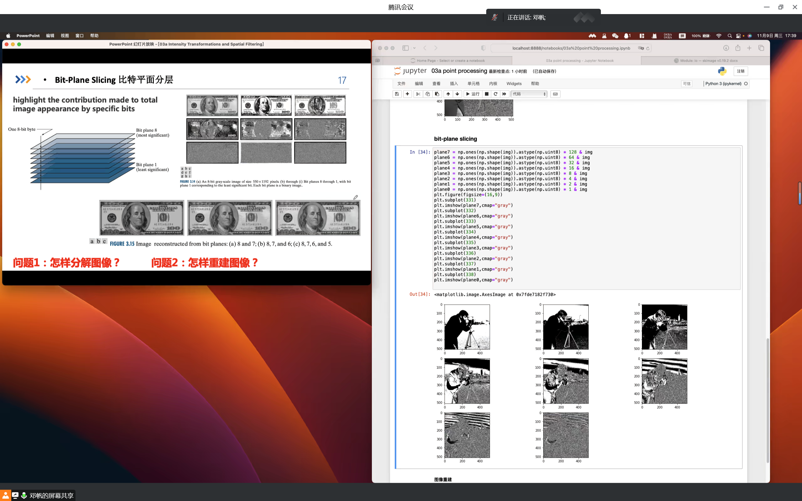

# 03a 强度转换和空间滤波 - 点处理


## 目录 Contents

在接下来的几节课中，我们将探讨空间领域的图像增强技术：

- 什么是图像增强？
- 不同种类的图像增强
- 点处理
- 直方图处理
- 空间滤波


## 什么是图像增强？

图像增强是使图像更有用的过程。
这样做的原因包括：

- 突出图像中有趣的细节
- 去除图像中的噪声
- 使图像在视觉上更具吸引力


## 代码实现

### 图像求反

> 导入需求包

```python
import numpy as np
import matplotlib.pyplot as plt
from skimage import data
```

> s1

```python
img=data.camera()
```

> s`

```python
plt.imshow(img,cmap="gray")
```

> d1

```python
type(img)
```

> 图像灰度范围

```python
img.shape
```

> 查看数据类型

```python
img.type
```

> 求值

```python
print(img.max(),img.min(),img.mean())
```

> 求尺寸

```python
img.size
```

> 求反

```python
out = 255 - img
plt.imshow(out,cmapy="gray")
```


### 对数变换

&emsp;&emsp;我们使用这种类型的转换来扩展图像中深色像素的值，同时压缩较高级别的值。反对数(指数)变换的情况正好相反。

```python
out1 = 2 * np.log(img + 1.0)
plt.imshow(out1.astype(np.uint8),cmap="gray")
```


### Gamma 变换（矫正）

&emsp;&emsp;为了防止越界，需要进行归一化操作。

> 归一化

```python
gamma = 0.4
Inorm = img / 255.0
Inorm.dtype
```

> 

```python
logImg = 1 / gamma * np.log(Inorm + 1)
```


```python
np.exp(logImg) * 255.0
```

> 输出值控制在 0 ~ 255 之间

```python
out3 =out3.astype(np.uint8)
plt.imshow(out3,cmap="gray")
```


### Bit-plane slicing 比特平面分层

&emsp;&emsp;突出显示特定位元对整体图像外观的贡献。

```python
plane7 = np.ones(np.shape(img)).astype(np.uint8) * 128 & img
plane6 = np.ones(np.shape(img)).astype(np.uint8) * 64 & img
plane5 = np.ones(np.shape(img)).astype(np.uint8) * 32 & img
plane4 = np.ones(np.shape(img)).astype(np.uint8) * 16 & img
plane3 = np.ones(np.shape(img)).astype(np.uint8) * 8 & img
plane2 = np.ones(np.shape(img)).astype(np.uint8) * 4 & img
plane1 = np.ones(np.shape(img)).astype(np.uint8) * 2 & img
plane0 = np.ones(np.shape(img)).astype(np.uint8) * 1 & img
plt.figure(figsize=(16,9))
plt.subplot(331)
plt.imshow(plane7, cmap="gray")
plt.subplot(332)
plt.imshow(plane6, cmap="gray")
plt.subplot(333)
plt.imshow(plane5, cmap="gray")
plt.subplot(334)
plt.imshow(plane4, cmap="gray")
plt.subplot(335)
plt.imshow(plane3, cmap="gray")
plt.subplot(336)
plt.imshow(plane2, cmap="gray")
plt.subplot(337)
plt.imshow(plane1, cmap="gray")
plt.subplot(338)
plt.imshow(plane0, cmap="gray")
```





## 课后作业

### 作业要求

- 在灰度图像上使用 MATLAB / Python 实现以下图像处理任务。代码应该是模块化的，尽量不要使用第三方图像处理模块。
- 截止日期：2022年11月15日，星期三
- 提交源代码文件和 pdf 报告文件（原理、公式、用途）

### 任务

1. 图像求反
2. Gamma 校正，校正值为 $0.4,1,1.6$
3. 将图像的大小调整 $0.5$（即，分辨率为 $400 × 400$ 的图像将减少到 $200 × 200$）。
4. 将图像的大小调整为 $2$ 倍（例如，分辨率为$400 × 400$ 的图像将增加到 $800 × 800$）
5. 对比度拉伸
6. 灰度分割
7. 显示测试图像的所有位平面