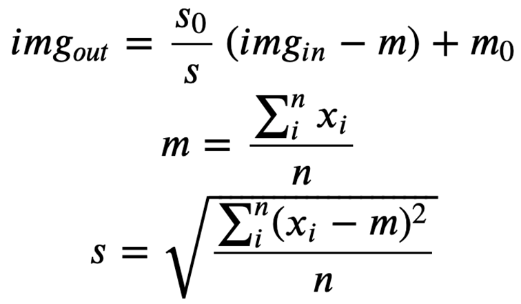

# 03b 直方图处理


## 目录 Contents

&emsp;&emsp;在接下来的几节课中，我们将探讨空间领域的图像增强技术：

1. 直方图处理
2. 空间滤波


## 1 Image Histograms 直方图

图像的直方图向我们展示了图像中灰度的分布。在图像处理中非常有用，特别是在分割方面。

f的非归一化直方图定义为


### 1.1 阈值化

- 图像归一化：
- 抠图原理，将图像的灰度值归一化为 0 与 1
- 默认 2% 的像素拉伸
-  

直方图形状与图像外观有关。

直观地说，可以合理地得出这样的结论：如果一个图像的像素趋向于占据所有可能的强度级别范围，而且趋向于均匀分布，那么它将具有高对比度的外观，并将显示出各种各样的灰色色调。


## 2 直方图操作


提高/降低亮度：增加/减少各个像素灰度值

提高对比度：

- 纵向不变，横向拉伸
- 均值为 $m$，标准差为 $s$ 的直方图可以用下式表示为均值为 $m_0$ ，标准差为 $s_0$ 的直方图

- 常用修改参数：均值和标准差

提高亮度的同时，往往需要提高对比度。





> 

```python
```


## 3 直方图均衡化

净效果将是一个图像，显示大量的灰度细节和高动态范围。

开发一个转换函数，只使用输入图像的直方图，就可以自动实现这一效果。


- PDF：概率密度函数（probability density function）
- CDF : 累积分布函数 (cumulative distribution function)，又叫分布函数


直方图均衡化产生一个转换函数，该函数寻求生成具有统一直方图的输出图像。当需要自动增强时，这是一个值得考虑的好方法，因为该技术的结果是可预测的，而且该方法很容易实现。然而，在一些应用中，直方图均衡化并不适用。特别是，有时能够指定我们希望处理的图像具有的直方图的形状是很有用的。用于生成具有指定直方图的图像的方法称为直方图匹配或直方图规范。


## 课后作业

### 作业要求

1. 制作小报告：比较以上三种直方图均衡化方法
2. 要求：排版美观
3. 包含原理、应用、参考文献

### 作业内容

1. 全局直方图均衡化
2. 局部直方图均衡化
3. 对比度受限自适应直方图均衡化
