# PostgreSQL9.6 & PostGIS3.2 安装

本文安装 PostgreSQL 9.6 +  PostGIS 3.2 版本。

## 1 安装PostgreSQL 

### 1.1 下载地址

​		https://www.enterprisedb.com/downloads/postgres-postgresql-downloads

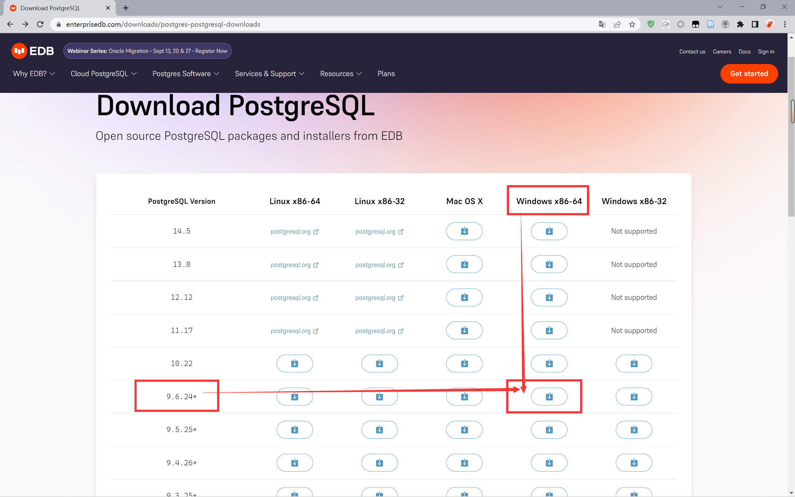

### 1.2 安装配置

#### 1.2.1 修改安装地址

- 不要装在 C 盘
- 安装路径无中文、无空格
- 安装路径不要太深

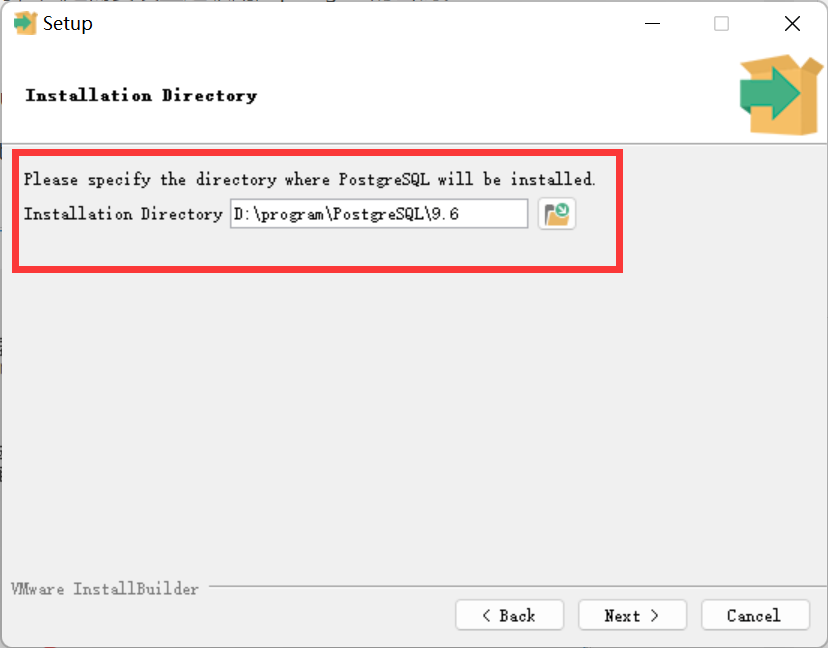

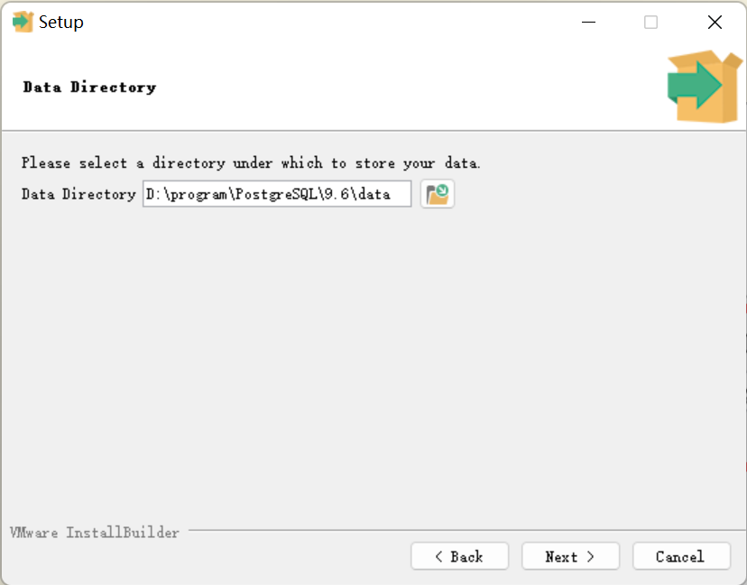

#### 1.2.2 设置超级管理员密码

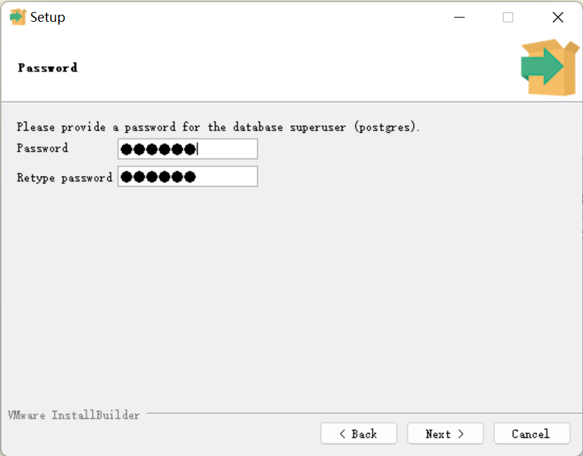

#### 1.2.3 修改数据库端口

- 一般不需要修改，默认就可以。

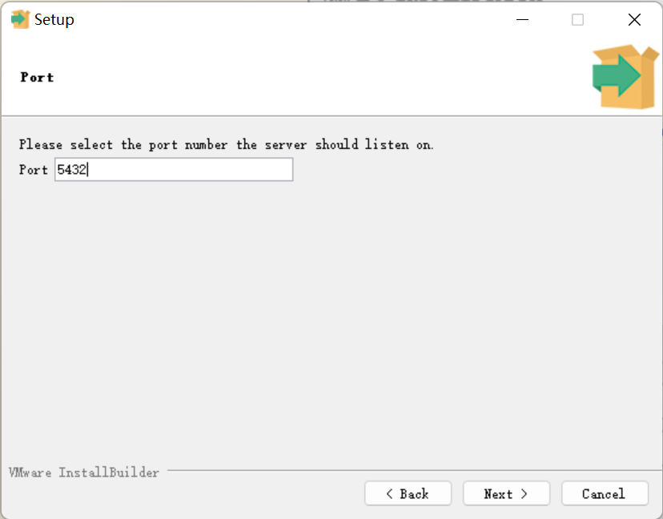

#### 1.2.4 选择新数据库集群要使用的地区

- 这里我们默认即可。

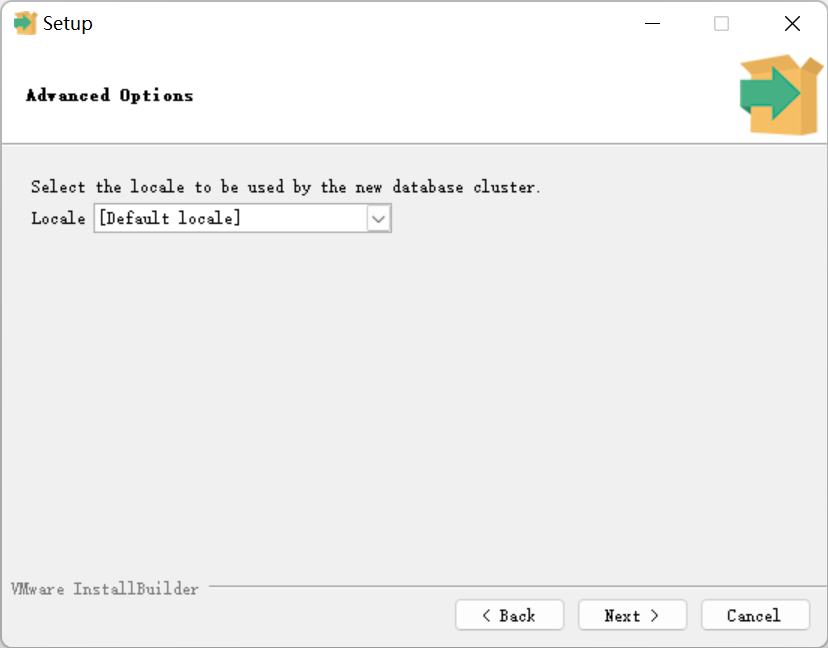

### 1.3 安装

- 完成上述步骤配置后，即可开始安装程序。
- 完成安装

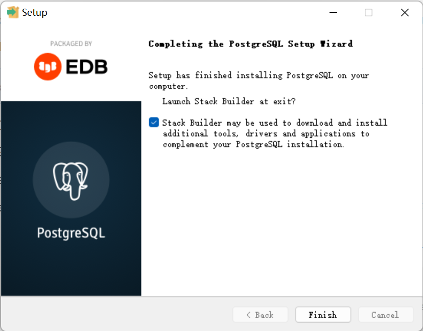

## 2 安装 PostGIS

### 2.1 Stack Builder 安装

#### 2.1.1 连接数据库

- 在完成安装后，会自动调出 Stack Builder，选择 5432 端口连接数据库

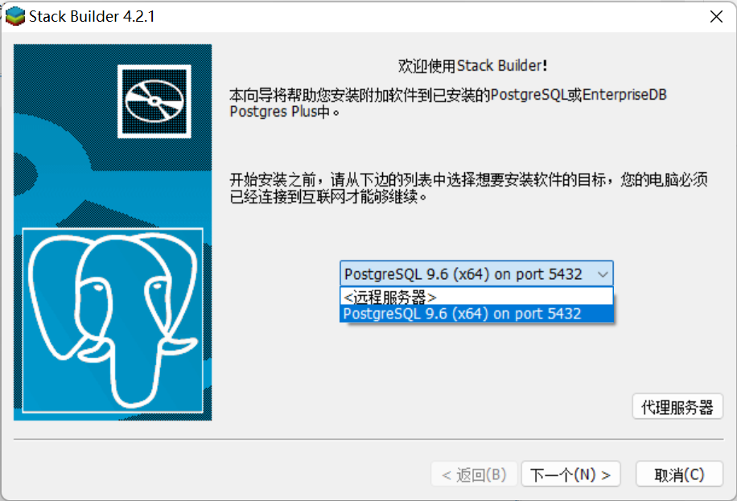

#### 2.1.2 选择 PostGIS 版本

- 这里我们选择 3.1 版本进行安装。

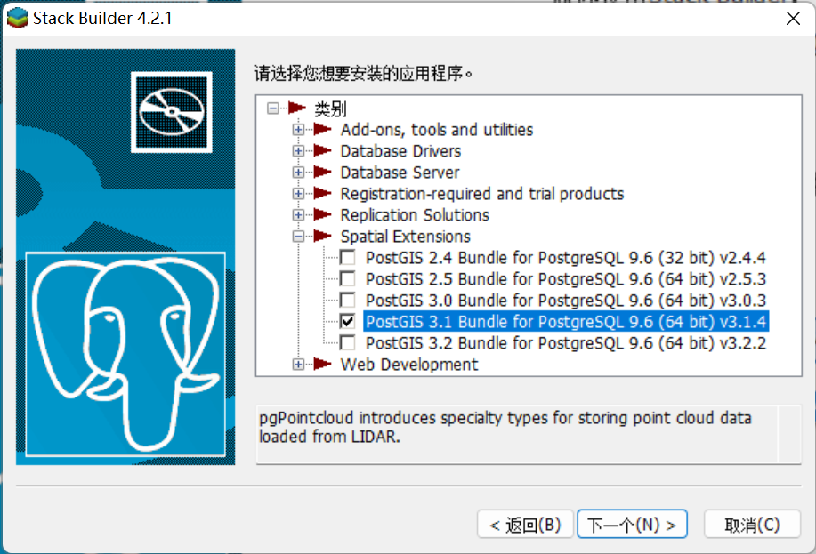

#### 2.1.3 选择安装包存放地址 

- 注意，这里是安装包存放地址，并不是安装地址

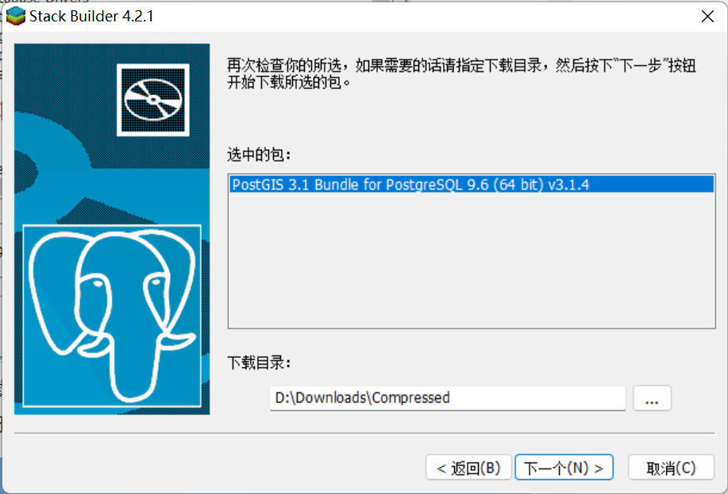

- 这里可能会出现卡死的现情况，所以我们使用官网直接下载的方式进行安装。

### 2.2 PostGIS 官网安装

#### 2.2.1 下载地址

​		https://winnie.postgis.net/download/windows/pg96/buildbot/

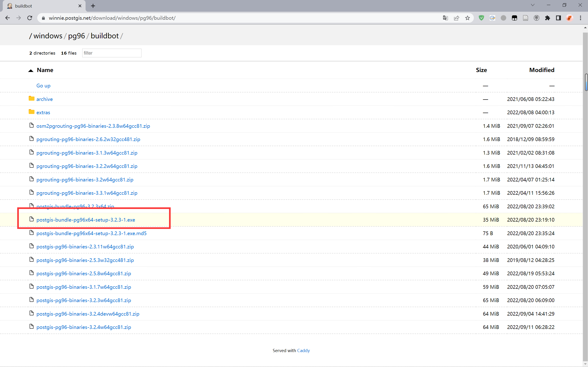

#### 2.2.2  安装步骤

- 这里我们安装的是与 PostgreSQL9.6 匹配的 PostGIS 3.2

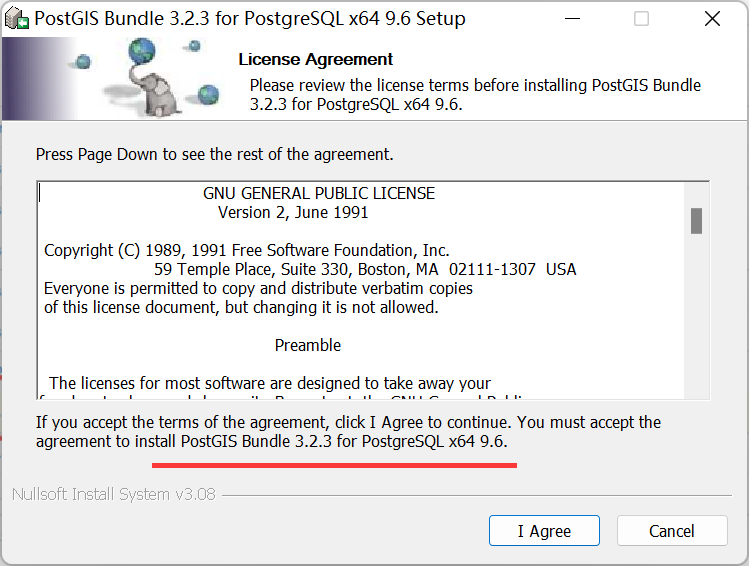

- 这里勾选后，可以创建一个新的空间数据库。

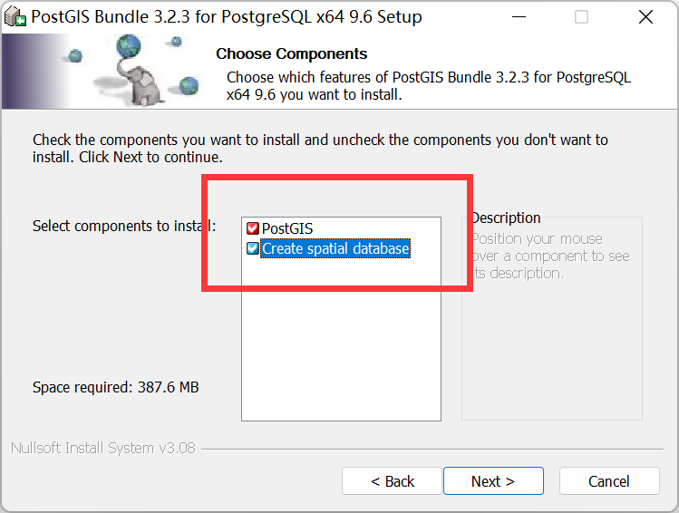

- 这里安装位置我们修改为与 PostgreSQL 同一安装目录下

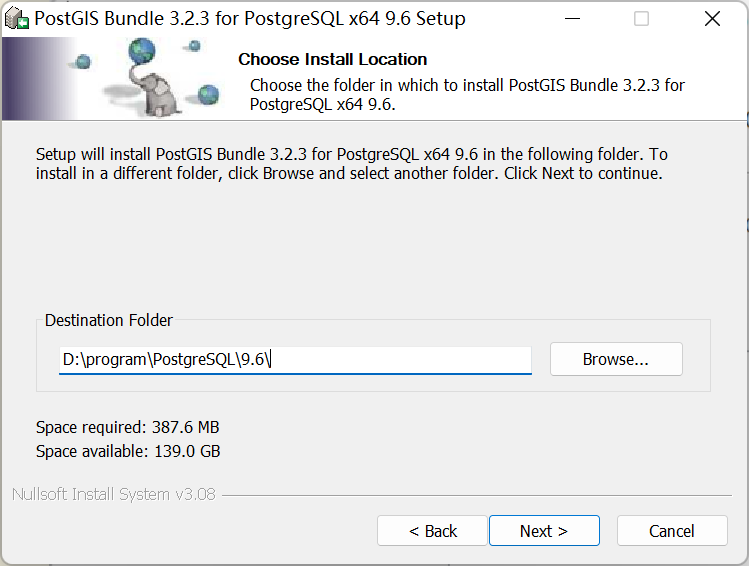

- 设置新建的空间数据库的账密及端口

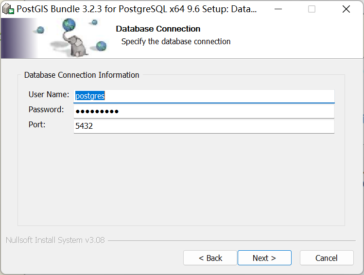

- 设置数据库名称

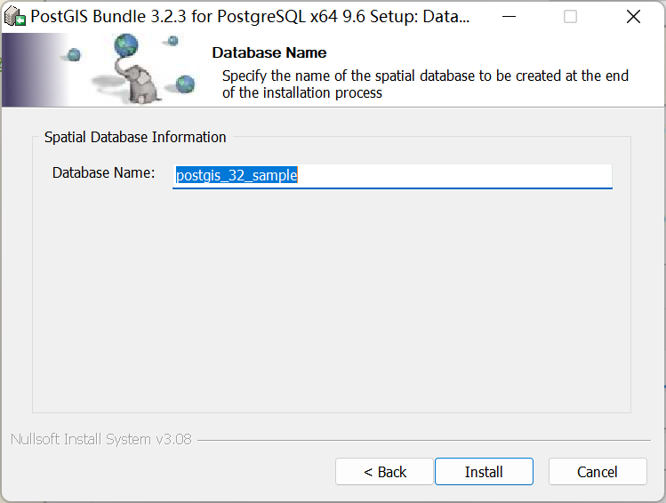

- 接下来，一路点是即可。

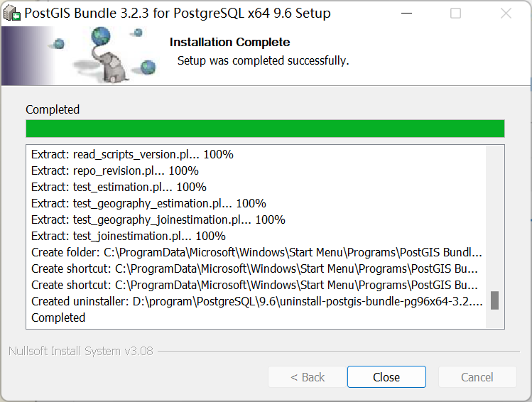

## 3 查看安装情况

### 3.1 打开 pgAdmin4

- 找到 pgAdmin4 （大象）图标，双击运行

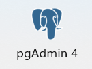

- 每次进入都需要输入超级管理员密码登录账号

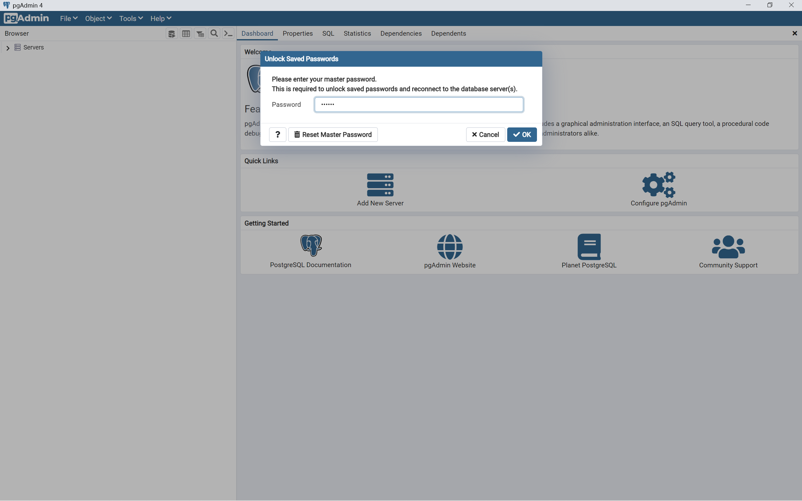

### 3.2 查看当前数据库

&emsp;&emsp;此时可以看到两个数据库，都处于 **运行状态。**

- 一个是，安装 PostgreSQL 时创建的模板数据库
- 另一个是，安装 PostGIS 时创建的模板数据库

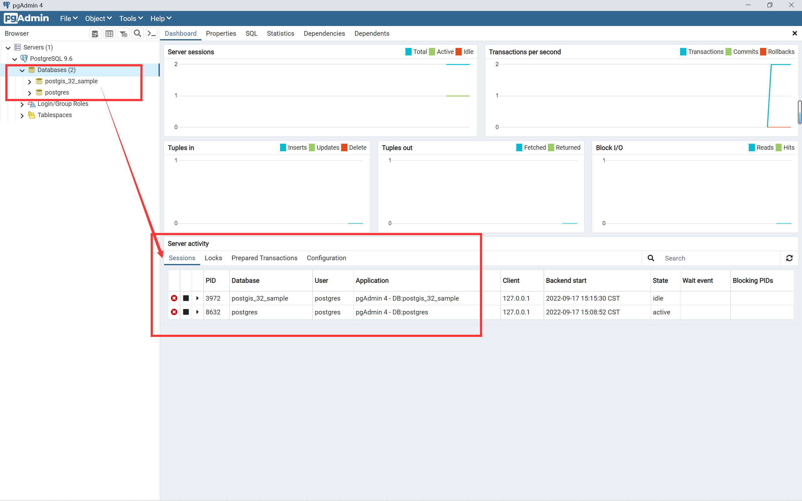

