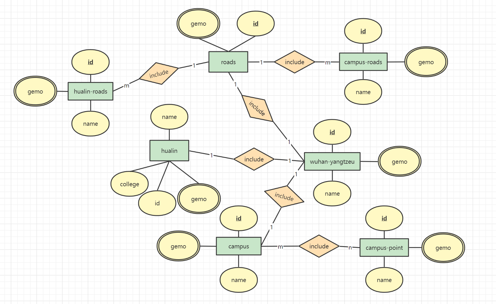

# 练习二：数字化校园的数据表与 E-R 图

书接上回：[练习一：数字化校园](./practice01.md)

## 一、实验内容

&emsp;&emsp;创建用于存储数字化校园数据的数据表，并绘制其 E-R 图。

## 1 数据表

- 在 Navicat 中查看数据表对象

## 2 E-R 图

上一章：[练习一：数字化校园](./practice01.md)

下一章：[练习三：数据查询](./practice03.md)
