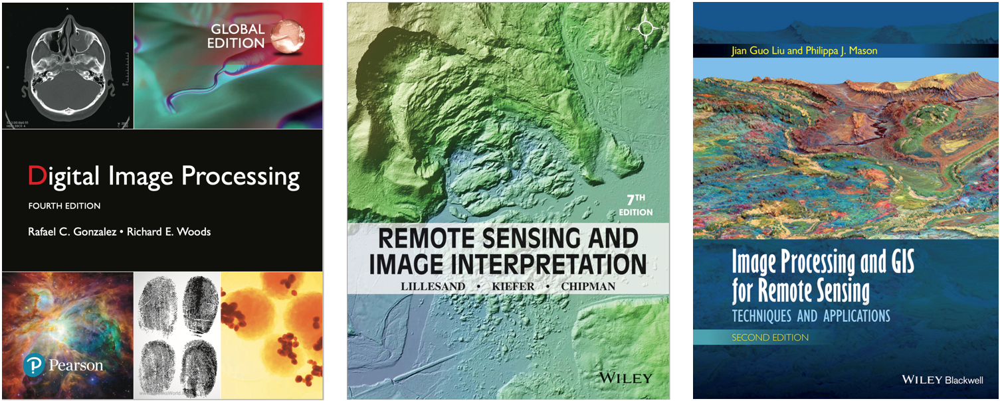

# Digital Image Processing A Remote Sensing Perspective 遥感数字图像处理与分析

## 1 课程要求

### 1.1 上课时间

- 周一第 5 节，周三第 4 节
- 第 10 周 ~ 第 18 周

### 1.2 考查方式

- 结课报告 + 程序（算法）设计：70%
- 平时作业：20%
- 考勤：10%

### 1.3 相关书籍

- Digital Image Processing：数字图像处理
- REMOTE SENSING AND IMAGE INTERPRETATION：遥感影像解译
- Image Processing and GIS for Remote Sensing：遥感图像处理与 GIS

## 2 课程主要内容

