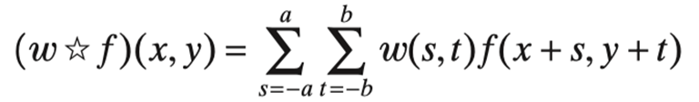
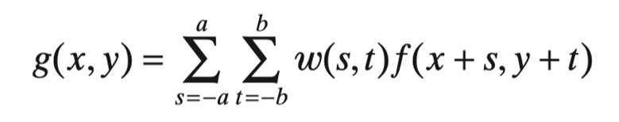
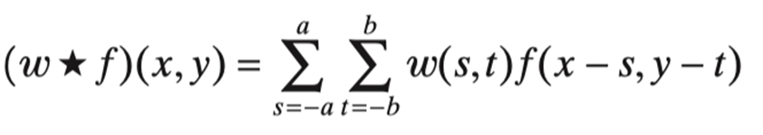

# 03c 空间滤波

## 中值滤波

中值滤波是去除噪声最有利的滤波器。

## 锐化（高通）滤波器

边缘增强

差分/微分 实现过程

### 1 基于一阶导数和二阶导数的锐化滤波器

数字函数的导数是用差来定义的

一阶导数：

1. 在强度恒定的区域必须为零。
2. 在强度阶跃或斜坡开始时必须非零。
3. 沿着强度坡道必须是非零的。

二阶导数：

1. 在强度恒定的区域必须为零。
2. 在强度台阶或斜坡的开始和结束时必须非零。
3. 在强度坡道上必须为零。

一维函数 $f(x)$ 的一阶导数就是差值

 $f(x)$ 的二阶导数作为差

## 空间相关和卷积

### 1 卷积

是一种数据之间的运算方式。

相关性：包括在图像上移动核的中心，并计算每个位置上的乘积的和。

空间卷积：它的机制是相同的，除了相关核旋转180°。

卷积有很多特性，但是没有相关，满足交换律，值不变·。

数学上：两个函数的运算，$f$ and $g$

图像上：两个图像的运算

卷积（又称叠积（convolution）、褶积或旋积），是透过两个[函数](https://zh.wikipedia.org/wiki/函数) *f* 和 *g* 生成第三个函数的一种数学[算子](https://zh.wikipedia.org/wiki/算子)，表征函数 *f* 与经过翻转和平移的 *g* 的乘积函数所围成的曲边梯形的面积。

### 2 相关

描述数据间的关系。

## 课堂疑问

1. 什么是核？
2. 为什么要旋转180°？
