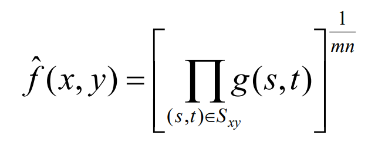
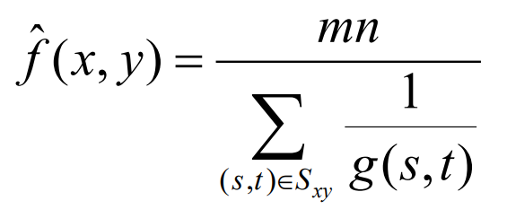
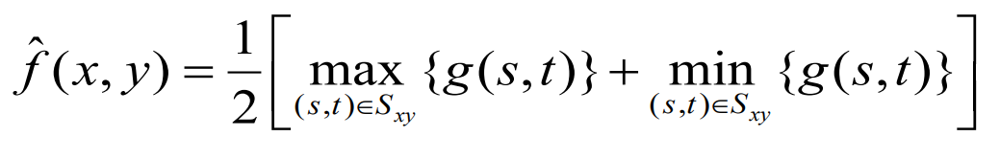
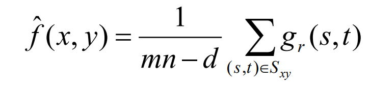

# 05a Image Restoration and Reconstruction-Noise Removal

# 05a 图像恢复与重建-去噪

$$
g(x, y) = f (x, y) +h(x, y)
$$

## 1 Noise Models 噪声模型

### Image noise term 图像噪声项

1. 高斯噪声 - Gaussian

- 最常见的模型 Most common model

2. 瑞利噪声 - Rayleigh
3. 爱尔兰噪声 - Erlang（Gamma）
4. 指数噪声 - Exponential
5. 均匀噪声 - Uniform
6. 椒盐噪声 / 冲击噪声 - Impulse

- salt and pepper noise 亮噪音和暗噪音

### Noise Example 噪声实例

## 2 空间滤波

滤除噪音

我们可以使用不同种类的空间滤波器来去除不同种类的噪声。

算术平均滤波器是一种非常简单的算法，计算方法如下：

### 2.1 均值滤波器

有不同种类的均值过滤器，它们都表现出稍有不同的行为:

1. 几何均值滤波器 Geometric Mean

2. 调和均值滤波器 Harmonic Mean

3. 反谐均值滤波器  Contraharmonic Mean

### 2.2 统计排序滤波器

基于对组成过滤器支持定义的邻域的像素值进行排序的空间过滤器。是非线性的。

有用的空间过滤器包括：

1. 中值滤波器（改进）：使用较多，去除 **少量** 椒盐噪声时效果最好

2. 最大值和最小值滤波器

- 最大值：暗噪声
- 最小值：亮噪声

3. 中点滤波器（使用较多）：适用于随机高斯和均匀噪声。

4. Alpha截断的均值滤波器（使用较多）

均值滤波容易受到极值的影响。

我们可以删除 $d/2$ 最低和 $d/2$ 最高灰度。$gr(s, t)$ 表示剩下的 $mn - d$ 像素。

重复通过可以更好地去除噪声，但也会使图像（平滑/失真）模糊。

### 自适应滤波器

到目前为止讨论的滤波器应用于整个图像，而不考虑图像特征从一点到另一点的变化。

**自适应滤波器** 的行为取决于滤波器区域内图像的特征。

我们将看一下 **自适应中值滤波器**。

### 自适应中值滤波

只要脉冲噪声的空间密度不大，中值滤波器对脉冲噪声的处理效果相对较好。

自适应中值滤波器可以处理空间密度更大的脉冲噪声，并对非脉冲噪声进行一定的平滑处理。

理解算法的关键是要记住自适应中值滤波器有三个目的：

1. 去除脉冲噪声 / 椒盐噪声

2. 提供平滑其他噪声

3. 减少失真(过度变薄或增厚的物体边界)。

设计标准，模板大小 size，

## 课后作业

### 周期性噪声 

PPT 35 ~ 38 页

傅里叶变换

通常是由于电或电磁干扰引起的。在图像中产生有规律的噪声模式。傅里叶域中的频域技术是去除周期性噪声最有效的方法。